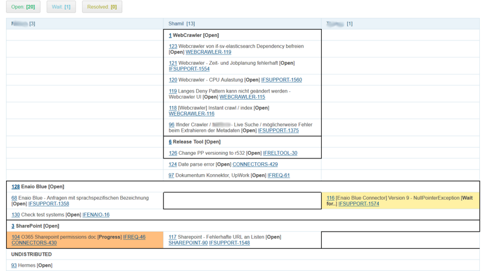

== Blow JIRA
Пример надстройки <<../plugin/pln/blow/index.adoc#, Blow>> плана над тикетами JIRA для быстрого управления проектом.
Может быть легко модифицирован под другие тикет системы: GitLab, GitHub, RedMine и т.д.

=== Настройка <<../kernel/process/index.adoc#setup-type, типа процесса>>
Добавьте текстовый параметр *JIRA* для хранения идентификаторов тикетов. В данном примере у него код *1*.
На скриншоте видны статусы процесса и параметры.

image::_res/bj_process_type.png[]

Конфигурация с <<../kernel/process/wizard.adoc#, мастером>> создания:
[source]
----
show.tab.messages=1
show.tab.links=0
show.tab.links.process=1
show.tab.links.process.add.from.buffer=1
#
processReference.1.objectTypes=processCard
processReference.1.stringExpression="#" + process.getId() + " " + u.escapeXml(process.getDescription())
#
#
style.processCardLeftBlock=min-width: 500px;
style.processCardRightBlock=width: 100%
#
# Creation Wizard
#
createWizard.createStep.1.title=JIRA Ticket
createWizard.createStep.1.class=ru.bgcrm.model.process.wizard.FillParamsStep
createWizard.createStep.1.parameterIds=1
#
#createWizard.createStep.2.title=Description
createWizard.createStep.2.class=ru.bgcrm.model.process.wizard.SetDescriptionStep
#
#createWizard.createStep.3.title=Executors
#createWizard.createStep.3.class=ru.bgcrm.model.process.wizard.SetExecutorsStep
----

=== Настройка <<../kernel/process/queue.adoc#setup, очереди процессов>>
Код очереди процесса в этом примере *1*.

[source]
----
filter.1.type=openClose
filter.1.defaultValue=open
column.1.title=ID
column.1.value=id
column.2.title=Type
column.2.value=type_title
column.3.title=Customer
column.3.value=linkedCustomer:title
column.3.titleIfMore=100
column.4.title=Description
column.4.value=descriptionLink
column.5.title=JIRA
column.5.value=param:1
----

=== Настройка Blow графика
[source]
----
blow:board.1.title=iFinder
blow:board.1.queueId=1
blow:board.1.stringExpressionCell=<<END
     result = process.getDescription() + " [<b>" + ctxProcessStatusMap[process.getStatusId()] + "</b>]";
     jiraTicket = params.get("col5");
     if (jiraTicket) {
          for (ticketId : jiraTicket.split(","))
             result += " <a target='_blank' href='https://jira/browse/" + ticketId + "'>" + ticketId + "</a>";
     }
     return result;
END

blow:board.1.filter.1.color=#31bc79
blow:board.1.filter.1.stringExpression=<<END
     count = 0;
     for (item : items) {
          if (item.getProcess().getStatusId() =~ [1,4]) {
               count += 1;
               item.addFilterId(filter.getId());
          }
     }
    return "Open: <b>[" + count + "]</b>";
END

blow:board.1.filter.2.color=#67c7db
blow:board.1.filter.2.stringExpression=<<END
     count = 0;
     for (item : items) {
          if (item.getProcess().getStatusId() =~ [6]) {
               count += 1;
               item.addFilterId(filter.getId());
          }
     }
    return "Wait: <b>[" + count + "]</b>";
END

blow:board.1.filter.3.color=#b2b02a
blow:board.1.filter.3.stringExpression=<<END
     count = 0;
     for (item : items) {
          if (item.getProcess().getStatusId() =~ [3]) {
               count += 1;
               item.addFilterId(filter.getId());
          }
     }
    return "Resolved: <b>[" + count + "]</b>";
END
----

=== Работа с планом
Примерный вид Blow плана представлен на рисунке.

При создании нового процесса запускается мастер, в котором вводятся через пробелы коды тикетов и краткое описание процесса.

image::_res/bj_wizard.png[]

Для дальнейшей обработки необходимо открывать карточку процессов.

