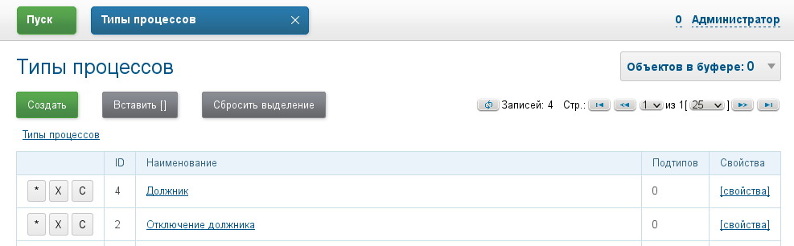
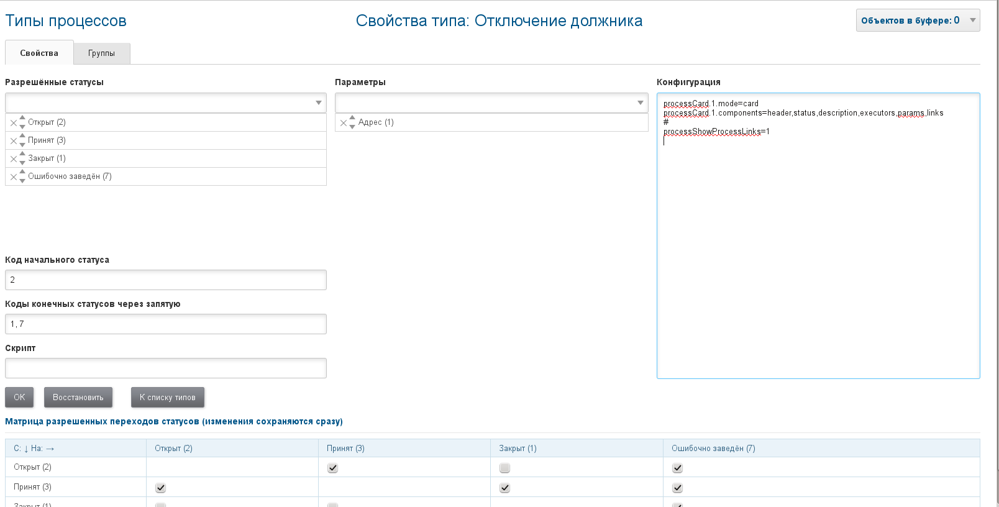
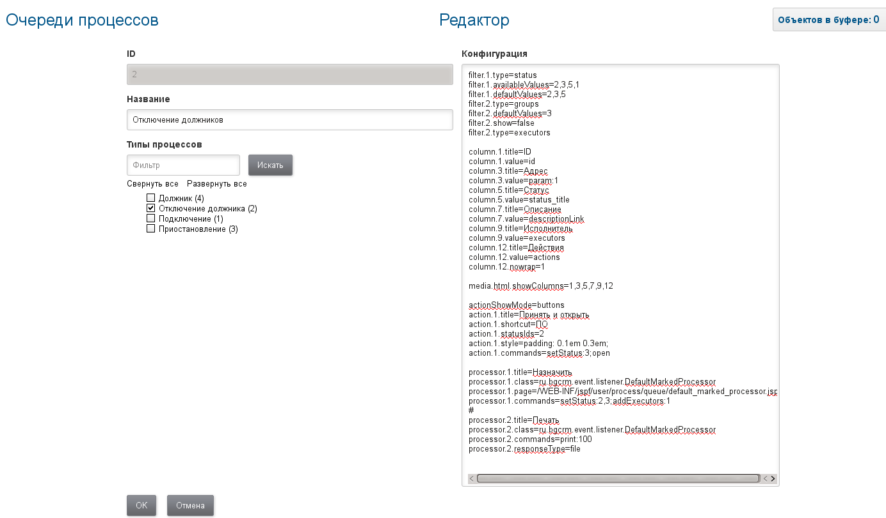
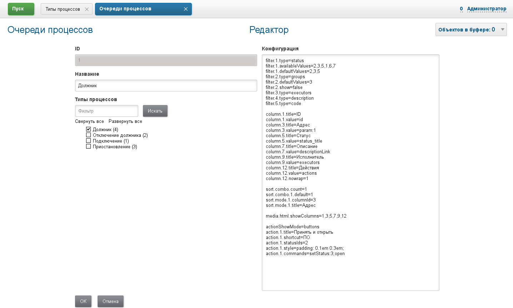
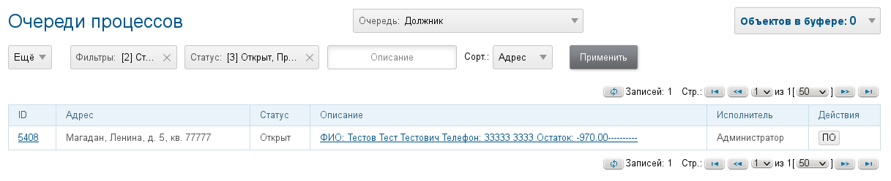
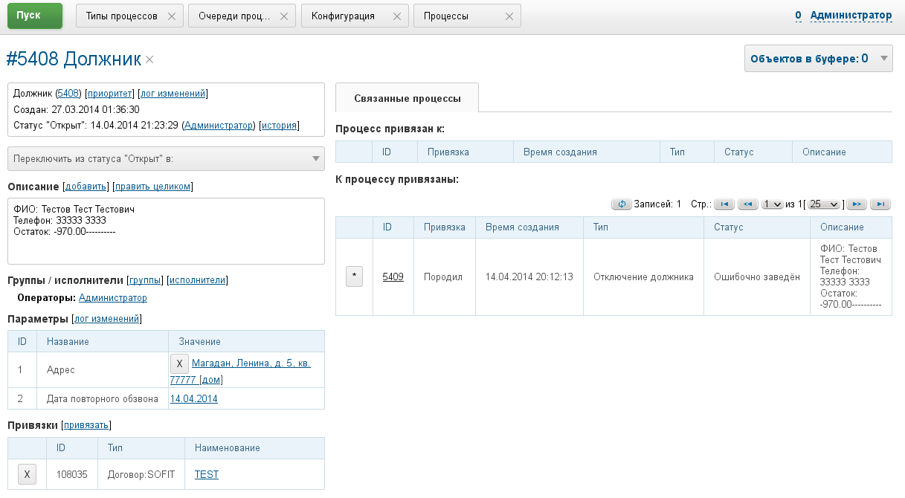
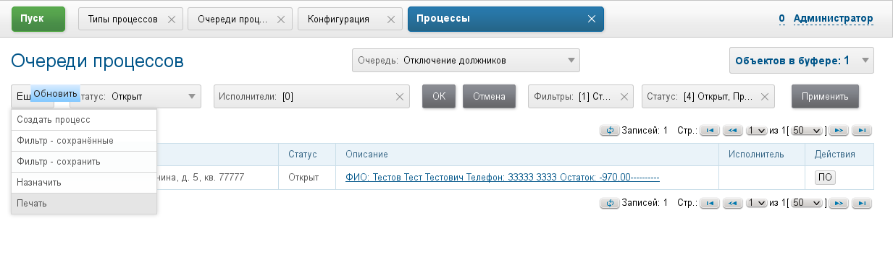
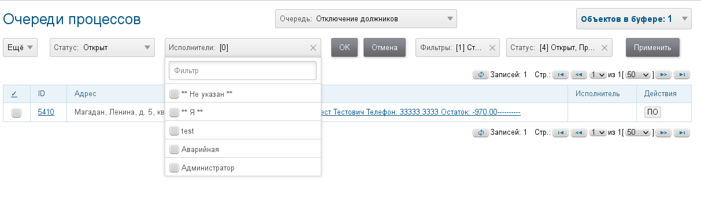
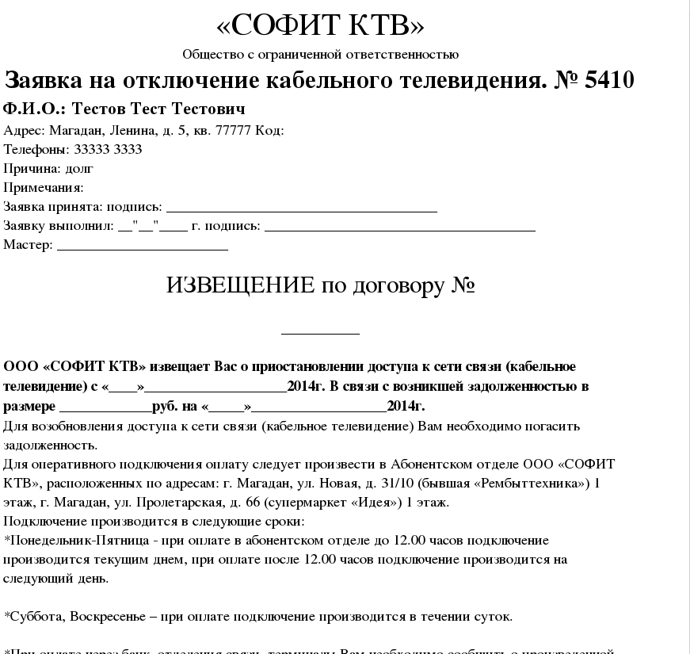

== Организация отключения должников КТВ
Используются следующие виды процессов:

Должник - работа с должником, обзвон, увещевания, возможно разнос квитанций.
Отключение должника - физическое отключение.
Настроенные типы процессов,их параметры и конфигурации.

Типы процессов:

Процесс "Должник":

image::_res/i0152.png[i0152, width=600]

Процесс "Отключение должника":

Конфигурация типа "Должник":

[source]
----
processCard.1.mode=card
processCard.1.components=header,status,description,executors,params,links
#
onProcessEvent.1.events=statusChanged:3
onProcessEvent.1.ifExpression=process.getExecutorIds().size() == 0
onProcessEvent.1.commands=addExecutors:{@ctxUserId}
#
onProcessEvent.2.events=linkAdded;createdAsLink
onProcessEvent.2.commands=bgbilling:getLinkedContractAddressParam:sofit:26:1
#
requireFillParamIdsBeforeStatusSet.5=2
 
show.tab.links.process=1
----

Конфигурация типа "Отключение должника":

[source]
----
processCard.1.mode=card
processCard.1.components=header,status,description,executors,params,links
#
show.tab.links.process=1
----

Настройки очередей процессов "Должник" и "Отключение".

Очередь "Должник":

Очередь "Отключение должника":

Конфигурация очереди "Должник".
[source]
----
filter.1.type=status
filter.1.availableValues=2,3,5,1,6,7
filter.1.defaultValues=2,3,5
filter.2.type=groups
filter.2.defaultValues=3
filter.2.show=false
filter.3.type=executors
filter.4.type=description
filter.5.type=code
 
column.1.title=ID
column.1.value=id
column.3.title=Адрес
column.3.value=param:1
column.5.title=Статус
column.5.value=status_title
column.7.title=Описание
column.7.value=descriptionLink
column.9.title=Исполнитель
column.9.value=executors
column.12.title=Действия
column.12.value=actions
column.12.nowrap=1
 
sort.combo.count=1
sort.combo.1.default=1
sort.mode.1.columnId=3
sort.mode.1.title=Адрес
 
media.html.showColumns=1,3,5,7,9,12
 
actionShowMode=buttons
action.1.title=Принять и открыть
action.1.shortcut=ПО
action.1.statusIds=2
action.1.style=padding: 0.1em 0.3em;
action.1.commands=setStatus:3;open
----

Конфигурация очереди "Отключение должника":

[source]
----
filter.1.type=status
filter.1.availableValues=2,3,5,1
filter.1.defaultValues=2,3,5
filter.2.type=groups
filter.2.defaultValues=3
filter.2.show=false
filter.2.type=executors
 
column.1.title=ID
column.1.value=id
column.3.title=Адрес
column.3.value=param:1
column.5.title=Статус
column.5.value=status_title
column.7.title=Описание
column.7.value=descriptionLink
column.9.title=Исполнитель
column.9.value=executors
column.12.title=Действия
column.12.value=actions
column.12.nowrap=1
 
media.html.showColumns=1,3,5,7,9,12
 
actionShowMode=buttons
action.1.title=Принять и открыть
action.1.shortcut=ПО
action.1.statusIds=2
action.1.style=padding: 0.1em 0.3em;
action.1.commands=setStatus:3;open
 
processor.1.title=Назначить
processor.1.class=ru.bgcrm.event.listener.DefaultMarkedProcessor
processor.1.page=/WEB-INF/jspf/user/process/queue/default_marked_processor.jsp
processor.1.commands=setStatus:2,3;addExecutors:1
#
processor.2.title=Печать
processor.2.class=ru.bgcrm.event.listener.DefaultMarkedProcessor
processor.2.commands=print:100
processor.2.responseType=file
----

Конфигурация шаблона модуля Document и сами шаблоны для распечатки нарядов на отключение:

[source]
----
# печать из очереди должников
document:pattern.101.title=BLANK
document:pattern.101.scope=processQueue
document:pattern.101.script=ru.bgcrm.plugin.document.docgen.CommonDocumentGenerator
document:pattern.101.xslt=docpattern/ktv_blank.xsl
document:pattern.101.type=xsltHtml
document:pattern.101.documentTitle=blank.html
----

Файлы ktv_blank.xsl - в docpattern; KtvDebtManager.java, KtvDebtWaitRestore.java - в dyn/ru/bgcrm/dyn/sofit

link:_res/ktv_blank.xsl[ktv_blank.xsl]

link:_res/KtvDebtWaitRestore.java[KtvDebtWaitRestore.java]

link:_res/KtvDebtManager.java[KtvDebtManager.java]

Динамический класс ru.bgcrm.dyn.sofit.KtvDebtWaitRestore переводит процессы, помеченные на повторный обзвон вновь в открытый статус по истечению даты.

Класс ru.bgcrm.dyn.sofit.KtvDebtManager периодически производит выборку договоров-должников из базы биллинга, привязанной к конфигурации биллинга с идентификатором sofit. База должна быть только для чтения, сконфигурирована примерно подобным образом:

[source]
----
# Биллинги
bgbilling:server.1.id=sofit
bgbilling:server.1.title=SOFIT
bgbilling:server.1.url=http://810.788.253.825:8080/bgbilling/executer
bgbilling:server.1.version=6.0
bgbilling:server.1.db.driver=com.mysql.jdbc.Driver
# при  characterEncoding=windows-1251 были проблемы в запросах с установкой русских символов
bgbilling:server.1.db.url=jdbc:mysql://592.768.177.377:3306/bgbilling?jdbcCompliantTruncation=false&useUnicode=true&characterEncoding=UTF-8
bgbilling:server.1.db.user=dsdfbrm
bgbilling:server.1.db.pswd=xxxxxxx
----

Для каждого найденного договора-должника создаётся процесс типа "Должник", если его нет. Необходимо скорректировать в Java коде критерии выборки должников в этом месте:

[source, java]
----
// -------------------------------------
// условия выборки договоров - должников
 
// базовый - код группы 25 - сумма долга 744 руб
processContracts( getContracts( conBilling, 1L<<25, null, new BigDecimal( -744 ) ), contractDebtProcesses, con );			
// код тарифа - 26, долг - 720 и выше
processContracts( getContracts( conBilling, null, 26, new BigDecimal( -720 ) ), contractDebtProcesses, con );
----

В описание процесса извлекаются адрес (в параметры), телефон, остаток и ФИО должника (в описание). Адресные справочники биллинга и BGCRM должны быть синхронизованы. Если процесс есть, а договора-должника уже нет (оплатил либо статус закрыт) - процесс "Должник" по этому договору закрывается.

В очереди процессов процесс должник выглядит следующим образом:

Очередь "Должник"

Процес "Должник"

Процессы "Должник" обрабатываются диспетчерами. Статус "Принят" означает занятие процесса на обработку. "Ожидание оплаты" - процесс откладывается и после указанной даты переводится в "Открыт". "Отключение" - создаётся связанный процесс "Отключение должника", куда копируется описание.

Процессы "Отключение должника" выводятся в отдельной очереди и обрабатываются отдельной группой исполнителей. В конфигурации очереди настроены групповое переключение статусов и печать бланков извещений.

Очередь "Отключение должников"

Доп действия в очереди

Вид бланка

ФИО и сумма долга для бланка извлекаются из автоматически сгенерированного опаисания процесса. При необходимости в описание процесса возможно добавление примечаний после символа разделителя "----------".
