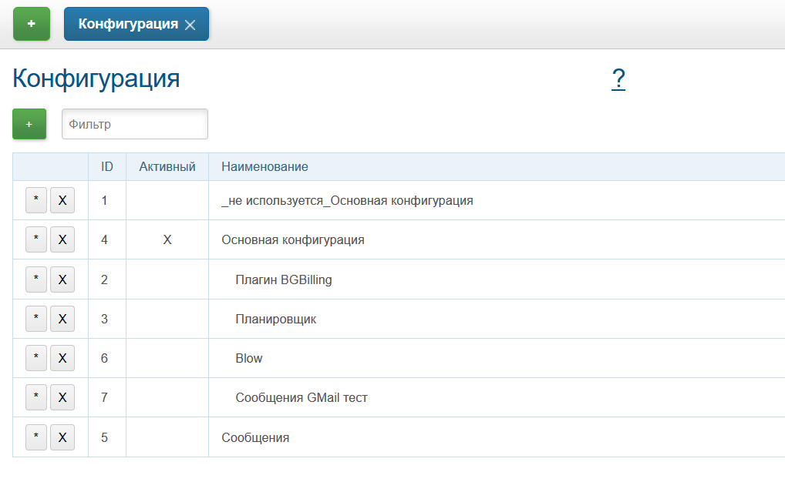

= Настройка EMail сообщений

Инструкция по настройке EMail ящика для обработки <<../kernel/message.adoc#type-email, сообщений>>.

Создать отдельную <<../kernel/setup.adoc#config, конфигурацию>> с новым типом сообщения, либо добавить тип в существующую.
Для ускорения проверки в системе, где уже есть много типов сообщений, можно сначала добавить конфигурацию в отдельный
инклуд, включаемый на время теста вместо существующей конфигурации с сообщениями.

В настраиваемом ящике создайте IMAP папки: *INBOX.CRM_PROCESSED*, *INBOX.CRM_SKIPPED*, *INBOX.CRM_SENT*.

[[common]]
== Простой случай
Нешифрованные протоколы IMAP и SMTP.
[source]
----
messageType.1.title=billing@bitel.ru
messageType.1.class=ru.bgcrm.dao.message.MessageTypeEmail
messageType.1.email=billing@bitel.ru
messageType.1.host=imap.ufamail.ru
messageType.1.login=billing@bitel.ru
messageType.1.pswd=*****
messageType.1.folderIn=INBOX
messageType.1.folderProcessed=INBOX.CRM_PROCESSED
messageType.1.folderSkipped=INBOX.CRM_SKIPPED
messageType.1.folderSent=INBOX.CRM_SENT
messageType.1.signExpression=<<END
    sign = NEW_LINE + user.getTitle() + NEW_LINE + "Служба технической поддержки" + NEW_LINE;
    sign += "ОАО \"Инет\"" + NEW_LINE + "тел. 2232333" + NEW_LINE + "email. mastea@inet.ru" + NEW_LINE;
END    
messageType.1.mail.transport.protocol=smtp
messageType.1.mail.smtp.user=billing@inet.ru
messageType.1.mail.smtp.host=smtp.ufamail.ru
messageType.1.mail.smtp.pswd=******
----

[[yandex]]
== Yandex
IMAP и SMTP через SSL, подключены режимы поиска.
*21* - код параметра пользователя EMail.
*17* - код параметра контрагента EMail.
[source]
----
signBms=NEW_LINE + "С уважением, команда Бител" + NEW_LINE +  "email. crm@bitel.ru" + NEW_LINE

messageType.3.title=info@bgcrm.ru
messageType.3.class=ru.bgcrm.dao.message.MessageTypeEmail
messageType.3.store=imaps
messageType.3.email=info@bgcrm.ru
messageType.3.host=imap.yandex.com
messageType.3.login=info@bgcrm.ru
messageType.3.pswd=*****
messageType.3.folderIn=INBOX
messageType.3.folderProcessed=CRM_PROCESSED
messageType.3.folderSkipped=CRM_SKIPPED
messageType.3.folderSent=CRM_SENT
messageType.3.signExpression={@signBms}
messageType.3.quickAnswerEmailParamId=21
messageType.3.search.1.title=Авто по EMail
messageType.3.search.1.class=ru.bgcrm.dao.message.MessageTypeSearchEmail
messageType.3.search.2.title=Контрагент по названию
messageType.3.search.2.class=ru.bgcrm.dao.message.MessageTypeSearchCustomerByTitle
messageType.3.search.3.title=Договор по параметру EMail
messageType.3.search.3.class=ru.bgcrm.plugin.bgbilling.dao.MessageTypeSearchEmail
messageType.3.search.3.billingId=bitel
messageType.3.search.3.paramIds=7
messageType.3.saver.class=ru.bgcrm.dao.message.MessageTypeContactSaverEmail
messageType.3.saver.paramId=17
messageType.3.mail.transport.protocol=smtps
messageType.3.mail.smtp.user=info@bgcrm.ru
messageType.3.mail.smtp.host=smtp.yandex.com
messageType.3.mail.smtp.pswd=*****
----

[[gmail]]
== GMail
IMAP и SMTP через SSL.

Для получения пароля к приложению включите двухфакторную авторизацию и сгенерируйте пароль 
согласно инструкции: https://support.google.com/accounts/answer/185833
Либо с link:https://support.google.com/accounts/answer/1064203?hl=ru[выключенной двухэтапной аутентификацией] используйте пароль от учётной записи( Аккаунт - Безопасность - Вход в аккаунт Google ), 
также должен быть включен меннее защищённый доступ приложениям ( Аккаунт - Безопасность - link:https://myaccount.google.com/lesssecureapps[Ненадёжные приложения, у которых есть доступ к аккаунту] )

[source]
----
messageType.5.title=bgerpp@gmail.com
messageType.5.class=ru.bgcrm.dao.message.MessageTypeEmail
messageType.5.store=imaps
messageType.5.email=bgerpp@gmail.com
messageType.5.host=imap.gmail.com
messageType.5.login=bgerpp@gmail.com
messageType.5.pswd=*****
messageType.5.folderIn=INBOX
messageType.5.folderProcessed=INBOX.CRM_PROCESSED
messageType.5.folderSkipped=INBOX.CRM_SKIPPED
messageType.5.folderSent=INBOX.CRM_SENT
messageType.5.mail.transport.protocol=smtps
messageType.5.mail.smtp.user=bgerpp@gmail.com
messageType.5.mail.smtp.host=smtp.gmail.com
messageType.5.mail.smtp.pswd=****
----

[[debug]]
== Отладка
После добавления режима поиска в конфигурацию включить <<../kernel/extension.adoc#log-dyn, динамическое логирование>> и 
выполнить в <<../kernel/extension.adoc#dyn, оснастке динамического кода>> класс *ru.bgcrm.worker.MessageExchange* в синхронном режиме.
При этом будет произведена попытка чтения настроенного ящика, а также установки соединения на отправку. Возможные ошибки отобразятся в логе. 

Должен работать <<../kernel/message.adoc#queue, просмотр>> сообщений в ящике и <<../kernel/message.adoc#process, отправка>> из карточки процесса. 
Для форсирования отправки запускать тот же класс.

После отладки тестовая конфигурация может быть включена в основную.
