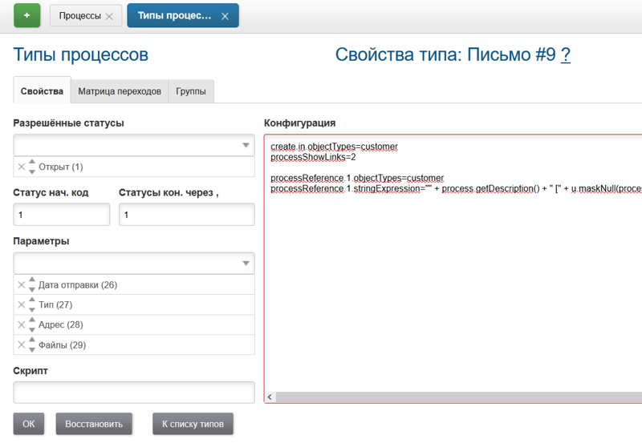
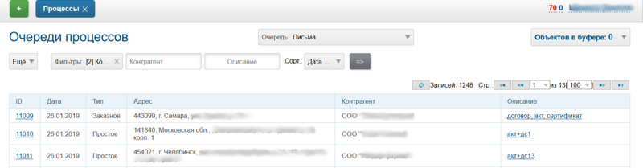

== Учёт писем

Простой учёт отправляемой корреспонденции.
Редактор типа процесса:

В типе процесса единственный статус, он же и конечный, и несколько параметров.

NOTE: Было бы логичнее данный статус назвать *Закрыт*.

В <<../kernel/setup.adoc#param-list, списковом параметре>> *Тип* установлены значения: *Простое* и *Заказное*.
Содержимое конфигурации типа процесса.
[source]
----
create.in.objectTypes=customer

processReference.1.objectTypes=customer
processReference.1.stringExpression="" + process.getDescription() + " [" + u.maskNull(processParam.getValue(26)) + " отпр. " + u.maskNull(processParam.getValue(28)) + "]"
----

Процесс может быть создан в контрагенте, конфигурация <<../kernel/process/index.adoc#setup-type-reference, описания>> выводит дату отправки и тип письма в списке.

image::_res/letter_customer_process.png[]

Вид очереди процессов.

Конфигурация очереди процессов.
[source]
----
filter.1.type=linkedCustomer:title
filter.2.type=description
#
sort.combo.count=1
sort.combo.1.default=1
sort.mode.1.columnId=3
sort.mode.1.title=Дата отпр обр.
sort.mode.1.desc=true
#
column.1.title=ID
column.1.value=id
column.2.title=Дата
column.2.value=param:26
column.3.title=Дата NF
column.3.value=param:26:value
column.4.title=Тип
column.4.value=param:27
column.5.title=Адрес
column.5.value=param:28
column.6.title=Контрагент
column.6.value=linkedCustomer:title
column.7.title=Описание
column.7.value=descriptionLink
column.7.titleIfMore=100

media.html.columns=1,2,4,5,6,7
----
