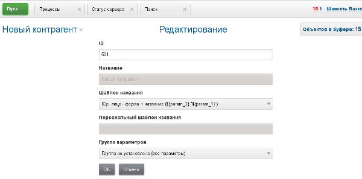
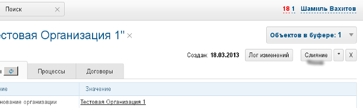

= Контрагенты
:toc:

Контрагент - физическое лицо либо организация, с которым взаимодействует пользователь BGERP. Также может быть использован как контакт.

Карточки открытых контрагентов отображаются в буфере. Для создания нового контрагента используйте меню +++<b>Пуск => Создать => Контрагент<b>+++. Также кнопка создания доступна в оснастке поиска.

image::_res/customer_screen.png[]

После создания открывается редактор свойств контрагента, в котором можно установить его наименование, группу параметров, шаблон наименования. В этот момент контрагент уже создан.

На вкладке Параметры редактируются параметры контрагента. На вкладке +++<b>Процессы</b>+++ отображаются привязанные к контрагенту процессы и возможно создание привязанного процесса (список типов процессов можно ограничить в конфигурации действия).

== Слияние контрагентов

Процесс слияния контрагентов предназначен для преобразования нескольких ошибочно раздельно заведённых контрагентов в одного с объединением параметров, сохранением корректных привязок к процессам и прочим объектам. Слияние инициируется одноимённой кнопкой интерфейса.

"Сливаемый" контрагент должен быть открыт буфере объектов. Если при слиянии будут обнаружены несовпадающие значения параметров - оператору будет предложено разрешить конфликт вручную. Для разрешения конфликта в одном из контрагентов параметр должен быть пуст, либо их значения должны совпадать.