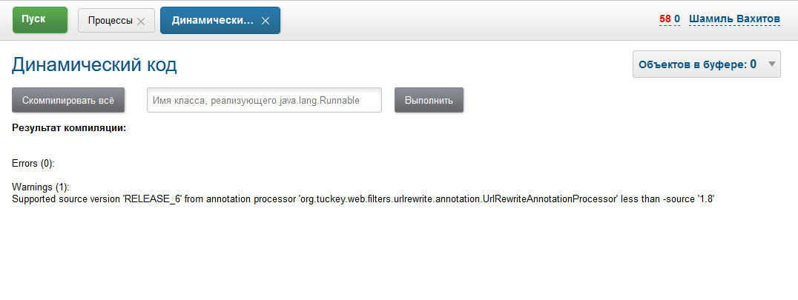

= Extension
:toc:

NOTE: This chapter may be skipped at first time of using the system.

Система BGERP является в первую очередь платформой, поэтому значительный эффект от её применения достигается путём
реализации различного рода расширений под специфику пользователя.

[[ccc]]
== Choose technology CCC
BGERP предоставляет сразу несколько уровней для расширения либо модификации стандартной логики.
Способы перечислены в порядке возрастания сложности и функциональности.
Рекомендуемая практика - переход от простого к более сложному.

[[ccc-config]]
=== Config
Изменение конфигураций продукта согласно документации.
Полная обратная совместимость, поведение описано документацией.
Using <<jexl, JEXL>> scripts for more flexibility.
No error check, no full-functional IDE>

[[ccc-custom]]
=== Custom
Develop own <<custom, Custom>> plugins using Java, JSP and full-featured IDE.

[[ccc-contribute]]
=== Contribute
Обобщение функциональности, есть требования к оформлению передаваемого кода и документации.
Переданный код постоянно находится "под присмотром", учитывается при изменениях продукта, равно как и используемые библиотеки.

[[config]]
== Configuration
[[jexl]]
=== JEXL
JEXL - язык коротких выражений.

Используется для написания в конфигурации макросов условных выражений, гибкого вычисления небольших строк.
Помимо операторов, описание которых доступно по ссылке в конце раздела, язык поддерживает обращение к функциям Java - объектов,
переданных на вход обработчика в зависимости от условий.

Для вызова функции Java объекта необходимо ввести название объекта в контексте, точку и непосредственно вызов функции.
Для вызова статического метода класса указывается имя класса с точкой.

Пример использования выражения:
[source]
----
processCreateLink.1.title=Проект (Уфа)
processCreateLink.1.processTypeId=9260
processCreateLink.1.linkType=processDepend
processCreateLink.1.checkExpression=1 =~ processParam.addressCityIds( 90 ) and process.getStatusId() == 39
processCreateLink.1.copyParams=90,89,238
processCreateLink.1.copyLinks=1
----

В данном случае создание связанного процесса будет доступно только для процессов в статусе с кодом 39 и с наличием адреса в параметре с кодом 90 с городом 1.

[[jexl-standard-context]]
В JEXL процессор всегда передаются объекты:
[square]
* *u* - статический контекст объекта javadoc:ru.bgcrm.util.Utils[] - возможность вызова статических функций;
* *tu* - статический контекст объекта javadoc:ru.bgcrm.util.TimeUtils[] - возможность вызова статических функций;
* *su* - статический контекст объекта link:https://commons.apache.org/proper/commons-lang/javadocs/api-3.8.1/org/apache/commons/lang3/StringUtils.html[org.apache.commons.lang3.StringUtils] - возможность вызова статических функций;
* *сu* - статический контекст объекта link:https://commons.apache.org/proper/commons-collections/javadocs/api-3.2.2/org/apache/commons/collections/CollectionUtils.html[org.apache.commons.collections.CollectionUtils] - возможность вызова статических функций;
* *fu* - object of class link:https://commons.apache.org/proper/commons-io/javadocs/api-2.6/org/apache/commons/io/FileUtils.html[org.apache.commons.io.FileUtils] for calling static methods;
* *log* - объект класса link:https://logging.apache.org/log4j/1.2/apidocs/org/apache/log4j/Logger.html[org.apache.log4j.Logger], позволяет вести <<log-dyn, отладку>> с помощью *log.debug* и других вызовов;
* *NEW_LINE* - перенос строки;
* *NEW_LINE2* - два переноса строки.

Дополнительные объекты передаются в зависимости от места использования.

[[jexl-process-context]]
Типовой дополнительный набор объектов для обработчика процесса:
[square]
* *user* - объект класса javadoc:ru.bgcrm.model.user.User[] - текущий пользователь;
* *userParam* - объект класса javadoc:ru.bgcrm.dao.expression.ParamValueFunction[] - параметры текущего пользователя;
* *process* - объект класс javadoc:ru.bgcrm.model.process.Process[] - изменяющийся процесс;
* *processParam* - объект класса javadoc:ru.bgcrm.dao.expression.ParamValueFunction[] - параметры изменяющегося процесса;
* *processLink* - объект класса javadoc:ru.bgcrm.dao.expression.ProcessLinkFunction[] - привязки изменяющегося процесса;
* *conSet* - объект класса javadoc:ru.bgcrm.util.sql.ConnectionSet[] - соединения к БД;
* *form* - объект класса javadoc:ru.bgcrm.struts.form.DynActionForm[] - данные по запросу к серверу;
* все переменные контекста из javadoc:ru.bgcrm.servlet.filter.SetRequestParamsFilter[];
* объект класса javadoc:ru.bgcrm.dao.expression.ProcessChangeFunctions[] передаётся как контекст функций по-умолчанию, т.е. все его функции можно вызывать непосредственно в скрипте.

При необходимости выражения могут быть <<interface.adoc#config-multiline, многострочными>>, при этом результат (если он есть) возвращается оператором return.
Пример многострочного скрипта для <<process/processing.adoc#, простого обработчика событий процесса>>:

[source,java]
----
onProcessEvent.2.doExpression=<<END
  dao = new("ru.bgcrm.dao.ParamValueDAO", conSet.getConnection());
  dao.updateParamText(process.getId(), 63, "тест");
END
----

Часто необходимая информация (детальное описание - по ссылкам далее):
[square]
* оператор *[]* - создание массива, *{}* - HashSet, подойдёт на место Collection;
* функция *new* (см. пример выше) - создание объекта класса, конструктор может быть с параметрами;
* операторы проверки наличия объектов в коллекциях: *=~* , *!~*

Методы вызываются у объектов классов с помощью точки, для вызова статического метода используется объект типа *java.lang.Class* нужного класса, который может быть создан просто записью полного имени класса. Небольшой пример, как вызывать статические методы javadoc:ru.bgcrm.util.Utils[].

[source,java]
----
u = ru.bgcrm.util.Utils;
v = u.parseInt(3);
----

Подробная спецификация по языку:
[square]
* http://commons.apache.org/jexl/reference/syntax.html#Functions
* https://commons.apache.org/proper/commons-jexl/apidocs/org/apache/commons/jexl3/package-summary.html

CAUTION: Обратите внимание на вызов функции u.escapeXml - она преобразует все символы HTML разметки в спецпоследовательности. Если не использовать эту функцию для генерации HTML, возможны проблемы, в случае появления в описании процесса символов <,> либо кавычек. Пример ниже.

[source,java]
----
processReference.1.stringExpression=u.escapeXml( u.maskNull( u.getFirst( processParam.addressValues( 345, 'fromStreet' ) ) ) ) + " (" + size( processParam.addressValues( 345 ) ) + ")"
----

[[regexp]]
=== Java REGEXP
Регулярные выражения позволяют гибко описывать шаблоны строк.

Описание строк осуществляется путём подстановки определённых макросов, обозначающих части строки либо символы определённого типа.

Например:
[square]
* (342) - это символы 342 следующие один за другим;
* 3\d2 - это 3 затем любая цифра и 2;
* ((342)|(559)) - последовательность симоволов 342 либо 559;
* 44[2-8] - строки 442, 443, 444, 445, 446, 447, 448.

Расшифровка некоторых макросов:
[square]
* а-b - на этом месте может располагаться симовол от a до b (в таблице символов);
* [abc] - на этом месте может располагаться любой из символов a, b либо c;
* abc - последовательное расположение символов a, b, c;
* ((abc)|(def)) - на этом месте последовательно располагаются abc либо def, () - группа символов.

Ссылки:
[square]
* http://www.opennet.ru/docs/RUS/perlre_man/ - регулярные выражения Perl, практически идентичны Java.
* http://j2w.blogspot.com/2008/01/java.html - регулярные выражения Java.
* http://docs.oracle.com/javase/1.5.0/docs/api/java/util/regex/Pattern.html - спецификация на английском.

[[log4j]]
=== Логирование
Log4j - библиотека логирования для Java. Настройка логирования производится в файле *log4j.properties*,
изменение файла можно производить при работающем приложении. Вид файла при установке системы:

[snippet, from="# lib"]
link:../../../build/bgerp/files/log4j.properties[log4j.properties]

Сообщения в логе разделяются на уровни (в порядке возрастания): *DEBUG*, *INFO*, *WARN*, *ERROR*, *FATAL*.
По-умолчанию настроен уровень INFO, т.е. выводятся информационные и ошибочные сообщения (INFO, FATAL, ERROR), отладка не выводится.
Вывод осуществляется в файл *log/bgerp.log*, который обрезается на размере 10МБ с созданием отдельных файлов.

Samples, how to enable loggers wanted package or classes to *log/bgerp.all.log* in:
[square]
* <<../plugin/asterisk/index.adoc#debug, Plugin Asterisk>>
* <<../plugin/sec/auth/index.adoc#debug, Plugin Auth>>

В конфигурационном файле возможно изменять формат информации в файле, фильтр по классам и другие параметры логирования.

Ссылки:
[square]
* http://artamonov.ru/2007/04/06/vvedenie-v-log4j/ - вводная статья на русском.

[[log-dyn]]
==== Динамическое логирование
Для более удобной отладки JEXL скриптов, конфигураций либо динамического кода
возможно получение логов только текущей сессии с помощью оснастки *Пуск / Логирование*.

image::_res/ext_dyn_log.png[width='600px']

Логирование позволяет отследить вызванную действиями пользователя активность на стороне сервера.
Количество строк лога ограничено, отображаются только последние 1000 строк.
Каждый раз при переходе в оснастку поле *Текущий лог* обновляется, то же действие производит повторное нажатие кнопки *Включить*.

[[custom]]
== Custom
Custom application code has to be placed `custom` directory in the project root.

drawio:_res/custom.drawio[]

[[custom-git]]
=== Custom GIT

[[custom-github]]
==== Creation on GitHub
In order to store your custom code you have to create a custom GIT repository and add there permissions of developers, who do you trust.
We kindly ask you to use open forks of the Custom GIT template repo: https://github.com/Pingvin235/bgerp-custom , hosted on GitHub.
With that you share your experience with other customers.

IMPORTANT: Be sure that you are not hardcoded any confidential data in your Custom GIT.

For creating your Custom GIT you have make the following steps.

Make a link:https://github.com[GitHub] account if it you don't have it and log in with it.

Open the template repo https://github.com/Pingvin235/bgerp-custom and press *Fork* button.

image::_res/github_fork.png[width='800px']

Rename the fork on Settings tab to *bgerp-custom-<MyCompany>*, using instead of *<MyCompany>* a wanted name. For example *bgerp-custom-bitel* as on the screen below.

image::_res/github_rename.png[width='800px']

Go to *Settings / Collaborators* and add your trusted developers using their GitHub accounts or e-mails.

image::_res/github_collab.png[width='800px']

[[custom-workflow]]
==== Workflow
Content of the directory may be stored using GIT and developed in full-featured <<../project/index.adoc#ide, IDE>>.

The `custom` directory is ignored in the root directory of the <<../project/index.adoc#checkout-reader, project>>,
and has to be checked out independently, e.g.:
[source]
----
git clone https://github.com/Company/bgerp-custom-company.git custom
----

A GIT URL can be taken from GitHub UI.

image::_res/github_url.png[width='800px']

Once you did changes, run the commands for pushing them in `custom` directory.
[source]
----
git pull --rebase && git add . &&  git commit -m "My changes" && git push
----

The same clone command has to be run in application directory, e.g.
[source]
----
git clone https://github.com/Company/bgerp-custom-company.git /opt/bgerp/custom
----

For checking out changes out of *CUSTOM GIT* may be used approach with *DETACHED HEAD*:
[source]
----
git fetch && git checkout origin/master
----

With *CUSTOM GIT* also can be used the same <<../project/workflow.adoc#change, GIT workflow>>
as for the main project's code. Any change has to be placed in a separated branch.

[[custom-update-fork]]
==== Update Fork
Use the following commands for updating your fork repo to the actual state of *bgerp-custom* repo.
[source]
----
git remote add upstream https://github.com/Pingvin235/bgerp-custom.git
git fetch upstream
git checkout master
git rebase upstream/master
git push
----

[[custom-using]]
=== Using
Inside `custom/src` placed regular Java code, including plugins <<../project/index.adoc#plugin, plugins>>.
*PLUGIN_ID* for those has to be prefixed by *custom.*, e.g. *custom.bitel*.
Respectively plugin files have to be stored under paths: *custom/org/bgerp/plugin/custom/<some-name>* .

That code has equal possibilities as the native application's, can use API and connected libraries.
After compilation *Administration - Custom* this code is persisted to `lib/app/custom.jar`.

NOTE: The application must be restarted to reload the `custom.jar`. There is *Restart* button available after successful compilation.

Subdirectory `custom/webapps` is searched *before* `webapps` from root directory
and should be used for placing custom JSP and JS files. Both types are applied immediately after change.

CAUTION: Each file from the original `webapps` may be "replaced" for Web server. That can brake built-in functionality.

[[custom-l10n]]
=== Custom localization
In file `custom/l10n.xml` has a special meaning for <<../project/index.adoc#l10n-files, localization>> system,
it allows to re-define each localized string in the system.

[[javalib]]
=== Java библиотеки
Пользовательские Java библиотеки, используемые в динамическом коде, JEXL выражениях либо JSP страницах должны быть размещены в каталоге *lib/custom*
JAR файлы из *lib/ext* перетираются при получении обновления библиотек.

[[dyn]]
=== Dynamic code
CAUTION: This approach is deprecated, use <<custom, Custom>> instead.

////
Динамический код - это Java файлы, которые можно изменять и подгружать без перезапуска приложения.
С его помощью можно обрабатывать различные события в системе. Файлы с классами динамического кода располагаются в по-умолчанию каталоге *dyn*.

Динамические классы необходимо создавать в пакете *ru.bgcrm.dyn.<дальнейшая иерархия пакетов>* и в соответствующем каталоге.

NOTE: Параметры динамического кода могут быть настроены в <<setup.adoc#config-dyn, конфигурации>>.

// TODO: Write AsciiDoc article.
Для написания динамического кода возможно использование как простого текстового редактора, так и полноценные IDE для Java разработки.
Методология при этом аналогична применяемой для link:https://web.archive.org/web/20180209130306/http://wiki.bitel.ru/index.php/%D0%A0%D0%B0%D0%B7%D1%80%D0%B0%D0%B1%D0%BE%D1%82%D0%BA%D0%B0_%D0%B4%D0%B8%D0%BD%D0%B0%D0%BC%D0%B8%D1%87%D0%B5%D1%81%D0%BA%D0%BE%D0%B3%D0%BE_%D0%BA%D0%BE%D0%B4%D0%B0_%D0%B2_IDE_Eclipse[разработке в BGBilling].

Компиляция динамического кода осуществляется в оснастке *Администрирование => Динамический код* интерфейса администратора.
Можно скомпилировать только все классы сразу. При успешной компиляции динамический код применяется также целиком.

Как видно из снимка экрана, помимо компиляции в оснастке возможно создание и запуск объекта класса реализующего интерфейс *java.lang.Runnable*.
Кроме данного способа возможны перечисленные в последующих разделах способы создания и применения объектов динамических классов.
Синхронный запуск происходит в потоке запроса и позволяет легко изучить <<#log-dyn, логи>>.
////

[[custom-jar]]
=== Custom JAR
CAUTION: This approach is deprecated, use <<custom, Custom>> instead.

With custom JAR in the application might be added any wanted Java classes.

[NOTE]
====
This sample describes deploing own annotated servlets in `WEB-INF/lib`.
Future plans about the functionality:
[square]
* such servlets have to be added in `META-INF/web-fragment.xml`;
* the JAR itself assempled out of earlier <<dyn, dynamic code>> in interface and placed in `lib/custom.jar`

Links:
[square]
* https://tomcat.apache.org/tomcat-9.0-doc/class-loader-howto.html
* link:https://github.com/apache/tomcat/blob/master/java/org/apache/tomcat/util/scan/StandardJarScanner.java[StandardJarScanner.java in Tomcat]
====

For making own servlet write annotated class extending *javax.servlet.http.HttpServlet*.
[source, java]
----
@WebServlet(name="RestApi", urlPatterns = "/restapi")
----

Compile to **.class*, assemple to a JAR file, place it in previously created directory `webapps/WEB-INF/lib`

To be loaded the JAR file has to be named with *custom* in name,
or you may change the marker string in configuration parameter *custom.jar.marker*.

==== Примеры
В составе поставки доступны примеры динамических классов в *dyn/ru/bgcrm/dyn* поименованные как *Example..* с описанием в комментариях.
Помимо этого вы можете найти примеры динамического кода <<../ext/dyn_sample.adoc#, здесь>>.

[[run]]
== Запуск кода
Во всех данных примерах могут использоватся как классы из библиотек системы, так и <<custom, custom>>.

=== Обработчики событий процессов
Имя класса-обработчика может быть указано в свойствах <<process/index.adoc#type, типа процесса>>.
Создаваемые динамические классы - обработчики событий должны расширять абстрактный класс javadoc:ru.bgcrm.event.listener.DynamicEventListener[].
Информацию по типам событий можно получить из API документации к системе в формате JavaDoc.

[[run-on-start]]
=== При старте сервера
Параметры *runOnStart* и *createOnStart* в <<setup.adoc#config, конфигурации сервера>>.
Указанные в них объекты классов создаются и запускаются для runOnStart при старте сервера.

[[run-http]]
=== HTTP запросом
[source]
----
<server>/admin/dynamic.do?action=runDynamicClass&iface=<iface>&class=<className>&j_username=<user>&j_password=<pswd>&param1=value&param2=..
----

Где:
[square]
* *<server>* - host and port of the server;
* *<className>* - имя динамического класса;
* *<user>* и *<pswd>* - логин и пароль пользователя BGERP, подробнее о запросах внешних систем;
* *<iface>* - тип класса-обработчика, подробнее ниже.

При параметре *<iface>* равным *event* класс должен расширять абстрактный класс javadoc:ru.bgcrm.event.listener.DynamicEventListener[]
в который передаётся событие javadoc:ru.bgcrm.event.RunClassRequestEvent[].
В противном случае класс может реализовать интерфейс java.lang.Runnable, который просто будет запущен.

//TODO: processCustomClassInvoke

[[run-cmd]]
=== Из командной строки
Для запуска любого класса, статического или динамического в контексте сервера BGERP вызовите:
[source, bash]
----
./crm.sh "runclass <class_name>"
----

Где *<class_name>* - полное имя класса с пакетом. Класс должен реализовывать интерфейс *java.lang.Runnable*.

Запуск в контексте сервера обозначает, что класс будет выполнен в рамках отдельного потока процесса сервера,
получив доступ к соединению с БД, конфигурациям и другим объектам контекста. Результаты работы можно выводить в логи.

[[run-scheduler]]
=== Планировщик
Для периодического выполнения класса необходимо использовать <<setup.adoc#scheduler, планировщик>>.

[[run-iface]]
=== User interface
In menu *Administration / Run* can be executed any Java class, implementing *java.lang.Runnable*.

[[ext-request]]
== Интеграция с внешними системами
Все запросы на изменение данных в возвращают результат в JSON формате. Запросы выборки данных возвращают результат в HTML формате,
однако возможно получение данных и в JSON формате, путём добавления в запрос параметра *responseType=json*.

Для прозрачной авторизации запроса сторонней системы логин и пароль пользователя могут быть переданы в запросе в HTTP параметрах запроса
*j_username* и *j_password* соответственно. Параметр *authToSession=0* в запросе указывает на хранение отсутствие необходимости в HTTP сессии.
Настоятельно рекомендуется использовать его при запросах внешних систем, т.к. предотвращение создания HTTP сессий экономит память BGERP.

Пример запроса на получение данных во внешнюю систему в JSON формате (выборка по очереди процессов):
[source]
----
https://bgerp.company.com/user/process.do?action=queueShow&id=4&dateStatusStatus=10&status=10&status=9&status=13&currentUserMode=&group=7&sort=0&j_username=shamil&j_password=*****&responseType=json&authToSession=0
----

При изучении формата запросов и ответов возможно использование инструмента разработчика в браузере
с отслеживанием запросов отправляемых браузером при работе пользователя в BGERP.

