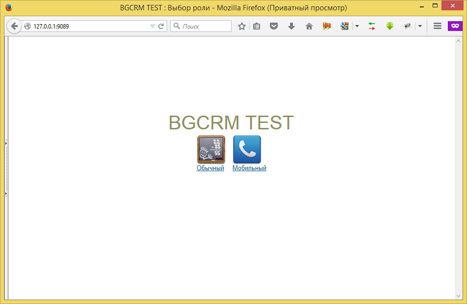
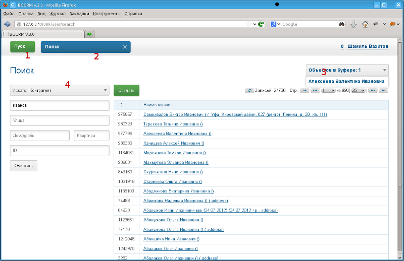
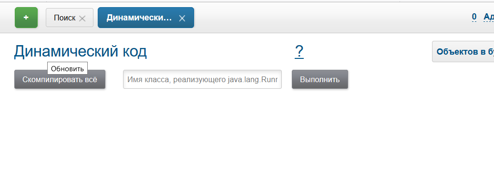
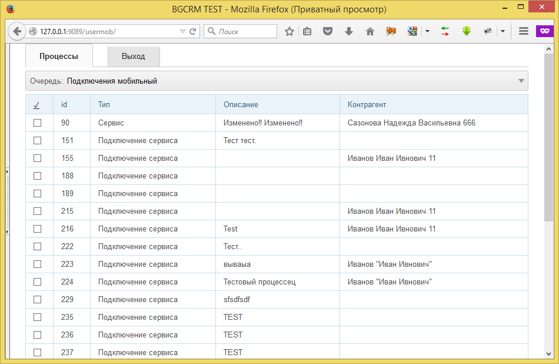

= Interface
:toc:

The program has the following types of Web-interface:
[square]
* <<user, *user*>> - is the main one, for normal PC with mouse and keyboard;
* <<mobile, *mobile*>> - restricted version for for mobile devices;
* <<open, *open*>> - for accessing from outside to open services without authentication.

[[server]]
For calling of the running system use URL: http://<host>:<port> where:
[square]
* *<host>* - IP address of the server;
* *<port>* - port, by default is *9088*.

On the opened page may be chosen <<user, user>> or <<mobile, mobile>> interfaces.

Configuration process has to be started from *user* interface.
After creation database has only one superuser *admin* with password *admin*.

IMPORTANT: Change them after the first log in. The user with ID=1 is a special one, <<setup.adoc#user, permissions>> are ignored for him.

image::_res/i0083.png[]

[[element]]
== Elements
[[element-button]]
=== Button
Button colors have the following meanings.
[cols="a,a", options="header"]
|===
|Button view
|Functionality

|image::_res/i0124.png[]
|Greens call an editor for adding new entity.

|image::_res/i0125.png[]
|Browns send request to server.

|image::_res/i0127.png[]
|Progress indicator.

|image::_res/i0126.png[]
|Whites do all other actions.
|===

[[user]]
== User interface
The interface is <<server, available>> by suffix */user*.

Основные элементы обычного интерфейса пользователя.

[square]
* *1* - кнопка вызова меню;
* *2* - панель запущенных оснасток;
* *3* - буфер открытых объектов;
* *4* - пример запущенной оснастки.

Меню иерархическое, позволяет запускать оснастки и выполнять различные действия в системе.
Пункты меню могут быть скрыты, если соответствующие права запрещены <<setup.adoc#user, пользователю>>.

image::_res/i0120.png[]

// Перевод: Tool
[[user-tool]]
=== Оснастка
Приложение для манипулирования данными
Оснастка может быть запущена только в одном экземпляре, похожа на программу в операционной системе.

[[user-object]]
=== Объект
Блок данных, например процессы. Все в объекты закрываемые результате перехода на другие объекты либо оснастки помещаются
в буфер на первую позицию (поведение по-умолчанию, но может быть изменено). Ёмкость буфера ограничена, при его переполнении нижние объекты удаляются.
Явно закрытые крестом объекты в буфер не попадают. Для обновления карточки открытого объекта необходимо кликнуть мышью по наименованию объекта.

Назначение буфера сходно с буфером обмена операционной системы: на находящиеся в нём объекты можно ссылаться в различных редакторах.
Кроме того, буфер позволяет осуществить быстрый переход на объекты, с которыми пользователь работал последнее время.

=== Всплывающие подсказки
При наведении и удержании мыши на некоторых элементах интерфейса отображается всплывающая подсказка, предоставляющая дополнительные сведения.

image::_res/i0123.png[]

// Перевод: Title line
[[user-top-line]]
=== Строка заголовка
Отображает название текущей открытой оснастки либо объекта. Может содержать ссылку на раздел документации с симоволом вопроса.
Клик по названию в строке заголовка обновляет открытый объект или вкладку.

[[notifications]]
=== Уведомления
В правом верхнем углу перед ссылкой на профиль отображаются настроенные для выведения <<process/queue.adoc#iface, счётчики>> процессов.
Клик по счётчику открывает соответствующую очередь процессов и сохранённый фильтр. Таким образом можно всегда видеть перед глазами важнейшие числа.

Далее отображается суммарное число необработанных сообщений и непрочитанных новостей. При изменении их количества число начинает мигать.
Клик по пункту выпадающего меню переводит соответсвенно в оснастку новостей либо сообщений.

image::_res/iface_notifications.png[]

=== Профиль
В правом верхнем углу отображается имя текущего пользователя. При нажатии на него открывается меню, ведущее в профиль.

image::_res/i0121.png[]

В профиле пользователь имеет возможность изменить логин с паролем, <<setup.adoc#param, параметры>> своего аккаунта. В нижней части редактора - специфичные для данного
пользователя нюансы поведения интерфейса, которые можно изменить.

Значения по-умолчанию опций интерфейса доступны для изменения в конфигурации.
Для этого в с помощью инспектора кода (FireBug, встроенное средство браузера, либо просмотр исходного кода фрагмента) узнать имя hidden поля параметра и значений.
Например, для свойства "Порядок объектов в буфере" это будет:
[source, html]
----
<input name="iface_buffer_behavior" value="2" type="hidden">
...
<li selected="selected" value="1">Подсветка строки / клик</li>
<li value="0">Кнопка со звёздочкой</li>
----

Заменой нижнего подчёркивания на точки получается имя значения по-умолчанию данной опции для конфигурации. В данном случае, установка:
----
iface.buffer.behavior=2
----

Включит для всех пользователей редактирование с помощью отдельной кнопки со звёздочкой как поведение по-умолчанию.

[[mobile]]
== Mobile interface
The interface is <<server, available>> by suffix */usermob*.

В текущей версии мобильный интерфейс пользователя предоставляет доступ к мобильной очереди процессов.
В отличие от обычной она сильно ограничена функциональностью:
[square]
* фильтрация и сортировка жёстко заданы;
* значения колонок со ссылками (открытие контрагент, пользователя) отображаются простым текстом, как при выводе очереди на печать;
* нет постраничного деления, предполагается, что фильтр ограничивает весь необходимый набор процессов для исполнителя.

Для того, чтобы очередь процессов была считалась мобильной, в конфигурации её должно быть указано:
----
showIn=usermob
----

Для всех фильтров должны быть определены жёстко значения, например:
----
filter.{@inc:cnt}.type=openClose
filter.{@cnt}.values=open
filter.{@inc:cnt}.type=executors
filter.{@cnt}.values=current

sort.combo.count=3
sort.mode.2.column.id=2
sort.mode.2.title=Создан обр.
sort.mode.2.desc=1
sort.mode.3.column.id=6
sort.mode.3.title=Статус
----

Создание процесса в очереди возможно только <<process/wizard.adoc#, мастером>>, для всех разрешённые к созданию типы процессов должны быть указаны
в переменной конфигурации очереди createAllowedProcessList примерно следующим образом:
----
createAllowedProcessList=72:Подключение;74:Подключение1
----

В данном примере 72 и 74 - коды процессов, для каждого создаваемого типа будет отображена своя кнопка.

image::_res/iface_mob_create.png[]

Открытие процесса происходит нажатием в любое место строки таблицы. При открытии процессе также вызывается мастер. Но не создания а редактирования.
Пример открытого процесса со следующей конфигурацией мастера:
----
wizard.step.1.title=Статус
wizard.step.1.class=SetStatusStep

wizard.step.2.title=Описание
wizard.step.2.class=SetDescriptionStep
----

image::_res/iface_mob_wizard.png[]

[[open]]
== Open Interface
The interface is <<server, available>> by suffix */user*.

Configuration sample of <<install.adoc#nginx, NGINX>> for accessing it from outside network.

Beside of some kernel functionality, described below, this interface is also used by following plugins:
[square]
* <<../plugin/dispatch/index.adoc#, Dispatch>>
* <<../plugin/feedback/index.adoc#, Feedback>>
* <<../plugin/mobile/index.adoc#, Mobile>>

[[open-config]]
=== Config
Default *<OPEN_URL>* for accessing the open interface is */open* that can be changed in <<setup.adoc#config, configuration>>.
It is recommended to make separated included configuration for configuring open interface.
----
# changed root <OPEN_URL>
#url.open=https://demo.bgerp.org/open
----

[[open-user]]
=== User profile
For enabling showing user specific information by URL *<OPEN_URL>/profile/<USER_ID>*:
[arabic]
. create user <<setup.adoc#param, parameter>> with type *list* and value *1=Yes*, ID of that is *<ENABLE_PARAM_ID>*;
. add the following records in <<setup.adoc#config, configuration>>.

----
user.open.enable.paramId=<ENABLE_PARAM_ID>
user.open.show.paramIds=<PARAM_IDS>
----

Where:
[square]
* *<PARAM_IDS>* - comma separated user parameter IDs to be shown, parameter type *file* is not supported

[[open-process]]
=== Process
For enabling showing process information by URL  *<OPEN_URL>/process/<PROCESS_ID>*
define in <<setup.adoc#config, configuration>>:

----
process.open.typeIds=<TYPE_IDS>
process.open.show.paramIds=<PARAM_IDS>
process.open.show.message.tagIds=<MESSAGE_TAG_IDS>
# optionally JEXL expression for handling access secrets
#process.open.secret.expression=<SECRET_EXPRESSION>
----

Where:
[square]
* *<TYPE_IDS>* - comma separated process type IDs to be shown;
* *<PARAM_IDS>* - comma separated process parameter IDs to be shown, parameter type *file* is not supported;
* *<MESSAGE_TAG_IDS>* - comma separated <<message/index.adoc#usage-process-tag, message tag>> IDs to be shown, * - show all tags;
* *<SECRET_EXPRESSION>* - <<extension.adoc#jexl, JEXL>> expression for secret handling, e.g using plugin <<../plugin/sec/secret/index.adoc#, secret>>.

[[open-process-queue]]
=== Process Queue
For enabling showing process queue by URL *<OPEN_URL>/process/queue/<OPEN_NAME>*
define in <<process/queue.adoc#setup, configuration>> of the queue:
----
openUrl=<OPEN_NAME>
media.html.open.columns=<COLUMN_IDS>
----

Where:
[square]
* *<COLUMN_IDS>* - comma separated list of queue <<process/queue.adoc#setup, columns>>.

[[open-l10n]]
=== Localization
For <<../project/index.adoc#l10n, localization>> of the Open Interface add HTTP request parameter *lang=<LANG>*, where *<LANG>* - shortcut of the wanted language.

[[id]]
== Коды объектов
Числовые коды объекты, они же *идентификаторы*, необходимы для однозначного определения различных объектов данных в системе.
Например, параметров, статусов и т.п. Генерируются при создании и не меняются в течении всего срока жизни объекта.
Поэтому, в отличии от наименований, пригодны для использования в конфигурациях. Код объекта обычно выводится в таблице справочника,
либо при открытии редактора объекта и сопровождается меткой *ID*. На скриншоте ниже приведены различные объекты и их коды.

image::_res/i0118.png[]

Также в конфигурациях могут потребоваться коды объектов внешних систем, например,
link:https://bgbilling.ru/v6.1/doc/ch01s08.html[BGBilling] (получение кодов описано в разделе "Горячие клавиши").

[[config]]
== Конфигурации
Очень большое количество редко меняющихся настроек поведения системы вынесено в конфигурации.
Конфигурация - это текстовый блок, состоящих из записей вида: *<ключ>=<значение>*.
На одной строке может быть только одна такая запись, символ *#* в начале строки означает комментарий.

Конфигурации вводятся либо в текстовых *.properties* - файлах (опции подключения к БД, базовые настройки),
либо в редакторах конфигурации, сохраняясь в базе данных.

[[config-variable]]
=== Переменные
В значениях параметров конфигурации возможна подстановка ранее указанных значений с помощью подстановок *{@имя параметра}*. Рассмотрим пример подстановки.
----
# определение значения
howYou=how you
# использование подстановки
some.kind.of.config.record=Thats {@howYou} should use macro!
----
При такой конфигурации при взятии значения some.kind.of.config.record получаем в результате строку "Thats how you should use macro!".
Подставляемое значение должно быть обязательно определено ранее подстановки.

=== Счётчики
После разбора конфигурация используется системой как набор пар ключ - значение, в котором порядок не определён. При необходимости указания порядка в ключе вводятся дополнительные числовые индексы.

Например:
----
object.1.id=1
object.1.title=Title1
object.2.id=2
object.2.title=Title2
----

При большом количестве подобных записей ведение индекса может быть затруднительным, особенно при необходимости изменения номеров записей.
В этом случе индекс можно вынести в отдельную переменную, увеличивая его с помощью макроса *inc*.
Далее приведена идентичная конфигурация, индексы в которой выведены в переменную.
----
object.{@inc:cnt}.id=1
object.{@cnt}.title=Title1
object.{@inc:cnt}.id=2
object.{@cnt}.title=Title2
----

=== Склеивание значений
Помимо присвоения параметр конфигурации можно приклеивать к уже существующему под таким ключём значению. Для этого используется оператор *+=* Например:
----
key=1
key+=,2
key+=,3
----

В этом случе под ключом *key* будет храниться строка "1,2,3".

Склеивание помогает разбить длинную строку конфигурации на несколько более читаемых. Например:
----
# дата рожд., с.-н. пасп., д.в. пасп., кем выд. пасп, адрес проп., тел. гор, тел. сот, адрес(а) усл., перс. данные
bgbilling:creator.importParameters=73,74,75,76,77,78,14,12,115
# ИНН, КПП, ФИО руководителя, полное название, должность рук.-ля, E-Mail(ы)
bgbilling:creator.importParameters+=,248,249, 252, 428, 429, 15
----

Также оно полезно при <<setup.adoc#united-user-config, объединении>> нескольких конфигураций, позволяя создать общую объединённую переменную.

[[config-multiline]]
=== Многострочные значения
Ещё один способ разбития на несколько строк значения конфигурации. Используется, например, в <<extension.adoc#jexl, JEXL>> скриптах.
----
value=<<END
Line1
Line2
END
----
Значение value будет *Line1Line2*. Переносы строк не участвуют в склеивании. Вместо *END* можно использовать любую строку.

[[log-dyn]]
== Dynamic Log
This tool may is available in *Log* menu and allows collecting session logs, which may be requested by developers.

image::_res/log_dyn.png[width="800"]

Once enabled the tool is collecting logs starting from *DEBUG* level for the current user session only,
that allows easier observe possible problems.

The log is refreshed any time when it opened back.
