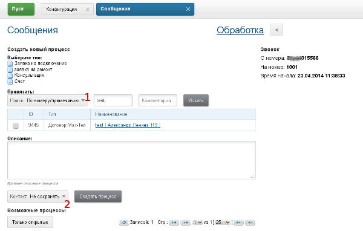
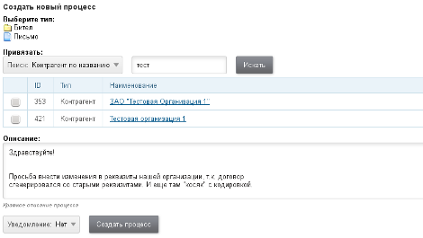
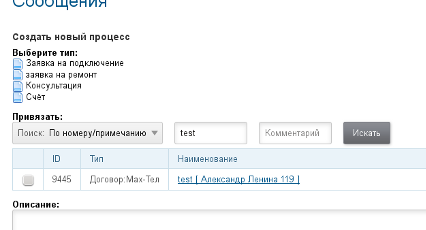
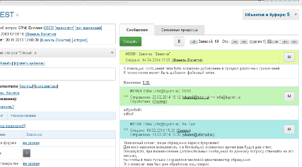
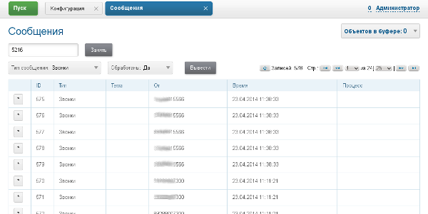
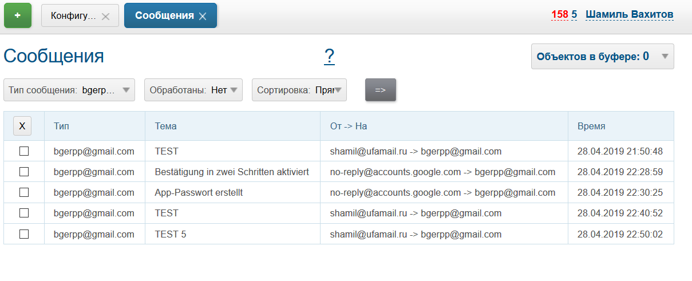

= Сообщения
:toc:

BGERP позволяет организовать обмен различными типами сообщений с привязкой их к процессам.
Таким образом процесс хранит всю историю связанных с ним коммуникаций с клиентами и между сотрудниками,
позволяя легко восстановить ход событий и производить весь обмен из интерфейса программы.

[ditaa]
----
          +-------------------------+
          |       Процесс           |
          +-------------------------+
          |       Сообщения         |
          | +----------+----------+ |
          | | E-Mail   | Slack    | |
          | +----------+----------+ |
Клиенты<->+ | Звонок   | Telegram | +<->Сотрудники
          | +----------+----------+ |
          | | Форум    | HelpDesk | |
          | +----------+----------+ |
          | |     Комментарий     | |
          | +---------------------+ |
          +-------------------------+
----

В ядре поддерживаются сообщения типа Звонок, Заметки (Комментарии). Дополнительные типы сообщений предоставляются плагинами.

Система сообщений позволяет организовать обмен информации централизованным образом, исключая персональные контакты через отдельные аккаунты
E-Mail, телефоны и т.п.. Процесс может легко быть передан иному исполнителю и всю информацию по нему доступна всем и всегда.

Сообщения E-Mail могут быть использованы для коммуникации двух BGERP между собой. В каждой из них сообщения будут привязаны к своему процессу,
имеющих собственных исполнителей.

[[setup]]
== Настройка
Для настройки сообщений создать отдельную <<../kernel/setup.adoc#config, конфигурацию>>, включаемую в основную посредством инклуда.

Following settings should be done in the configuration.

[[type]]
== Типы
Типы сообщения настраиваются в конфигурации, одна или несколько записей вида:
[source]
----
messageType.<id>.title=<title>
messageType.<id>.class=<messageTypeClassName>
----
Где:
[square]
* *<id>* - уникальный числовой идентификатор типа сообщения, не должен меняться впоследствии;
* *<title>* - наименование типа сообщения;
* *<messageTypeClassName>* - имя класса-обработчика сообщений.

Опциональные параметры:
[source]
----
# не информировать о необработанных сообщениях данного типа
messageType.<id>.unprocessedMessageNotify=0
----

Остальные параметры различаются для разных видов сообщений.

Для типа сообщения могут быть указаны один или несколько режимов поиска:
[source]
----
messageType.<id>.search.<searchModeId>.title=<title>
messageType.<id>.search.<searchModeId>.class=<searchModeClassName>
----
Где:
[square]
* *<searchModeId>* - уникальный числовой идентификатор режима поиска, начиная с 1;
* *<title>* - наименование режима поиска;
* *<searchModeclassName>* - имя класса, реализующего режим поиска.

Первый режим поиска применяется по-умолчанию при открытии сообщения для обработки.

Необязателен к указанию и класс, сохраняющий контакт.

[source]
----
messageType.<id>.saver.class=<saverClassName>
----

На скриншоте цифрой 1 изображены режимы поиска, 2 - режимы сохранения контакта.

Режимы поиска и сохранения могут быть специфичны для типа сообщения.

[[type-search]]
=== Режимы поиска
[cols="a,a", options="header"]
|===

|Значение <searchModeClassName>, что ищет
|Конфигурация и пример

|:hardbreaks:
*ru.bgcrm.dao.message.MessageTypeSearchCustomerByTitle*
Контрагента по наименованию, для любого типа сообщения.

|:hardbreaks:
Нет дополнительных параметров.
Пример:
[source]
----
messageType.1.search.2.title=Контрагент по названию
messageType.1.search.2.class=ru.bgcrm.dao.message.MessageTypeSearchCustomerByTitle
----

|:hardbreaks:
*ru.bgcrm.dao.message.MessageTypeSearchEmail*
Поиск контрагента по Email для типа сообщения Email.
|:hardbreaks:
Нет дополнительных параметров.
Пример:
[source]
----
messageType.1.search.1.title=Авто по EMail
messageType.1.search.1.class=ru.bgcrm.dao.message.MessageTypeSearchEmail
----

|:hardbreaks:
*ru.bgcrm.dao.message.MessageTypeSearchCall*
Поиск контрагента в базе BGERP по номеру телефона звонящего для типа сообщения Call. Поиск производится по точному совпадению.
|:hardbreaks:
[source]
----
messageType.<id>.search.<searchModeId>.title=<title>
messageType.<id>.search.<searchModeId>.class=ru.bgcrm.dao.message.MessageTypeSearchCall
messageType.<id>.search.<searchModeId>.commands=<commands>
# необязательный параметр
messageType.<id>.search.<searchModeId>.stringExpressionNumberPreprocess=<jexl>
----
Где:
[square]
* *<commands>* - команды разделённые точкой с запятой, в данный момент поддержана *customerByPhoneParam:<paramIds>*, где *<paramIds>* - коды параметров типа "телефон" в биллинге через запятую;
* *<jexl>* - <<extension.adoc#jexl, JEXL>> выражение для предобработки номера перед поиском с его использованием, исходный номер передаётся переменной *numberFrom*.

Пример:
[source]
----
messageType.1.search.1.title=Авто контрагент (номер)
messageType.1.search.1.class=ru.bgcrm.dao.message.MessageTypeSearchCall
messageType.1.search.1.commands=customerByPhoneParam:10
messageType.1.search.1.stringExpressionNumberPreprocess=if( numberFrom.length() == 11 ){ numberFrom = numberFrom.substring(1)}; return numberFrom;
----

|:hardbreaks:
*ru.bgcrm.plugin.bgbilling.dao.MessageTypeSearchEmail*
Поиск договора в базе BGBilling по EMail парамеру для типа сообщения EMail.
|:hardbreaks:
[source]
----
messageType.<id>.search.<searchModeId>.title=<title>
messageType.<id>.search.<searchModeId>.class=ru.bgcrm.plugin.bgbilling.dao.MessageTypeSearchEmail
messageType.<id>.search.<searchModeId>.billingId=<billingId>
messageType.<id>.search.<searchModeId>.paramIds=<paramIds>
----
Где:
[square]
* *<billingId>* - идентификатор биллинга;
* *<paramIds>* - коды параметров договора т ипа EMail через запятую.

Пример:
[source]
----
messageType.1.search.3.title=Договор по параметру EMail
messageType.1.search.3.class=ru.bgcrm.plugin.bgbilling.dao.MessageTypeSearchEmail
messageType.1.search.3.billingId=bitel
messageType.1.search.3.paramIds=7
----

|:hardbreaks:
*ru.bgcrm.plugin.bgbilling.dao.MessageTypeSearchCall*
Поиск договора в базе BGBilling по номеру телефона звонящего для типа сообщения Call. Поиск производится по подстроке.
|:hardbreaks:
[source]
----
messageType.<id>.search.<searchModeId>.title=<title>
messageType.<id>.search.<searchModeId>.class=ru.bgcrm.plugin.bgbilling.dao.MessageTypeSearchCall
messageType.<id>.search.<searchModeId>.billingId=<billingId>
messageType.<id>.search.<searchModeId>.commands=<commands>
# необязательный параметр
messageType.<id>.search.<searchModeId>.stringExpressionNumberPreprocess=<jexl>
----
Где:
[square]
* *<billingId>* - идентификатор биллинга;
* *<commands>* - команды, в данный момент поддержана *contractByPhoneParam:<paramId>*, где *<paramId>* - идентификатор параметра типа "телефон" в биллинге;
* *<jexl>* - <<extension.adoc#jexl, JEXL>> выражение для предобработки номера перед поиском с его использованием, исходный номер передаётся переменной *numberFrom*.

Пример:
[source]
----
messageType.1.search.1.title=Авто (номер)
messageType.1.search.1.class=ru.bgcrm.plugin.bgbilling.dao.MessageTypeSearchCall
messageType.1.search.1.billingId=bg
messageType.1.search.1.commands=contractByPhoneParam:27
messageType.1.search.1.stringExpressionNumberPreprocess=if( numberFrom.length() == 11 ){ numberFrom = numberFrom.substring(1)}; return numberFrom;
----

|:hardbreaks:
*ru.bgcrm.plugin.bgbilling.dao.MessageTypeSearchContractByTitleAndComment*
Поиск договора в базе BGBilling по номеру и комментарию, для любого типа сообщения.

|:hardbreaks:
[source]
----
messageType.<id>.search.<searchModeId>.title=<title>
messageType.<id>.search.<searchModeId>.class=ru.bgcrm.plugin.bgbilling.dao.MessageTypeSearchContractByTitleAndComment
messageType.<id>.search.<searchModeId>.billingId=<billingId>
----
Где:
[square]
* *<billingId>* - идентификатор биллинга.

Пример:
[source]
----
messageType.1.search.2.title=По номеру/примечанию
messageType.1.search.2.class=ru.bgcrm.plugin.bgbilling.dao.MessageTypeSearchContractByTitleAndComment
messageType.1.search.2.billingId=bg
----

|:hardbreaks:
*ru.bgcrm.plugin.bgbilling.dao.MessageTypeSearchContractByDialUpLogin*
Поиск договора в базе BGBilling по логину либо алиасу DialUp модуля.
|:hardbreaks:
[source]
----
messageType.<id>.search.<searchModeId>.title=<title>
messageType.<id>.search.<searchModeId>.class=ru.bgcrm.plugin.bgbilling.dao.MessageTypeSearchContractByDialUpLogin
messageType.<id>.search.<searchModeId>.billingId=<billingId>
messageType.<id>.search.<searchModeId>.moduleId=<moduleId>
----
Где:
[square]
* *<billingId>* - идентификатор биллинга;
* *<moduleId>* - код экземпляра модуля DialUp.

Пример:
[source]
----
messageType.1.search.3.title=По логину DialUp
messageType.1.search.3.class=ru.bgcrm.plugin.bgbilling.dao.MessageTypeSearchContractByDialUpLogin
messageType.1.search.3.billingId=bg
messageType.1.search.3.moduleId=1
----
|===

[[type-saver]]
=== Режимы сохранения
[cols="a,a", options="header"]
|===

|Значение <saverClassName>, что делает
|Конфигурация и пример

|:hardbreaks:
*ru.bgcrm.dao.message.MessageTypeContactSaverEmail*
Сохранение EMail в параметр типа "email" контрагента. Возможно сохранение домена либо только EMail а.
|:hardbreaks:
[source]
----
messageType.<id>.saver.class=ru.bgcrm.dao.message.MessageTypeContactSaverEmail
messageType.<id>.saver.paramId=<paramId>
----
Где:
[square]
* *<paramId>* - код параметра контрагента типа "EMail".

Пример:
[source]
----
messageType.1.saver.class=ru.bgcrm.dao.message.MessageTypeContactSaverEmail
messageType.1.saver.paramId=27
----

|:hardbreaks:
*ru.bgcrm.dao.message.MessageTypeContactSaverPhone*
Сохранение телефона в параметр типа "phone" контрагента. Возможно сохранение домена либо только EMail а.
|:hardbreaks:
[source]
----
messageType.<id>.saver.class=ru.bgcrm.dao.message.MessageTypeContactSaverPhone
messageType.<id>.saver.paramId=<paramId>
----
Где:
[square]
* *<paramId>* - код параметра понтрагента типа "Phone";
* *<format>* - <<setup.adoc#config, формат (param.phone.format)>> номера.

Пример:
[source]
----
messageType.1.saver.class=ru.bgcrm.dao.message.MessageTypeContactSaverPhone
messageType.1.saver.paramId=37
messageType.1.saver.format=13
----

|:hardbreaks:
*ru.bgcrm.plugin.bgbilling.dao.MessageTypeContactSaverPhone*
Сохранение телефона в параметр типа "телефон" договора биллинга.
|:hardbreaks:
[source]
----
messageType.<id>.saver.class=ru.bgcrm.plugin.bgbilling.dao.MessageTypeContactSaverPhone
messageType.<id>.saver.paramId=<paramId>
messageType.<id>.saver.format=<format>
----
Где:
[square]
* *<paramId>* - код параметра типа "телефон" в биллинге;
* *<format>* - <<setup.adoc#config, формат (param.phone.format)>> номера.

Пример:
[source]
----
messageType.1.saver.class=ru.bgcrm.plugin.bgbilling.dao.MessageTypeContactSaverPhone
messageType.1.saver.paramId=27
----

|===

[[type-email]]
=== Тип EMail
Support of E-Mails separated to the <<../plugin/msg/email/index.adoc#, plugin>>.

[[type-note]]
=== Тип Note
*<messageTypeClassName>=ru.bgcrm.dao.message.MessageTypeNote*

Используются для добавления заметок (комментариев) по ходу процесса.

Пример настройки:
[source]
----
#
messageType.100.title=Заметка (Комментарий)
messageType.100.class=ru.bgcrm.dao.message.MessageTypeNote
----

[[type-call]]
=== Тип Call
*<messageTypeClassName>=ru.bgcrm.dao.message.MessageTypeCall*

Дополнительные необязательные параметры:
[source]
----
messageType.<id>.offerNumberFromParamId=<offerNumberFromParamId>
messageType.<id>.autoNumberRegister=<autoNumberRegister>
----
Где:
[square]
* *<offerNumberFromParamId>* - код текстового параметра пользователя, содержащий номер, предлагаемый к занятию по-умолчанию.
* *<autoNumberRegister>* - 0, to disable automatic registering user number on login.

Тип сообщения представляет из себя звонок, который обрабатывается оператором.
Для данного типа сообщения в оснастке <<#queue, обработки>> сообщений отображается поле занятия номера. Строго говоря, это означает,
что в системе может быть зарегистрирован только один тип сообщения Call.

По занятому номеру система определяет какой из пользователей получил звонок и открывает для него сообщение для обработки.
Для включения данного функционала в переменной *createOnStart* конфигурации сервера <<extension.adoc#run-on-start, должен быть указан>> класс javadoc:ru.bgcrm.event.listener.MessageTypeCallListener[].

"Поставщиком" звонков может, выступить плагин Asterisk либо звонок может быть зарегистрирован внешним <<extension.adoc#run-http, HTTP запросом>> класса javadoc:ru.bgcrm.event.listener.MessageTypeCallRegister[].

[[scheduler]]
== Настройка планировщика
Получение новых сообщений и отправку созданных в BGERP осуществляет класс *ru.bgcrm.worker.MessageExchange*,
настройте его запуск в <<setup.adoc#scheduler, планировщике>>.

Дополнительные опциональные параметры конфигурации задачи:
[square]
* *messageTypeIds* - коды типов сообщений через запятую, для которых производить обмен.

[[queue]]
== Оснастка "Сообщения"
Доступна через оснастку *Сообщения*. Основное назначение - первичная обработка сообщений с привязкой к вновь созданным, либо существующим процессам.
В обработке нуждаются не все сообщения, в данный момент она используется для E-Mail ов и <<#type-call, звонков>>.
Обработка звонка открывается автоматически, E-Mail ы необходимо открывать на оснастке вручную.

NOTE: Уведомление о количестве необработанных сообщений выводится в области <<interface.adoc#notifications, уведомлений>>.

Сообщение считается обработанным после того, как к нему привязан процесс. Помимо этого сообщение можно удалить.
В выпадающем списке можно выбрать фильтр по типу сообщений. В квадратных скобках рядом с типом отображается число необработанных сообщений каждого типа.

При клике по строке открывается обработка сообщения, внешний вид может быть следующим для звонка (снимок уже использовался выше).

Либо для E-Mail.

image::_res/message_process_email.png[width="600px"]

[[process]]
== Работа в процессе
Отображение вкладки сообщений должно быть настроено в <<process/index.adoc#config-messages, конфигурации типа процесса>>.

image::_res/process_messages.png[]

Для создания сообщения в рамках процесса используйте кнопку *Создать*.

[[message-tag]]
Доступен фильтр по сообщениям со вложениями и <<setup.adoc#config-message-tag, тегам>>.
Теги позволяют маркировать каждое сообщение определёнными метками, позволяющими их позже легко найти, например: "TODO", "Реквизиты".

Кнопка *M* рядом с каждым сообщением вызывает всплывающее меню с операциями:
[square]
* *Вкл./выкл. разрывы строк* - перенос длинных строк в сообщениях либо отображение скроллинга;
* *Теги* - установить теги на выбранное сообщение.
* *Изменить процесс на* - привязать сообщение к другому процессу:
** *Другой существующий* - по коду уже существующего процесса;
** *Независимую копию текущего* - создаётся новый процесс, копия текущего, в него копируются все привязки;
** *Зависящую копию текущего* - создаётся новый процесс, копия текущего и <<process/index.adoc#linked-process, привязанный к нему с типом processDepend>>;
** *Порождённую копию текущего*  - создаётся новый процесс, копия текущего и <<process/index.adoc#linked-process, привязанный к нему с типом processMade>>;
** *Ссылаемую копию текущего* - создаётся новый процесс, копия текущего и <<process/index.adoc#linked-process, привязанный к нему с типом processLink>>.
* *Ответить* - создать новое сообщение, являющееся ответом на выбранное и также привязанное к текущему процессу;
* *Редактировать* - редактировать сообщение, если тип поддерживает;
* *Удалить* - удалить сообщение, если тип поддерживает.

Пометку процессов с новыми сообщениями можно <<process/processing.adoc#, реализовать>> переключением статуса процесса по событию поступления сообщения.

[[debug]]
== Отладка
После добавления типа сообщения аналогичного <<#type-email, E-Mail>> в конфигурацию, включить <<../kernel/extension.adoc#log-dyn, динамическое логирование>> и
выполнить в <<../kernel/extension.adoc#dyn, оснастке Выполнить>> класс *ru.bgcrm.worker.MessageExchange* в синхронном режиме.
При этом будет произведена попытка чтения настроенного ящика, а также установки соединения на отправку. Возможные ошибки отобразятся в логе.

Должен работать <<../kernel/message.adoc#queue, просмотр>> сообщений в ящике и <<../kernel/message.adoc#process, отправка>> из карточки процесса.
Для форсирования отправки запускать тот же класс.

[[dev-plan]]
== Планы дальнейшего развития
Сообщение несёт на себе функцию всего информационного обмена для процесса. Между его исполнителям и с внешним миром.
E-Mail, звонки, форум, HelpDesk, Slack - поддержаны в настоящий момент.
Выписка о платеже, запланированная встреча (календарь), переписка чат-бота, автоматические уведомления впоследствии будут реализованы в виде сообщений.

