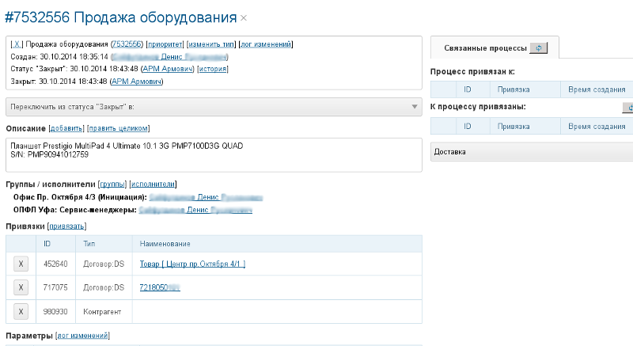
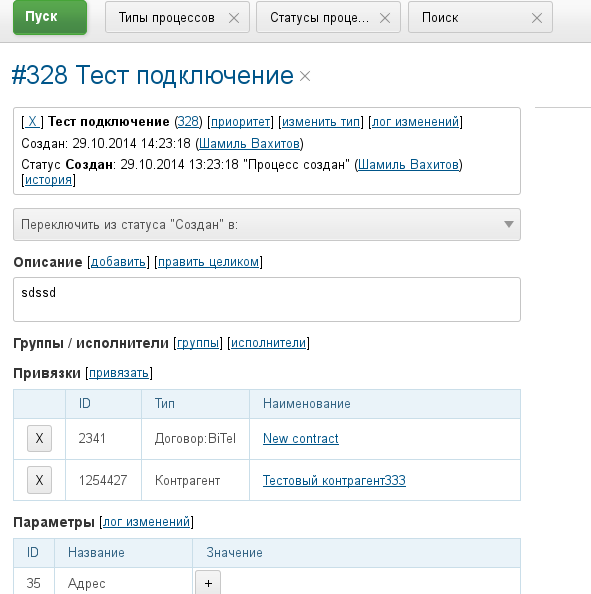
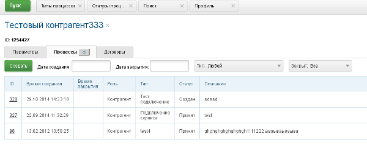

= Process
:toc:
:toclevels: 4

[[about]]
== About
Процесс - сущность, позволяющая учитывать различные протекающие в организации процессы. Процесс обладает встроенными параметрами:
[square]
* тип;
* текущий статус и время его установки;
* время начала;
* время завершения;
* исполнители и группы решения;
* описание;
* <<../setup.adoc#config-process-priority, приоритет>> [[priority]].

Остальные параметры назначаются с помощью системы параметров для разных типов процессов.

В большинстве ERP систем ближайшим родственным понятием процессу выступает понятие "Задача".
Однако, с помощью системы связывания процессов между собой, возможна настройка полноценных бизнес-процессов с подчинёнными задачами.

Новый процесс можно создать в:
[square]
* очереди процессов;
* на вкладке "Процессы" объекта;
* как привязанный;
* при обработке сообщений.

[[setup]]
== Setup

[[setup-status]]
=== Status
Правка статусов производится в оснастке *Администрирование / Процессы / Статусы процессов*.
Статус определяет текущее состояние процесса. Позиция статуса определяет порядок его в списке статусов.

image::_res/proc_status.png[width="800"]

Кнопка *Показать* отображает типы процессов, в которых используется статус.

[[setup-type]]
=== Type
Правка выполняется в оснастке *Администрирование / Процессы / Типы процессов*.
Типы процессов организованы в древовидный список.

image::_res/type.png[width="800"]

При редактирование типа может быть указано его название и признак наследования либо не наследования свойств от родительского типа.

image::_res/type_prop.png[width="800"]

В свойствах типа указываются следующие параметры:
[square]
* разрешённые статусы, их порядок в редакторе и возможные переходы между ними;
* допустимые параметры процесса, их порядок;
* код (ID) начального и конечных статусов;
* начальные группы решения, устанавливаемые в процесс с указанием их ролей (не обязательно) ;
* допустимые для установки в процесс группы решения с указанием их ролей;
* конфигурация (не обязательно).

CAUTION: Не следует без необходимости порождать большое количество типов процессов, наследованных от общего предка и различающихся только наименованием. Тип - главный классифицирующий признак для очереди процессов и в случае их большого количества эффективность фильтрации сильно падает. Пользуйтесь списковым параметром для разделения таких процессов.

В конфигурацию типа процесса могут быть <<../setup.adoc#config-include, включены>> блоки основной конфигурации.

Параметры конфигурации типа процесса, поддержанные ядром.

[example]
:hardbreaks:
====
# скрытие в редакторе процесса ссылки полной правки описания
hideDescriptionChange=1
# 0 - hide, 1 (default) - show on tab <<../message/index.adoc#usage-process, process messages>> [[config-messages]]
#show.tab.messages=1
# отображение в процессе сообщений также и дочерних <<usage-related-process, привязанных процессов>>
#show.messages.link.process=processMade, processDepend
# empty (default) or 0 - hide, 1 - show on tab <<usage-link, process links>> [[config-link]]
#show.tab.links=1
# требования указания обязательного комментария при переводы в статусы
requireChangeCommentStatusIds=<status_ids>
# коды групп исполнителей через запятую, которые можно указать при создании процесса
onCreateSelectGroup=<groupIds>
# шаблон текста при добавлении в описание процесса текста кнопкой "Добавить"
descriptionAddPattern=(${description}\n)[(${time}) (${user})]\t(${text})
# произвольный шаблон времени для добавляемого текста
descriptionAddPattern.timePattern=dd.MM HH:mm

# JSP шаблон для отображения карточки процесса вместо стандартного /WEB-INF/jspf/user/process/process/process.jsp
#processCardJsp=/WEB-INF/jspf/user/process/process/custom/process_jur/zayavka.jsp
# HTML стиль левого и правого блока карточки процесса, по-умолчанию они делятся поровну
#style.processCardLeftBlock=min-width: 500px;
#style.processCardRightBlock=width: 100%
====
:hardbreaks!:

Где:
[square]
* *<status_ids>* - коды статусов через запятую;
* *<groupIds>* - коды групп через запятую.

[[setup-type-title]]
==== Title
NOTE: You can see the feature enabled and sample configurations in <<../install.adoc#demo, Demo System>>, the process description is *Kernel Process Title*.

By default for every process type <<usage-card, title>> has generated like *#<PROCESS_ID> <PROCESS_DESCRIPTION>*, but that may be changed by placing in the type configuration:
----
title.expression=<jexl>
----

Where *<jexl>* contains <<../extension.adoc#jexl, JEXL>> expression with the following variables in context:
[square]
* *p* or *process* - object of class javadoc:ru.bgcrm.model.process.Process[] - the process;
* *pp* or *processParam* - object of class javadoc:ru.bgcrm.dao.expression.ParamExpressionObject[] - process parameters;
* *pl* or *processLink* - object of class javadoc:ru.bgcrm.dao.expression.ProcessLinkExpressionObject[] - process links.

Example with title generation out of process ID, type title and parameter with ID = 3 value.
----
title.expression=p.getId() + " " + p.getTypeTitle() + " " + pp.val(3)
----

Another one, with title including process link customer's title.
----
title.expression="Subscription " + p.getId() + " " + u.escapeXml(u.maskNull(pl.linkTitle("customer")))
----

[[setup-type-description]]
==== Description
NOTE: You can see the feature enabled and sample configurations in <<../install.adoc#demo, Demo System>>, the process description is *Kernel Process Description*.

Similar to process title may be gererated process description by placing in the type configuration:
----
description.expression=<jexl>
----

Where *<jexl>* contains <<../extension.adoc#jexl, JEXL>> expression with the following variables in context:
[square]
* *p* or *process* - object of class javadoc:ru.bgcrm.model.process.Process[] - the process;
* *pp* or *processParam*  - object of class javadoc:ru.bgcrm.dao.expression.ParamExpressionObject[] - process parameters;
* *pl* or *processLink* - object of class javadoc:ru.bgcrm.dao.expression.ProcessLinkExpressionObject[] - process links.

Example with title generation out of process ID, type title and parameter with ID = 3 value.
----
description.expression=p.getId() + " " + p.getTypeTitle() + " " + pp.val(3)
----

[[setup-type-param-behaviour]]
==== Params Behaviour
----
# при ошибке правки параметров - обновление таблицы с параметрами, необходимо в случае, если при этом другие параметры изменяются динамическим кодом
onErrorChangeParamsReload=1
# требование заполненности параметров перед установкой статуса, одна или несколько записей вида
requireFillParamIdsBeforeStatusSet.<status_to_code>=<param_codes>
# сокрытие параметров в том или ином статусе, одна или несколько записей вида
hideParamIdsInStatus.<status_code>=<param_codes>
# параметры, редактор для которых скрыт в данном типе процесса (заполняются программно)
readonlyParamIds=<param_codes>
----

Где:
[square]
* *<param_code>* - код параметра процесса, который должен быть указан при его закрытии, при этом редактор открывается под переключением статуса процесса;
* *<status_to_code>* - код статуса, в который переводится процесс;
* *<param_codes>* - коды параметров процесса через запятую;
* *<status_code>* - код текущего статуса процесса.

Для настройки отображения параметра в зависимости от гибкой проверки условия одно или несколько правил:
----
# отображение параметра, только если выполняется JEXL выражение
showParam.<paramId>.checkExpression=<JEXL_EXPR>
----

Где:
[square]
* *<paramId>* - код параметра;
* *<JEXL_EXPR>* - <<../extension.adoc#jexl, JEXL>> script with <<../extension.adoc#jexl-process-context, standard context for process>>.

[[setup-type-left]]
==== Card Left Area
NOTE: You can see the feature enabled and sample configurations in <<../install.adoc#demo, Demo System>>, the process description is *Kernel Process Card*.

Для настройки отображения левой области карточки процесса в конфигурацию типа добавляются одна или несколько конструкций вида:
----
processCard.<id>.mode=<modes>
processCard.<id>.components=<components>
----

Где:
[square]
* *<id>* - порядковый номер правила;
* *<modes>* - список через запятую режимов отображения карточки процесса, допустимые значения:
   ** *card* - просмотр карточки с открытием в буфере,
   ** *linked* - просмотр карточки процесса, привязанного к другому процессу с открытием в правой области первого процесса;
* *<components>* - через запятую компоненты левого блока, допустимые стандартные блоки: *header*, *description*, *executors*, *links*, *params*; or custom JSP files prefixied by *jsp:*.

Example:
[snippet, from="processCard", to="executors"]
link:../../../itest/org/bgerp/itest/kernel/process/ProcessCardTest.process.type.config.txt#L1-L2[Kernel Process Card type configuration]

How does the configured card look like.

image::_res/card_config.png[width="800"]

[[setup-type-executor-restriction]]
==== Executors Limit
Одно или несколько правил вида:
----
executorRestriction.<n>.groupId=<groupId>
executorRestriction.<n>.maxCount=<maxCount>
----

Где:
[square]
* *<n>* - порядковый числовой номер правила;
* *<groupId>* - код группы пользователей;
* *<maxCount>* - максимальное число исполнителей из данной группы на процессе.

Просматриваются все правила в порядке их номеров.

[[setup-type-create]]
==== Creation
NOTE: You can see the feature enabled and sample configurations in <<../install.adoc#demo, Demo System>>, the process type named *Kernel Process Create In*.

To restricting areas where the process type can be created, add:
----
create.in.areas=<areas>
----

Where *<areas>* is comma-separated list of areas, where process can be created:
[square]
* *message* - message processing;
* *queue* - process queues;
* *customer* - *Processes* tab for a customer.

Plugin areas:
[square]
* <<../../plugin/bgbilling/index.adoc#process-type-config, BGBilling>> *contract:<BILLING_ID>*

Or you can use *pass:[*]* for any area. Empty key value denies process creation for all areas, but doesn't influence on <<#setup-type-related-process-create-and-link, Create and Link>> configurations.

Additional configuration:
----
# copy parameters
#create.in.copyParams=semicolon separated pairs <paramFromId>:<paramToId>

# make the process type in the tree by default
#create.in.<area>.selected=1
----

Example of allowance process creation as customer-linked, with copying customer parameters 1 and 5 to process params 3 and 6 respectively.
----
create.in.areas=customer
create.in.copyParams=1:3;5:6
----

[[setup-type-related-process]]
==== Related Processes
Process relatinons are *ordered*.

drawio:_res/related/direction.drawio[]

To distinguish those, we name sometimes a *Parent* process as *Linked* and a *Child* as *Link*.

Relations might have three *types*.

drawio:_res/related/relation_types.drawio[]

Where:
[square]
* *Link* - simple reference from one process to another, no additional logic has been added;
* *Made* - processes *C* is part of process *A* that can be closed only after *C*;
* *Depend* - process *C* depends on process *B* and can be closed only ater closing *B*.

You can change change this default closing linked processes logic in type configuration.
----
# on process closing checking of being closed related child processes - 'down', or parents - 'up', 0 - do not check at all
process.close.check.processDepend=up
process.close.check.processMade=down
----

Such complex character of relations is hidden from the end-user, operating on <<usage-related-process, Related Processes>> tab.
The tab is shown by default for any process type, it can be however disabled using properties configuration.

----
# 0 - hide, 1 (default) - show on tab linked processes
show.tab.links.process=0
----

Once the tab is shown, any type of linked processes have to be shown in a separated sub-tab, so named *Category*.

[[setup-type-related-process-category]]
===== Categories
For every category of linked processes add the following record in process type configuration.

----
process.link.category.<n>=<title>
# optional keys
process.link.category.<n>.link=<link>
process.link.category.<n>.link.type=<relationType>
process.link.category.<n>.process.types=<processTypes>
process.link.category.<n>.add=<add>
process.link.category.<n>.add.process.statuses=<addProcessStatuses>
----

Where:
[square]
* *<n>* - unique record's numeric ID;
* *<title>* - meaningful title for the category of linked processes;
* *<link>* - *1* (default) for child relations, or *0* for parent;
* *<relationType>* - process relation type: *processLink* (default), *processMade*, *processDepend*;
* *<processTypes>* - comma separted process type IDs of linked processes;
* *<add>* - *1* for ability to add linked processes in the category;
* *<addProcessStatuses>* - comma-separated process statuses for filtering available for adding; the order of statuses is used for sorting them.

[[setup-type-related-process-create-and-link]]
===== Create and Link
For every item in creating and linking process combo box has to be added a record in process type configuration.

----
processCreateLink.<n>.title=<title>
processCreateLink.<n>.processTypeId=<typeId>
processCreateLink.<n>.linkType=<linkType>
# optionally
#processCreateLink.<n>.checkExpression=<expression>
#processCreateLink.<n>.checkErrorMessage=<expressionError>
# copy process parameters
#processCreateLink.<n>.copyParams=<copyRules>
# copy process links
#processCreateLink.<n>.copyLinks=<copyLinks>
----

Where:
[square]
* *<n>* - unique numeric ID;
* *<title>* - title for the combo;
* *<linkType>* - process relation type: *processLink*, *processMade*, *processDepend*;
* *<typeId>* - created process type ID;
* *<expression>* - <<../extension.adoc#jexl, JEXL>> expression, when returns *false* - the combo-box item is displayed strikethrough;
* *<exressionError>* - error message shown on attempt to use a disabled item;
* *<copyRules>* - comma-separated parameter IDs to be copied in each newly created process, or mapping pairs *<from_id>:<to_id>* for copying between different parameters but with a same type, or *** to copy all parameters existing both in initial process and in the newly created;
* *<copyLinks>* - copy links to a created process, *1* - copy all links, but also possible to limit them by type, e.g.: *contract%*, *customer%*.

To JEXL processor for *<expression>* are passed objects:
[square]
* *processParam* - object of class javadoc:ru.bgcrm.dao.expression.ParamExpressionObject[], process parameters.

NOTE: Only child related processes can be created in a this way.

[[setup-linked-process-howto]]
===== Рекомендации к применению
Использование связанных процессов рекомендуется в случае, когда существующие иные разделения не позволяют учитывать всю информацию.

Существующие методы организации данных о бизнес-процессах:

Процесс:: Долгоживущая сущность, у неё есть параметры, исполнители, группы решения, статусы меняются.
В перспективе в нём же будет учёт затраченного времени и оценка оставшегося. Запланированные даты.
Процесс и его параметры постоянно изменяются.

<<../message/index.adoc#, Сообщения>>:: Любой информационный обмен в рамках процесса.
Параметров мало: тип, направление, адрес противоположной стороны.
Входящие - исходящие звонки, письма, сообщения форума, HelpDesk а. Здесь же в дальнейшем будут сохраняться и встречи (как в классическом календаре Outlook).
Это протокол обмена информацией, сообщения не изменяются после отправки.

<<../../plugin/task/index.adoc#, Задача>>:: Отложенное действие по процессу.
Например, напомнить менеджеру сделать звонок. Или дублировать периодический процесс.

Связанный процесс:: В рамках текущего процесса порождается новый.
Исполнители у него совершенно другие и не связаны с основным процессом. Статусы тоже.
В основном процессе должна отображаться лишь краткая сводка о текущем статусе дочернего процесса.
Порождать дочерние процессы следует экономно, иначе можно запутаться.

Разделять процессы следует в случае, если вложенные процессы:
[square]
* Исполняются параллельно с другими дочерними либо с основным процессом. Если процесс просто последовательно меняет состояния - лучше добавить статусов.
Исполняется несколькими исполнителями или группами - добавить групп решения либо ролей.
* Исполняется множество на один родительский процесс. Подключения по разным адресам, например.
В этом случае текущее состояние можно отобразить только множеством статусом.

[[usage]]
== Usage

[[usage-card]]
=== Process Card
Process card shows in UI process properties and parameters. In the top left area there is a <<setup-type-title, configurable process title>>, click to it causes reload of the card.
Clicking to the cross right of the title closes the card.
When a process wasn't closed, but you moved away it to a different UI place, the process title will stay in <<../interface.adoc#user-object, buffer>> that allows you quickly going back to it.

image::_res/card.png[width="800"]

В левой области расположены блоки редактирования свойства процесса и ссылки для их редактирования, настроенные для <<setup-type, типа>> процесса <<../setup.adoc#param, параметры>>.
Вид левого блока можно <<setup-type-left, настроить>> в конфигурации типа процесса.

В правой области отображаются связанные с процессом данные, например <<usage-related-process,связанные процессы>>, либо различные расширения, предоставляемые плагинами.

[[usage-card-existance-operation]]
==== Existance Operations
The link *[...]* left of process type calls a popup menu.

image::_res/card_existance_operations.png[]

That allows the following operations:
[square]
* *Clone* - the process is copied with all its parameter values;
* *Merge* - the process is deleted, all its <<../message/index.adoc#, messages>> and description are moved to a merging target process;
* *Delete* - the process is just deleted.

[[usage-card-executor]]
==== Группы решения и исполнители
Каждый процесс может выполняться одним или несколькими подразделениями (группами). При этом группа выступает в процессе в той или иной роли.
По-умолчанию в системе определена одна роль с кодом 0 - "Выполнение" процесса.
Список ролей может быть дополнен в [[group-executor-role]] <<../setup.adoc#config-group-executor-role, конфигурации>>.
Примерами ролей могут быть: "Инициация", "Продажа", "Согласование" и т.п. У каждой роли должен быть свой уникальный код.

На снимке ниже одна группа выполняет процесс в роли "Выполнение", другая "Инициация".

Для каждой группы выполнения процесса могут быть установлены исполнители один или несколько.

[[usage-card-executor-swap]]
===== Executors Swap
*eswap* operation performs swapping executors placed with two different groups and roles.
On the screen below *Kernel Executors* and *Karl Marx* will be exchanged.

image::_res/executor_swap.png[]

[[usage-link]]
=== Привязки
Отображение привязок в карточке процесса задаётся <<config-link, переменной>> в конфигурации типа процесса.
К процессу могут быть привязаны различные объекты. Например: контрагенты, договоры.

Привязываемый к процессу объект должен бть доступен в буфере интерфейса. Контрагент может быть привязан с несколькими ролями.
По-умолчанию в системе доступна лишь роль "Контрагент", это изменяется в <<../setup.adoc#config-customer-process-role, конфигурации>>.

[[usage-link-process]]
У привязанных объектов процессы к ним относящиеся отображаются на вкладке *Процессы*.

По-умолчанию отображаются несколько обязательных полей процессов.
Вместо стандартного списка может быть отображена <<queue.adoc#, очередь процессов>> с фильтром по данному объекту.
В конфигурации очереди могут быть определены столбцы и <<queue.adoc#sort, сортировки>> с явным значением *value*.

image::_res/link_process_queue.png[]

Данная функция включается в <<../setup.adoc#config, конфигурации>>:
----
<objectType>.processes.queue=<queueId>
----

Где:
[square]
* *<objectType>* - тип привязанного объекта, например *customer* или *contract:<billingId>*;
* *<queueId>* - код очереди процессов.

Например:
----
customer.processes.queue=12
contract:bitel.processes.queue=11
----

[[usage-create]]
=== Создание процесса
С помощью <<setup-type-create, настройки>> в конфигурации типа процесса возможно разрешение создания процессов определённого типа прямо из данной вкладки.

[[usage-related-process]]
=== Related Processes
NOTE: You can see the feature enabled and sample configurations in <<../install.adoc#demo, Demo System>>, the process description is *Kernel Process Link*.

The *Related Processes* tab shows all the processes, related to the current one.
Counters in the tab title (*2*) show total counts of parent / child relations for the current process.

IMPORTANT: Normally all of those related processes have to be shown in categories tabs (read after about them).

*Open / Close* filter on the top applied to all the shown below processes, seprated on <<setup-type-related-process-category, configured>> *Categories* tabs.
The filters' value is also used when adding (button *1*) exising processes inside a tab.

NOTE: The last choosen filters' value is persisted for the current user.

image::_res/related/tab.png[width="800"]

After pressing the *1* button, the Link existing process editor is opened.

image::_res/related/add_existing.png[]

There are suggested to be linked already existing processes, matching to the selected category and not related there yet.
Prior to horizintal black line are shown processes opened in <<../interface.adoc#user-object, buffer>>.
Needed processes can be quickly filtered out by description of ID, checked and linked by pressing *OK* button.

IMPORTANT: Is is not allowed to make cyclic relations with type *Link* or *Made*. On attempt to do that you get the *Cyclic dependency* error.

When clicking in a process ID within categories table, a separated process card would be opened.
Clicking on any other place in a process row except ID opens a left area of the process card direct in the table place.

image::_res/related/open_in.png[width="800"]

For creating and linking processes there is a button placed right from the filter (*3*).
Pressing it calls an editor with a drop-down list of <<setup-type-related-process-create-and-link, preconfigured>> values.

image::_res/related/create_and_link.png[width="800"]

The strikethrough item in the list mark a blocked item, the blocking reason is shown when you try to use it.

