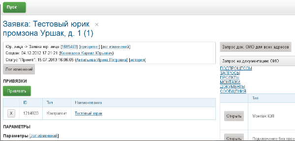
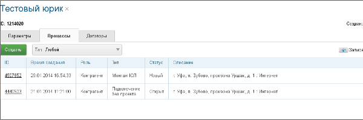
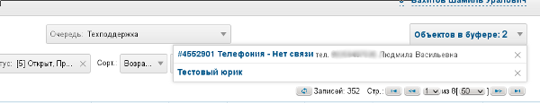
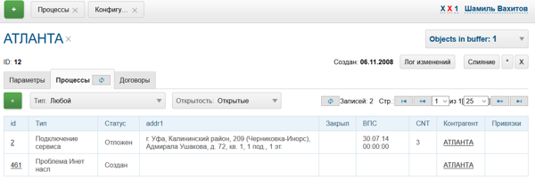

= Процессы
:toc:
:toclevels: 4

Процесс - сущность, позволяющая учитывать различные протекающие в организации процессы. Процесс обладает встроенными параметрами:
[square]
* тип;
* текущий статус и время его установки;
* время начала;
* время завершения;
* исполнители и группы решения;
* описание;
* <<../setup.adoc#config-process-priority, приоритет>> [[priority]].

Остальные параметры назначаются с помощью системы параметров для разных типов процессов.

В большинстве ERP систем ближайшим родственным понятием процессу выступает понятие "Задача".
Однако, с помощью системы связывания процессов между собой, возможна настройка полноценных бизнес-процессов с подчинёнными задачами.

Новый процесс можно создать в:
[square]
* очереди процессов;
* на вкладке "Процессы" объекта;
* как привязанный;
* при обработке сообщений.

[[status]]
== Статусы
Правка статусов производится в оснастке *Администрирование / Процессы / Статусы процессов*.
Статус определяет текущее состояние процесса. Позиция статуса определяет порядок его в списке статусов.

image::_res/proc_status.png[]

Кнопка *Показать* отображает типы процессов, в которых используется статус.

[[type]]
== Типы процессов
Правка выполняется в оснастке *Администрирование / Процессы / Типы процессов*.
Типы процессов организованы в древовидный список.

image::_res/type.png[]

При редактирование типа может быть указано его название и признак наследования либо не наследования свойств от родительского типа.

image::_res/type_prop.png[]

В свойствах типа указываются следующие параметры:
[square]
* разрешённые статусы, их порядок в редакторе и возможные переходы между ними;
* допустимые параметры процесса, их порядок;
* код (ID) начального и конечных статусов;
* <<../extension.adoc#dyn, динамический класс>>, обрабатывающий события изменения процесса (не обязательно);
* начальные группы решения, устанавливаемые в процесс с указанием их ролей (не обязательно) ;
* допустимые для установки в процесс группы решения с указанием их ролей;
* конфигурация (не обязательно).

CAUTION: Не следует без необходимости порождать большое количество типов процессов, наследованных от общего предка и различающихся только наименованием. Тип - главный классифицирующий признак для очереди процессов и в случае их большого количества эффективность фильтрации сильно падает. Пользуйтесь списковым параметром для разделения таких процессов.

[[type-config]]
=== Конфигурация
В конфигурацию типа процесса могут быть <<../setup.adoc#config-include, включены>> блоки основной конфигурации.

Параметры конфигурации типа процесса, поддержанные ядром.

[example]
:hardbreaks:
====
# скрытие в редакторе процесса ссылки полной правки описания
hideDescriptionChange=1
# 0 - hide, 1 (default) - show on tab <<../message.adoc#process, process messages>> [[config-messages]]
#show.tab.messages=1
# отображение сообщений также и дочерних <<linked-process, привязанных процессов>>
#show.messages.link.process=processMade, processDepend
# empty (default) or 0 - hide, 1 - show on tab <<link, process links>> [[config-link]]
#show.tab.links=1
# требования указания обязательного комментария при переводы в статусы
requireChangeCommentStatusIds=<status_ids>
# коды групп исполнителей через запятую, которые можно указать при создании процесса
onCreateSelectGroup=<groupIds>
# шаблон текста при добавлении в описание процесса текста кнопкой "Добавить"
descriptionAddPattern=(${description}\n)[(${time}) (${user})]\t(${text})
# произвольный шаблон времени для добавляемого текста
descriptionAddPattern.timePattern=dd.MM HH:mm
#
# JSP шаблон для отображения карточки процесса вместо стандартного /WEB-INF/jspf/user/process/process/process.jsp
#processCardJsp=/WEB-INF/jspf/user/process/process/custom/process_jur/zayavka.jsp
# HTML стиль левого и правого блока карточки процесса, по-умолчанию они делятся поровну
#style.processCardLeftBlock=min-width: 500px;
#style.processCardRightBlock=width: 100%
#
# parameters related to <<linked-process, linked processes>> [[config-linked-process]]
# 0 - hide, 1 (default) - show on tab linked processes
#show.tab.links.process=0
# 0 - hide parent relations
#show.tab.links.process.up=0
# 0 - hide child relations
#show.tab.links.process.down=0
# 0 - hide adding links from buffer
#show.tab.links.process.add.from.buffer=0
#
# при закрытии процесса проверка закрытости связанных дочерних процессов - down, либо родительских - up, 0 - не проверять никаких
process.close.check.processDepend=up
process.close.check.processMade=down
====
:hardbreaks!:

Где:
[square]
* *<status_ids>* - коды статусов через запятую;
* *<groupIds>* - коды групп через запятую.

==== Настройки поведения параметров процесса
[source]
----
# при ошибке правки параметров - обновление таблицы с параметрами, необходимо в случае, если при этом другие параметры изменяются динамическим кодом
onErrorChangeParamsReload=1
# требование заполненности параметров перед установкой статуса, одна или несколько записей вида
requireFillParamIdsBeforeStatusSet.<status_to_code>=<param_codes>
# сокрытие параметров в том или ином статусе, одна или несколько записей вида
hideParamIdsInStatus.<status_code>=<param_codes>
# параметры, редактор для которых скрыт в данном типе процесса (заполняются программно)
readonlyParamIds=<param_codes>
----

Где:
[square]
* *<param_code>* - код параметра процесса, который должен быть указан при его закрытии, при этом редактор открывается под переключением статуса процесса;
* *<status_to_code>* - код статуса, в который переводится процесс;
* *<param_codes>* - коды параметров процесса через запятую;
* *<status_code>* - код текущего статуса процесса.

Для настройки отображения параметра в зависимости от гибкой проверки условия одно или несколько правил:
[source]
----
# отображение параметра, только если выполняется JEXL выражение
showParam.<paramId>.checkExpression=<JEXL_EXPR>
----

Где:
[square]
* *<paramId>* - код параметра;
* *<JEXL_EXPR>* - <<../extension.adoc#jexl,JEXL>> выражение.

В JEXL процессор передаются следующие объекты для вызова функций:
[square]
* *user* - объект класса javadoc:ru.bgcrm.model.user.User[] - текущий пользователь;
* *process* - объект класс javadoc:ru.bgcrm.model.process.Process[] - изменяющийся процесс;
* *processParam* - объект класса javadoc:ru.bgcrm.dao.expression.ParamValueFunction[] - параметры изменяющегося процесса.

==== Ограничение количества исполнителей по группам
Одно или несколько правил вида:
[source]
----
executorRestriction.<n>.groupId=<groupId>
executorRestriction.<n>.maxCount=<maxCount>
----

Где:
[square]
* *<n>* - порядковый числовой номер правила;
* *<groupId>* - код группы пользователей;
* *<maxCount>* - максимальное число исполнителей из данной группы на процессе.

Просматриваются все правила в порядке их номеров.

[[type-config-left]]
==== Настройка левой области карточки процесса
Для настройки отображения левой области карточки процесса в конфигурацию типа добавляются одна или несколько конструкций вида:
[source]
----
processCard.<id>.mode=<modes>
processCard.<id>.components=<components>
----

Где:
[square]
* *<id>* - порядковый номер правила;
* *<modes>* - список через запятую режимов отображения карточки процесса, допустимые значения:
   ** *card* - просмотр карточки с открытием в буфере,
   ** *linked* - просмотр карточки процесса, привязанного к другому процессу с открытием в правой области первого процесса;
* *<components>* - через запятую компоненты левого блока, либо произвольные JSP файлы, позволяющие кастомизировать карту процесса; допустимые стандартные блоки: *header*, *status*, *description*, *executors*, *links*, *params*.

На снимке ниже подписаны соответствующие блоки левого блока карточки процесса.

image::_res/card_config.png[]

Пример:
[source]
----
processCard.1.mode=card
processCard.1.components=header;jsp:/WEB-INF/jspf/user/process/process/custom/process_stp/contract_process_count.jsp;status;description;executors;params
----

[[create-process-with-link]]
==== Создание процесса с привязанными объектами
Переменная в конфигурации типа процесса:
[source]
----
# * (default) - allow creation as linked in any object
#create.in.objectTypes=<типы объектов через запятую>
create.in.copyParams=перечень пар <с параметра>:<на параметр>, разделённых точкой с запятой
#
# открывать (1), не открывать (0), открывать мастером (wizard) вкладку с созданным привязанным процессом
create.in.<тип объекта>.openCreated=1
----

Разрешает создание процесса с привязанным данным объектом во вкладке Процессы объекта (ниже на скриншоте).
Копирование параметров поддерживается только для объектов, использующих стандартную систему параметров системы.
Типы объектов ядра:
[square]
* customer - контрагент.

Типы объектов плагинов описаны в документации плагинов:
[square]
* <<../../plugin/bgbilling/index.adoc#process-type-config, BGBilling>>

Пример. Возможность создания процесса с привязкой контрагента, копированием параметра с кодами 1 и 5 в контрагента в параметры процесса с кодами 3 и 6 соответственно:
[source]
----
create.in.objectTypes=customer
create.in.copyParams=1:3;5:6
----

[[type-config-reference]]
==== Описание процесса
Макрос описаний процесса позволяет сгенерировать текст для заголовка вкладки процесса или для перечня процессов.
Для генерации описаний в конфигурацию типа процесса добавляются записи вида:
[source]
----
processReference.<n>.objectTypes=<objectTypes>
processReference.<n>.stringExpression=<macros>
----

Где:
[square]
* *<n>* - порядковый номер записи;
* *<objectTypes>* - области, где используется данный макрос через запятую, перечень областей см. далее;
* *<macros>* - <<../extension.adoc#jexl,JEXL>> выражение, передаваемые объекты см. далее.

Перечень областей:
[square]
* *customer* - <<link-processes, вкладка>> *Процессы* контрагента;
* *processCard* - заголовок вкладки процесса;
* *linkedProcessList* - список процессов к которым привязан данный процесс;
* *linkProcessList* - список процессов, привязанных к данному;
* *open.processCard* - process card in <<../interface.adoc#open-process, open>> interface.

В JEXL процессор передаются объекты:
[square]
* *process* - объект класса javadoc:ru.bgcrm.model.process.Process[] - процесс;
* *processParam* - объект класса javadoc:ru.bgcrm.dao.expression.ParamValueFunction[] - параметры процесса.
* *processLink* - объект класса javadoc:ru.bgcrm.dao.expression.ProcessLinkFunction[] - для работы с привязками процесса.

Кроме того доступны переменные устанавливаемые в javadoc:ru.bgcrm.servlet.filter.SetRequestParamsFilter[].

CAUTION: Retrieving parameters may be quite expensive.

Пример конфигурации для генерации описания списке процессов контрагента из адреса и перечня услуг и на вкладке процесса из наименования контрагента и адреса:
[source]
----
processReference.1.objectTypes=customer
processReference.1.stringExpression=u.toString(processParam.addressValues(90, 'fromStreet')) + " : " + u.toString(processParam.listValueTitles(238))
processReference.2.objectTypes=processCard
processReference.2.stringExpression="Запрос док. ОИО: " + u.escapeXml(u.toString(processLink:linkTitles("customer"))) + " " + u.escapeXml(u.toString( processParam.addressValues(90, 'fromStreet'))) + "&nbsp;"
----

Пример вывода исполнителей процесса в описании. Выводится в связанных процессах контрагентов и договорах биллинга *bitel*.
[source]
----
processReference.1.objectTypes=customer,contract:bitel
processReference.1.stringExpression=<<END
   result = process.getDescription();
   result += " <b>" + u.getObjectTitles(u.getObjectList(ctxUserList, process.getExecutorIds())) + "</b>";
   return result;
END
----

Как выглядит в интерфейсе.

[[type-config-reference-sample-type]]
В описании возможно использование HTML разметки, с выделением части описания жирным шрифтом для отображения в буфере. Например:
[source]
----
processReference.1.objectTypes=processCard
processReference.1.stringExpression="#" + process.getId() +  " " + process.getTypeTitle() + " " +  "" + u.escapeXml(process.getDescription())  + ""
----

При закрытии в буфер, данный процесс будет выглядеть следующим образом:

[[card]]
== Карточка процесса
Карточка процесса открывается в буфере объектов и позволяет редактировать свойства уже созданного процесса.

image::_res/card.png[]

В левой области расположены блоки редактирования свойства процесса и ссылки для их редактирования, настроенные для <<type,типа>> процесса <<../setup.adoc#param, параметры>>.
Вид левого блока можно <<type-config-left, настроить>> в конфигурации типа процесса.

Строка с описанием процесса (по-умолчанию содержит код процесса и наименование его типа) может быть <<type-config-reference, настроена>> в конфигурации.
Эта же строка отображается в буфере закрытых объектов, позволяя вернуться на недавно открытый процесс.

В правой области отображаются связанные с процессом данные, например <<linked-process,связанные процессы>>, либо различные расширения, предоставляемые плагинами.

[[delete]]
=== Удаление и слияние
Ссылка *[X]* слева от типа процесса вызывает меню с операциями *Удаление* и *Слияние*.
Обе операции уничтожают текущий процесс, вторая предварительно переносит все <<../message.adoc#, сообщения>> и описание из него в целевой.

[[executor]]
=== Группы решения и исполнители
Каждый процесс может выполняться одним или несколькими подразделениями (группами). При этом группа выступает в процессе в той или иной роли.
По-умолчанию в системе определена одна роль с кодом 0 - "Выполнение" процесса.
Список ролей может быть дополнен в [[group-executor-role]] <<../setup.adoc#config-group-executor-role, конфигурации>>.
Примерами ролей могут быть: "Инициация", "Продажа", "Согласование" и т.п. У каждой роли должен быть свой уникальный код.

На снимке ниже одна группа выполняет процесс в роли "Выполнение", другая "Инициация".

image::_res/card_groups.png[]

Для каждой группы выполнения процесса могут быть установлены исполнители один или несколько.

[[executor-swap]]
==== Executors swap
*eswap* operation performs swapping executors placed with two different groups and roles.
On the screen below *Kernel Executors* and *Karl Marx* will be exchanged.

image::_res/executor_swap.png[]

[[link]]
== Привязки
Отображение привязок в карточке процесса задаётся <<config-link, переменной>> в конфигурации типа процесса.
К процессу могут быть привязаны различные объекты. Например: контрагенты, договоры.

image::_res/link.png[]

Привязываемый к процессу объект должен бть доступен в буфере интерфейса. Контрагент может быть привязан с несколькими ролями.
По-умолчанию в системе доступна лишь роль "Контрагент", это изменяется в <<../setup.adoc#config-customer-process-role, конфигурации>>.

[[link-processes]]
У привязанных объектов процессы к ним относящиеся отображаются на вкладке *Процессы*.

image::_res/object_process.png[]

По-умолчанию отображаются несколько обязательных полей процессов, возможна настройка <<type-config-reference, описания>> в конфигурации типа для области *customer*.
Данный способ, однако, вызывает значительную дополнительную нагрузку на БД при выводе списка и не позволяет гибко настраивать отображаемые столбцы.
Вместо стандартного списка может быть отображена <<queue.adoc#, очередь процессов>> с фильтром по данному объекту.
В конфигурации очереди могут быть определены столбцы и <<queue.adoc#sort, сортировки>> с явным значением *value*.

Данная функция включается в <<../setup.adoc#config, конфигурации>>:
[source]
----
<objectType>.processes.queue=<queueId>
----

Где:
[square]
* *<objectType>* - тип привязанного объекта, например *customer* или *contract:<billingId>*;
* *<queueId>* - код очереди процессов.

Например:
[source]
----
customer.processes.queue=12
contract:bitel.processes.queue=11
----

=== Создание процесса
С помощью <<create-process-with-link, настройки>> в конфигурации типа процесса возможно разрешение создания процессов определённого типа прямо из данной вкладки.

[[linked-process]]
== Связанные процессы
Связи между процессами носят всегда *направленный характер*.

drawio:_res/linked_process.drawio[]

Родительский процесс может ссылаться на дочерний следующими способами:
[square]
* *Ссылается (link)* - простая ссылка одного процесса на другой;
* *Порождён (made)* - процессы *B* и *C* является частями процесса *A*, который может быть закрыт только после закрытия *B* и *C*;
* *Зависит (depend)* - процесс *C* зависит от процесса *B* и может быть закрыт только после закрытия *B*.

На скриншоте ниже в верхней таблице указаны процессы, к которым привязан данный (родительские для него),
в нижней - привязанные к данному процессу (дочерние). Добавление привязок производится только в родительском процессе.

Параметры в <<config-linked-process, конфигурации типа процесса>> могут изменять вариант опции контроля закрытия и отображения в карточке процесса.

image::_res/i0060.png[]

Рассмотрим отображаемые на снимке экрана области В таблице *1* отображаются процессы, которые ссылаются на текущий процесс.
В таблице *2* - те процессы, на которые ссылается текущий процесс.

NOTE: Кнопки удаления связей должны быть включены специальной опцией в <<../setup.adoc#user-action-tree, конфигурации действия>> "Удаление привязки".

Выпадающий список *3* - позволяет выбрать метод отношейний для привязки к текущему другого процесса, открытого в буфере.

IMPORTANT: Не допускаются циклические привязки типов *Ссылается* и *Порождён*, при попытке добавления такой система возвращает ошибку: "Циклическая зависимость".

Выпадающий список *4* - позволяет создать процесс и привязать к данному процессу. Содержимое списка определяется записями в конфигурации типа процесса вида:
[source]
----
processCreateLink.<n>.title=<title>
processCreateLink.<n>.processTypeId=<typeId>
processCreateLink.<n>.linkType=<linkType>
# необязательные параметры
#processCreateLink.<n>.checkExpression=<expression>
#processCreateLink.<n>.copyParams=<copyRules>
# копирование привязок
#processCreateLink.<n>.copyLinks=<copyLinks>
----
Где:
[square]
* *<n>* - порядковый номер записи;
* *<title>* - наименование для списка;
* *<linkType>* - тип связи: *processLink* - ссылается, *processMade* - порождён, *processDepend* - зависит;
* *<typeId>* - код типа создаваемого процесса;
* *<expression>* - <<../extension.adoc#jexl, JEXL>> выражение, позволяющее показывать пункт списка в зависимости от условий;
* *<copyRules>* - через запятую коды копирующихся с текущего на создаваемый параметров, либо пары <from>:<to> - кодов однотипных параметров с какого на какой необходимо копировать;
* *<copyLinks>* - копирование привязок на процесс, 1 - копировать все привязки, возможно ограничение по маске типов объектов, например: contract%, customer%.

В JEXL процессор передаются объекты:
[square]
* *processParam* - объект класса javadoc:ru.bgcrm.dao.expression.ParamValueFunction[], параметры процесса.

Пример конфигурации. Создаётся ссылаемый процесс с кодом типа 9244, запись отображается в списке только если значение параметра с кодом 227 равно 1.
[source]
----
processCreateLink.1.title=Авария
processCreateLink.1.processTypeId=9244
# processLink - ссылается, processMade - порождён
processCreateLink.1.linkType=processLink
processCreateLink.1.checkExpression=processParam.getParamValue(227) == 1
processCreateLink.1.copyParams=48,46,150,151
processCreateLink.1.copyLinks=1
----

Карточка привязанного процесса может быть открыта прямо на вкладке привязок кликом по строке таблицы.
При этом открывается только левая часть карточки процесса с основными свойствами.

image::_res/i0125.png[]

Краткое описание, выводящееся в таблице привязанных процессов, вид левого блока карточки процесса возможно настроить в <<type-config-left, конфигурации типа>>.

[[linked-process-howto]]
=== Рекомендации к применению
Использование связанных процессов рекомендуется в случае, когда существующие иные разделения не позволяют учитывать всю информацию.

Существующие методы организации данных о бизнес-процессах:

Процесс:: Долгоживущая сущность, у неё есть параметры, исполнители, группы решения, статусы меняются.
В перспективе в нём же будет учёт затраченного времени и оценка оставшегося. Запланированные даты.
Процесс и его параметры постоянно изменяются.

<<../message.adoc#, Сообщения>>:: Любой информационный обмен в рамках процесса.
Параметров мало: тип, направление, адрес противоположной стороны.
Входящие - исходящие звонки, письма, сообщения форума, HelpDesk а. Здесь же в дальнейшем будут сохраняться и встречи (как в классическом календаре Outlook).
Это протокол обмена информацией, сообщения не изменяются после отправки.

<<../../plugin/task/index.adoc#, Задача>>:: Отложенное действие по процессу.
Например, напомнить менеджеру сделать звонок. Или дублировать периодический процесс.

Связанный процесс:: В рамках текущего процесса порождается новый.
Исполнители у него совершенно другие и не связаны с основным процессом. Статусы тоже.
В основном процессе должна отображаться лишь краткая сводка о текущем статусе дочернего процесса.
Порождать дочерние процессы следует экономно, иначе можно запутаться.

Разделять процессы следует в случае, если вложенные процессы:
[square]
* Исполняются параллельно с другими дочерними либо с основным процессом. Если процесс просто последовательно меняет состояния - лучше добавить статусов.
Исполняется несколькими исполнителями или группами - добавить групп решения либо ролей.
* Исполняется множество на один родительский процесс. Подключения по разным адресам, например.
В этом случае текущее состояние можно отобразить только множеством статусом.

