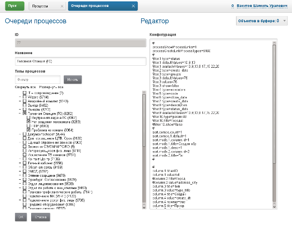
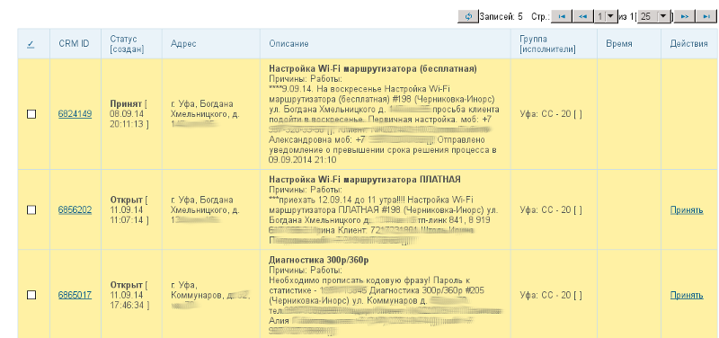
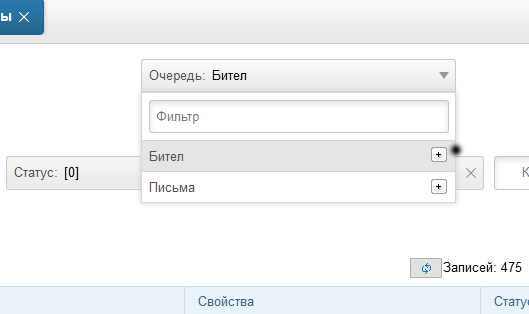
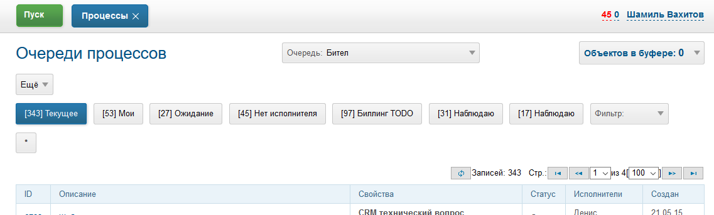

= Очереди процессов
:toc:

Очередь процессов - это интерфейс доступа к массиву процессов определённых типов.
Очередь определяет вид таблицы, доступные сортировки и фильтры.

[[setup]]
== Настройка
Редактирование очередей процессов производится в оснастке *Администрирование / Процессы / Очереди процессов*.

image::_res/i0030.png[]

В свойствах очереди определяются доступные в ней типы процессов, прочие параметры вводятся в конфигурации.

В конфигурации очереди процессов определяются колонки с выводимыми данными, доступные фильтры и прочие параметры.
При выборе родительского типа процесса в разрешённых типах все вновь появившиеся типы процессов-потомки также будут отображены в очереди без необходимости её пересохранения.

[[columns]]
=== Колонки
Одна или несколько записей вида:
----
column.<id>.title=<title>
column.<id>.value=<type>
# необязательные параметры
# запрет переносов в столбце
column.<id>.nowrap=1
# выравнивание в столбце
column.<id>.align=<align>
# стиль столбца
column.<id>.style=<style>
# форматирование переносов строк в столбце к HTML формату (переносы строк отображаются в таблице)
column.<id>.formatToHtml=1
# обрезание значения столбца с добавлением ссылки на развёртывание полного текста, если длина текста больше <maxSymbols> символов
column.<id>.cutIfMore=<maxSymbols>
# обрезание значение столбца с отображением полного значения по наведению мыши
column.<id>.titleIfMore=<titleIfMore>
# отображать значение как ссылку
column.<id>.showAsLink=<linkTitle>
# значения параметров берутся у процесса, к которому данный привязан (родительский)
#column.<id>.process=linked
# преобразование значения в UNSIGNED - может быть полезным при сортировке
#column.<id>.convert=int
# агрегирующая функция
column.<id>.aggregate=<aggregateFunction>
----
Где:
[square]
* *<id>* - уникальный числовой идентификатор колонки;
* *<title>* - заголовок;
* *<type>* - выводимое значение, см. значения далее;
* *<align>* - выравнивание: *left*, *center*, *right*;
* *<style>* - CSS стиль столбца;
* *<maxSymbols>*, *<titleIfMore>* - максимальная не обрезаемая длина текста;
* *<linkTitle>* - текст со ссылкой, *linkUrl* - разместить в качестве текста саму ссылку (значение колонки);
* *<aggregateFunction>* - агрегирующая функция для столбца, допустимые значения: *SUM*, *AVG*, *COUNT*.

При указании для столбца агрегирующей функции - в заголовке столбца помимо его названия будет выводится значение функции для всех отфильтрованных
процессов в квадратных скобках. Для каждого столбца допустима только одна функция.

WARNING: Использование агрегирующих функций предполагает дополнительный запрос для каждого вывода таблицы очереди процессов, что может замедлить отображение.

Выводимое значение *<type>* может быть следующим:

[cols="a,50%a,a,a,a", options="header"]
|===
|Значение *<type>*
|Что выводится
|titleIfMore, cutIfMore
|Сортировка
|Вывод на печать

|id
|Код процесса со ссылкой на открытие процесса на нём.
|Да
|Да
|Да

|type_title
|Наименование типа процесса.
|Да
|Да
|Да

|status_title
|Текущий статус процесса.
|Да
|Да
|Да

|status_pos
|Position of the current process <<index.adoc#setup-status, status>>.
|Да
|Да
|Да

|<<dt-col, status_dt>>
|Дата и время установки текущего статуса.
|Да
|<<dt-col, Да>>
|Да

|status_user
|Пользователь, установивший текущий статус.
|Да
|Да
|Да

|status_comment
|Комментарий текущего статуса.
|Да
|Да
|Да

|<<dt-col, status:<statusIds>:dt>>
|Дата и время последней установки статуса с кодом из перечисленных в *<statusIds>* через запятую.
|Да
|<<dt-col, Да>>
|Да

|status:<statusIds>:user
|Пользователь, последним установивший статус из перечисленных в *<statusIds>* через запятую.
|Да
|Да
|Да

|status:<statusIds>:comment
|Комментарий последнего статуса с кодом из перечисленных через запятую в *<statusIds>*.
|Да
|Да
|Да

|priority
|Приоритет процесса. Строка в таблице очереди процесса окрашивается в цвет приоритета.
|Нет
|Да
|Выводится число

|<<dt-col, create_dt>>
|Дата и время создания процесса.
|Да
|<<dt-col, Да>>
|Да

|create_user
|Пользователь, создавший процесс.
|Да
|Да
|Да

|<<dt-col, close_dt>>
|Дата и время закрытия процесса.
|Да
|<<dt-col, Да>>
|Да

|close_user
|Пользователь, закрывший процесс.
|Да
|Да
|Да

|executors:<groupIds>:<roleIds>
|Исполнители процесса через запятую. Необязательные дополнения *:<groupIds>* и *:<roleIds>* позволяют ограничить исполнителей по группам и ролям, указывая их через запятую. Если необходимо ограничение только по ролям, использовать *executors:pass:[*]:<roleIds>*.
|Да
|Нет
|Да

|groups:<roleIds>
|Группы решения процесса через запятую. Необязательное дополнение *:<roleIds>* позволит ограничить группы по ролям, указывая их через запятую.
|Да
|Нет
|Да

|description
|Описание процесса.
|Да
|Да
|Да

|descriptionLink
|Описание процесса со ссылкой на открытие карточки процесса.
|Да
|Да
|Да

|param:<param_id>
|:hardbreaks:
Значение параметра процесса с кодом *<param_id>.*

Для параметров с типами date и datetime <<dt-col,возможно указание формата и необходимости вывода непосредственного значения>>.

Для параметров адресного типа возможно указание *param:<param_id>:quarter* и *param:<param_id>:street* - вывод наименования квартала и улицы.
|Да
|Да
|Да

|ifListParam:<paramId>:<value>:<existFag>:<notExistFlag>
|Вывод *<existFlat>* если списковый параметр процесса с кодом *<paramId>* установлен в значение *<value*> либо *<notExistFlag>* в противоположном случае, *:<existFag>:<notExistFlag>* - необязательные параметры, по умолчанию это символы "✓" и "✗
|Нет
|Нет
|Нет, числовое значение спискового параметра

|messageInCount
|Количество входящих <<../message/index.adoc#, сообщений>> в процессе  (обратите внимание, что все сообщение типа "Заметка" считаются входящими).
|Да
|Да
|Да

|<<dt-col, messageInLastDt>>
|Дата и время отправки последнего входящего сообщения.
|Да
|<<dt-col, Да>>
|Да

|messageInUnreadCount
|Количество входящих непрочитанных сообщений в процессе.
|Да
|Да
|Да

|messageInLastText
|Текст последнего входящего сообщения.
|Да
|Да
|Да

|messageInLastUser
|Пользователь, принявший последнее входящее сообщение.
|Да
|Да
|Да

|messageInLastSubject
|Тема последнего входящего сообщения в процессе.
|Да
|Да
|Да

|messageOutCount
|Количество исходящих сообщений в процессе.
|Да
|Да
|Да

|<<dt-col, messageOutLastDt>>
|Дата и время создания последнего исходящего сообщения.
|Да
|<<dt-col, Да>>
|Да

|messageOutLastText
|Текст последнего исходящего сообщения.
|Да
|Да
|Да

|messageOutLastUser
|Пользователь, создавший последнее исходящее сообщение.
|Да
|Да
|Да

|messageOutLastSubject
|Тема последнего исходящего сообщения в процессе.
|Да
|Да
|Да

|message:<type_ids>:systemId
|Идентификатор привязанного к процессу сообщения с типом из *<type_ids>* - разделённого запятыми списка типов. Можно выбирать, например, код темы форума.
|Да
|Да
|Да

|linkCustomer:param:<param_id>
|Параметр привязанного к процессу контрагента, где *<param_id>* - код параметра. Возможны все те же опции, что и для столбца param.
|Да
|Да
|Да

|linkCustomer:<column>
|Значения столбца *<column>* из таблицы *customer* для привязанных контрагентов; *id* - код, *title* - наименование.
|Да
|Да
|Да

|linkObject:<object_type_prefix>
|Названия привязанных к процессу сущностей в таблице *process_link* с префиксом типа *<object_type_prefix>*.
|Да
|Да
|Да

|linkObject:<object_type_prefix>:id
|Аналогично предыдущему, но выводится идентификатор привязанного объекта. Например: *linkObject:bgbilling-helpdesk:id* - код привязанного топика HelpDesk.
|Да
|Да
|Да

|linkCustomerLink
|Перечень контрагентов, привязанных к процессу со ссылками на открытие их карточек.
|Нет
|Нет
|Нет

|linkObject:process
|Перечень кодов привязанных к процессу процессов со ссылками на открытие карточки через запятую.
|Нет
|Нет
|Нет

|linkObject:contract:<billingIds>
|Перечень привяазанных к процессу договоров BGBilling, необязательный суффикс *<:billingIds>* позволяет уточнить идентификаторы биллингов через запятую.
|Нет
|Нет
|Нет

|linkProcessList:<linkType>:<open>:<typeIds>
|Отображение привязанных процессов к данному процессу. Отображаются код, тип и статус.
Необязательные параметры, * - значение по-умолчанию:
[square]
* *<linkType>* - <<index.adoc#usage-related-process, тип связи>>;
* *<open>* - *open* для вывода только открытых процессов;
* *<typeIds>* - коды <<index.adoc#setup-type, типов>> процессов через запятую.
|Да
|Нет
|Да

|linkedProcessList:<linkType>:<open>:<typeIds>
|Аналогично предыдущему, но выводятся процессы, к которым привязан данный.
|Да
|Нет
|Да

|actions
|Links or buttons with <<action, process actions>>.
|Нет
|Нет
|Нет

|===

[[dt-col]]
[NOTE]
=====
Для всех типов столбцов, выводящих дату и время возможна установка после наименования столбца формата через двоеточие в формате link:http://archive.is/wznr4#http://www.seostella.com/ru/article/2012/02/05/formatirovanie-daty-v-java.html[Java].
Например: *status_dt:dd.MM.yy* выведет только дату с двухзначным годом. Если столбец используется для сортировки и сортировка требуется по значению даты и времени а не по их строковому представлению, то вместо формата указывается *:value*.
Если столбец требуется и для сортировки и для отображения - следует сделать два столбца один из которых скрыть.
=====

Очередь процессов может быть выведена в таблицу HTML либо на печать с помощью вызова *Ещё - Печать*.

По-умолчанию в таблице оснастки отображаются все настроенные столбцы, ограничить их и поменять порядок можно с помощью опции *media.html.columns=<columnIds>*,
где *<columnIds>* - id столбцов через запятую в порядке вывода. Например:
----
media.html.columns=1,2,3
----

Допустима склейка значений нескольких столбцов на одной позиции с помощью символа сложения, например:
----
media.html.columns=1,3+4,5,6
----

Для вывода таблицы на печать определите таким же образом параметр конфигурации *media.print.columns*.
Обратите внимание на таблицу, не все столбцы могут быть выведены на печать.

Для выгрузки таблицы в XLS файл, укажите переменную *media.xls.columns*, правила заполнения аналогичны.
Пункт выгрузки в Excel появляется также в *Ещё*.

Выводимую в очереди таблицу с процессами можно настроить ещё более гибко, указав в конфигурации очереди:
----
rowConfig.1.media=html
rowConfig.1.expressionHead=<configHead>
rowConfig.1.expressionRow=<configRow>
----

Где *<configHead>* и *<configRow>* - <<../extension.adoc#jexl, JEXL>> выражения, генерирующие HTML для вывода заголовочного столбца таблицы и строк данных соответственно.

В контекст JEXL выражения передаются объекты, при генерации заголовка:
[square]
* *checkAllLink* - строка, содержащая ссылку для выделения всех строк в случае использования <<processor, обработчиков>> в очереди.

При генерации строки:
[square]
* *priority* - строка с цветом, соответствующим приоритету процесса;
* *colX* - HTML со значением столбца с кодом X.

Пример настройки отображения заголовка таблицы и строк с помощью JEXL
(выражения можно более коротко оформить с помощью <<../interface.adoc#config-multiline, многострочных значений переменных>> конфигураций с JEXL выражениями):

----
column.1.title=ID
column.1.value=id
column.2.title=Причины
column.2.value=param:500
column.3.title=Работы
column.3.value=param:466
column.4.title=Создан
column.4.value=create_dt
column.5.title=Приор.
column.5.value=priority
column.6.title=Статус
column.6.value=status_title
column.7.title=Группа
column.7.value=groups
column.8.title=Адрес
column.8.value=param:345
column.30.title=Описание
column.30.value=description
column.31.title=Исполнители
column.31.value=executors
column.32.title=Время
column.32.value=param:610
column.33.title=Время (значение)
column.33.value=param:610:value
column.34.title=Действия
column.34.value=actions
column.34.align=center

configHead=<<END
   return "<td width='20' class='printHide'>" + checkAllLink  + "</td>"
    + "<td>ID</td>"
    + "<td>Статус [создан]</td>"
    + "<td>Адрес</td>"
    + "<td>Описание</td>"
    + "<td>Группа [исполнители]</td>"
    + "<td>Время</td>"
    + "<td class='printHide'>Действия</td>";
END

configRow=<<END
   return "<tr bgcolor='" + urgColor + "' processId='" + process.getId() + "'>"
     + "<td class='printHide'><input type='checkbox' name='processId' value='" + process.getId() + "'/></td>"
     + "<td>" + col1 + "</td>"
     + "<td><b>" + col6 + "</b> [" + col4 + "]" + "</td>"
     + "<td>" + col8 + col36 + "</td>"
     + "<td><b>" + process.getTypeTitle() + "</b> "
     + (process.getTypeId() != 9432 ? "Причины: " + col2 + "Работы: " + col3 + " " : "")
     + (process.getTypeId() == 9432 ? "И: " + col40 + "; КТВ: " + col45 + "; ТЛФ: " + col50 + "; VOIP: " + col55 + " " : "")
	 + col30 + "</td>"
     + "<td>" + col7 + " [" + col31 + "]</td>"
     + "<td>" + col32 + "</td>"
     + "<td class='printHide'>" + col34 + "</td>"
     + "</tr>";
END

rowConfig.1.media=html
rowConfig.1.expressionHead={@configHead}
rowConfig.1.expressionRow={@configRow}
----

В результате очередь будет выглядеть приблизительно подобным образом.

Обратите внимание на группировку различных данных в столбцах описание и статус.

[[filters]]
=== Фильтры
Одна или несколько записей вида:
----
filter.<id>.type=<type>
# при необходимости сделать фильтр скрытым
#filter.<id>.show=0
# дополнительные обязательные и необязательные параметры различные для разных фильтров
filter.<id>.<param1>=<value1>
..
filter.<id>.<paramX>=<valueX>
----

Где:
[square]
* *<id>* - уникальный числовой идентификатор фильтра;
* *<type>* - тип фильтра, единственный обязательный параметр, см. значения далее.

Порядок фильтров в конфигурации определяет их порядок в отображении.

Пример. Фильтр по статусу с выбранным по-умолчанию значением и ограничениям на значения, фильтр по дате создания, по группам решения, исполнителям, коду и дате закрытия.
----
filter.{@inc:cnt}.type=status
filter.{@cnt}.availableValues=9,10,12
filter.{@cnt}.defaultValues=10

filter.{@inc:cnt}.type=create_date

filter.{@inc:cnt}.type=groups
filter.{@cnt}.defaultValues=17

filter.{@inc:cnt}.type=executors
filter.{@inc:cnt}.type=code
filter.{@inc:cnt}.type=close_date
----

Далее описываются фильтры по их типу (параметр *<type>*), обязательные и необязательные параметры. В таблице перечислены типы фильтров и их параметры.

[cols="15%a,25%a,60%a", options="header"]
|===
|Значение *<type>*
|Фильтр
|Информация

|type
|Тип процесса.
|Необязательные параметры:
[square]
* *availableValues* - отображаемые в фильтре коды типов процессов, в порядке их отображения; если параметр не указан - отображаются все типы процессов;
* *defaultValues* - коды типов процессов, выбранных в фильтре по-умолчанию через запятую;
* *onEmptyValues* - значения фильтра, используемые, если никакие значения пользователем не выбраны.

|status_date
|Диапазон дат когда процесс последний раз был переведён в какой-то статус.
|Необязательные параметры:
[square]
* *availableValues* - отображаемые в фильтре коды статусов, в порядке их отображения; если параметр не указан - отображаются все статусы.

|status
|Текущий статус процесса.
|Необязательные параметры:
[square]
* *width* - ширина фильтра в пикселях;
* *values* - жёстко заданные в фильтре коды статусов, в этом случае фильтр имеет смысл только скрытым;
* *availableValues* - отображаемые в фильтре коды статусов, в порядке их отображения; если параметр не указан - отображаются все статусы;
* *defaultValues* - коды статусов, выбранные в фильтре по-умолчанию через запятую;
* *onEmptyValues* - значения фильтра, используемые, если никакие значения пользователем не выбраны.

|:nowrap:
param:<paramId>
|Параметр процесса с кодом *<paramId>*.
|Поддерживаются параметры одного из следующих типов: "address" , "blob", "date", "datetime", "list", "listcount", "money", "text".

Обязательные параметры:
[square]
* *title* - подпись к фильтру.

Необязательные параметры:
[square]
* *orEmpty* - "1", для включения в выборку процессов с пустым значением параметра; для параметров "date", "datetime".
* *width* - ширина фильтра в пикселях; для параметров типа "list", "address";
* *values* - hardly defined values;
* *availableValues* - доступные значения спискового параметра;
* *defaultValues* - выбранные по-умолчанию значения спискового параметра;
* *onEmptyValues* - значения параметра, используемые, если никакие значения пользователем не выбраны;
* *valueFrom* - "curdate", для принудительного задания начала периода равным текущей дате; для параметров "date", "datetime";
* *valueTo* - "curdate", для принудительного задания конца периода равным текущей дате; для параметров "date", "datetime";
* *fields* -  разделённые точкой с запятой поля для параметра типа "address", доступные значения: "city;quarter;street;house;flat"; поля город, улица и дом отображаются всегда, вне зависимости от наличия в конфигурации.

|openClose
|Открытые либо закрытые процессы.
|В отличие от фильтра по статусу данный фильтр может существенно ускорять выборку.

Дополнительные параметры:
[square]
* *defaultValue* - *open* либо *close*, значение по-умолчанию;
* *values* - *open* либо *close*, жестко заданные значения.

|linkedCustomer:title
|Подстрока в наименовании привязанного к процессу контрагента.
|Необязательные параметры:
[square]
* *width* - ширина фильтра в пикселях.

|linkedCustomer:param:<paramId>
|Параметр привязанного к процессу контрагента с кодом *<paramId>*.
|Поддержан только тип list.

Обязательные параметры:
[square]
* *title* - подпись к фильтру.

Необязательные параметры:
[square]
* *width* - ширина фильтра в пикселях;
* *availableValues* - доступные значения спискового параметра;
* *defaultValues* - выбранные по-умолчанию значения спискового параметра;
* *onEmptyValues* - значения параметра, используемые, если никакие значения пользователем не выбраны.

|linkedObject
|Привязка процесса, все фильтры жёстко заданы.
|Параметры:
[square]
* *objectTypeMask* - SQL LIKE выражение по типу объекта;
* *objectTitleRegExp* - SQL REGEXP выражение по названию привязанного объекта;
* *notMode* - *1*, если необходимо искать процессы без привязки.

|linkObject
|Привязка процесса, в отличие от linkedObject - код объекта вводится пользователем
|Параметр *whatFilter* может принимать значения:
[square]
* *id* - код привязанного объекта;
* *title* - наименование.

Пример фильтра по коду темы HelpDesk:
----
filter.{@inc:cnt}.type=linkObject
filter.{@cnt}.objectType=bgbilling-helpdesk:bitel
filter.{@cnt}.whatFilter=id
filter.{@cnt}.title=Тема HelpDesk
----

Пример фильтра по наименованию устройства.
----
filter.{@inc:cnt}.type=linkObject
filter.{@cnt}.objectType=bgbilling-device:bitel
filter.{@cnt}.whatFilter=title
filter.{@cnt}.title=Устройство
----

|groups
|Группы, исполняющие процесс. Без учёта ролей.
|Необязательные параметры:
[square]
* *width* - ширина фильтра в пикселях;
* *availableValues* - отображаемые в фильтре коды групп, в порядке их отображения; если параметр не указан - отображаются все группы;
* *defaultValues* - коды типов групп, выбранных в фильтре по-умолчанию через запятую;
* *onEmptyValues* - значения фильтра, используемые, если никакие значения пользователем не выбраны.

|grex
|Совмещённый фильтр по группам и исполнителям процесса.
|Фильтрует с учётом роли групп в процессах.

Обязательные параметры:
[square]
* *roleId* - код роли.

Необязательные параметры:
[square]
* *groups.show* - 0, если выбор групп необходимо скрыть;
* *groups.width* - ширина выбора групп в пикселях;
* *groups.availableValues* - отображаемые в фильтре коды групп, в порядке их отображения; если параметр не указан - отображаются все группы;
* *groups.defaultValues* - коды типов групп, выбранных в фильтре по-умолчанию через запятую;
* *groups.onEmptyValues* - значения групп фильтра, используемые, если никакие значения пользователем не выбраны;
* *executors.show* - 0, если выбор исполнителей необходимо скрыть;
* *executors.width* - ширина выбора исполнителей в пикселях;
* *executors.title* - подпись к выбору исполнителей, например: *Наблюдение*.

|executors
|Исполнители процесса.
|Без учёта в составе какой группы участвует пользователь. Фильтр работает только совместно с фильтром groups,
при этом в списке исполнителей отображаются пользователи, когда-либо состоявшие в группах, указанных в фильтре groups.

Необязательные параметры:
[square]
* *width* - ширина фильтра в пикселях;
* *values* - "current", если необходимо отображать только процессы с текущим пользователем в исполнителях, фильтр в этом случае желательно скрыть;
* *showEmptyExecutor* - "1", отображение в фильтре исполнителей пункта "не указан" для выбора процессов без исполнителя.

|create_user
|User created of process.
|User list includes the current one and other users, having the same groups as the current.

|close_user
|User closed of process.
|User list includes the current one and other users, having the same groups as the current.

|description
|Подстрока в описании процесса.
|

|create_date
|Диапазон дат создания процесса.
|

|code
|Числовой код процесса.
|

|close_date
|Диапазон дат закрытия процесса.
|

|message:systemId
|Системный идентификатор сообщения.
|

|===

[[sort]]
=== Сортировка
Конфигурация количества последовательных сортировок (выпадающих списков с режимами сортировки).
----
sort.combo.count=<count>
----
Где:
[square]
* *<count>* - количество последовательных сортировок.

Пример:
----
sort.combo.count=3
----

Для каждого выпадающего списка возможно определение значния по-умолчанию:
----
sort.combo.<combo_id>.default=<defaultValue>
----
Где:
[square]
* *<combo_id>* - порядковый номер выпадающего списка начиная с 1;
* *<defaultValue>* - выбранное по-умолчанию значение в выпадающем списке начиная с 1.

Либо жёстко определить значение (используется в основном для мобильного интерфейса):
----
sort.combo.<combo_id>.value=<value>
----
Где:
[square]
* *<combo_id>* - порядковый номер выпадающего списка начиная с 1;
* *<value>* - выбранное значение в выпадающем списке начиная с 1.

Конфигурация режимов сортировок (значения для выпадающих списков), одна или несколько записей вида:
----
sort.mode.<id>.columnId=<col_id>
sort.mode.<id>.title=<title>
# обратный режим сортировки 1 - обратный, 0 - прямой
sort.mode.<id>.desc=1
----
Где:
[square]
* *<id>* - уникальный числовой идентификатор режима сортировки;
* *<col_id>* - числовой идентификатор колонки, по которой производится сортировка, либо "0" - случайный режим сортировки;
* *<title>* - название режима сортировки.

Пример. Режимы сортировки по типу процесса, выводимому в колонке 1 и режим обратной соротировке по id процесса.
----
sort.mode.1.columnId=1
sort.mode.1.title=Тип
sort.mode.2.column.id=2
sort.mode.2.title=Создан обр.
sort.mode.2.desc=1
----

[[action]]
=== Actions
Настраиваемые операции над процессом, ссылки которых выводятся в колонке с *value=actions*.
Действия могут отображаться в виде ссылок либо кнопок.

image::_res/i0103.png[]

image::_res/i0104.png[]

По-умолчанию операции отображаются в виде ссылок, для "кнопочного" отображения добавить в конфигурацию очереди.
----
actionShowMode=buttons
----

Сами операции определяются в конфигурации очереди следующим образом:
----
action.<id>.title=<title>
action.<id>.statusIds=<statusIds>
action.<id>.commands=<commands>
#
# необязательные параметры
# подпись кнопки
action.<id>.shortcut=<shortcut>
action.<id>.style=<style>
----

Где:
[square]
* *<id>* - уникальный числовой идентификатор режима сортировки;
* *<title>* - наименование операции.
* *<statusIds>* - коды статусов через запятую, в которых разрешена операция;
* *<commands>* - <<processing.adoc#commands-kernel, команды>> макроса обработки процесса;
* *<shortcut>* - сокрашённый текст на кнопке;
* *<style>* - атрибут HTML style для кнопки.

Пример настройки операций в очереди процессов.
----
actionShowMode=buttons
action.1.title=Принять
action.1.shortcut=П
action.1.statusIds=10,13
action.1.style=padding: 0.2em 0.6em;
action.1.commands=setStatus:9;setCurrentExecutor;refreshCurrentQueue
action.2.title=Принять и открыть
action.2.shortcut=ПО
action.2.statusIds=10,13
action.2.style=padding: 0.2em 0.6em;
action.2.commands=setStatus:9;setCurrentExecutor;open
action.3.title=Отложить
action.3.shortcut=ОТЛ
action.3.statusIds=9,10,15
action.3.style=padding: 0.2em 0.6em;
action.3.commands=setStatus:13;clearExecutors;refreshCurrentQueue
----

[[processor]]
=== Processor
Обработчики позволяют производить пакетную обработку нескольких выделенных процессов. Например, менять статус или устанавливать исполнителя.
Обработчики добавляются в конфигурации очереди записями следующего вида:
----
processor.<id>.title=<title>
processor.<id>.class=<class>
#
# необязательные параметры
processor.<id>.page=<jspPage>
processor.<id>.responseType=file
# optional parameters for open interface only
processor.<id>.page.url=<pageUrl>
----

Где:
[square]
* *<id>* - числовой идентификатор обработчика;
* *<class>* - динамический либо обычный класс, расширяющий javadoc:ru.bgcrm.event.listener.EventListener[]
* *<jspPage>* - JSP страница со свойствами обработчика.

Параметр *responseType=file* необходимо указывать для обработчиков, генерирующих файлы, например для печати.

Пример обработчиков в конфигурации:
----
processor.1.title=Создать компанию обзвона Астериск
processor.1.class=ru.bgcrm.dyn.ufanet.otm.CreateTMCallCampaign

processor.2.title=Принять на
processor.2.class=ru.bgcrm.dyn.ufanet.stp.SetProcessExecutor
processor.2.page=/WEB-INF/jspf/user/process/queue/custom/executor_list.jsp
----

Обработчики отображаются в пункте меню *Ещё* очереди процессов наряду со стандартными пунктами.

image::_res/i0105.png[]

[[processor-default-marked]]
В системе поставляется обработчик *DefaultMarkedProcessor*,
позволяющий выполнять некоторые типовые обработки процессов в очереди. Шаблон добавления обработчика:

----
processor.<id>.title=<title>
processor.<id>.class=DefaultMarkedProcessor
processor.<id>.commands=<commands>
# additional JEXL script, without UI defined params
processor.<id>.doExpression=<doExpression>

# если печать
#processor.<id>.responseType=file
# если печать - открытие диалога печати браузера
#processor.<id>.openPrintDialog=1
----

Где:
[square]
* *<id>* - числовой идентификатор обработчика;
* *<commands>* - команды, см. далее;
* *<doExpression>* - <<../extension.adoc#jexl, JEXL>> script with <<../extension.adoc#jexl-process-context, standard context for process>>.

Поддержанные команды:
[square]
* *setStatus:<statusIds>* - установка одного из статусов, коды которых через запятую перечислены в <statusIds>;
* *addExecutors:<groupIds>* - добавление в процесс исполнителей из групп, коды которых перечислены через запятую в <groupIds>;
* *setParam:<paramId>* - установка параметра процесса с кодом <paramId>, поддержаны типы 'date' и 'datetime', 'list';
* *print:<patternId>* - команда должна быть единственной в обработчике; генерация <<../../plugin/document/index.adoc#, бланка документа>> типа jspHtml либо pdfForm.

Шаблон документа для команды print должен обладать scope=processQueue, title=<любая строка>. Пример шаблона:
----
document:pattern.100.scope=processQueue
document:pattern.100.script=ru.bgcrm.plugin.document.docgen.CommonDocumentGenerator
document:pattern.100.type=jspHtml
document:pattern.100.jsp=/WEB-INF/jspf/user/plugin/document/template/example/process_queue_processor_html.jsp
----

Sample of processor, set parameter value and delete groups:
----
processor.6.title=Set date, delete groups
processor.6.class=DefaultMarkedProcessor
processor.6.commands=setParam:40
processor.6.doExpression=deleteGroups(process.getGroupIds())
----

[[processor-open]]
==== Open Interface
For <<../interface.adoc#open, open>> interface definition of processor is easier, example:
----
processor.{@inc:cnt}.iface=open
processor.{@cnt}.page=/WEB-INF/jspf/open/plugin/custom.bitel/calculate_processor.jsp
----
Only one open processor per queue is supported. JSP template here placed in <<../extension.adoc#custom, custom>> area.

[[pdf]]
=== PDF generation
Пример конфигурации. В очереди появляются галочки для выбора процессов, в меню *Ещё* появляется пункт *Бегунок*.
В *columns* указываются разделённые двоеточиями коды колонок и относительные ширины.
----
media.print.1.title=Бегунок
media.print.1.columns=1:10;4:10;36:10;30:10;31:10;32:10
# может быть landscape
media.print.1.orientation=portrait
#media.print.1.fileName=queue.pdf
----

=== Прочие параметры очереди
----
# в каком интерфейсе отображать очередь
showIn=<show_in>
# для мобильного интерфейса кнопки создания процессов в очереди
createAllowedProcessList=<process_id_1>:<title_1>;<process_id_2>:<title_2>;..<process_id_n>:<title_n>
# для стационарного интерфейса - запрет создания процессов в очереди (нет кнопки "Создать")
allowCreateProcess=0
----

Где:
[square]
* *<show_in>* - может быть *usermob*, *user*; по-умолчанию принимается значение user.
* *<process_id_x>* - код типа процесса;
* *<title_x>* - наименование кнопки.

[[iface]]
== Работа с очередями
Оснастка запускается через меню *Пуск / Процессы*.

Возможный вид очереди процессов изображён на рисунке ниже.
Чтобы очередь появилась в списке доступных она должна быть добавлена в свойствах пользователя или его группы.

image::_res/queue_table.png[]

Нажатие кнопки в выпадающем списке очередей выделяет очередь в отдельную кнопку быстрого доступа рядом с выпадающим списком.
Обратно в список кнопка может быть перемещена нажатием креста на ней.

По нажатию *Ещё* возможно:
[square]
* создание нового процесса одного из разрешённого в очереди типов;
* печать очереди (если она настроена в конфигурации);
* переход из режима полного фильтра в режим сохранённых а также сохранение либо удаление фильтра.

По-умолчанию очередь открывается с полным фильтром, определённым в конфигурации.

image::_res/queue_filters.png[]

Для управления видимыми фильтрами используется одноимённый выпадающий список.
Полужирный текст обозначает заполненность фильтра, при этом фильтр может быть скрыт.

Часто используемые фильтры могут быть сохранены. Для сохранения фильтра используется меню *Ещё - Фильтр - Cохранить*.
Все сохранённые фильтры отображаются в виде отдельных кнопок, доступных для быстрого переключения с отображением на них количества текущих процессов.

Переключение из полного фильтра в сохранённые производится также через меню *Ещё*.
Кнопки сохранённых фильтров возможно перемещать мышью, изменяя их порядок.
Для корректировки сохранённого фильтра следует извлечь его в полный посредством *Ещё - Фильтр - Извлечь в полный*,
после чего скорректировать и сохранить, удалив впоследствии старый фильтр. Таким же образом можно оценить, какие параметры у сохранённого фильтра.

Действия *Ещё - Фильтр - Счётчик на панель* / *Фильтр - Счётчик убрать с панели* позволяют выделить число <<../interface.adoc#, счётчика>> на панель задач BGERP
с определённым цветом и всегда иметь актуальную информацию о важных количественных параметрах процессов.
На снимке экрана выше процессы фильтра *Нет исполнителя* вынесены на панель с красным цветом.

Кнопки сохранённых фильтров возможно перемещать с помощью мыши. Редко используемые сохранённые фильтры могут быть перетащены в выпадающий список *Фильтр*.
Также перетаскиванием мышью их можно извлечь обратно.

Кнопка с символом * открывает список общих фильтров, в которые можно экспортировать любой из сохранённых.
Общие фильтры становятся доступны всем пользователям, имеющим доступ к данной очереди процессов. Они могут быть импортированы и использованы.
С помощью общих фильтров администратор может настроить типовые фильтры для остальных пользователей.