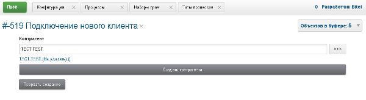
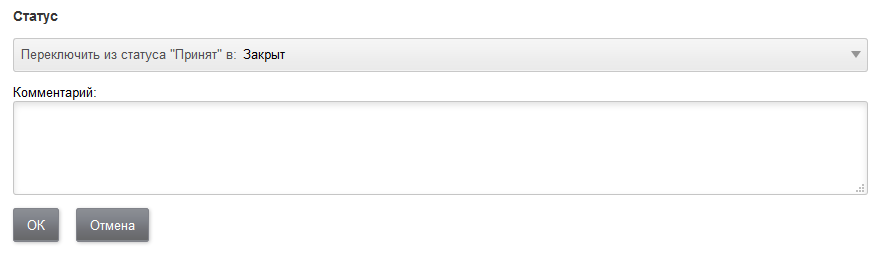

= Мастер
:toc:

Мастер создания позволяет не разрешать создать процесс без заполнения обязательных полей. 
Создание процесса мастером может быть инициировано в очереди процессов либо в списке привязанных к процессу процессов. 
После определения типа процесса мастер поочерёдно выполнения указанных в конфигурации шагов. 
После выполнения всех шагов процесс создаётся окончательно и доступен для работы.

Шаги мастера настраиваются в конфигурации типа процесса в виде одной или нескольких инструкций вида:
[source]
----
createWizard.createStep.<id>.title=<title>
createWizard.createStep.<id>.class=<class>
----

Где:
[square]
* *<id>* - последовательный порядковый номер правила;
* *<title>* - наименование шага (необязательно);
* *<class>* - Java класс с шагом.

Класс шага определяет его логику. Для класса возможны дополнительные параметры, указываются в виде: *createWizard.createStep.<id>.<param>=<value>*. 
Доступные в данный момент шаги описаны в таблице.

== Шаги мастера ядра

[cols="a,a", options="header"]
|===
|<class> и внешний вид
|Описание и параметры

|
ru.bgcrm.model.process.wizard.AddressInfoStep
|
Отображение информации по указанному в процессе адресу (комментарий дома).
[square]
* *addressParamId* - код параметра.

|
ru.bgcrm.model.process.wizard.ContinueStep
|
Продолжение работы мастера либо остановка.
[square]
* *parameterId* - код текстового параметра процесса, в который записывается 1 при прохождении шага;
* *continuedText* - текст, выводимый, когда шаг был пройден;
* *continueText* - текст подтверждения прохождения шага.

|
ru.bgcrm.model.process.wizard.FillParamsStep

|
Параметры процесса.
[square]
* *parameterIds* - обязательный, коды параметров через запятую;
* *checkParamIds* - через запятую коды параметров обязательные для заполнения, если не указано - должен быть заполнен хотя бы один.

|
ru.bgcrm.model.process.wizard.JexlStep
|
Выполнение произвольного <<../extension.adoc#jexl, JEXL>> скрипта.
[square]
* *doExpression* - сам скрипт, передаётся <<../extension.adoc#jexl-process-context, типовой контекст для обработки процесса>>. 

После выполнения скрипт возвращает Map с установленными полями:
[square]
* *filled* - java.lang.Boolean, шаг заполнен;
* *message* - java.lang.String, сообщение для вывода в интерфейс. 

|
ru.bgcrm.model.process.wizard.LinkCustomerStep

|
Привязка существующего либо создание и привязка нового контрагента к создаваемому процессу. 
В случае отмены мастера контрагент останется в БД.
[square]
* *paramGroupId* - группа параметров создаваемого контрагента.

|
ru.bgcrm.model.process.wizard.SetDescriptionStep

|
Установка описания в создаваемый процесс.

|
ru.bgcrm.model.process.wizard.SetExecutorsStep

image::_res/proc_wiz_se.png[]
|
Установка исполнителей процесса.

|
ru.bgcrm.model.process.wizard.SetStatusStep

|
Изменение статуса процесса.

|===

== Шаги мастера плагина BGBilling
include::../../plugin/bgbilling/wizard_steps.adocf[]

== Примеры мастера
Пример конфигурации мастера.
[source]
----
cnt=0
createWizard.createStep.{@inc:cnt}.title=Контрагент
createWizard.createStep.{@cnt}.class=ru.bgcrm.model.process.wizard.LinkCustomerStep
#
createWizard.createStep.{@inc:cnt}.class=ru.bgcrm.model.process.wizard.FillParamsStep
createWizard.createStep.{@cnt}.title=Адрес установки / конт. лицо
createWizard.createStep.{@cnt}.parameterIds=16,49
#
createWizard.createStep.{@inc:cnt}.class=ru.bgcrm.model.process.wizard.SetDescriptionStep
#
createWizard.createStep.{@inc:cnt}.class=ru.bgcrm.model.process.wizard.SetExecutorsStep
----

И снимок экрана с заполненным мастером.

image::_res/proc_wiz_screen.png[]

Если сессия пользователя была аварийно прервана до окончания заполнения мастера - при следующей авторизации карточка недосозданного процесса всплывёт в интерфейсе снова.

Помимо функции создания мастер может предоставлять функции упрощённого редактирования для <<../interface.adoc#mobile, мобильного интерфейса>>. 
Мастер редактирования для типа процесса задаётся с помощью префикса конфигурации: *createWizard.step*

CAUTION: Мастерa не работают при создании процессов в обработке <<../message.adoc#, сообщения>>.

=== Ссылки на примеры
[square]
* <<wizard_sample_connect.adoc#, Простой мастер подключения>>
* <<wizard_sample_connect_inet.adoc#, Мастер подключения с BGBilling Inet>>
 
