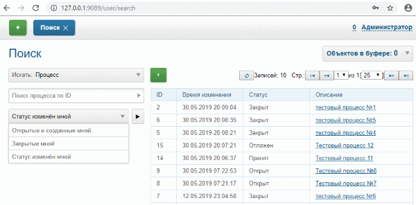

= Поиск
:toc:

Оснастка позволяет осуществлять поиск всех сущностей в системе.
Для поиска необходимо нажать Enter в поле с параметром поиска, либо в поле Квартира для адресного параметра (можно оставить пустым). 
При поиске по адресу доступен контекстный поиск улиц и домов.

image::_res/i0093.png[]

Ядро предоставляет поиск контрагентов по адресу, наименованию, коду. Для поиска по наименованию необходимо набрать подстроку наименования и нажать Enter. 
Для поиска по коду - ввести точный код контрагента и нажать Enter. При поиске контрагента по наименованию возможен дополнительный вывод описывающих его параметров, что задаётся в конфигурации.

image::_res/i0094.png[]

При поиске по адресу осуществляется поиск по всем адресным параметрам контрагентов. 
В результатах поиска отображается наименование контрагента, наименование параметра и значение. 
Возможен поиск как только по улице: выбрать улицу в контекстном поиске и нажать Enter; 
так и по Улице + Дому или Улице + Дому + Квартире - Enter нажимается в последнем заполненном поле.

image::_res/i0095.png[]

Дополнительно может быть настроен полнотекстовый поиск контрагента по различным параметрам.

== Полнотекстовый поиск
Полнотекстовый поиск реализуется плагином <<../plugin/fulltext/index.adoc#, FullText>>.

[[process]]
== Поиск процессов
Реализован поиск процесса по ID, а также относящихся к текущиму пользователю процессов:
[square]
* *Созданные мной* - созданные текущим пользователем;
* *Закрытые мной* - закрытые текущим пользователем;
* *Статус изменен мной* - последнее изменение статуса произведено текущим пользователем.

Сортировка осуществляется по убыванию времени создания, закрытия или изменения.

