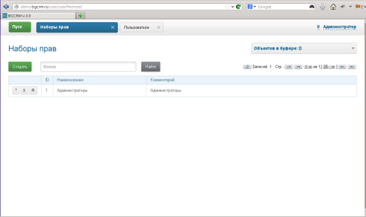
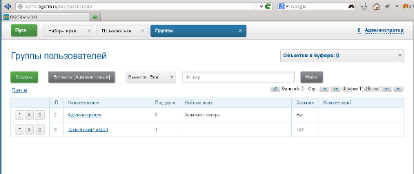
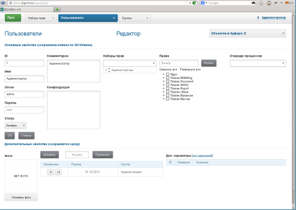
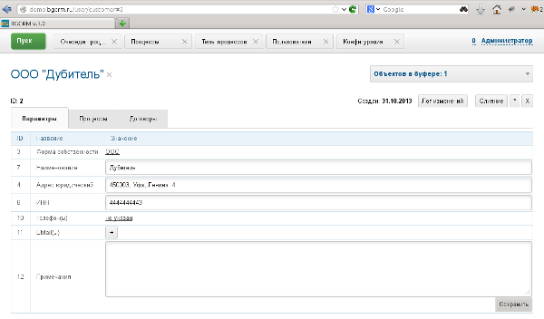
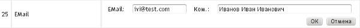
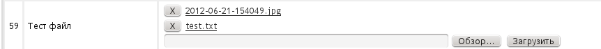

= Setup
:toc:

[[config]]
== Server Configuration
Правка конфигурации производится в оснастке *Администрирование / Конфигурация*.

Основная конфигурация BGERP определяет большинство параметров функционирования ядра и плагинов.
В основную конфигурацию попадают параметры, определённые в файле *bgerp.properties* (имя файла может быть переопределено в скрипте запуска).
Далее создаётся соединение с БД по указанным в файле параметрам и загружается активная конфигурация указанная в интерфейсе администратора.
После чего файл загружается повторно, это позволяет переопределять в файле любые параметры из конфигурации.

image::_res/i0084.png[]

Одномоментно может быть активна только одна конфигурация выделенная признаком *Активный*. Для создания конфигурации - кнопка *Создать*.
Изменении конфигурации применяется "на лету", перезапуск системы не требуется.

В конфигурации указываются параметры ядра и подключённых плагинов. Для ядра доступны указанные ниже параметры.
Вы можете использовать данную конфигурацию, как начальную.

// the configuration breaks OUTLINE in VSCode
[example]
:hardbreaks:
====
# <<../project/index.adoc#l10n, язык интерфейса>>, поддерживаются: ru, en
lang=en

# browser window title
title=BGERP TEST

# application access URL [[config-app-url]]
URL=https://erp.test.org
# explicit values for user and open interfaces, used for notifications texts
#url.user={@URL}/user
#url.open={@URL}/open

# disable checking of browser version
#check.browser=0

# disable client-side pooling, might be useful for development
#pooling.enable=0

# timeout of user session activity in seconds
user.session.timeout=300

# формат <<#param-address, адресного параметра>>, доступны переменные: index, сity, area, quarter, street, house, flat, room, pod, floor, comment [[config-param-address]]
address.format=(${city})(, ${street})(, д. ${house})(, кв. ${flat})( ${room})

# substring search mode for <<#param-address, street search>> [[config-street-search-mode]]
#address.street.search.mode=substring

# шаблон описания контрагента для [[config-search]] <<search.adoc#, поиска>>
# в нём можно указать параметры контрагента подстановками вида (param:<code>); например: (${param:73} г.р.)(, ${param:12})
#customer.reference.pattern=

# минимальная длина подстроки в поиске контрагента
#search.customer.title.min.substring.length=0

# formatting for <<#param-phone, parameter type "phone">> [[config-param-phone]]
# item format
param.phone.format=(${number})( [${comment}])
# comma separated number formats
# Ufa, Russia
param.phone.format.number=+7 (347) XXX-XX-XX,+7 9XX XXX-XX-XX
# Munich, Germany
#param.phone.format.number=017X XXXXXXX,089 XXXXXXX

# при пробросе запросов на сервер с помощью Proxy сервера - имя HTTP заголовка, в котором передаётся адрес клиента
#header.name.remote.addr=X-Real-IP

# [[config-customer-process-role]] роли, в которых контрагент может быть привязан к процессу, роли должны начинаться с customer, например: customer:Контрагент;customerSogl:Согласователь
processCustomerLinkRoles=customer:Контрагент

# проверка <<#user, прав доступа пользователей>>, 1 - включить [[config-user]]
user.permission.check=0

# допустимые символы, диапазон длин пароля пользователей
user.password.chars=1234567890qwertyuipasdfghjoklzxcvbnmQWERTYUIOPASDFGHJKLZXCVBNM_-=[].,
user.password.length.min=5
user.password.length.max=10

# <<process/index.adoc#group-executor-role, роли>> [[config-group-executor-role]] групп в процессах, добавляются через точку с запятой в виде <id>:<title>
processGroupRoles=0:Выполнение

# custom process <<process/index.adoc#priority, priorities>> [[config-process-priority]]
#process.priority.0.color=yellow
#process.priority.1.color=#00FF00
#process.priority.2.color=#F00

# HTML support in process description and message texts
#text.html=1

# параметры EMail
mail.from.email=bgcrm@xxxxxxx
mail.from.name=BGERP
mail.smtp.host=
mail.smtp.user=
mail.smtp.pswd=
# SMTP SSL протокол
#mail.transport.protocol=smtps
# порт, если не указано - 25 для SMTP, 465 для SMTP SSL
#mail.smtp.port=
# отладка почтового обмена SMTP
#mail.debug=1

# EMail для экстренных уведомлений о проблемах в системе
#alarm.mail=

# максимальное время выполнения обработчика события в мс. до принудительного прерывания
event.process.timeout=5000

# перечень через запятую динамических или обычных классов, реализующих интерфейс java.lang.Runnable, запускаемых при старте сервера [[config-on-start]]
#runOnStart=
# перечень через запятую динамических или обычных классов, объекты которых создаются при старте сервера, при перекомпиляции динамических классов создание объектов производится повторно
#createOnStart=

# disable <<#scheduler, scheduler>> run [[config-scheduler]]
#scheduler.start=0

# maximal size of uploaded file in MB, default is 3
#file.upload.max.size.mb=3

# remove log/access logs older than days, default is 60
#log.access.max.days=60

# 1 - база доступна только на чтение, отключение записи логов и сохранения параметров интерфейса
#db.readonly=1
====

:hardbreaks!:

[[config-include]]
=== Includes
In main configuration may be included sub-configurations. Included configurations are shown under a parent one with indentation. Only one level of depth is supported for now.

image::_res/config_include.png[width="800"]

Top-level main configurations not having includes can be also included in other configurations, like <<process/index.adoc#setup-type, process type>> using constructions like:
----
include.<configId>=1
----

Where *<configId>* - ID of included main configuration.

Such type of includes were earlier allowed also for main configuration, but now that is a deprecated way. Using it causes such log messages.
----
WARN [main] Setup - Used old-style included config 2 in config 1
----

[[config-plugin]]
=== Plugins
The most part of the product's functionality is available in form of plugins.
By default the application searches and enables all the plugins, that may be confusing users and overloading the system.
To reduce visible functionality it is recommended to define in main <<config, configuration>>:
----
plugin.enable.default=0
----

For every activated plugin make own <<config-include, included>> configuration named *Plugin <name>*, starting from key: *<plugin>:enable=1*
and with all other required keys after. In case of big size, multiple plugin configurations may be used.
Example of included configuration named *Plugin Blow BGERP Projects*, for marking skipped blocks used multiple points:
----
blow:enable=1

blow:board.2.title=BGERP Projects
blow:board.2.queueId=6
blow:board.2.expressionCell=<<END
     result = "";
     ........
     return result;
END
blow:board.2.openUrl=bgerp-is
....
----

[[config-license]]
=== License
A license file `lic.data` placed in the application root directory and enables usage of defined plugins and restricts number of concurrent user sessions.

License management tool can be found in menu *Administration / License*.

image::_res/license.png[width="800"]

In the top state area is shown the current license state, below is placed the current license content and a buttom for uploding file.
The actual demo license is always awailable on the project's web-site.

[[config-data]]
=== Data
// includes break OUTLINE in VSCode
include::../skip_at_first.adocf[]

The application stores almost all the data in MySQL DB server, access credentials for that are defined in *properties* file.
There are also stored file's metadata, but file bodies are persisted in `filestorage` directory.

NOTE: In former versions file bodies were stored as a flat list, that may be changed <<run, running>> javadoc:org.bgerp.exec.MoveToSubDirs[] class.

[[user]]
== Пользователи и права
Все действия пользователей в системе выполняются через проверку прав.
Правка пользователей и полномочий производится в оснастках *Администрирование / Пользователи / ...*.
Редактирование учётных записей пользователей, их прав доступа и групп.

NOTE: Проверка прав доступа включается <<#config-user, переменной конфигурации>>.

[[user-perm-set]]
=== Наборы прав
Наборы прав определяют разрешаемые пользователю действия. При установке в системе присутствует пустой набор прав *Администраторы*.
Целесообразно разрешить данному набору все действия, используя его для наделения пользователей полными правами.

NOTE: На этапе начального изучения системы вам будет достаточно этого набора прав.

Кнопка *R* в таблице наборов позволяет перенести на набор все действия другого набора, выбранного из открываемого списка.
В редакторе набора прав указывается его название, конфигурация. В дереве действий указываются разрешённые набору действия.

image::_res/i0086.png[]

[[user-group]]
=== Группы
Группы пользователей обозначают подразделения в организации и выступают группами решения для подсистемы <<process/index.adoc#, процессов>>.

В группе могут быть указаны <<process/queue.adoc#, очереди процессов>>, наборы прав, конфигурация.
Подробно о логике работы системы ограничений см. далее, в описании редактора пользователей.

Группы выстроены в иерархию, что позволяет учитывать службы, отделы и другие структурные единицы организации.
Кнопка *C* в таблице позволяет вырезать группу, переместив её в новое место в иерархии.
Флаг скрытости предназначен для обозначения ныне не существующих подразделений.

[[user-user]]
=== Пользователи
В свойствах пользователя указывается одна или несколько групп с указанием периода, наборы прав, имя пользователя, его логин и пароль.
Пользователи выступают исполнителями для подсистемы <<process/index.adoc#, процессов>>.

Параметры пользователя определяются в редакторе <<param, параметров>>.

Группы пользователя определяют вхождение пользователя в подразделения.

[[united-user-config]]
Результирующие права пользователя, параметры его конфигурации и разрешённые очереди процессов определяются описанным ниже образом.
Сложение списка обозначает добавление в конец списка новых элементов.
[square]
* Действующий список групп (ДСГ) - упорядоченный список = список групп в алфавитном порядке (как отображаются в списке групп), из них оставлены только действующие в настоящий момент у пользователя.
* Действующий список наборов прав (ДСНП) - упорядоченный список = списки всех наборов прав групп ДСГ + список наборов прав пользователя.
* Действующая конфигурация (ДК) - строка = конфигурации всех наборов прав из ДСНП + конфигурации всех групп из ДСГ (конфигурация каждой группы составлена из конфигурации всех её предков + конфигурация группы) + конфигурация пользователя. Переменная более поздно добавленная в конфигурацию переопределит более раннюю.
* Очереди процессов = список очередей процессов, из которых оставлены очереди указанные в пользователе либо в одной из групп ДСГ.
* Разрешения = разрешения из наборов прав ДСНП + разрешения из пользователя.

Схема довольно сложна, однако позволяет очень гибко настраивать права пользователей.
[[user-action-tree]]
Редактор разрешённых действий в наборе прав и пользователе представляет из себя *дерево действий* следующего вида:

image::_res/i0089.png[]

Установка галочки на узле дерева разрешает действия. У некоторых действий есть конфигурация, задающая дополнительные ограничения.
Заданные переменные конфигураций отображаются в квадратных скобках рядом с действиями (на снимке выше для действия "Просмотр пользователей").
Для открытия редактора конфигурации действия необходимо кликнуть мышью в скобки. При этом отобразится диалог следующего вида.

image::_res/action_tree_edit_dialog.png[]

Над панелью ввода конфигурации действия отображается подсказка по допустимым параметрам.

В данную конфигурацию допускается подставлять переменные из действующей конфигурации пользователя.
Подстановка осуществляется макросом *{@<paramName>}*, где *<paramName>* - параметр из конфигурации. Например: *groupSet={@smGroup}*.
Так, на приведённым ранее снимке пользователю разрешают просматривать список пользователя только входящих в те же группы, что и он сам.
Используется подставновка системной переменной из действующей конфигурации пользователя.

В зависимости от разрешённых действий и их конфигураций в интерфейсе, отображаемом пользователю, могут скрываться либо отображаться различные элементы.

CAUTION: Для пользователя с кодом 1 конфигурации действий не применяются, данному пользователю всегда разрешены все действия, но с пустыми конфигурациями.

[[united-user-config-keys]]
Опции конфигурации пользователя (они могут попасть в неё из указанных выше конфигураций):
----
# отключение проверки прав
#user.permission.check=0

# открытие оснасток после авторизации зафиксированной (в данном примере - поиск и обработка сообщений), разделитель - запятая
#on.login.open.pinned=/user/search,/user/message/queue

# открытие оснасток после авторизации (в данном примере - обработка сообщений), разделитель - запятая
#on.login.open=/user/message/queue

# disable client-side pooling for the user, might be useful for development
#pooling.enable=0
----

[[user-correct-permission]]
=== Correct Permissions
You may notice such warnings in application logs.

----
06-27/19:24:51  WARN [http-nio-9088-exec-1] PermissionNode - Not found action node 'ru.bgcrm.struts.action.admin.WorkAction:shiftList', run 'org.bgerp.task.CorrectPermissions' class to fix
06-27/19:24:51  WARN [http-nio-9088-exec-1] PermissionNode - Not found action node 'ru.bgcrm.struts.action.admin.WorkAction:callboardAvailableShift', run 'org.bgerp.task.CorrectPermissions' class to fix
----

They mean that not primary action IDs were used to store in DB. Nothing critical, but later <<run, execute>> the mentioned class *CorrectPermissions* to fix it.

IMPORTANT: That action breaks backward compatibility of DB, so do only when you do not need to roll back.

[[user-profile]]
=== User Profile
User profile tool for other users may be accesed by UI link: in users table, process card or any other iface place.

image::_res/user/profile_another_user_table.png[width="800"]

image::_res/user/profile_another_process.png[width="800"]

The tool allows depending on your see and update groups, parameters and send personal news.

image::_res/user/profile_another.png[width="800"]

You own profile can be opened by the link in top right menu.

image::_res/user/profile_own_menu.png[]

In your own profile you can additionaly change title, login and password.

image::_res/user/profile_own_settings.png[width="800"]

And adjust UI settings.

image::_res/user/profile_own_ui_options.png[width="800"]

The settings are stored in so named *User Personalization* configuration, it can be seen by pressing *Text* button.
The drop-down selected options are stored using *iface.* key prefix. All the configuration might be completely resetted to the default state using *Reset* button.

image::_res/user/profile_own_personalization.png[width="800"]

[[user-isolation]]
=== User Isolation
Изоляция позволяет ограничить доступные пользователю данные и применяется ко всем действиям, запрашивающим и модифицирующим эти данные.
Параметры изоляции задаются в <<united-user-config, объединённой конфигурации пользователя>>.

----
isolation.process=<processIsolation>
----
Где:
[square]
* *<processIsolation>* - process isolation mode, can take one of the following values.

[square]
* *executor* - uses sees only processes where he is an executor;
* *group* - uses sees only processes where execution groups are intersected with his current groups.

For *group* mode may be defined additionally process types which have *executor* isolation level.
----
isolation.process.group.executor.typeIds=<typeIds>
----
Where *<typeIds>* comma separated list of process type IDs.

[[user-isolation-process-type-filter]]
==== Creation process type filtering
Isolation mode *group* restricts available types for process creation.

The same logic without isolation can be archived using *onlyPermittedTypes* option in <<user-perm-set, permissions>>.

[[param]]
== Параметры
Для большинства сущностей в системе возможно определение настраиваемых параметров.
Редактирование перечня параметров осуществляется в оснастке *Администрирование / Параметры* интерфейса.
Выбор сущности, для которой определяются параметры, производится в выпадающем списке. Список может расширяться при установке плагинов.

image::_res/i0090.png[]

Редактор параметра выглядит следующим образом. Для всех типов кроме спискового (отличия будут рассмотрены далее) его вид идентичен.

image::_res/i0091.png[]

Таблица параметров сущности выглядит подобным образом. Порядок записи в таблице определяется числовым полем *Порядок* параметра,
либо порядком, задаваемым при привязке к типу процесса либо группе параметров.

[[param-config]]
Ключи конфигурации параметра различаются для типов параметров, общие для всех типов необязательные значения:
----
# comma separated parameter IDs, must be set before the parameter
requireBeforeFillParamIds=<codes>
# comma separated parameter IDs, must be empty before the parameter set
requireBeforeEmptyParamIds=<codes>
# comma separated tag strings, tagged parameter can be viewed or edited only
# with explicitly allowance in permission options
tags=<tags>
# read only parameter, can't be edited in UI
readonly=1
# parameters table row style
style=<style>
----

Where:
[square]
* *<codes>* - comma separated parameter IDs;
* *<tags>* - comma separated tag strings;
* *<style>* - CSS style attribute value.

[[customer-param-group]]
=== Группы параметров контрагентов
Группа параметров необходима для ограничения списка параметров контрагента определённого объекта. Например: "Физическое лицо", "Юридическое лицо".

=== Шаблоны названия контрагентов
Шаблон названия позволяет устанавливать зависимость названия объектов от его параметров.
Подстановка параметров осуществляется макросами вида *${param_<code>}*, где *<code>* - уникальный код параметра.
Так, например, возможна генерация названия контрагента юридического лица из параметров спискового "Форма собственности"
и текстового "Наименование организации", что предотвращает дублирование информации.
При изменении параметров в дальнейшем наименование объекта будет правиться автоматически.

[[param-address]]
=== Parameter type "address"
Address parameter, referencing houses in <<address, Address Directory>>.
In parameter configuration may be defined the following options.
----
# multiple values
multiple=1
----

How does the parameter look like in table and editor.

image::_res/setup/param/address_view.png[width="800"]

NOTE: Format of address string can be <<config-param-address, configured>>.

Street and house can be choosen and filtered from drop-downs.

image::_res/setup/param/address_editor.png[width="800"]

The street search may be performed over multiple substrings as well.

image::_res/setup/param/address_editor_1.png[width="800"]

The street search mode can be changed to simple substring search in <<config-street-search-mode, configuration>>.

The parameter should be used for storing addresses in limited areas, e.g. service delivery address.
Not registration address of abitary customers, as you will need all of them stored in directory first.

[[param-blob]]
=== Параметр типа "blob"
Большая многострочная строка до 65000 символов. В конфигурации параметра могут быть указаны следующие необязательные параметры:
----
rows=<rows>
saveOn=<saveOn>
----

Где:
[square]
* *<rows>* - количество отображаемых в редакторе строк, по-умолчанию 4;
* *<saveOn>* - режим сохранения, может быть "focusLost" (потеря фокуса полем), по-умолчанию сохранение производится по нажатию кнопки Ок.

В таблице параметр выглядит следующим образом:

image::_res/i0014.png[]

[[param-date]]
=== Параметр типа "date"
Дата: год - месяц - день.
В конфигурации параметра могут быть указаны следующие необязательные параметры:
----
# возможность смены месяца
changeMonth=true
# возможность смены года
changeYear=true
yearRange=<yearRange>
# возможность редактирования поля с клавиатуры
editable=1
saveOn=<saveOn>
# при редактировании поля отправка классу-обработчику изменений параметра события ru.bgcrm.event.DateChangingEvent, позволяющего раскрашивать даты различными цветами и сопровождать примечаниями
#sendColorMapRequest=1
----

Где:
[square]
* *<yearRange>* - диапазон отображаемых лет в выпадающем списке годов, могут быть значения от текущего года, например: *-10:+30* , либо значения от текущей выбранной даты, например: *c:-10:c+30*, по-умолчанию *с-10:с+10*;
* *<saveOn>* - режим сохранения, может быть "focusLost" (потеря фокуса полем) либо "enter" (нажатие клавиши "Enter"), по-умолчанию режим "enter"; актуально только при *editable=1*.

IMPORTANT: Для параметра yearRange нулевое значение указывать как +0, например: -10:+0

В таблице параметр и его редактор выглядят следующим образом.

image::_res/i0021.png[]

image::_res/i0022.png[]

[[param-datetime]]
=== Параметр типа "datetime"
Дата + время различной точности.
В конфигурации параметра могут быть указаны следующие необязательные параметры:
----
type=<type>
stepHour=<stepHour>
stepMinute=<stepMinute>
#
# при редактировании поля отправка классу-обработчику изменений параметра события ru.bgcrm.event.DateChangingEvent, позволяющего раскрашивать даты различными цветами и сопровождать примечаниями
#sendColorMapRequest=1
----

Где:
[square]
* *<type>* - может принимать значения ymdh, ymdhm, ymdhms в зависимости от требуемой точности поля;
* *<stepHour>* - шаг в выборе часов;
* *<stepMinute>* - шаг в выборе минут.

Пример параметра. Конфигурация, как выглядит в таблице и редактирование.

image::_res/i0023.png[]

image::_res/i0025.png[]

[[param-email]]
=== Параметр типа "email"
Один или несколько EMail адресов либо только адресов доменов с комментариями.
В конфигурации параметра могут быть указаны следующие необязательные параметры:
----
# несколько EMail в параметре
multiple=1
----

Как выглядит в таблице и редактирование.

image::_res/i0055.png[]

[[param-file]]
=== Параметр типа "file"
Один или несколько файлов. В конфигурации параметра могут быть указаны следующие необязательные параметры:
----
# несколько файлов в параметре
multiple=1
----

[[param-list]]
=== Параметр типа "list"
Параметр с выбираемыми из набора значениями. Значения могут быть определены как конфигурации параметра так и во внешнем справочнике,
на который ссылается параметр. Для некоторых значений можно добавить возможность или установить обязательное требование указания комментария.

В конфигурации параметра могут быть указаны следующие необязательные параметры:
----
# мультивыбор
multiple=1
# сохранение сразу после выбора значения, без нажатия кнопки Ок (только для параметра с одним выбором)
saveOn=select
editAs=<editAs>

# сортировка значений по наименованию а не в порядке кодов
sort.mode=byTitle

allowCommentValues=<allowCommentValues>
needCommentValues=<needCommentValues>

directory=<dirName>
availableValues=<values>
availableValuesInnerJoinFilter=<joinTable>;<joinColumn>;<joinFilter>
----

Где:
[square]
* *<editAs>* - может принимать значения combo - по-умолчанию, выпадающий список, radio - выбор значения в виде переключателей, select - выпадающий список с возможностью поиска значения;
* *<dirName>* - справочник, из которого берутся значения, может быть "address_city" для городов, если справочника нет - значения указываются в самом параметре;
* *<values>* - допустимые коды значений через запятую;
* *<allowCommentValues>* - перечень значений для которых допустимо указание комментария, возможно указание диапазонов, например: 1-3,7,9-14
* *<needCommentValues>* - перечень значений для которых обязателен комментарий, указывается аналогично <allowCommentValues>;
* *<joinTable>* - имя таблицы, с которой осуществляется фильтрующая операция SQL INNER JOIN справочной таблицы;
* *<joinColumn>* - колонка таблицы, по которой проводится JOIN столбца id справочной таблицы;
* *<joinFilter>* - дополнительное условие INNER JOIN.

Пример конфигурации параметра, в котором доступны контрагенты, входящие в группу с кодом 3.
----
multiple=1
directory=customer
availableValuesInnerJoinFilter=customer_group;customer_id;group_id IN (3)
----

Parameter editor.

image::_res/setup/param/list_config.png[width=800]

Values table.

image::_res/setup/param/list_table.png[]

Value editor for a single value.

image::_res/setup/param/list_editor_single.png[width=600]

Same, using radio buttons.

image::_res/setup/param/list_editor_single_radio.png[]

Values editor for multiple values.

image::_res/setup/param/list_editor_mult.png[]

[[param-listcount]]
=== Параметр типа "listcount"
Позволяет выбирать перечислимые значения с указанием количества для них.

In configuration may be defined the following non-mandatory options:
----
# multiple values
multiple=1
----

На снимке экрана ниже - редактор свойств параметра, конфигурирование значений аналогично параметру типа "list".

image::_res/setup/param/listcount_config.png[width=800]

Values table.

image::_res/setup/param/listcount_table.png[]

Value editor for a single value.

image::_res/setup/param/listcount_editor_single.png[width=600]

Values editor for multiple values.

image::_res/setup/param/listcount_editor_mult.png[width=600]

[[param-money]]
=== Parameter type "money"
Decimal number with two digits after delimiter.

In configuration may be defined the following non-mandatory options:
----
saveOn=<saveOn>
----

Where:
[square]
* *<saveOn>* - save mode, can be *focusLost*, by default stores by pressing *Enter* or *OK* button.

Values table.

image::_res/setup/param/money_table.png[]

Values editor.

image::_res/setup/param/money_editor.png[]

[[param-phone]]
=== Параметр типа "phone"
Один или несколько телефонов с комментариями. Как выглядит в таблице.

image::_res/setup/param/phone_table.png[width=600]

Редактирование.

image::_res/setup/param/phone_editor.png[width=600]

Формат строки с номерами задаётся в <<config-param-phone, конфигурации>>.

[[param-text]]
=== Параметр типа "text"
Однострочная строка до 250 символов.
В конфигурации параметра могут быть указаны следующие необязательные параметры:
----
saveOn=<saveOn>
# parameter contains URL, shown as a link
show.as.link=<showAsLink>
# вместо значение параметра выводится <ЗНАЧЕНИЕ ЗАШИФРОВАНО>, параметр можно только поправить, нельзя просмотреть
encrypt=encrypted
----

Где:
[square]
* *<saveOn>* - режим сохранения, может быть *focusLost*, по-умолчанию сохранение производится по нажатию кнопки Ок либо Enter;
* *<showAsLink>* - *1* to show parameter value as a URL; *hideProtocol* - hiding a protocol prefix.

Также в конфигурации параметра могут быть указаны одна или несколько конструкций вида:
----
regexp.<n>.title=<title>
regexp.<n>.regexp=<regexp>
----

Где:
[square]
* *<n>* - число, порядковый номер регулярного выражения;
* *<title>* - наименование шаблона;
* *<regexp>* - <<extension.adoc#regexp, регулярное выражение>>, описывающее шаблон.

При наличии в конфигурации текстового параметра подобных конструкций вводимая строка будет проверяться на совпадение хотя бы с одним из шаблонов, например:
----
regexp.1.title=<город без г.>,<улица без ул.>,<дом без д.>
regexp.1.regexp=[а-яА-Я\s\-]+,[\dа-яА-Я\s\-]+,\s*[\dа-яА-Я/]+
regexp.2.title=<город без г.>,<улица без ул.>,<дом без д.>,<номер квартиры>
regexp.2.regexp=[а-яА-Я\s\-]+,[\dа-яА-Я\s\-]+,\s*[\dа-яА-Я/]+,*\s*\d+
regexp.3.title=<город без г.>,<улица без ул.>,<дом без д.>,<номер квартиры>, <номер комнаты>
regexp.3.regexp=[а-яА-Я\s\-]+,[\dа-яА-Я\s\-]+,\s*[\dа-яА-Я/]+,*\s*\d+,\s*\d+
----

В данном случае параметр контрагента адрес по прописке проверяется на соответствие одному из шаблонов. Содержание шаблонов легко понять из атрибутов title.

В таблице параметр выглядит следующим образом:

image::_res/i0013.png[]

[[param-tree]]
=== Parameter type "tree"
Selected tree items.

In configuration may be defined the following non-mandatory options:
----
# multiple values
multiple=1
----

Parameter editor.

image::_res/setup/param/tree.png[width="800"]

Values table.

image::_res/setup/param/tree_table.png[]

Values editor.

image::_res/setup/param/tree_editor.png[]

[[param-treecount]]
=== Parameter type "treecount"
Selected tree items with decimal amounts.

In configuration may be defined the following non-mandatory options:
----
# multiple values
multiple=1
----

Parameter editor.

image::_res/setup/param/treecount.png[width="800"]

Values table.

image::_res/setup/param/treecount_table.png[]

Values editor.

image::_res/setup/param/treecount_editor.png[width="800"]

[[status]]
== App Status
In menu  *Administation / App / Status* you can see the current status of the running App,
which includes on the first place the current version and used memory info.

image::_res/setup/status/version_memory.png[]

After has shown DB connections state with a link *trace* for becoming Java stack traces of connection consumers.

image::_res/setup/status/db_trace.png[width="800"]

Down on the page is placed App restart button and tables with logs.

image::_res/setup/status/restart_logs.png[width="800"]

In the bottom of the page are placed tools for <<install.adoc#update-installer-ui, updating>>.

[[status-warn]]
=== Warnings
Size of `bgerp.warn.log` must be zero, check messages there case and perform required fixes if its not.

Here is the list of typical issies there and ways to fix it.

[cols="a,a", options="header"]
|===
|Error's Sample
|Solution

|Processor - Configuration key 'page' is no longer needed in processor definition: /WEB-INF/jspf/user/process/queue/default_marked_processor.jsp
|Delete *page* key for <<process/queue.adoc#processor, processors>> configurations.

|Bean class was found by an old name: ru.bgcrm.plugin.bgbilling.dao.MessageTypeSearchCall
|Find the mentioned *class* key value in server configuration and replace it to *MessageTypeSearchCall* without package.

|CommonObjectLink - Deprecated method 'getLinkedObjectId' was called. Use 'getLinkObjectId' instead.
|Replace in process configurations *getLinkedObjectId* to *getLinkObjectId*

|ParamValueFunction - Deprecated method 'listValueTitles' was called. Use 'getValue' instead.
|Replace in process configurations *u.toString(processParam.listValueTitles(<ID>))* to *processParam.getValue(<ID>)*
|===

[[execution]]
== Execution
[[run]]
=== Run
In menu *Administration / Execution / Run* can be executed any Java class, implementing *java.lang.Runnable*.

image::_res/run_class.png[]

When *Wait of execution is done* is selected to Yes, execution logs can be obtained from enabled <<interface.adoc#log-dyn, Dynamic Log>>.

[[scheduler]]
=== Scheduler
include::../skip_at_first.adocf[]

Scheduler allows periodically run Java classes, which extend javadoc:org.bgerp.app.exec.scheduler.Task[].
To configure scheduled tasks add the following blocks to server configuration:
----
scheduler.task.<id>.class=<name>

# running time in Cron format
# supported ranges: 1-2; divisible: */3; enums: 1,2
scheduler.task.<id>.minutes=<minutes>
scheduler.task.<id>.hours=<hours>
scheduler.task.<id>.dm=<dm>
scheduler.task.<id>.month=<month>
scheduler.task.<id>.dw=<dw>

# for disabling the task
#scheduler.task.<id>.enable=0
----

Where:
[square]
* *<id>* - unique string ID;
* *<name>* - simple of full name of the running class;
* *<minutes>* - minutes 0 - 59;
* *<hours>* - hours 0 - 23;
* *<dm>* - days of month 1 - 31;
* *<month>* - months 1 - 12;
* *<dw>* - days of week 1 - 7, 1 is Monday.

Configured tasks must be visible in menu *Administration / Execution / Scheduler*

image::_res/scheduler.png[width="800"]

Scheduler is controlled by <<#config-scheduler, config option>>.

In the right column table placed buttons, allowing to run a scheduled tasks at any moment of time.
If a toggle selected, task is running in an request thread, allowing to <<interface.adoc#log-dyn, follow logs>>.

[[address]]
== Адреса
Просмотр и редактирование адресных справочников доступны в оснастке *Адреса*.

image::_res/i0037.png[width="800"]

Адресный справочник рекомендуется использовать только для ограниченных населённых пунктов, в которых предоставляются услуги.
Параметры типа <<param-address, address>>, использующие справочник, позволяют производить поиск по городу, улицу и т.п.
Нецелесообразно заносить в адресный справочник юридические адреса организаций, адреса для получения корреспонденции и т.п.
Это приведёт к неоправданному разрастанию справочника и усложнению его поддержки.

Как настроить выгрузку справочника адресов в BGBilling и первичную выгрузку из него описано <<../plugin/bgbilling/address_load.adoc#, здесь>>.

При необходимости согласования справочников адресов нескольких биллингов воспользуйтесь встроенной в BGBillingClient <<../plugin/bgbilling/address_sync.adoc#, утилитой>>
