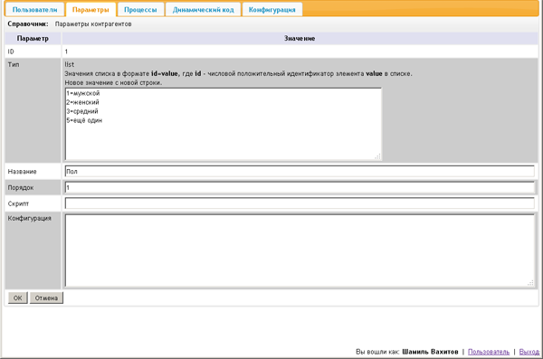
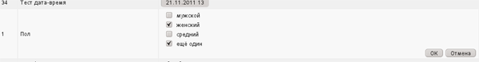
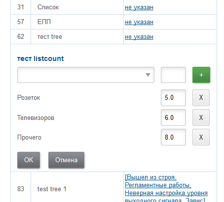
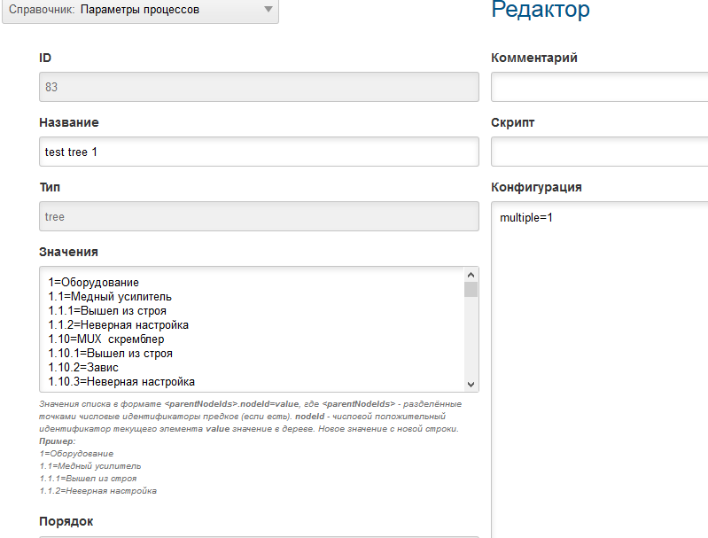
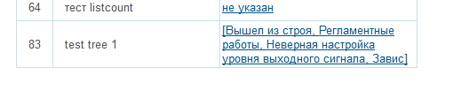
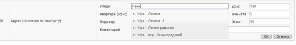

= Настройка
:toc:

[[config]]
== Конфигурация сервера
Правка конфигурации производится в оснастке *Администрирование => Конфигурация*.

Основная конфигурация BGERP определяет большинство параметров функционирования ядра и плагинов.
В основную конфигурацию попадают параметры, определённые в файле *bgerp.properties* (имя файла может быть переопределено в скрипте запуска). 
Далее создаётся соединение с БД по указанным в файле параметрам и загружается активная конфигурация указанная в интерфейсе администратора. 
После чего файл загружается повторно, это позволяет переопределять в файле любые параметры из конфигурации.

image::_res/i0084.png[]

Одномоментно может быть активна только одна конфигурация выделенная признаком *Активный*. Для создания конфигурации - кнопка *Создать*. 
Изменении конфигурации применяется "на лету", перезапуск системы не требуется.

В конфигурации указываются параметры ядра и подключённых плагинов. Для ядра доступны указанные ниже параметры. 
Вы можете использовать данную конфигурацию, как начальную.

[example]
:hardbreaks:
====
# <<../project.adoc#l10n, язык интерфейса>>, поддерживаются: ru, en
lang=en
#
# выводится в заголовке окна браузера при работе с BGERP
title=BGERP TEST
#
# 0 - отключение проверки версии браузера пользователя при авторизации
check.browser=1
#
# таймаут активности сессии пользователя в секундах, по-умолчанию сессия отключается через 5 минут
sessionTimeout=300
#
# формат <<#param-address, адресного параметра>>, доступны переменные: index, сity, area, quarter, street, house, flat, room, pod, floor, comment [[config-param-address]]
address.format=(${city})(, ${street})(, д. ${house})(, кв. ${flat})( ${room})
#
# шаблон описания контрагента для [[config-search]] <<search.adoc#, поиска>>
# в нём можно указать параметры контрагента подстановками вида (param:<code>); например: (${param:73} г.р.)(, ${param:12})
#customer.reference.pattern=
#
# минимальная длина подстроки в поиске контрагента
searchCustomerTitleMinSubstringLength=2
#
# форматирование <<#param-phone, параметра типа "phone">>, общий формат одного номера [[config-param-phone]]
param.phone.format=(${number})( [${comment}]);
# форматирование поля ${number} внутри каждого номера, в зависимости от формата
# форматирование определяет разбиение номера по полям в редакторе, f13 - первый символ в первом поле, далее три во втором
param.phone.format.number=+X XXX XXX-XX-XX
param.phone.format.number.f10=+X XXX-XXX-XX-XX
param.phone.format.number.f13=+X (XXX) XXX-XX-XX
param.phone.format.number.f14=+X (XXXX) XX-XX-XX
param.phone.format.number.f15=+X (XXXXX) X-XX-XX
# количество полей в параметре типа "телефон"
param.phone.item.count=4
# префикс по-умолчанию для параметра типа "телефон"
param.phone.default.prefix=3472
# ускорение ввода номеров - подстановка 7 в код страны
param.phone.part.1.default=7
# переход в третье поле при введение во втором кода российского мобильного, без удаление последнего символа
param.phone.part.2.jumpRegexp.1.regexp=^9\d{2}
param.phone.part.2.jumpRegexp.1.moveLastChars=0
# переход в третье поле с переносом последнего введённого во втором поле при наборе во втором поле 3472
param.phone.part.2.jumpRegexp.2.regexp=^3472
param.phone.part.2.jumpRegexp.2.moveLastChars=1
#
# при пробросе запросов на сервер с помощью Proxy сервера - имя HTTP заголовка, в котором передаётся адрес клиента
#header.name.remote.addr=X-Real-IP
# [[config-customer-process-role]]
# роли, в которых контрагент может быть привязан к процессу, роли должны начинаться с customer, например: customer:Контрагент;customerSogl:Согласователь
processCustomerLinkRoles=customer:Контрагент
#
# проверка <<#user, прав доступа пользователей>>, 1 - включить [[config-user]]
user.permission.check=0
#
# допустимые символы, диапазон длин пароля пользователей
user.password.chars=1234567890qwertyuipasdfghjoklzxcvbnmQWERTYUIOPASDFGHJKLZXCVBNM_-=[].,
user.password.length.min=5
user.password.length.max=10
#
# <<process/index.adoc#group-executor-role, роли>> [[config-group-executor-role]] групп в процессах, добавляются через точку с запятой в виде <id>:<title>
processGroupRoles=0:Выполнение
#
# параметры EMail
mail.from.email=bgcrm@xxxxxxx
mail.from.name=BGERP
#
mail.smtp.host=
mail.smtp.user=
mail.smtp.pswd=
# SMTP SSL протокол
#mail.transport.protocol=smtps
# порт, если не указано - 25 для SMTP, 465 для SMTP SSL
#mail.smtp.port=
# отладка почтового обмена SMTP
#mail.debug=1
#
# EMail для экстренных уведомлений о проблемах в системе
#alarm.mail= 
#
# <<message.adoc#process, теги>> сообщений [[config-message-tag]]
tag.1.title=Реквизиты
tag.1.color=red
tag.2.title=ТЗ
tag.2.color=green
tag.3.title=TODO
tag.3.color=magenta
#
# <<extension.adoc#dyn, динамический код>> и расширение функциональности [[config-dyn]]
dynamic.src.dir=dyn
dynamic.src.encoding=UTF-8
#
# максимальное время выполнения обработчика события в мс. до принудительного прерывания
event.processTimeout=1000
#
# перечень через запятую динамических или обычных классов, реализующих интерфейс java.lang.Runnable, запускаемых при старте сервера [[config-on-start]]
#runOnStart=
# перечень через запятую динамических или обычных классов, объекты которых создаются при старте сервера, при перекомпиляции динамических классов создание объектов производится повторно
#createOnStart=
#
# <<#scheduler, планировщик>>, запуск - 1 [[config-scheduler]] 
scheduler.start=1
#
# сброс кэша новостей каждые указанное количество секунд, может быть необходимо лишь при импорте новостей извне в БД BGERP
#flush.news.everySeconds=
#
# 1 - база доступна только на чтение, отключение записи логов и сохранения параметров интерфейса
#db.readonly=1
====

:hardbreaks!:

[[config-include]]
=== Инклуды
Возможно включение в одну конфигурации другой, для этого во включающей конфигурации размещается инструкция *include.<configId>=1*, 
где *<configId>* - код включаемой на данной позиции конфигурации. Включенные конфигурации отображаются под содержащей их выделяются отступом.

NOTE: Поддерживается только один уровень вложенности конфигураций. 

Рекомендуется создать как минимум одну инклуд конфигурацию, в которой определять все <<interface.adoc#config-variable, переменные>>, 
как-то: коды параметров процессов, статусов. В дальнейшем эту конфигурацию включить в активную конфигурацию сервера, а так же в конфигурации процессов.
 
Рекомендованный формат:
[source]
----
USER_PARAM_EMAIL=

PROCESS_STATUS_OPEN=
PROCESS_PARAM_CONTACT=
PROCESS_PARAM_EMAIL=
----

[[config-plugin]]
=== Plugins
The most part of the product's functionality is available in form of plugins.
By default the application searchs and enables all the plugins, that may be confusing users and overloading the system.
To reduce visible functionality it is recommended to define in main <<config, configuration>>:
[source]
----
plugin.enable.default=0
----

For every activated plugin make own <<config-include, included>> configuration named *Plugin <name>*, starting from key: *<plugin>:enable=1* 
and with all other required keys after. In case of big size, multiple plugin configurations may be used. 
Example of included configuration named *Plugin Blow BGERP Projects*, for marking skipped blocks used multiple points:
[source]
----
blow:enable=1

blow:board.2.title=BGERP Projects
blow:board.2.queueId=6
blow:board.2.stringExpressionCell=<<END
     result = "";
     ........
     return result;
END
blow:board.2.openUrl=bgerp-is
....
----

[[user]]
== Пользователи и права
Все действия пользователей в системе выполняются через проверку прав.
Правка пользователей и полномочий производится в оснастках *Администрирование => Пользователи => ...*. 
Редактирование учётных записей пользователей, их прав доступа и групп.

NOTE: Проверка прав доступа включается <<#config-user, переменной конфигурации>>.

=== Наборы прав
Наборы прав определяют разрешаемые пользователю действия. При установке в системе присутствует пустой набор прав *Администраторы*. 
Целесообразно разрешить данному набору все действия, используя его для наделения пользователей полными правами.

NOTE: На этапе начального изучения системы вам будет достаточно этого набора прав.

image::_res/i0085.png[]

Кнопка *R* в таблице наборов позволяет перенести на набор все действия другого набора, выбранного из открываемого списка.
В редакторе набора прав указывается его название, конфигурация. В дереве действий указываются разрешённые набору действия.

image::_res/i0086.png[]

=== Группы
Группы пользователей обозначают подразделения в организации и выступают группами решения для подсистемы <<process/index.adoc#, процессов>>.

image::_res/i0087.png[]

В группе могут быть указаны <<process/queue.adoc#, очереди процессов>>, наборы прав, конфигурация.
Подробно о логике работы системы ограничений см. далее, в описании редактора пользователей.

Группы выстроены в иерархию, что позволяет учитывать службы, отделы и другие структурные единицы организации. 
Кнопка *C* в таблице позволяет вырезать группу, переместив её в новое место в иерархии. 
Флаг скрытости предназначен для обозначения ныне не существующих подразделений.

=== Пользователи
В свойствах пользователя указывается одна или несколько групп с указанием периода, наборы прав, имя пользователя, его логин и пароль. 
Пользователи выступают исполнителями для подсистемы <<process/index.adoc#, процессов>>.

image::_res/i0088.png[]

Параметры пользователя определяются в редакторе <<param, параметров>>.

Группы пользователя определяют вхождение пользователя в подразделения.

[[united-user-config]]
Результирующие права пользователя, параметры его конфигурации и разрешённые очереди процессов определяются описанным ниже образом. 
Сложение списка обозначает добавление в конец списка новых элементов.
[square]
* Действующий список групп (ДСГ) - упорядоченный список = список групп в алфавитном порядке (как отображаются в списке групп), из них оставлены только действующие в настоящий момент у пользователя.
* Действующий список наборов прав (ДСНП) - упорядоченный список = списки всех наборов прав групп ДСГ + список наборов прав пользователя.
* Действующая конфигурация (ДК) - строка = конфигурации всех наборов прав из ДСНП + конфигурации всех групп из ДСГ (конфигурация каждой группы составлена из конфигурации всех его предков + конфигурация группы) + конфигурация пользователя. Переменная более поздно добавленная в конфигурацию переопределит более раннюю.
* Очереди процессов = список очередей процессов, из которых оставлены очереди указанные в пользователе либо в одной из групп ДСГ.
* Разрешения = разрешения из наборов прав ДСНП + разрешения из пользователя.
* Роли - набор = роли всех наборов прав ДСНП + роли из пользователя.

В действующую конфигурацию пользователя дополнительно добавляются переменные:
[source]
----
ctxUserId=<код пользователя в БД>
ctxUserGroupIds=<коды групп пользователя через запятую>
ctxUserPermsetIds=<коды наборов прав пользователя через запятую>
----

Схема довольно сложна, однако позволяет очень гибко настраивать права пользователей.
[[user-action-tree]]
Редактор разрешённых действий в наборе прав и пользователе представляет из себя *дерево действий* следующего вида:

image::_res/i0089.png[]

Установка галочки на узле дерева разрешает действия. У некоторых действий есть конфигурация, задающая дополнительные ограничения. 
Заданные переменные конфигураций отображаются в квадратных скобках рядом с действиями (на снимке выше для действия "Просмотр пользователей"). 
Для открытия редактора конфигурации действия необходимо кликнуть мышью в скобки. При этом отобразится диалог следующего вида.

image::_res/action_tree_edit_dialog.png[]

Над панелью ввода конфигурации действия отображается подсказка по допустимым параметрам.

В данную конфигурацию допускается подставлять переменные из действующей конфигурации пользователя. 
Подстановка осуществляется макросом *{@<paramName>}*, где *<paramName>* - параметр из конфигурации. Например: *groupSet={@smGroup}*. 
Так, на приведённым ранее снимке пользователю разрешают просматривать список пользователя только входящих в те же группы, что и он сам. 
Используется подставновка системной переменной из действующей конфигурации пользователя.

В зависимости от разрешённых действий и их конфигураций в интерфейсе, отображаемом пользователю, могут скрываться либо отображаться различные элементы.

CAUTION: Для пользователя с кодом 1 конфигурации действий не применяются, данному пользователю всегда разрешены все действия, но с пустыми конфигурациями.

Опции конфигурации пользователя (они могут попасть в неё из указанных выше конфигураций):
[source]
----
# отключение проверки прав
#dontCheckPermission=1
# открытие оснасток после авторизации зафиксированной (в данном примере - поиск и обработка сообщений), разделитель - запятая
#on.login.open.pinned=/user/search,/user/messageQueue
# открытие оснасток после авторизации (в данном примере - обработка сообщений), разделитель - запятая
#on.login.open=/user/messageQueue
----

[[user-isolation]]
=== Изоляция пользователей
Изоляция позволяет ограничить доступные пользователю данные и применяется ко всем действиям, запрашивающим и модифицирующим эти данные.
Параметры изоляции задаются в <<united-user-config, объединённой конфигурации пользователя>>.

[source]
----
isolation.process=<processIsolation>
----
Где:
[square]
* *<processIsolation>* - уровень изоляции процессов, может принимать значения *executor* либо *group*.

Режим *executor* отображает пользователю лишь процессы, в которых он является исполнителем. 
Режим *group* отображает процессы, группы решения которых содержат одну из текущих групп пользователя. 

[[param]]
== Параметры
Для большинства сущностей в системе возможно определение настраиваемых параметров. 
Редактирование перечня параметров осуществляется в оснастке *Администрирование => Параметры* интерфейса. 
Выбор сущности, для которой определяются параметры, производится в выпадающем списке. Список может расширяться при установке плагинов. 

image::_res/i0090.png[]

Редактор параметра выглядит следующим образом. Для всех типов кроме спискового (отличия будут рассмотрены далее) его вид идентичен.

image::_res/i0091.png[]

Таблица параметров сущности выглядит подобным образом. Порядок записи в таблице определяется числовым полем *Порядок* параметра, 
либо порядком, задаваемым при привязке к типу процесса либо группе параметров.

image::_res/i0092.png[]

Свойство *Скрипт* параметра позволяет установить <<extension.adoc#run, класс>>, обрабатывающий события изменения параметра.
Ключи конфигурации параметра различаются для типов параметров, общие для всех типов необязательные значения:

[source]
----
# коды параметров сущности, которые должны быть заполнены перед установкой данного параметра
requireBeforeFillParamIds=<codes>
# коды параметров сущности, которые должны быть пустыми перед установкой данного параметра
requireBeforeEmptyParamIds=<codes>
# теги параметра через запятую - тегированный параметр можно просматривать или править
# только явно разрешив тег в настройке прав на изменение параметра либо просмотр параметров
tags=<tags>
# редактор параметра недоступен (параметр загружается посредством API к БД либо HTTP API)
readonly=1
----

Где:
[square]
* *<codes>* - коды параметров через запятую;
* *<tags>* - теги через запятую.

[[customer-param-group]]
=== Группы параметров контрагентов
Группа параметров необходима для ограничения списка параметров контрагента определённого объекта. Например: "Физическое лицо", "Юридическое лицо".

=== Шаблоны названия контрагентов
Шаблон названия позволяет устанавливать зависимость названия объектов от его параметров. 
Подстановка параметров осуществляется макросами вида *${param_<code>}*, где *<code>* - уникальный код параметра. 
Так, например, возможна генерация названия контрагента юридического лица из параметров спискового "Форма собственности" 
и текстового "Наименование организации", что предотвращает дублирование информации. 
При изменении параметров в дальнейшем наименование объекта будет правиться автоматически.

[[param-text]]
=== Параметр типа "text"
Однострочная строка до 250 символов.
В конфигурации параметра могут быть указаны следующие необязательные параметры:
[source]
----
saveOn=<saveOn>
# параметр содержит URL, в просмотре параметров отображение ссылки перехода по ссылке
showAsLink=1
# вместо значение параметра выводится <ЗНАЧЕНИЕ ЗАШИФРОВАНО>, параметр можно только поправить, нельзя просмотреть
encrypt=encrypted
----

Где:
[square]
* *<saveOn>* - режим сохранения, может быть *focusLost*, по-умолчанию сохранение производится по нажатию кнопки Ок либо Enter.

Также в конфигурации параметра могут быть указаны одна или несколько конструкций вида:
[source]
----
regexp.<n>.title=<title>
regexp.<n>.regexp=<regexp>
----

Где:
[square]
* *<n>* - число, порядковый номер регулярного выражения;
* *<title>* - наименование шаблона;
* *<regexp>* - <<extension.adoc#regexp, регулярное выражение>>, описывающее шаблон.

При наличии в конфигурации текстового параметра подобных конструкций вводимая строка будет проверяться на совпадение хотя бы с одним из шаблонов, например:
[source]
----
regexp.1.title=<город без г.>,<улица без ул.>,<дом без д.>
regexp.1.regexp=[а-яА-Я\s\-]+,[\dа-яА-Я\s\-]+,\s*[\dа-яА-Я/]+
regexp.2.title=<город без г.>,<улица без ул.>,<дом без д.>,<номер квартиры>
regexp.2.regexp=[а-яА-Я\s\-]+,[\dа-яА-Я\s\-]+,\s*[\dа-яА-Я/]+,*\s*\d+
regexp.3.title=<город без г.>,<улица без ул.>,<дом без д.>,<номер квартиры>, <номер комнаты>
regexp.3.regexp=[а-яА-Я\s\-]+,[\dа-яА-Я\s\-]+,\s*[\dа-яА-Я/]+,*\s*\d+,\s*\d+
----

В данном случае параметр контрагента адрес по прописке проверяется на соответствие одному из шаблонов. Содержание шаблонов легко понять из атрибутов title.

В таблице параметр выглядит следующим образом:

image::_res/i0013.png[]

[[param-blob]]
=== Параметр типа "blob"
Большая многострочная строка до 65000 символов. В конфигурации параметра могут быть указаны следующие необязательные параметры:
[source]
----
rows=<rows>
saveOn=<saveOn>
----

Где:
[square]
* *<rows>* - количество отображаемых в редакторе строк, по-умолчанию 4;
* *<saveOn>* - режим сохранения, может быть "focusLost" (потеря фокуса полем), по-умолчанию сохранение производится по нажатию кнопки Ок.

В таблице параметр выглядит следующим образом:

image::_res/i0014.png[]

[[param-list]]
=== Параметр типа "list"
Параметр с выбираемыми из набора значениями. Значения могут быть определены как конфигурации параметра так и во внешнем справочнике, 
на который ссылается параметр. Для некоторых значений можно добавить возможность или установить обязательное требование указания комментария.

В конфигурации параметра могут быть указаны следующие необязательные параметры:
[source]
----
# мультивыбор
multiple=1
# сохранение сразу после выбора значения, без нажатия кнопки Ок (только для параметра с одним выбором)
saveOn=select
editAs=<editAs>
#
# сортировка значений по наименованию а не в порядке кодов
sort.mode=byTitle
#
allowCommentValues=<allowCommentValues>
needCommentValues=<needCommentValues>
#
directory=<dirName>
availableValues=<values>
availableValuesInnerJoinFilter=<joinTable>;<joinColumn>;<joinFilter>
----

Где:
[square]
* *<editAs>* - может принимать значения combo - по-умолчанию, выпадающий список, radio - выбор значения в виде переключателей, select - выпадающий список с возможностью поиска значения;
* *<dirName>* - справочник, из которого берутся значения, может быть "address_city" для городов, если справочника нет - значения указываются в самом параметре;
* *<values>* - допустимые коды значений через запятую;
* *<allowCommentValues>* - перечень значений для которых допустимо указание комментария, возможно указание диапазонов, например: 1-3,7,9-14
* *<needCommentValues>* - перечень значений для которых обязателен комментарий, указывается аналогично <allowCommentValues>;
* *<joinTable>* - имя таблицы, с которой осуществляется фильтрующая операция SQL INNER JOIN справочной таблицы;
* *<joinColumn>* - колонка таблицы, по которой проводится JOIN столбца id справочной таблицы;
* *<joinFilter>* - дополнительное условие INNER JOIN.

Пример конфигурации параметра, в котором доступны контрагенты, входящие в группу с кодом 3.
[source]
----
multiple=1
directory=customer
availableValuesInnerJoinFilter=customer_group;customer_id;group_id IN (3)
----

Пример параметра с одним значением. Конфигурация - как выглядит в таблице и редактирование.

image::_res/i0016.png[]

Пример параметра с несколькими значениями (мультивыбор). Конфигурация - как выглядит в таблице и редактирование.

image::_res/i0015.png[]

[[param-listcount]]
=== Параметр типа "listcount"
Позволяет выбирать перечислимые значения с указанием количества для них. 
На снимке экрана ниже - редактор свойств параметра, конфигурирование значений аналогично параметру типа "list".

image::_res/param_listcount.png[]

В таблице параметров.

image::_res/param_listcount_table.png[]

Редактор.

[[param-tree]]
=== Параметр типа "tree"
Допустимые значения могут быть организованы в дерево.
В конфигурации параметра могут быть указаны следующие необязательные параметры:
[source]
----
# несколько значений в дереве
multiple=1
----

Как выглядят конфигурация, таблица параметров и редактирование.

image::_res/param_tree_editor.png[]

[[param-date]]
=== Параметр типа "date"
Дата: год - месяц - день.
В конфигурации параметра могут быть указаны следующие необязательные параметры:
[source]
----
# возможность смены месяца
changeMonth=true
# возможность смены года
changeYear=true
yearRange=<yearRange>
# возможность редактирования поля с клавиатуры
editable=1
saveOn=<saveOn>
# при редактировании поля отправка классу-обработчику изменений параметра события ru.bgcrm.event.DateChangingEvent, позволяющего раскрашивать даты различными цветами и сопровождать примечаниями
#sendColorMapRequest=1
----

Где:
[square]
* *<yearRange>* - диапазон отображаемых лет в выпадающем списке годов, могут быть значения от текущего года, например: *-10:+30* , либо значения от текущей выбранной даты, например: *c:-10:c+30*, по-умолчанию *с-10:с+10*;
* *<saveOn>* - режим сохранения, может быть "focusLost" (потеря фокуса полем) либо "enter" (нажатие клавиши "Enter"), по-умолчанию режим "enter"; актуально только при *editable=1*.

IMPORTANT: Для параметра yearRange нулевое значение указывать как +0, например: -10:+0

В таблице параметр и его редактор выглядят следующим образом.

image::_res/i0021.png[]

image::_res/i0022.png[]

[[param-datetime]]
=== Параметр типа "datetime"
Дата + время различной точности.
В конфигурации параметра могут быть указаны следующие необязательные параметры:
[source]
----
type=<type>
stepHour=<stepHour>
stepMinute=<stepMinute>
#
# при редактировании поля отправка классу-обработчику изменений параметра события ru.bgcrm.event.DateChangingEvent, позволяющего раскрашивать даты различными цветами и сопровождать примечаниями
#sendColorMapRequest=1
----

Где:
[square]
* *<type>* - может принимать значения ymdh, ymdhm, ymdhms в зависимости от требуемой точности поля;
* *<stepHour>* - шаг в выборе часов;
* *<stepMinute>* - шаг в выборе минут.

Пример параметра. Конфигурация, как выглядит в таблице и редактирование.

image::_res/i0023.png[]

image::_res/i0025.png[]

[[param-address]]
=== Параметр типа "address"
Адресный, ссылающийся на дом в справочнике адресов.
В конфигурации параметра могут быть указаны следующие необязательные параметры:
[source]
----
# несколько адресов в параметре
multiple=1
----

Как выглядит в таблице и редактирование.

image::_res/i0026.png[]

Доступен контекстный поиск по подстроке улицы и дому. 
Несмотря на приведённый пример использовать подобный параметр для адреса прописки не следует, 
т.к. он требует наличия в справочнике домов записей обо всех домах, используемых в значениях параметров.

NOTE: Формат строки отображаемой в таблице задаётся в <<config-param-address, конфигурации>>.

[[param-phone]]
=== Параметр типа "phone"
Один или несколько телефонов с комментариями. В конфигурации параметра ничего не указывается.
Как выглядит в таблице и редактирование.

image::_res/i0028.png[]

image::_res/i0029.png[]

NOTE: Количество записей в параметре и формат строки, отображаемой в таблице, задаётся в <<config-param-phone, конфигурации>>.

[[param-email]]
=== Параметр типа "email"
Один или несколько EMail адресов либо только адресов доменов с комментариями.
В конфигурации параметра могут быть указаны следующие необязательные параметры:
[source]
----
# несколько EMail в параметре
multiple=1
----

Как выглядит в таблице и редактирование.

image::_res/i0055.png[]

image::_res/i0056.png[]

[[param-file]]
=== Параметр типа "file"
Один или несколько файлов. В конфигурации параметра могут быть указаны следующие необязательные параметры:
[source]
----
# несколько файлов в параметре
multiple=1
----

image::_res/i0054.png[]

[[scheduler]]
== Планировщик
NOTE: Вы можете пропустить этот раздел при первом знакомстве с системой.

Подсистема планировщика позволяет выполнять периодический запуск определённых задач. 
Для запуска задачи в конфигурацию сервера добавляются записи вида:
[source]
----
scheduler.task.<id>.class=<class_name>
scheduler.task.<id>.minutes=<minutes>
# необязательные параметры
scheduler.task.<id>.hours=<hours>
scheduler.task.<id>.dw=<dw>
----

Где:
[square]
* *<id>* - уникальный числовой идентификатор задачи;
* *<class_name>* - имя класса запускаемой задачи;
* *<hours>* - часы в которые запускается задача, через запятую от 0 до 23;
* *<dw>* - дни недели в которые запускается задача, через запятую от 1 до 7, 1 - понедельник.

Планировщик ежеминутно проверяет задачи и выполняет те из них, чьи ограничения по времени отвечают указанным в конфигурации условиям.

В планировщике может быть запущен любой объект Java-класса, реализующий интерфейс *java.lang.Runnable*. 
Класс может находиться в библиотеках системы либо быть <<extension.adoc#dyn, динамическим>>.

Запуск планировщика определяется <<#config-scheduler, опцией конфигурации>>.

[[address]]
== Адреса
Просмотр и редактирование адресных справочников доступны в *Пуск => Адреса*.

image::_res/i0037.png[]

Адресный справочник рекомендуется использовать только для ограниченных населённых пунктов, в которых предоставляются услуги. 
Параметры типа <<param-address, address>>, использующие справочник, позволяют производить поиск по городу, улицу и т.п. 
Нецелесообразно заносить в адресный справочник юридические адреса организаций, адреса для получения корреспонденции и т.п. 
Это приведёт к неоправданному разрастанию справочника и усложнению его поддержки.

Как настроить выгрузку справочника адресов в BGBilling и первичную выгрузку из него описано <<../plugin/bgbilling/address_load.adoc#, здесь>>.

При необходимости согласования справочников адресов нескольких биллингов воспользуйтесь встроенной в BGBillingClient <<../plugin/bgbilling/address_sync.adoc#, утилитой>> 
