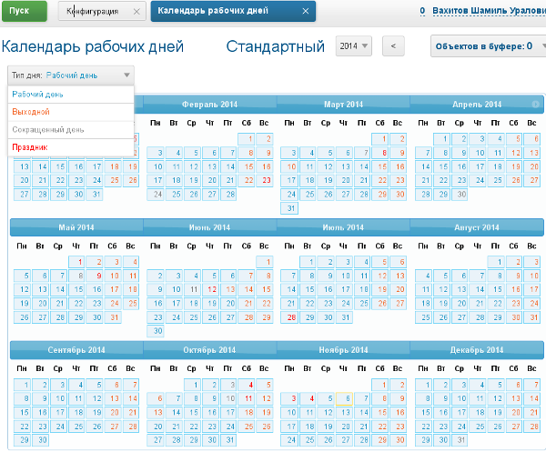
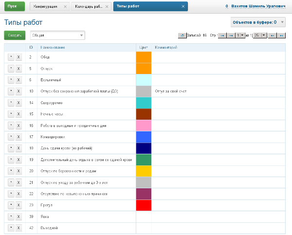
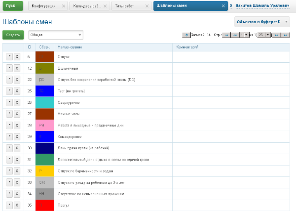
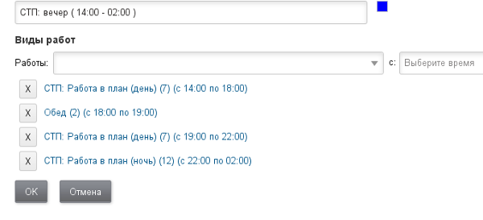
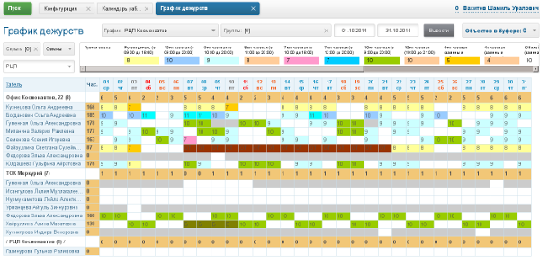
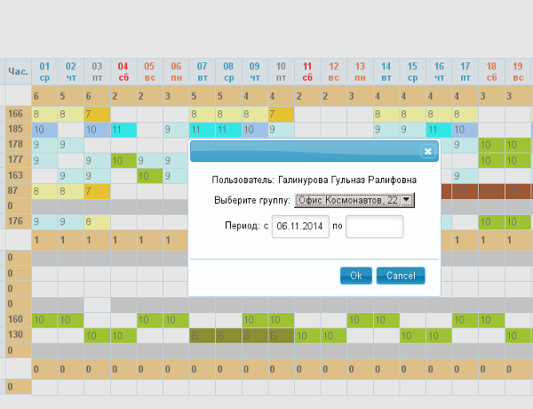
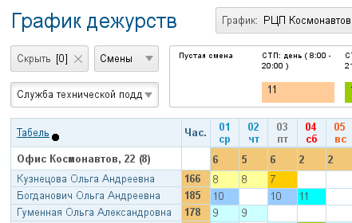
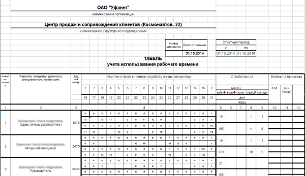
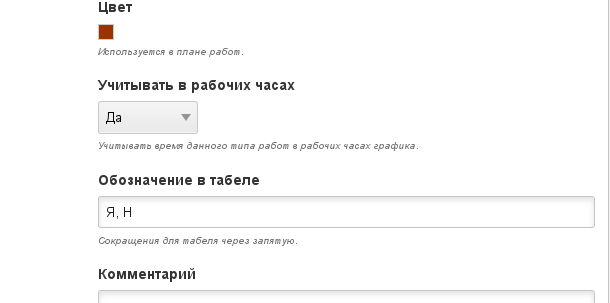
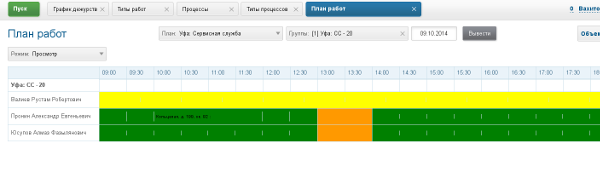

= Организация работ

Организация работ - общее название раздела системы, предназначенного для организации учета рабочего времени, назначения времени исполнения процессов. 
Все элементы доступны в меню *Пуск => Организация работ*.

image::_res/i0134.png[]

== Типы дней / Календарь рабочих дней
Календарь определяет распределение дней по типам. Сами типы дней определяются в конфигурации. Целесообразно выделить конфигурацию по организации работ в отдельный блок.

Типы дней добавляются правилами вида:
[source]
----
callboard.workdays.type.<id>.title=<title>
callboard.workdays.type.<id>.color=<color>
----

Где:
[square]
* *<id>* - числовой идентификатор типа дня;
* *<title>* - наименование типа дня;
* *<color>* - HTML HEX цвет типа дня.

Пример:
[source]
----
callboard.workdays.type.1.title=Рабочий день
callboard.workdays.type.1.color=#1C94C4
callboard.workdays.type.1.workHours=8
callboard.workdays.type.2.title=Выходной
callboard.workdays.type.2.color=#f36223
callboard.workdays.type.2.workHours=0
callboard.workdays.type.3.title=Сокращенный день
callboard.workdays.type.3.color=#808080
callboard.workdays.type.3.workHours=7
callboard.workdays.type.4.title=Праздник
callboard.workdays.type.4.color=#FF0000
callboard.workdays.type.4.workHours=0
callboard.workdays.type.4.holiday=1
----

Конфигурация календаря выглядит следующим образом:
[source]
----
callboard.workdays.calendar.<id>.title=<title>
callboard.workdays.calendar.<id>.comment=<comment>
callboard.workdays.calendar.<id>.rule=<rules>
----

Где:
[square]
* *<id>* - порядковый номер
* *<rules>* - правила распределния. 

Правила разделяются ";". Правила могут быть вида X:Y, либо X1-X2:Y (где X - порядковый день недели, Y - id типа рабочего дня, X1-X2 - диапазон дней недели, например 1-5 значит с 1 по 5)
Пример настройки календаря с типами дней из предыдущего примера:

[source]
----
callboard.workdays.calendar.1.title=Стандартный
callboard.workdays.calendar.1.comment=Общий план распределения рабочих дней
callboard.workdays.calendar.1.rule=1-5:1;6,7:2;
----

Здесь правила означают, что: дни с 1 по 5 каждой недели будут соотноситься с типом 1 (Рабочие дни в данном примере), а дни 6 и 7 с типом 2 (Выходные дни).

Можно создать неограниченное количество календарей с различными наборами распределения рабочих дней.

После добавления в конфигурации календарь появляется в таблице календарей.

image::_res/i0135.png[]

И может быть открыт для правки.

В календаре уже отмечены типы дней согласно правилам. Выбрав в выпадающем списке тип времени возможно переопределение типов для конкретных дней.

== Категории
Для разделения типов работ, шаблонов смен между подразделениями возможно добавление в конфигурацию категорий.

Категория добавляется следующим правилом:
[source]
----
callboard.worktype.category.<id>.title=<title>
callboard.worktype.category.<id>.public=<public>
----

Где:
[square]
* *<id>* - уникальный числовой идентификатор категории;
* *<title>* - наименование;
* *<public>* - 0, если категория не доступна для всех.

Пример:
[source]
----
#Конфигурация категорий работ
callboard.worktype.category.1.title=Общая
callboard.worktype.category.1.public=0
callboard.worktype.category.2.title=Вторая линия (осн)
callboard.worktype.category.2.public=0
callboard.worktype.category.3.title=Расчетная служба
callboard.worktype.category.3.public=0
callboard.worktype.category.4.title=Первая линия (осн)
callboard.worktype.category.4.public=0
callboard.worktype.category.5.title=Сервисная служба
callboard.worktype.category.5.public=0
callboard.worktype.category.6.title=Тестовая категория
callboard.worktype.category.6.public=0
callboard.worktype.category.7.title=Служба технической поддержки (Старшие)
callboard.worktype.category.7.public=0
callboard.worktype.category.8.title=РЦП
callboard.worktype.category.8.public=0
----

Целесообразно выделить общую категорию, включающую типы работ общие для всех.

== Типы работ
Тип работы определяет характер выполняемых действий подразделением в определённый момент времени.

Редактор типа работы.

image::_res/i0138.png[]

Категория соотносит тип работы категории. Цвет - используется в плане работ. Флаг "Учитывать в рабочих часах" - относится к генерации табеля и отображению сумм часов в графике. Обозначения в табеле - для генерации табеля.

Шаг длительности определяет размер минимального слота времени для графика дежурств. В графике допускаются типы работ с одинаковым размером слота. Способ назначения времени указывает на то, устанавливать ли время исполнения процесса на начало слота либо сдвигать время начала по мере заполнения слота.

Конфигурация определяет сколько минут занимает определённый процесс данного типа работы. Конфигурация нужна только если тип работы используется для назначения на смены с ним процессов.

В конфигурации добавляются одно или несколько правил вида:

[source]
----
rule.<pos>.checkExpression=<expression>
rule.<pos>.duration=<duration>
----

Где:
[square]
* *<pos>* - порядковый числовой номер правила;
* *<expression>* - <<extension.adoc#jexl, JEXL>> выражение проверки соответствия процесса правилу;
* *<duration>* - длительность в минутах.

В JEXL процессор передаются объекты:
[square]
* *process* - объект класса javadoc:ru.bgcrm.model.process.Process[] - процесс;
* *processParam* - объект класса javadoc:ru.bgcrm.dao.expression.ParamValueFunction[] - параметры процесса;
* *processLink* - объект класса javadoc:ru.bgcrm.dao.expression.ProcessLinkFunction[] - для работы с привязками процесса;
* *shift* - объект класса javadoc:ru.bgcrm.struts.action.WorkAction.ShiftData[].

Для определения сколько времени данный тип работы в данной смене будет обрабатывать конкретный процесс правила проходятся последовательно. 
Положительно значение длительности означает, что данный тип работы пригоден для обработки процесса.

Пример правил, в зависимости от значения спискового параметра процесса процесс может занимать разную длительность.

[source]
----
cnt=1
 
# отсеивание типов процессов отличных от 9432 (Подключение физ. лиц (Уфа) )
rule.{@inc:cnt}.checkExpression=process.getTypeId() != 9432
rule.{@cnt}.duration=0
#
# подключение любых задач, кроме пакета услуг, по договорам NK
rule.{@inc:cnt}.checkExpression=cu.intersection( processParam.listValueIds( 123 ), u.toIntegerSet( "1,3" ) ).size() > 0 && shift.getUserIds().size() == 1
rule.{@cnt}.duration=90
# полная бригада
rule.{@inc:cnt}.checkExpression=cu.intersection( processParam.listValueIds( 123 ), u.toIntegerSet( "1,3" ) ).size() > 0 && shift.getUserIds().size() > 1
rule.{@cnt}.duration=60
#
#
#rule.{@inc:cnt}.checkExpression=processParam.listValueIds( 123 ).size() > 0 && shift.userIds().size() == 1
#rule.{@cnt}.duration=90
#rule.{@inc:cnt}.checkExpression=processParam.listValueIds( 123 ).size() > 0 && shift.userIds().size() > 1
#rule.{@cnt}.duration=60
#
# правило по-умолчанию
rule.{@inc:cnt}.checkExpression=true
rule.{@cnt}.duration=120
----

== Шаблоны смен
Шаблоны смен используются для заполнения графика, разделяются по категориям.

Редактор смены.

image::_res/i0140.png[]

Цвет и символ смены используются для обозначения его в графике дежурств.

В смену могут быть добавлены несколько видов работ. Время закрытия не включается в диапазон. Допустим один переход суток, например так.

== График дежурств
График дежурств соотносит смены с исполнителями-членами групп. 
График позволяет учитывать рабочее время сотрудников, назначать время исполнения процессов, выгружать табель использования рабочего времени.

=== Настройка
График дежурств настраивается в конфигурации следующим образом.
[source]
----
callboard.<id>.groupId=<groupId>
callboard.<id>.calendarId=<calendarId>
# необязательные параметры
# автоматическое добавление групп при назначение смены в отсутствующей группе
#callboard.<id>.autoAddGroup=1
----

Где:
[square]
* *<id>* - уникальный числовой идентификатор графика;
* *<groupId>* - код группы пользователей, для которой составляется график;
* *<calendarId>* - код календаря рабочего времени, который является подложкой графика.

=== Работа с графиком
Все пользователи графика должны относиться к данной группе. График поддерживает один уровень вложенность групп, 
при этом позволяет учитывать работу пользователей в подгруппах и простое перераспределение между ними.

Для подсветки дат используются цвета типов дней привязанного к графику календаря. 
Суммы по горизонтали, рядом с пользователем считают количество рабочих часов в соответствии с типами работ, указанными в сменах. 
Суммы по вертикали - количество смен в сутках в данной подгруппе.

Серый цвет ячеек означет, что в данный день пользователь не входил в группу, белый - входил и может быть установлена смена.

На данном примере в группе есть две подгруппы. Пользователи, относящиеся только к основной группе - расположены внизу. Кликом по пользователю активируется окно добавление ему группы с определённым периодом.

Для установки смен необходимо выбрать в выпадающем списке над графиком "Смены", выбрать категорию смен, выбрать смену и устанавливать её кликами либо протаскиванием зажатой ЛКМ по ячейкам графика. "Пустая" смена очищает ячейку.

image::_res/i0144.png[]

Режим установки бригад позволяет пометить работающих вместе сотрудников.

image::_res/i0145.png[]

Установка одной бригады в сутках на двух исполнителей с разными сменами невозможно. 
Если у второго и последующего исполнителя ставится бригада, присутствующая у исполнителя с заполненной сменой - данная смена устанавливается на исполнителей.

== Табель рабочего времени
NOTE: Табель может быть сгенерирован только за весь месяц целиком.

Для генерации табеля рабочего времени по графику дежурств необходимо добавить в конфигурацию графика:
[source]
----
callboard.<id>.tabel.template=<template>
callboard.<id>.tabel.departmentTitle=<title>
callboard.<id>.tabel.paramTabelNumberId=<tabelNumberParamId>
callboard.<id>.tabel.paramPostId=<postNumberParamId>
----

Где:
[square]
* *<id>* - идентификатор графика;
* *<template>* - ссылка на XLS файл-шаблон табеля;
* *<title>* - наименование в заголовке табеля;
* *<tabelNumberParamId>* - код параметра пользователя типа "text", содержащего табельный номер сотрудника;
* *<postNumberParamId>* - код параметра пользователя типа "text", содержащего должность сотрудника.

Образец с шаблоном табеля *docpattern/tabel_blank.xls* поставляется с системой. Рекомендуется скопировать файл и сохранить с другим именем.

Пример конфигурации графика с генерацией табеля:

[source]
:prewrap!:
----
callboard.2.groupId=9
callboard.2.calendarId=1
callboard.2.tabel.template=docpattern/tabel_blank.xls
callboard.2.tabel.departmentTitle=Служба технической поддержки службы удаленной поддержки клиентов
callboard.2.tabel.paramTabelNumberId=884
callboard.2.tabel.paramPostId=773
----

В графике, для которого произведена настройка в левом вернем углу отображается ссылка выгрузки табеля, возвращающая XLS файл.

Примерный внешний вид готового табеля.

Табель строится на основании типов работ, содержащихся в установленных пользователям сменах.

Виды работ, помеченные для учёта в рабочих часах суммируются в рядах.

В сокращениях указываются через запятую буквы, обозначающие роль вида работ в табеле. Могут быть указаны:
[square]
* *Я* - явка, вид работ засчитывается в рабочие часы;
* *Н* - ночные часы работы, обычно комбинируется с явкой;
* *В* - выходной день;
* *С* - сверхурочная работа;
* *РВ* - работа в выходной день.

== Назначение времени
Для отображения в правой области карточки процесса вкладки Уст. времени в конфигурации типа процесса указывается:
[source]
----
callboard.timeset.graphId=<graphId>
callboard.timeset.paramId=<paramId>
callboard.timeset.daysShow=<daysShow>
----

Где:
[square]
* *<graphId>* - идентификатор графика из конфигурации;
* *<paramId>* - код параметра процесса типа "datetime" в который будет записано назначенное время;
* *<daysShow>* - какое количество дней после выбранной даты выводить в списке доступных времён.

Пример:
[source]
----
callboard.timeset.graphId=3
callboard.timeset.paramId=610
callboard.timeset.daysShow=3
----

Внешний вид вкладки назначения времени в процессе.

image::_res/i0149.png[]

Назначенное время возможно переопределить.

== План работ
План работ отображает назначенное время на конкретные сутки с выводом описаний занимающих процессов.

Цвет означает тип работ. Строка-описание процесса настраивается с помощью JEXL выражения в конфигурации типа процесса, в *objectTypes* указывется *callboard*.

Пример:
[source]
----
processReference.1.objectTypes=callboard
processReference.1.stringExpression=u.escapeXml(u.maskNull(u.getFirst(processParam.addressValues(90, 'fromStreet')))) + " : " + process.getDescription()
----

Описание процесса для плана генерируется только в момент установки времени процесса и не изменяется в дальнейшем при правке процесса.
