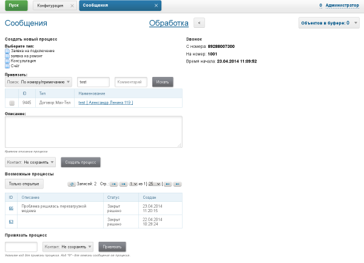

= Плагин Asterisk
:toc:

Плагин предназначен для интеграции c программной АТС Asterik: регистрация в системе звонков клиентов и открытие их на обработку. 
Звонки регистрируются с помощью механизма сообщений.

Для интеграции используется библиотека http://asterisk-java.org/asterisk-java/ версии 1.0.0.CI-SNAPSHOT, 
поддерживающая AMI (протокол управления) версии 1.4 для Asterisk v. 12.

[[config]]
== Конфигурация 
В <<../../kernel/setup.adoc#config, конфигурации сервера>>.
[source]
----
# AMI
asterisk:amiManager.<id>.messageTypeId=<typeId>
asterisk:amiManager.<id>.host=<host>
asterisk:amiManager.<id>.port=<port>
asterisk:amiManager.<id>.login=<login>
asterisk:amiManager.<id>.pswd=<pswd>
# optional parameter, speeds connection process up or solves problem with undetectable version
asterisk:amiManager.<id>.version=<version>
# переопределение класса - слушателя классом динамического кода, должен расширять указанный ниже класс по-умолчанию
#asterisk:amiManager.<id>.listenerClass=ru.bgcrm.plugin.asterisk.AmiEventListener
----
Где:
[square]
* *<id>* - порядковый номер правила;
* *<typeId>* - идентификатор типа <<../../kernel/message.adoc#type-call, сообщения типа Call>>, с которым будут заводиться звонки в системе;
* *<host>* - хост с Asterisk с AMI;
* *<port>* - порт доступа к AMI;
* *<login>* - логин к AMI;
* *<pswd>* - пароль к AMI;
* *<version>* - version string, may be: 'Asterisk 13.0', 'Asterisk 16.0', see: https://github.com/asterisk-java/asterisk-java/blob/master/src/main/java/org/asteriskjava/AsteriskVersion.java

Пример:
[source]
----
# AMI
asterisk:amiManager.1.messageTypeId=1
asterisk:amiManager.1.host=961.210.800.6
asterisk:amiManager.1.port=5038
asterisk:amiManager.1.login=crm
asterisk:amiManager.1.pswd=55555
----

Пример настройки со стороны Asterisk а, файл manager.conf.
[source]
----
[general]
enabled = yes
port = 5038
bindaddr = 0.0.0.0
 
[crm]
secret = 55555
deny=0.0.0.0/0.0.0.0
permit=192.168.20.0/255.255.255.0
permit=127.0.0.1/255.255.255.0
read = call
writetimeout = 5000
----

В <<../../kernel/extension.adoc#run-on-start, переменной createOnStart>> конфигурации сервера должны быть указаны следующие классы:
[source]
----
createOnStart=ru.bgcrm.plugin.asterisk.AMIManager,ru.bgcrm.event.listener.MessageTypeCallListener
----

Первый класс устанавливает соединение с Asterisk ом, наблюдая звонки. 
Второй - передаёт зарегистрированным пользователям оповещение о поступлении нового звонка для обработки.

После регистрации в сообщении типа Call пользователем своего номера при определении принятого на этот номер вызова BGERP откроет сообщение для обработки.

[[debug]]
== Debug
Recommended <<../../kernel/extension.adoc#log4j, logger>> configuration.

[source]
----
# for debugging events
log4j.logger.ru.bgcrm.plugin.asterisk=DEBUG, file
log4j.additivity.ru.bgcrm.plugin.asterisk=false
#
# for debugging library
log4j.logger.org.asteriskjava=DEBUG, file
log4j.additivity.org.asteriskjava=false
----
