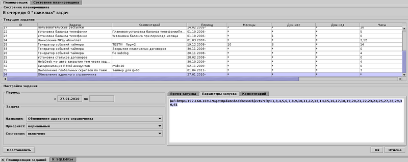

= Синхронизация справочников адресов с BGBilling

== Настройка
Для первичной конвертации адресных справочников из базы BGBilling версии 5.1 - 7.0 вы можете использовать 
BASH скрипт link:_res/bgbilling_dump_address.sh[bgbilling_dump_address.sh] 
Он создаёт дамп таблиц, пригодный для заливки в базу BGERP. При этом создаётся временная база данных. 
Загрузите скрипт, при необходимости скорректируйте в нём указанные ниже параметры. 
Для BGBilling с версии 6.2 и выше SRC_CHARSET должен быть установлен в utf8.

[source]
----
BASE="bgbilling"
HOST="127.0.0.1"
LOGIN="root"
PSWD=""

SRC_CHARSET="cp1251"
TARGET_CHARSET="utf8"

BASE_TEMP="_bg_address_tables"
DUMP_FILE="address_data.sql"

COMMAND_SQL="mysql -h$HOST -u$LOGIN -p$PSWD" 
COMMAND_DUMP="mysqldump -h$HOST -u$LOGIN -p$PSWD --default-character-set=$SRC_CHARSET --skip-set-charset" 
----

Далее выполните на машине с mysql клиентом и доступом к mysql серверу биллинга (проще всего выполнить непосредственно на сервере БД биллинга). 
Скрипт создаёт временную базу "_bg_address_tables", структура таблиц которой идентична таблицам BGERP. 
Далее в эту временную базу переносится информация адресных справочников, снимается дамп и преобразуется кодировка дампа.

Полученный дамп можно применить к БД BGERP, например так: 
[source]
----
mysql bgcrm -ubgcrm -pcrm --default-character-set=utf8 < address_data.sql
----

После первичной загрузки данных возможна настройка синхронизации справочников биллинга с адресными справочниками BGERP.
При этом правка справочника будет происходить _только_ в BGERP, а биллинг будет лишь получать обновления. На начальном этапе настройки, либо если адресный справочник удобнее вести в единственном биллинге - просто настройте периодическое выполнение скрипта первичного переноса адресов.
Для этого следует настроить в BGBilling задачу планировщика "Обновление адресного справочника", запретить с помощью прав изменение справочников в BGBilling.
Если задачи нет в планировщике (версия биллинга младше 6.1) добавьте её запросом в SQL редакторе: 
[source]
----
INSERT INTO scheduled_class(title, class) VALUES ("Обновление адресного справочника", "ru.bitel.bgbilling.kernel.task.server.TaskUpdateAddressDirectory" ); 
----

В параметрах задачи укажите: 
[source]
----
url=http://<CRM_IP_PORT>/getUpdatedAddressObjects?city=<city_codes>
----

Где:
[square]
* *<CRM_IP_PORT>* - IP адрес и порт BGERP;
* *<city_codes>* - коды городов через запятую. 

Пример настройки можно посмотреть на скриншоте. 

== Отладка

Сделайте несколько явных изменений и обратитесь к CRM в ручном режиме по тому адресу который у вас прописан в настройках задачи.
[source]
----
http://serverip:9088/getUpdatedAddressObjects?city=1,2,3,4&time=1427791348291
----

Где *time* взять из БД запросом:
[source]
----
SELECT value FROM setup WHERE id='address.time'
----

Посмотрите данные в XML ответе, описаны ли изменения.
 