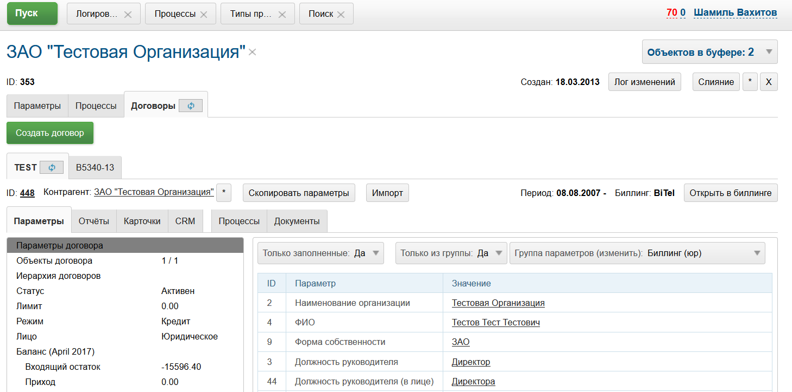
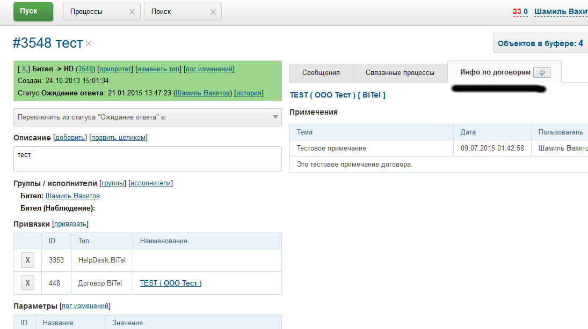
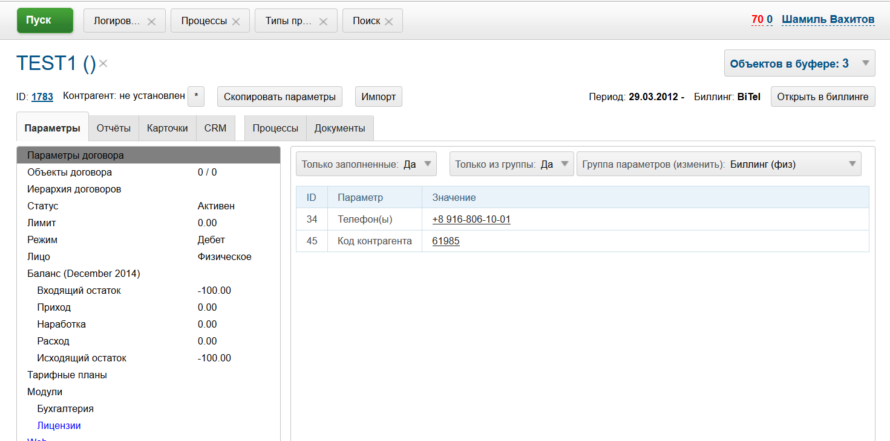

= Плагин BGBilling
:toc:

Плагин предназначен для интеграции BGERP с биллинговой системой BGBilling и предоставляет функционал:
[square]
* поиск договоров по базе биллингов;
* создание и модификация параметров договоров;
* привязка договоров к контрагентам;
* копирование параметров контрагентов в договора;
* создание базы контрагентов по базе договоров.

[[howto]]
== Методика использования
Интеграция с BGBilling не является необходимой для BGERP. BGERP не сохраняет данные биллинга, но предоставляет интерфейс доступа к
ним и позволяет привязывать объекты биллинга к процессам. В CRM может производится учёт процессов обслуживания, подключения, отключения абонентов.
В момент создания процессов параметры договоров, такие как адрес, описание и т.п. копируются в процесс и используются в работе.
В отдельные параметры имеет смысл копировать информацию, которая используется для поиска либо требуется отдельно. Например, адрес.
Всё остальное предпочтительно собрать в текстовый блок описания процесса. Это упрощает работу и оптимизирует хранение данных.

Использование контрагентов и привязка их к договорам не является необходимым и может быть внедрено на втором этапе.
Контрагент представляет собой актуальное хранилище параметров физического лица либо организации. В момент создания договора необходимые параметры
копируются в него и остаются далее неизменными, фиксируя состояние на момент заключения контракта. По возможности данные контрагента стоит хранить
только в контрагенте, как например контактные телефоны и т.п., а в договор передавать необходимые данные.

На заключительном шаге интеграции договора в биллинге могут быть полностью лишены параметров, сохраняя в себе лишь данные необходимые для
функционирования биллинга. Печатные формы в этом случае генерируются также в CRM и сохраняют информацию о реквизитах на момент подписания.

Система BGERP может быть интегрирована с несколькими биллингами, представляя центральное хранилище всех протекающих процессов.
Адресный справочник BGERP и всех биллингов должен быть синхронизирован. При нескольких биллингах центральным местом ведения адресов выступает BGERP.
Если биллинг один и на первом этапе интеграции возможна настройка обратной синхронизации, когда адреса переносятся из биллинга в CRM.
<<address_load.adoc#, Подробнее о синхронизации адресов>>.

[[config]]
== Конфигурация
Все настройки из данного раздела размещаются в <<../../kernel/setup.adoc#config, конфигурации сервера>>, предпочтительно отдельно с инклудом в общую.

[[config-search]]
=== Поиск

[[config-search-param-address]]
==== Address param
Specifying which parameters are used by address search:
----
bgbilling:search.contract.param.address.paramIds=<paramIds>
----

Where:
[square]
* *<paramIds>* - comma separated list of BGBilling parameter IDs.

[[config-server]]
=== Серверы биллинга
Для добавления биллингов в конфигурации сервера добавляют конструкции вида:
----
bgbilling:server.<n>.id=<id>
bgbilling:server.<n>.title=<title>
bgbilling:server.<n>.url=<url>
# необязательные параметры
bgbilling:server.<n>.customerIdParam=<paramId>
bgbilling:server.<n>.timezone=<timezone>
bgbilling:server.<n>.requestTimeOut=<timeout>
bgbilling:server.<n>.version=<version>
----
Где:
[square]
* *<n>* - уникальный порядковый номер сервера биллинга в конфигурации;
* *<id>* - строковый идентификатор биллинга, короткая строка, именно на него ссылаются все остальные записи в конфигурации;
* *<title>* - отображаемое наименование;
* *<url>* - URL для подключения к сервлету executer биллинга;
* *<param_id>* - код текстового параметра договора в биллинге, в котором сохраняется код контрагента, к которому привязан данный договор;
* *<timezone>* - временная зона сервера, например Europe/Moscow;
* *<timeout>* - таймаут ожидания ответа сервера биллинга в мс;
* *<version>* - явно определённая версия сервера биллинга, возможные значения в фрагменте кода далее.

[snippet, from="static", to=");"]
link:../../../../src/ru/bgcrm/plugin/bgbilling/DBInfoManager.java#L23-L23[DBInfoManager.java]

Например:
----
bgbilling:server.1.id=bitel
bgbilling:server.1.title=BiTel
bgbilling:server.1.url=http://billing.bitel.ru/executer
bgbilling:server.1.version=5.2
bgbilling:server.1.customerIdParam=100
----

Дополнительно для каждого сервера могут быть указаны необязательные параметры:
----
bgbilling:server.<n>.markerRequestParam=<markerParam>:<markerValue>
bgbilling:server.<n>.contract_pattern.<pat_num>.title_pattern=<pattern>
bgbilling:server.<n>.crm.problem.status.list=<status_list>
bgbilling:server.<n>.copyParamMapping=<mapping>
----
Где:
[square]
* *<markerParam>:<markerValue>* - наименование и значение дополнительного "маркерного" параметра HTTP запроса к данному биллингу, для возможности простого разделения запросов в логах;
* *<pat_num>* - код шаблона договора из биллинга;
* *<pattern>* - шаблон нумерации договоров по этому шаблону при создании их из BGERP;
* *<mapping>* - правила копирования параметров контрагента в договор, см. далее.

В параметре <mapping> указываются разделённые точкой с запятой значения вида *<cust_id>:<billing_id>*.
Где:
[square]
* *<cust_id>* - числовой код параметра контрагента либо *customerTitle* - наименование контрагента; для списковых параметров указывается код параметра и коды значений в квадратных скобках после кода;
* *<billing_id>* - числовой код параметра договора биллинга; для списковых параметров указывается код параметра и коды значений в квадратных скобках после кода.

Например:
----
bgbilling:server.11.copyParamMapping=15:9;72:46;73:5;74:51;75:68;76:69;77:56;78:7;14:8;12:6;109:48;110:50;114:12;115[1,2]:25[4,3];customerTitle:1
----

[[config-server-report]]
==== Доступ для отчётов
Для возможности отчётов плагина <<../report/index.adoc#, Report>> выполнять запросы в БД биллингу необходимо добавить в конфигурацию сервера, пример:
----
bgbilling:server.1.db.driver=com.mysql.jdbc.Driver
bgbilling:server.1.db.url=jdbc:mysql://127.0.0.1/bgbilling?useUnicode=true&characterEncoding=UTF-8&connectionCollation=utf8_unicode_ci&allowUrlInLocalInfile=true&zeroDateTimeBehavior=convertToNull&jdbcCompliantTruncation=false&elideSetAutoCommits=true&cachePrepStmts=true&useCursorFetch=true&queryTimeoutKillsConnection=true
bgbilling:server.1.db.user=bill
bgbilling:server.1.db.pswd=pass
----

Рекомендуется использовать реплику основной БД биллинга и пользователя с правами только на чтение и создание временных таблиц.

[[config-user]]
=== Аккаунты доступа
Обращение к биллингу осуществляется с использованием логина и пароля пользователя BGERP.
Возможна установка отличного логина и пароля в <<../../kernel/setup.adoc#united-user-config, конфигурации>> пользователя:
----
bgbilling:login=<login>
bgbilling:password=<pswd>
----

Либо настройка логина и пароля для конкретного биллинга. Возможно также переопределение только логина либо только пароля.
----
bgbilling:login.<billingId>=<login>
bgbilling:password.<billingId>=<pswd>
----

Для BGBilling обращения плагина выглядят так же как и обращения обычного пользователя биллинга, аналогично действуют ограничения прав.

[[contract-type]]
=== Типы договоров
Это договоры, которые могут быть созданы в привязке к контрагенту в его <<customer-card, карточке>>, при этом нумерацию осуществляет биллинг.
Для добавления договора услуги в конфигурации указываются одна или несколько записей вида:
----
bgbilling:contractType.<n>.title=<title>
bgbilling:contractType.<n>.billing=<billing_id>
bgbilling:contractType.<n>.patternId=<pattern_id>
bgbilling:contractType.<n>.tariffList=<tariff_list>
# необязательно, если не указано, то считается равным -1
bgbilling:contractType.<n>.tariffPosition=<tariff_pos>
----
Где:
[square]
* *<n>* - уникальный порядковый номер типа в конфигурации;
* *<title>* - наименование типа договора;
* *<billing_id>* - строковый идентификатор биллинга;
* *<pattern_id>* - код шаблона договора в биллинге;
* *<tariff_list>* - перечень разделённых через точку с запятой записей вида <id>:<title>, где <id> -код тарифа в биллинге, <title> - обозначение тарифа;
* *<tariff_pos>* - позиция, с которой будет добавлен тариф (если выбран): -1 - заменить тарифом первый текущий тариф, либо добавить с позицией 0, если тарифа нет; >= 0 - тариф будет добавлен к существующем в договоре с данной позицией.

=== Синхронизация адресных справочников
Необходима в случае совместного использования адресных параметров в BGERP и биллингах.
Например, создания процессов с адресами из договоров, импорта контрагентов и т.п. <<address_load.adoc#, Настройка синхронизации>>.

BGERP позволяет централизованно вести адресный справочник, предоставляя одному или нескольким биллингам возможность
синхронизации изменений с помощью периодического процесса планировщика.
Также в статье описан первоначальный перенос справочника из единственного биллинга в BGERP.

При наличии изначально нескольких биллингов с рассогласованными адресными справочниками возможно сведение их <<address_sync.adoc#, утилитой>>.

[[customer-import]]
=== Импорт контрагентов из договоров
Использование контрагентов не является обязательным при интеграции BGERP с BGBilling.
Возможна работа с договорами посредством Web-интерфейса в BGERP, к договорам могут быть привязаны процессы.
Контрагент позволяет выделить параметры специфичные для непосредственно клиента либо организации в отдельную сущность.
Например, актуальные контакты, паспортные данные, банковские реквизиты.
Также контрагент позволяет сгруппировать договора организации/клиента. Наиболее оптимально импортировать контрагентов вторым этапом интеграции.

Общее описание алгоритма импорта:
[arabic]
. Из базы биллинга выбирается следующий договор с текстовым полем *Код контрагента = 0* (код поля настраивается, само поле нужно создать в биллинге).
. Наименование контрагента извлекается из комментария договора биллинга.
. Производится поиск в базе контрагентов с названием, включающем в себя название контрагента договора,
для всех найденных контрагентов сверяются *подтверждающие параметры* (адреса, телефоны, паспортные данные и т.п.).
При совпадении хотя бы одного из подтверждающих параметров контрагент считается установленным.
. Если в шаге 2 контрагент не найден, то контрагент ищется по *ключевым параметрам*, после чего для найденных контрагентов определяется степень
несовпадения наименования с наименованием контрагента договора.
Если link:http://ru.wikipedia.org/wiki/%D0%A0%D0%B0%D1%81%D1%81%D1%82%D0%BE%D1%8F%D0%BD%D0%B8%D0%B5_%D0%9B%D0%B5%D0%B2%D0%B5%D0%BD%D1%88%D1%82%D0%B5%D0%B9%D0%BD%D0%B0[расстояние Левенштейна] между двумя наименованиями не превышает указанного
в конфигурации значения, то контрагент считается установленным. К наименованию контрагента в BGERP добавляется новый вариант написания через символ пайпа (|).
В дальнейшем правильный вариант написания предстоит установить оператору.
. Если контрагент не найден при прямом и обратном поиске - создаётся новый контрагент.
. К созданному контрагенту привязывается договор, в него импортируются параметры договора.

Для настройки импорта контрагентов из базы договоров биллинга добавьте в конфигурацию правила импорта:
----
bgbilling:creator.confirmParameters=<confirm_params>
bgbilling:creator.searchParameters=<search_params>
bgbilling:creator.titleDistance=<title_dist>
bgbilling:creator.importParameters=<import_params>
bgbilling:creator.importBillingIds=<billing_ids>
----
Где:
[square]
* *<confirm_params>* - подтверждающие параметры контрагента, коды через запятую;
* *<search_params>* - ключевые параметры контрагента, коды через запятую;
* *<title_dist>* - максимальное расстояние Левенштейна;
* *<import_params>* - импортируемые из договора параметры контрагента;
* *<billing_ids>* - идентификаторы биллингов, из которых запускается импорт, если не указано - каждый запуск в планировщике инициирует импорт для всех биллингов.

Далее одно или несколько правил определения группы параметров контрагента из номера договора:
----
# необязательный параметр, если шаблона нет - то группа выставляется всем контрагентам
bgbilling:creator.parameterGroupRule.<id>.contractTitlePattern=<title_pattern>

bgbilling:creator.parameterGroupRule.<id>.paramGroupId=<param_group>
bgbilling:creator.parameterGroupRule.<id>.titlePatternId=<title_pattern_id>
----
Где:
[square]
* *<id>* - уникальный числовой идентификатор правила, правила просматриваются в порядке их идентификаторов;
* *<param_group>* - <<../../kernel/setup.adoc#customer-param-group, группа параметров>> контрагента;
* *<title_pattern>* - <<../../kernel/extension.adoc#regexp, REGEXP>> выражение, с которым сравнивается номер договора;
* *<title_pattern_id>* - код шаблона имени контрагента.

И для каждого из серверов биллинга записи:
----
bgbilling:creator.server.<id>.billingId=<billing_id>
bgbilling:creator.server.<id>.user=<user>
bgbilling:creator.server.<id>.pswd=<pswd>
bgbilling:creator.server.<id>.paramMapping=<mapping>
bgbilling:creator.server.<id>.pageSize=<page_size>
----
Где:
[square]
* *<id>* - уникальный числовой идентификатор правила;
* *<billing_id>* - строковый <<config-server, идентификатор>> биллинга;
* *<user>*, *<pswd>* - логин и пароль пользователя биллинга, под которым осуществляется импорт;
* *<page_size>* - количество договоров для импорта, выбираемых за один раз;
* *<mapping>* - соотношение параметров контрагента и биллинга, разделённые точкой с запятой пары *<код параметра контрагента>:<код параметра договора>* для простых параметров
и *<код параметра контрагента>[<коды значений спискового параметра через запятую>]:<код параметра договора>[<коды значений спискового параметра через запятую>]* - для спискового типа; если маппинг не задан, то код значения спискового параметра будет импортирован "как есть" из биллинга.

Дополнительные необязательные параметры:
----
bgbilling:creator.server.<id>.minCustomerTitleLength=<minTitleLength>
----
Где:
[square]
* *<minTitleLength>* - минимально допустимая длина наименования контрагента (комментария договора) с которым будет предпринята попытка импорта,
если параметр не указан, то значение по-умолчанию равно 10.

При импорте поддерживаются параметры договоров и, соответственно, контрагентов типа: "дата, текст, адрес, телефон, список".
Параметры дата и текст перетирают значение параметра в договора, адрес, телефон и список - дополняют.

Параметр контрагента типа email может быть импортирован из аналогичного либо текстового параметра биллинга.

Пример конфигурации импорта контрагентов:
----
# загрузчик контрагентов
# дата рожд, адреса  услуг, сот. телефон(ы), паспорт с.-н.
bgbilling:creator.confirmParameters=73,12,14,74
# поиск по с.-н. паспорта, адресам услуг, сот. телефонам
bgbilling:creator.searchParameters=74,12,14
# расстояние по Левинштейну
bgbilling:creator.titleDistance=2
# кодовая фр., дата рожд., с.-н. пасп., д.в. пасп., кем выд. пасп, адрес проп., тел. гор, тел. сот, адрес(а) усл.
bgbilling:creator.importParameters=72,73,74,75,76,77,78,14,12

# группа параметров контрагента
bgbilling:creator.parameterGroupRule.1.paramGroupId=3

bgbilling:creator.server.1.billingId=ds
bgbilling:creator.server.1.user=bgcrm
bgbilling:creator.server.1.pswd=bgcrmv2
bgbilling:creator.server.1.paramMapping=72:456;73:386;74:457;75:458;76:459;77:460;78:401;14:399;12:42;46:378;115[1,2]:421[14575,14576]
bgbilling:creator.server.1.pageSize=10

bgbilling:creator.server.2.billingId=tks
bgbilling:creator.server.2.user=bgcrm
bgbilling:creator.server.2.pswd=bgcrmv2
bgbilling:creator.server.2.paramMapping=72:95;73:51;74:96;75:97;76:98;77:99;78:59;14:60;12:9,80,83
bgbilling:creator.server.2.pageSize=10
----
Импорт контрагента можно инициировать вручную в <<contract-card, карточке договора>>, либо настроить в планировщике.
Для настройки импорта контрагента по таймеру добавьте в <<../../kernel/setup.adoc#scheduler, конфигурацию планировщика>> класс *CustomerCreator*, например:
----
scheduler.task.{@inc:cnt}.class=CustomerCreator
scheduler.task.{@cnt}.minutes=2,12,22,32,42,52
----
Мониторить выполнение задачи можно по логам.

[[process-type-config]]
=== Конфигурация типа процесса
В <<../../kernel/process/index.adoc#setup-type, конфигурацию типа процесса>> возможна установка следующих параметров.

Для автоматического добавления групп решения процесса по названию либо биллингу привязанного договора одна или несколько правил вида:
----
bgbilling:processLinkedContract.<n>.groupIds=<groupIds>
bgbilling:processLinkedContract.<n>.titleRegexp=<titleRegexp>
bgbilling:processLinkedContract.<n>.billingIds=<billingIds>
----
Где:
[square]
* *<n>* - порядковый номер правила;
* *<titleRegexp>* - REGEXP номера договора;
* *<billingIds>* - строковые идентификаторы биллингов через запятую, к которым может относиться договор.

Правила отрабатывают при привязке договора к процессу, либо при создании привязанного к договору процесса.
Проверка осуществляется до первого совпавшего по REGEXP либо кодам биллингов правила. Достаточно указать лишь одно из этих условий.

Для отключения привязки контрагента к процессу при привязке относящегося к нему договора:
----
bgbilling:linkCustomerOnContractLink=0
----
Отображение на вкладках в карточке процесса процессов привязанных договоров:
----
bgbilling:processShowLinkContractProcess=1
----

Выглядит так, для каждого привязанного договора добавляется дополнительная вкладка:

image::_res/i0116.png[]

[[plugin-document]]
=== Интеграция с плагином Document
Для вкладки документов карточки договора в <<../document/index.adoc#setup, конфигурации типов документов>> указывать scope=*bgbilling-contract*.

[[search]]
== Оснастка "Поиск"
В оснастке плагин добавляет функционал поиска договоров по базам. Поиск может осуществляться по номеру договора, комментарию, адресным параметрам.

image::_res/i0041.png[]

Поиск по номеру и комментарию осуществляется по подстроке. Поиск по адресным параметрам - аналогично поиску контрагента, можно искать как по только по улице так и дополнять данные для поиска.

Возможен также поиск по нескольким типам параметров: текстовому, телефонному, дате. Для поиска необходимо выбрать тип параметра и названия параметров данного типа. Если не выбраны названия параметров, то поиск осуществляется по всем параметрам данного типа.

Из результатов поиска отображаются только первые 30 на каждый биллинг.
Под результатами поиска в каждом из биллингов отображается число найденных и отображённых записей.

[[customer-card]]
== Карточка "Контрагент"
=== Вкладка "Договоры"
Позволяет просматривать <<contract-card, карточки договоров>> контрагента, создавать привязанные сконфигурированные <<contract-type, типы договоров>>.

Возможно копирование параметров в договоры, переход на карточку договора нажатием на ссылку-номер.

== Карточка "Процесс"
Для отображения в карточке процесса примечаний привязанных к процессу договоров установить в конфигурации типа процесса:
----
bgbilling:processShowLinkedContractsInfo=memo
----

[[contract-card]]
== Карточка "Договор"
Карточка договора отображает основные параметры договора в биллинге. Отдельно открываются не <<customer-card, привязанные к контрагенту>> договоры.
Через данный редактор BGERP может быть использован как Web-интерфейс для работы с договорами BGBilling.

Кнопка изменения контрагента (*) позволяет убрать привязку контрагента к договору либо привязать договор к одному из открытых в буфере контрагентов.
Кнопка *Импорт* вызывает импорт параметров из договора в выбранного контрагента, либо создаёт контрагента в соответствии с
правилами <<customer-import, импорта контрагентов>> и привязывает его к договору.

Кнопка *Открыть в биллинге* - позволяет быстро открыть вкладку договора клиенте BGBillingClient.
Для этого клиент биллинга должен быть подключен к серверу под тем же пользователем, что и текущий пользователь в BGERP. Для открытия договора - нажать кнопку и перейти в клиент биллинга.
Быстрый переход предназначен для операций с договором, не реализованных через интерфейс BGERP.

NOTE: Создание нового договора возможно только с из <<customer-card, карточки контрагента>>.

[[helpdesk]]
== Интеграция с плагином HelpDesk биллинга
Настройка связки BGERP с плагином HelpDesk BGBilling а позволяет:
[square]
* получать отображение тем HelpDesk одного или нескольких биллингов в виде процессов BGERP, автоматически привязываемых к договору и (если есть) к контрагенту;
* вести переписку в темах с помощью стандартного механизма <<../../kernel/message/index.adoc#, сообщений>>;
* устанавливать статусы тем, стоимость, менять исполнителей из карточки процесса в BGERP;
* учитывать дополнительные параметры, привязанные к процессам HelpDesk.

=== Настройка
Всем пользователям, работающим с HelpDesk, должен быть сопоставлен <<config-user, аккаунт>> в биллинге.

Для каждого биллинга, с которым необходима настройка указывается в конфигурации свой отдельный <<../../kernel/message/index.adoc#setup-type, тип сообщения>>, следующим образом:
----
messageType.<id>.title=<title>
messageType.<id>.billingId=<billingId>
messageType.<id>.class=MessageTypeHelpDesk
messageType.<id>.user=<user>
messageType.<id>.pswd=<pswd>
messageType.<id>.processTypeId=<processTypeId>
messageType.<id>.openStatusId=<openStatusId>
messageType.<id>.closeStatusId=<closeStatusId>
messageType.<id>.costParamId=<costParamId>
messageType.<id>.statusParamId=<statusParamId>
messageType.<id>.autoCloseParamId=<autoCloseParamId>
messageType.<id>.pageSize=<pageSize>
messageType.<id>.newMessageEvent=<event>
# необязательные
messageType.<id>.markMessagesReadStatusIds=<readStatusIds>
# добавлять первое сообщение в описание процесса
messageType.<id>.addFirstMessageInDescription=1
# во время отладки ограничение синхронизацию одной темой
#messageType.<id>.topicId=<topicId>
----

Где:
[square]
* *<id>* - код типа сообщения;
* *<billingId>* - строковый <<config-server, идентификатор>> сервера биллинга;
* *<user>* - пользователь биллинга, под которым BGERP будет производить периодическое сканирование тем для синхронизации;
* *<pswd>* - пароль пользователя биллинга *<user>*;
* *<processTypeId>* - тип создаваемого процесса;
* *<openStatusId>* - код статуса, в который процесс переводится при открытии темы в биллинге;
* *<closeStatusId>* - код статуса, в который процесс переводится при закрытии темы в биллинге;
* *<costParamId>* - код текстового параметра процесса со стоимостью обращения;
* *<statusParamId>* - код спискового параметра процесса со статусом темы, значения должны соответствовать занесённым в справочник BGBilling;
* *<autoCloseParamId>* - код спискового параметра с флагом автозакрытия темы, должно быть одно значение 1=Да;
* *<pageSize>* - количество отслеживаемых тем HelpDesk, можно выставить в 10000;
* *<event>* - 1, если необходимо генерировать событие при поступлении нового сообщения в тему, при первичном импорте лучше установить в 0 - не генерировать;
* *<readStatusIds>* - коды статусов процессов, при переводе в которые все сообщения помечаются прочитанными (необязательно).

Тип процесса <processTypeId> должен существовать, у него должны присутствовать указанные выше параметры и статусы, переходы в которые должны быть разрешены.

Пример настройки:
----
messageType.2.title=HD
messageType.2.billingId=bg
messageType.2.class=MessageTypeHelpDesk
messageType.2.user=bgcrm
messageType.2.pswd=bgcrm
messageType.2.processTypeId=3
messageType.2.costParamId=23
messageType.2.statusParamId=25
messageType.2.autoCloseParamId=24
messageType.2.openStatusId=1
messageType.2.closeStatusId=4
messageType.2.pageSize=100000
messageType.2.newMessageEvent=1
messageType.2.markMessagesReadStatusIds=2,3,4,5
----

После добавления данного типа сообщения при первом выполнении задачи <<../../kernel/message/index.adoc#setup-scheduler, синхронизации>> в системе создаются процессы указанного типа,
куда будут импортированы параметры тем и их менеджеры. При произведении модификаций над процессом в BGERP, как то: смена исполнителя,
параметра - обращение в BGBilling будет выполняться от лица модифицирующего пользователя, т.е. либо с его логином-паролем либо с указанными в его конфигурации.

=== Работа
Процесс, связанный с темой HelpDesk выглядит примерно следующим образом. Работа производится через стандартную вкладку с <<../../kernel/message/index.adoc#usage-process, сообщениями>> процесса.
Там же могут присутствовать сообщения других типов: EMail переписка, заметки.

image::_res/i0100.png[]

NOTE: После первичного создания у процесса можно изменять тип, связь с топиком HelpDesk не потеряется.

== Примеры кастомизации
=== Пункт меню "Оплатить до"
Сумма тарифов рассчитывается исходя из названий вида *Тариф такой-то (400 р.)*.
Далее выполняется расчёт исходящего остатка для месяца в 30 дней.
link:_res/payment_date.jsp[JSP] файл с комментарием по установке внутри.

image::_res/cust_payment_date.png[width=600px]

