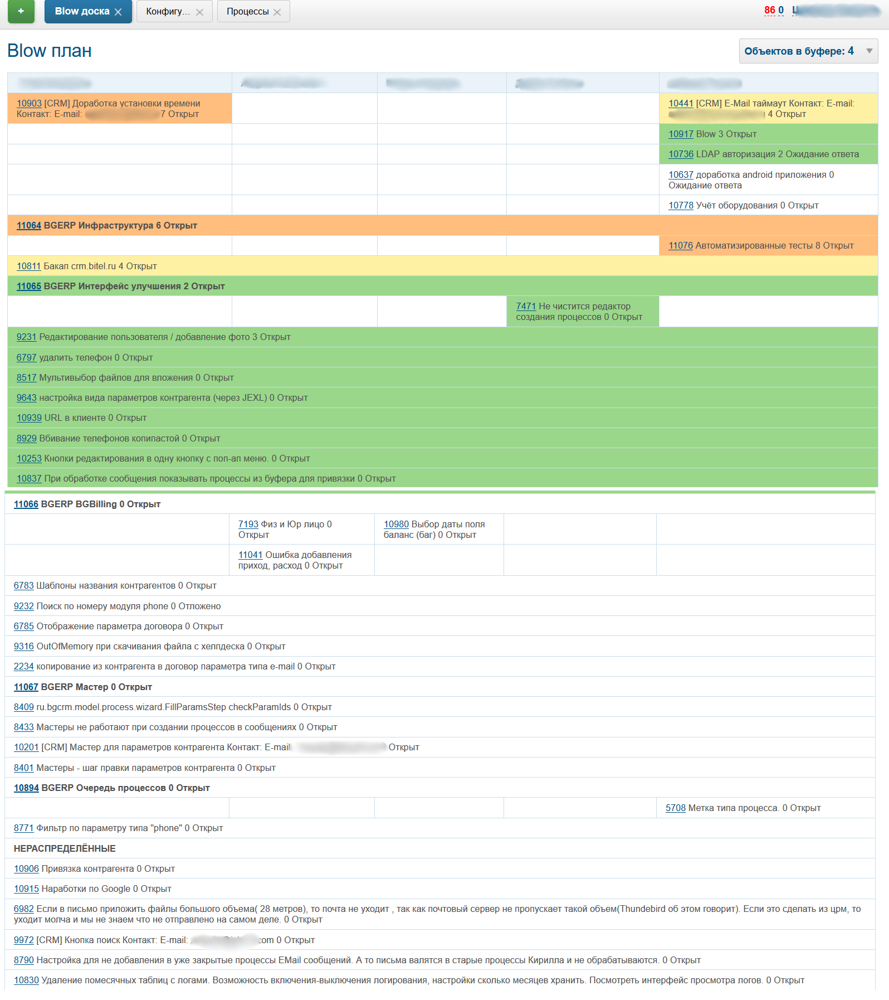
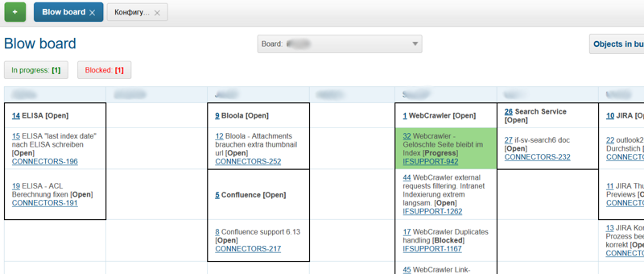

=  Плагин Blow
:toc:

Поддержка динамической ниспадающей модели управления проектами.

== О плагине
Плагин позволяет организовать долгосрочное планирование сложных проектов.
Он дополняет функционал очередей процессов, позволяющих работать только с текущим потоком одноранговых задач.

=== Известные проблемы
В браузерах отличных от Firefox некорректно отображаются границы групп по причине неверной подддержки CSS. 
 
[[setup]]
== Настройка
Все настройки из данного раздела размещаются в <<../../kernel/setup.adoc#config, конфигурации сервера>>.
Конфигурацию плагина рекомендуется сделать вложенной конфигурацией, включённой в основную.

Доска отображает данные, полученные из <<../../kernel/process/queue.adoc#, очереди процессов>>.
Очередь определяет типы процессов, выбираемые столбцы с дополнительной информацией 
и может быть использована для предварительного просмотра процессов из плана.
Сортировку плана производит сам плагин.

Sample of :
[source]
----
# filter for show only opened processes 
filter.1.type=openClose
filter.1.value=open
# optionally additional status filter
#filter.2.type=status
#filter.2.values=1,2,3

column.1.title=ID
column.1.value=id
# optional columns with additional columns, used at board
column.6.title=Telegram
column.6.value=param:20
column.7.title=Incoming messages
column.7.value=messageInCount
column.8.title=Unread incoming messages
column.8.value=messageInUnreadCount
column.9.title=Status changed
column.9.value=status_dt:dd.MM.yyyy
column.10.title=Tags
column.10.value=param:42
column.12.title=Customer
column.12.value=linkedCustomer:title
column.12.titleIfMore=100
----

The simplest board configuration requires only queue ID, as an example for queue ID *10*.
[source]
----
blow:board.1.title=Test
blow:board.1.queueId=10
----

В <<../../kernel/extension.adoc#jexl, JEXL>> процессор для вычисления текста ячейки помимо стандартных переменных и *process* 
передаются значения, выбранные в столбцах очереди процессов как переменные *colX*, где *X* - код столбца.

Example of showing additional information using additional columns from the queue before.
[source]
----
blow:board.1.title=BGERP
blow:board.1.queueId=4
blow:board.1.stringExpressionCell=<<END
     result = process.getDescription() + " [<b>" + ctxProcessStatusMap[process.getStatusId()];
     if (process.getProcessExecutorsWithRole(0).size() > 0) {
        result += " " + params.get("col9");
     } 
     result += "</b>]";
     
     telegramGroup = params.get("col6");
     if (telegramGroup)
          result += " <a target='_blank' href='https://t.me/" + telegramGroup + "'>@" + telegramGroup + "</a>";
     
     msgCnt = params.get("col7");
     if (msgCnt) {
         result += " " + msgCnt;
         unreadCnt = params.get("col8");
         if (unreadCnt)
            result += " (<b>" + unreadCnt + "</b>)";
     }

     tags = params.get("col10");
     if (tags) {
          result += " {" + tags + "}";
     }
     
     return result;
END
----

[[using]]
== Работа
Blow план отображает иерархию, порядок выполнения и исполнителей процессов.
Форма представления табличная, столбцы таблицы - исполнители либо группы решения. 
По вертикали в ячейках отображаются процессы: код со ссылкой на открытие и текст описания, сгенерированный JEXL выражением.

Все процессы представляются в виде дерева, связанного <<../../kernel/process/index.adoc#linked-process, типом связи>> *Порождён*.
Проект, подпроект, задача - всё представляется в виде процессов. 
Некоторые из процессов существуют длительное время, другие выполняются и закрываются.

Выбираемые для плана процессы должны быть открытыми (пустая дата завершения).

Исполнители и группы решения выбираются только в <<../../kernel/process/index.adoc#executor, роли>> *0 Выполнение*. 
Процесс, не назначенный ни на кого, либо назначенный на более одного исполнителя отображается на всю ширину таблицы.
Такие процессы считаются *не назначенными*. Если в процессе есть хоть один дочерний не назначенный процесс 
- родительский процесс также считается не назначенным.

Процессы на каждом уровне сортируются следующим образом:
[square]
* назначенные процессы;
* процессы с дочерними процессами, сортировка обратно приоритету;
* не назначенные процессы, сортировка обратно приоритету.

Отображаются только два уровня иерархии: контейнеры и дочерние процессы.
Возможно создание нескольких планов на разных уровнях, множественные предки.
Например, у задачи может быть процессы-предки *Компонент* и *Проект* одновременно, отображаемые на разных планах для разработчиков и PSO.
Процессы разделяются по различным планам с помощью фильтров по типам, группам в очереди процессов а также с использованеим <<../../kernel/setup.adoc#user-isolation, изоляции>>.

Процессы-контейнеры выделяются полужирным шрифтом.
В нижней области таблицы отображается виртуальный родительский процесс *НЕ РАСПРЕДЕЛЁННЫЕ*.
Ячейки с процессами можно перетаскивать мышью, изменяя предка.
Для преобразования процесса в независимый в качестве предка использовать *НЕ РАСПРЕДЕЛЁННЫЕ*, либо вызвать <<rc-menu, контекстное меню>>.
 
При наведении мыши на процесс выделяется он сам и все его дочерние процессы.

[[rc-menu]]
Правым кликом мыши по диаграмме вызывается контекстное меню, позволяющее:
[square]
* создавать процесс, идентичный выбранному: c таким же типом и в том же контейнерном процессе;
* вырезать и вставлять процессы;
* отделять процессы из контейнерных в независимые.

Основная идея Blow диаграммы состоит в постепенном всплывании процессов наверх с распределением их среди исполнителей.
Контейнерные процессы агрегируют свойства дочерних: бюджеты, затраченное время.
Процессы создаются и структурируются по исполнителям внизу и поднимаются вверх для исполнения.

== Фильтры
Фильтры представляют из себя программируемые кнопки, отображаемые над таблицей плана.
Каждая кнопка отображает сгенерированный скриптом текст и при клике по ней включает либо выключает подсветку процессов, подпадающих под фильтр.

Пример конфигурации фильтра по статусу *In progress [4]* для доски с кодом *1*:
[source]
----
blow:board.1.filter.1.color=green
blow:board.1.filter.1.stringExpression=<<END
     count = 0;
     for (item : items) {
          if (item.getProcess().getStatusId() =~ [4]) {
               count += 1;
               item.addFilterId(filter.getId());      
          }
     }
    return "In progress: <b>[" + count + "]</b>";
END
----

Пример вывода кнопки с общим количеством процессов для доски с кодом *1*:
[source]
----
blow:board.1.filter.1.color=#b2b02a
blow:board.1.filter.1.stringExpression=<<END
     return "Всего: <b>[" + items.size() + "]</b>";
END
----

== Открытый интерфейс
При добавлении в конфигурации плана параметра *openUrl* равным он станет доступным в <<../../kernel/interface.adoc#open, открытом интерфейсе>>
с адресом *../open/blow/<openUrl>*. Пример открытого link:http://crm.bitel.ru/open/blow/bgerp[плана] разработки BGERP.

== Дальнейшее развитие
[square]
* Отображение параметров: задач по исполнителям, оценочного и затраченного времени, бюджетов с суммированием по уровням.

