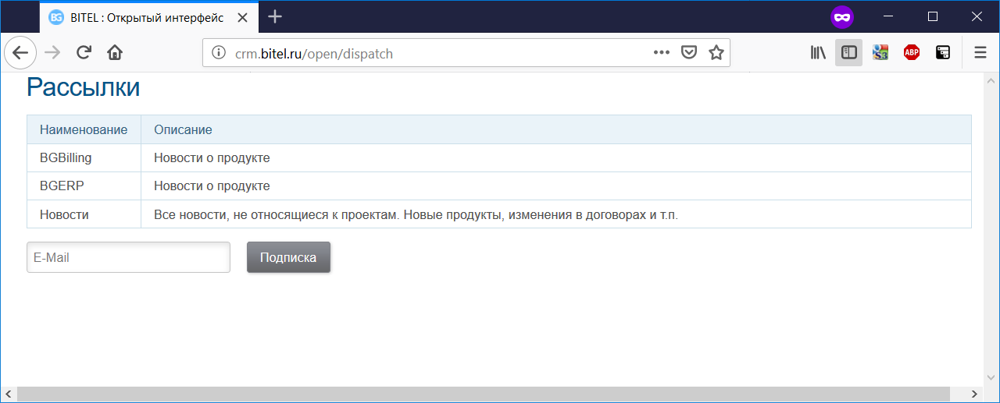

= Плагин Dispatch
:toc:

Плагин позволяет организовать рассылки, на которые пользователи могут подписываться в данный момент поддержаны только EMail рассылки. 
Управление подпиской производится клиентами через <<../../kernel/interface.adoc#open, открытый интерфейс>> системы, 
адрес оканчивается на *../open/dispatch*.

Управление предоставляет пользователю список рассылок и возможность подписки на них. 

== Конфигурация плагина
Для работы с рассылками необходимо настроить отдельный EMail адрес в <<../../kernel/setup.adoc#config, конфигурации сервера>>.

Пример настройки.
[source]
----
# рассылки
dispatch:manageEmail.email=dispatch@bitel.ru
dispatch:manageEmail.login=dispatch@bitel.ru
dispatch:manageEmail.host=imap.ufamail.ru
dispatch:manageEmail.pswd=*********
dispatch:manageEmail.mail.transport.protocol=smtp
dispatch:manageEmail.mail.smtp.host=smtp.ufamail.ru
dispatch:manageEmail.mail.smtp.user=dispatch@bitel.ru
dispatch:manageEmail.mail.smtp.pswd=*********
----

IMAP доступ необходим для обработки управляющих EMail команд, SMTP - для отправки писем.

Обработка с EMail команд на управление рассылками производится задачами *ru.bgcrm.plugin.dispatch.CommandProcessor* и *ru.bgcrm.plugin.dispatch.MessageSender*, 
периодический запуск которых необходимо настроить в <<../../kernel/setup.adoc#scheduler, планировщике>>.

Пример настройки:
[source]
----
scheduler.task.4.class=ru.bgcrm.plugin.dispatch.CommandProcessor
#
scheduler.task.5.class=ru.bgcrm.plugin.dispatch.MessageSender
scheduler.task.5.minutes=44
----

Управление перечнем рассылок производится оснастке *Пуск => Рассылки => Рассылки*. Для каждой рассылки отображается число подписчиков.

image::_res/dispatch_mailing.png[width="600px"]

Непосредственно отправка в оснастке *Пуск => Рассылки => Сообщения рассылок*.
