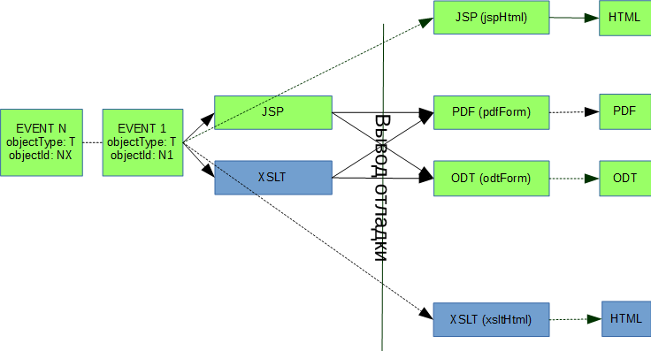

= Плагин Document
:toc:

Плагин предназначен для генерации и учёта печатных форм документов. 
Понятие "документ" здесь трактуется достаточно широко: так это может быть и HTML отчёт, генерируемый из очереди процессов.

== Механизм работы
Схематично принцип работы плагина изображён ниже. Синим цветом выделены блоки с использованием устаревшей XSLT технологии. 
Она поддержана в режиме обратной совместимости и более не документируется. 

Пояснения по схеме выше. На вход генератора подаётся одно либо несколько событий с идентификаторами объектов, 
для которых следует сгенерировать документ и требуемым шаблоном. Идентификатор объекта - это код контрагента, процесса и т.п. 
Одно событие - генерация документа непосредственно для объекта, блок событий - генерация, например, из очереди процессов.

Есть некоторая разница в генерации событий в зависимости от результирующего формата. 
При генерации HTML документа из многих объектов генерируется одно событие, т.к. HTML подразумевает единый корень документа. 
При генерации PDF генерируются несколько событий и результаты склеиваются. Генерация ODT/DOCX и прочих форматов для нескольких объектов невозможна.

IMPORTANT: Мы настоятельно *не* рекомендуем использовать PDF формы, они очень трудоёмки в сопровождении. Используйте HTML вместо них.

== Конфигурация
[[type-config]]
Для добавления генератора документа в конфигурации указывается запись вида:
[source]
----
document:pattern.<id>.title=<title>
document:pattern.<id>.scope=<scope>
# заменой этого класса своим возможно полностью переопределить логику генерации документов
document:pattern.<id>.script=ru.bgcrm.plugin.document.docgen.CommonDocumentGenerator
document:pattern.<id>.type=<type>
document:pattern.<id>.jsp=<jsp>
#
# необязательные параметры общие
document:pattern.<id>.result=<result>
#
# если результат не stream только - то имя сохраняемого документа
document:pattern.<id>.documentTitle=<doc_title>
document:pattern.<id>.titleRegexp=<title_pattern>
document:pattern.<id>.additionalParametersJsp=<additional_params_jsp>
#
# необязательный параметры для type=pdfForm/docxForm/odtForm
document:pattern.<id>.file=<file>
document:pattern.<id>.flattening=<flattening>
#
----
Где:
[square]
* *<id>* - уникальный числовой идентификатор типа документа;
* *<title>* - отображаемое наименование шаблона, необходимо только для шаблонов, которые можно выбрать;
* *<scope>* - тип сущности, для которой генерируется документ, см. далее;
* *<type>* - тип генерируемого документа, описание типом см. далее;
* *<jsp>* - путь к <<../../project.adoc#jsp, JSP>> шаблону, генерирующему HTML, либо подготавливающему данные для шаблонов;
* *<result>* - допустимые значения через запятую: *stream* - не сохранять сгенерированный документ и сразу выдать его клиенту, *save* - сохранить документ;
* *<doc_title>* - имя создаваемого документа;
* *<file>* - имя файла со шаблоном документа (PDF форма либо иной исходный документ для подстановки параметров) рекомендуется располагать в каталоге *BGERP/docpattern*;
* *<title_pattern>* - <<../../kernel/extension.adoc#regexp, REGEXP>> шаблон имени сущности, для которой будет предлагаться к генерации данный тип документа;
* *<additional_params_jsp>* - JSP файл с дополнительными параметрами для генерации документа;
* *<file>* - исходный документ, заполняемый данными;
* *<flattening>* - 1, для типа pdfForm, если сгенерированный PDF документ следует сделать нередактируемым.

Возможные значения параметра <scope>, для генерации документов объектов ядра:
[square]
* *processQueue* - шаблон используется для генерации <<../../kernel/process/queue.adoc#default-marked-processor, печатной формы в очереди процессов>>;
* *process* - шаблон для генерации печатной формы процесса, дополнительно вкладка "Документы" должна быть включена в <<../../kernel/process/index.adoc#type-config, конфигурации типа процесса>> следующим образом:
[source]
----
document:processShowDocuments=1
document:processCreateDocumentsAllowedTemplates=<коды шаблонов документов, доступных для генерации через запятую>
----

Также интеграцию с Document поддерживают следующие плагины, для них возможны свои значения параметра <scope>:
[square]
* <<../bgbilling/index.adoc#plugin-document, BGBilling>>

Поддерживаемые типы (параметр <type>):
[square]
* *pdfForm* - PDF форма, исходная форма получается из параметра <file>, поля формы заполняются из XML документа с параметрами, подготовленного с помощью JSP шаблона <jsp>;
* *docxForm* либо *odtForm* - .docx либо .odt файл с макросами вида *${macros}*, значения которых заменяются значениями из XML документа с параметрами, подготовленного с помощью JSP шаблона <jsp>;
* *jspHtml* - преобразование исходных данных в HTML с помощью JSP шаблона <jsp>.

NOTE: PDF формы можно подготовить с помощью Adobe Acrobat, Master PDF Editor или аналогичной программы.

При использовании типов docxForm либо odtForm производится замена в текстовых файлах *word/document.xml* и *content.xml* макросов на значения.

Файлы эти расположены внутри архивов, коими по сути являются файлы этих двух форматов. 
Для проверки корректности макросов можно переименовать .docx либо .odt файл в .zip, открыть архиватором и просмотреть указанные ранее файлы. 
Важно проконтролировать, чтобы макросы шли сплошными блоками и находились поиском в текстовом редакторе.

Возможны, например, такие варианты форматирования, макрос в этом случае корректно заменён не будет:
[source, xml]
----
<text:span text:style-name="T2">${cardNumber</text:span><text:span text:style-name="T3">}</text:span>
----

В этом случае макрос следует забить повторно и пересохранить документ, добившись примерно такого варианта:
[source, xml]
----
<text:span text:style-name="T2">${cardNumber}</text:span>
----

Пример настройки генерации HTML документа из карточки процесса (взят из <<samples, примеров>> *webapps/WEB-INF/jspf/user/plugin/document/template/example*).
[source]
----
document:pattern.101.title=Пример процесс HTML
document:pattern.101.scope=process
document:pattern.101.script=ru.bgcrm.plugin.document.docgen.CommonDocumentGenerator
document:pattern.101.type=jspHtml
document:pattern.101.jsp=/WEB-INF/jspf/user/plugin/document/template/example/process_html.jsp
document:pattern.101.documentTitle=document.html
document:pattern.101.result=stream,save
----

IMPORTANT: Пользовательские JSP документов располагать располагать в каталоге *WEB-INF/custom/plugin/document/*.

При использовании не HTML результирующего формата вывод JSP шаблона используется только в режиме отладки (см. далее). 
Для заполнения полей в JSP шаблон передаётся объект *field*, методом *set* которого можно установить значения именованных параметров.
[[debug]]
Установленные промежуточные данные возможно просмотреть в режиме отладки. 
Режим отладки запускается при генерации документа с зажатой клавишей *Alt* в режиме без сохранения на диск. Отладка выводится в отдельном окне.

image::_res/debug.png[]

Режим отладки имеет смысл для типов шаблонов, где результирующим документом выступает не HTML. 
Он предоставляет возможность изучить вывод JSP шаблона с отладочной информацией  и подготовленные им поля. 
Для шаблонов, генерирующих HTML отладка возможна сразу в результирующий документ.

Плагин может быть использован для <<../../kernel/process/queue.adoc#default-marked-processor, генерации отчётов в очереди процессов>>. 
Для запуска режима отладки в этом случае клавиша *Alt* должна быть зажата в момент выбора пункта обработчика в меню *Ещё*.

== Интерфейс пользователя
В интерфейсе пользователя функционал плагина доступен на вкладках *Документы* различных сущностей. 
В таблице отображаются привязанные к объекту документы. 
Возможно удаление ранее привязанных документов, их открытие.

image::_res/documents_tab.png[]

В выпадающем списке выводятся настроенные для данного типа сущности шаблоны документов. 
Далее кнопки генерации документа с сохранением и без (настраиваются с помощью *result* параметра в конфигурации шаблона). 
Кнопка *+?* позволяет загружать произвольные файлы.

При удержании нажатой клавиши *Alt* в момент генерации документа без сохранения запускается <<debug, режим отладки>>.

[[samples]]
== Примеры
С системой поставляется набор примеров генерации различных видов документов. 
Примеры JSP файлов с инструкциями по их настройке в комментариях расположены в каталоге *webapps/WEB-INF/jspf/user/plugin/document/template/example*.

<<samples.adoc#, Дополнительные примеры>>.