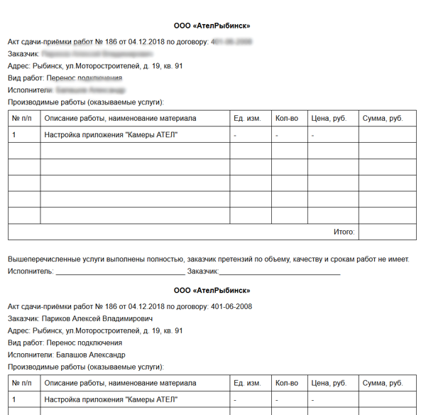

= Примеры шаблонов плагина Document
:toc:

[[act-and-order]]
== Акт и заказ
Система шаблонов для генерации в очереди процессов акта и заявки.
Подставляются данные из процесса, текущий исполнитель, из привязанного договора.
Автоматически вставляются разрывы страниц для печати.

Внешний вид акта:

Внешний вид заявок:

image::_res/sample_act_order/order.png[]

Шаблоны для размещения в  */WEB-INF/custom/plugin/document/*:
[square]
* link:_res/sample_act_order/act.jsp[act.jsp] - основной шаблон акта;
* link:_res/sample_act_order/act_include.jsp[act_include.jsp] - инклуд с таблицей акта;
* link:_res/sample_act_order/order.jsp[order.jsp] - основной шаблон заявки;
* link:_res/sample_act_order/head.jsp[head.jsp] - инклуд с определениями различных переменных, стилями и заголовками, используется в обоих шаблонах.

Пример <<index.adoc#setup, настройки>> в конфигурации:
[source]
----
# печать актов
document:pattern.21.scope=processQueue
document:pattern.21.script=ru.bgcrm.plugin.document.docgen.CommonDocumentGenerator
document:pattern.21.type=jspHtml
document:pattern.21.jsp=/WEB-INF/custom/plugin/document/act.jsp

# печать заявок
document:pattern.22.scope=processQueue
document:pattern.22.script=ru.bgcrm.plugin.document.docgen.CommonDocumentGenerator
document:pattern.22.type=jspHtml
document:pattern.22.jsp=/WEB-INF/custom/plugin/document/order.jsp
----

и в <<../../kernel/process/queue.adoc#processor-default-marked, очереди>> процессов:
[source]
----
# печать актов
processor.5.title=Печать актов
processor.5.class=DefaultMarkedProcessor
processor.5.commands=print:21
processor.5.responseType=file

# печать заявок
processor.6.title=Печать заявок
processor.6.class=DefaultMarkedProcessor
processor.6.commands=print:22
processor.6.responseType=file
----

В меню *Ещё* очереди должны появиться пункты *Печать актов* и *Печать заявок*, вызывающие шаблоны.

[[act]]
== Акт
Шаблон печатной формы (содержимое файла */WEB-INF/custom/plugin/document/akt.jsp*)
[source, jsp]
----
<%@ page contentType="text/html; charset=UTF-8"%>
<%@ include file="/WEB-INF/jspf/taglibs.jsp"%>

<u:newInstance var="processDao" clazz="ru.bgcrm.dao.process.ProcessDAO">
    <u:param value="${conSlave}"/>
</u:newInstance>

<u:newInstance var="paramDao" clazz="ru.bgcrm.dao.ParamValueDAO">
        <u:param value="${conSlave}"/>
</u:newInstance>

<c:set var="processId" value="${event.objectId}"/>

<html>
        <head>
                <link rel="stylesheet" type="text/css" href="/css/style.css.jsp"/>
                <meta content="text/html; charset=UTF-8" http-equiv="content-type">
        </head>
        <body>
            

                    Список актов процессв ВЫЗОВ ТЕХНИКА
            

            

            <table class="data">
        <tr><td>&nbsp;</td></tr>
    <c:forEach var="processId" items="${event.getObjectIds()}">
        <c:set var="process" value="${processDao.getProcess(processId)}"/>

        <tr>
        <td><b><u><i>№ ${processId}</u></i></b> &nbsp;&nbsp;&nbsp;&nbsp;
                Исполнитель: <b> ${u:objectTitleList(ctxUserList, process.getExecutorIds())} </b>&nbsp;
                Дата:<b>${paramDao.getParamDate(processId, 71)}</b></td>
    </tr>
    <tr>        <td><u><i>Абонент:</i></u>      ${paramDao.getParamText(processId, 47)}
                <i><u>Адрес:</i></u>
                <c:forEach var="addr" items="${paramDao.getParamAddress(processId, 25).values()}" varStatus="status">
                    ${addr.value}
                </c:forEach>
                <u><i>Телефоны:</i></u>
                ${paramDao.getParamText(processId, 46)},&nbsp;
                ${paramDao.getParamText(processId, 61)},&nbsp;
                ${paramDao.getParamText(processId, 62)}
              </td>
             </tr>
             <tr>
              <td colspan=2>
                ${paramDao.getParamText(processId, 73)},&nbsp;
                ${u:toString(paramDao.getParamListWithTitles(processId, 70))}&nbsp;
                ${u:toString(paramDao.getParamListWithTitles(processId, 76))}
                 
                ${process.getDescription()}
              </td>
              </tr>
		</c:forEach>
    </table>
    

        </body>
</html>
----

В коде ID параметров подставлены напрямую в местах их использования в коде. Для удобства чтения можно свести эти значения в переменные:
[source]
----
<c:set var="PROCESS_PARAM_ADDRESS" value="25"/>
----
и в соответствующих местах их использовать:
[source]
----
<c:forEach var="addr" items="${paramDao.getParamAddress(processId, PROCESS_PARAM_ADDRESS).values()}" varStatus="status">
----
Вывод параметра типа phone:
[source]
----
Телефон: ${paramDao.getParamPhone(processId, 20).getValue()}
----
