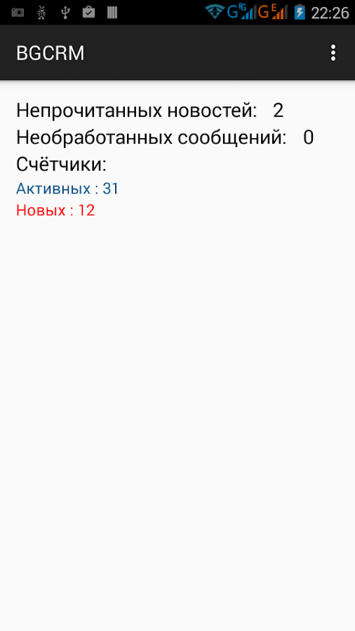
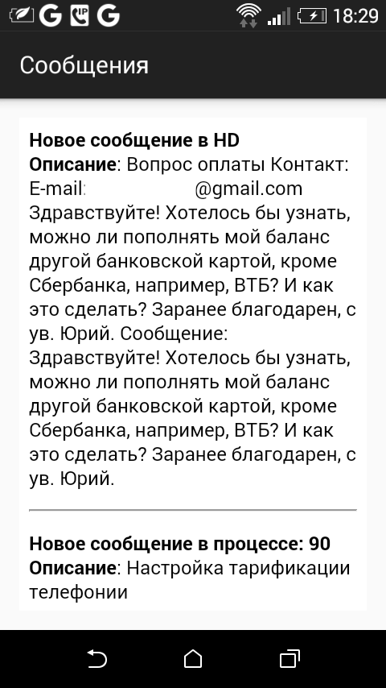
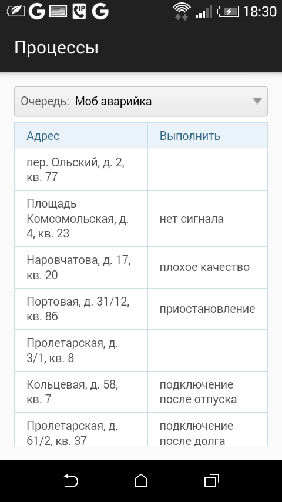

= Plugin Mobile
:toc:

Плагин предоставляет возможность интеграции системы с мобильным приложением
link:https://play.google.com/store/apps/details?id=ru.bgcrm[BGERP] для платформы Android.

[[about]]
== About
Current functionality is:
[square]
* вывод текущего количества непрочитанных новостей и необработанных сообщений;
* вывод счётчиков из очередей процессов, вынесенных пользователем на панель задач BGERP;
* получение Push сообщений из системы BGERP, хранение истории сообщений;
* отображение <<../../kernel/interface.adoc#mobile, мобильных очередей процессов>>.

Мобильное приложение производит обмен данными только непосредственно с серверами BGERP клиентов.
Централизовано только хранение реестра этих серверов, доступного для выбора пользователя.

drawio:_res/data_flow.drawio[]

[[setup]]
== Setup
Обращение к серверу BGERP происходит через <<../../kernel/interface.adoc#, открытый и мобильные интерфейсы>>.
Необходимо убедиться, что они доступны из внешней сети.
В качестве тестового URL можно использовать, например: *<HOST>/open/plugin/mobile/auth.do* В ответ сервер должен ответить JSON документом.

Для добавления сервера в список доступных в приложении необходимо написать в link:https://team.bgerp.org/open/process/12387[процесс] сообщение
с указанием вашего адреса открытого интерфейса BGERP.
В ответ предоставляется уникальный ключ сервера. Его требуется указать в конфигурации сервера:

----
mobile:serverId=<ваш ключ>
----

Your server may be visible in servers list or added as hidden and available only by ID.

image::_res/mobile_login.png[width="300"]

Для авторизации может быть использован логин и пароль любого пользователя.

[[setup-process-type]]
=== Process Type
Пользователю BGERP с установленным мобильным клиентом возможна отправка сообщений с помощью скрипта в
doExpression <<../../kernel/process/processing.adoc#, простого обработчика событий>> возможна отправка сообщений.

----
onProcessEvent.1.events=statusChanged
onProcessEvent.1.doExpression=<<END
    text = process.getDescription();
    mobile.sendMessageToExecutors("Изменился статус процесса, в котором вы исполнитель", text);
END
#
onProcessEvent.2.events=messageAdded
onProcessEvent.2.doExpression=<<END
    text ="<b>Описание</b>: " + process.getDescription() + " Сообщение: " + event.getMessage().getText();
    mobile.sendMessageToExecutors("Новое сообщение в процессе, в котором вы исполнитель", text);
END
----

Объект mobile класса  javadoc:ru.bgcrm.plugin.mobile.ExpressionObject[] с функциями API предоставляется плагином.

//TODO: Скрин с сообщениями и очередью процессов.

[[usage]]
== Usage

Счётчики процессов, выводимые в статусе и их цвета идентичны определённым для отображения на панели задач BGERP.

<<setup-process-type, Сообщение>> приходят как PUSH уведомления и доступны к просмотру после в мобильном приложении.

Так же есть возможность отображать мобильную очередь процессов.

