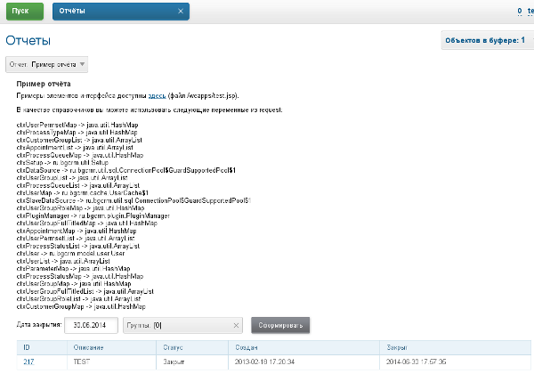
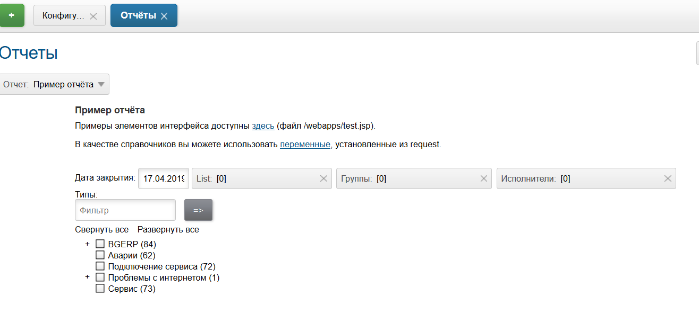

= Plugin Report
:toc:

[[about]]
== About
The actual version of the plugin contains built-it reports, available after plugin's activation in menu *Reports*.
These reports may be defined int the plugin itself for kernel data or in other plugins.

Reports are implemented with unified <<../../project/index.adoc#mvc, Action MVC API>>.
Each report extends Java class javadoc:org.bgerp.plugin.report.action.ReportActionBase[].
Source codes of existing reports may be used as examples for development of new.

NOTE: Previously supported so named <<jsp, JSP Reports>> have to be converted to action reports either in system or <<../../kernel/extension.adoc#custom, custom>> code.

[[dev]]
== Development
As an report example you can have a look on the following files which together make built-it *Processes* report:
[square]
* link:../../../../src/org/bgerp/plugin/report/Plugin.java[org.bgerp.plugin.report.Plugin]
* link:../../../../src/org/bgerp/plugin/report/action/ReportProcessAction.java[org.bgerp.plugin.report.action.ReportProcessAction]
* link:../../../../webapps/WEB-INF/jspf/user/plugin/report/report/process.jsp[webapps/WEB-INF/jspf/user/plugin/report/report/process.jsp]

The relationships between the different parts of report are shown in the diagram below.

drawio:_res/report_mvc.drawio[]

[[jsp]]
== JSP отчёты
WARNING: Устаревшие JSP отчёты отображаются в отдельном подменю и должны быть первоначально перенесены в <<../../kernel/extension.adoc#custom, Custom>> репозитарий в существующем виде, а позже переписаны на Java.

Для примера рассмотрим следующую конфигурацию.
[source]
----
report:report.1.title=ТП - Отчет по процессам
report:report.1.jspFile=/WEB-INF/custom/plugin/report/custom_tp_queries_report.jsp
----

Она должна быть изменена таким образом.
[source]
----
report:report.1.title=ТП - Отчет по процессам
report:report.1.jspFile=/WEB-INF/jspf/user/plugin/custom.smartkom/report/old/custom_tp_queries_report.jsp
----

А соответствующие файлы link:https://github.com/arj57/bgerp-custom-smartkom/tree/master/webapps/WEB-INF/jspf/user/plugin/custom.smartkom/report/old[перенесены] во вновь созданный Custom репозитарий.

// TODO: Ссылка на Custom Смарткома.

[[dev]]
== Development
As an report example you can have a look on the following files which together make built-it *Processes* report:
[square]
* link:../../../../src/org/bgerp/plugin/report/Plugin.java[org.bgerp.plugin.report.Plugin]
* link:../../../../src/org/bgerp/plugin/report/action/ReportProcessAction.java[org.bgerp.plugin.report.action.ReportProcessAction]
* link:../../../../webapps/WEB-INF/jspf/user/plugin/report/report/process.jsp[webapps/WEB-INF/jspf/user/plugin/report/report/process.jsp]

The relationships between the different parts of report are shown in the diagram below.

drawio:_res/report_mvc.drawio[]

////
Плагин предназначен для разработки отчётов в HTML формате с гибкими фильтрами.
Логика отчёта реализуется с помощью обычных либо <<../../kernel/extension.adoc#dyn, динамических>> Java классов, отображение - <<../../project/index.adoc#jsp, JSP>> шаблоном.
Возможна разработка отчётов, где и логика выборки помещена в JSP шаблон, так называемые *JSP отчёты*.
Данный подход обладает следующими недостатками:
[square]
* работа с БД удобнее и стандартнее выполняется в Java коде;
* невозможно реализация выгрузки данных в различные форматы;
* смешивание слоёв логики и представления усложняют сопровождение.

[[config]]
== Конфигурация
Отчёты настраиваются в <<../../kernel/setup.adoc#config, конфигурации>>, желательно создать отдельную включаемую под отчёты.
Для каждого отчёта добавляется запись вида:
[source]
----
report:report.<id>.title=<title>
report:report.<id>.daoClass=<daoClass>
----

Либо для JSP отчёта:
[source]
----
report:report.<id>.title=<title>
report:report.<id>.jspFile=<jspFile>
----

Где:
[square]
* *<id>* - числовая идентификатор отчёта;
* *<daoClass>* - обычный либо динамический Java класс, расширяющий
* *<jspFile>* - путь к JSP шаблону, генерирующему отчёт, расположенный в каталоге *WEB-INF/custom/plugin/report/*.

=== Стандартные отчёты
С программой поставляются встроенные отчёты, конфигурация:
[source]
----
report:report.100.title=Процессы
report:report.100.daoClass=ru.bgcrm.plugin.report.dao.ProcessReportDAO
----

Их исходный код может использоваться в качестве примера.

== Оснастка "Отчеты"
В оснастке отображаются все сконфигурированные в системе отчёты.

[[samples]]
== Примеры JSP отчётов
Числовые коды отчётов в конфигурациях примеров даны случайно и в реальной системе могут быть любыми.

=== Пример отчёта
Поставляется с системой для изучения. Отчёт выводит список процессов с различными фильтрами.
В теле отчёта приведена ссылка на JSP страницу с доступными элементами ввода и выведен список справочников.

Конфигурация:
[source]
----
report:report.1.title=Пример отчёта
report:report.1.jspFile=/WEB-INF/custom/plugin/report/example.jsp
----

=== Пример отчёта BGBilling
Поставляется с системой для изучения. Осуществляет прямую работу с базой биллинга.
Необходимое дополнительное конфигурирование описано в файле *example_bgbilling.jsp*

Конфигурация:
[source]
----
report:report.2.title=Пример отчёта BGBilling
report:report.2.jspFile=/WEB-INF/custom/plugin/report/example_bgbilling.jsp
----

=== Смены ЦУС
Конфигурация:
[source]
----
report:report.3.title=Отчёт ЦУС по сменам
report:report.3.jspFile=/WEB-INF/custom/plugin/report/ncc_smena.jsp
----

link:_res/ncc_smena.jsp[JSP файл]

=== Должники BGBilling
Выводит должников из базы BGBilling.

image::_res/image_debtors.png[]

Конфигурация:
[source]
----
report:report.4.title=Отчет по должникам
report:report.4.jspFile=/WEB-INF/custom/plugin/report/debtors.jsp
----

В JSP необходима дополнительная конфигурация.
link:_res/debtors.jsp[JSP файл]

В дин. коде установите корректные значения полей billingId, adressParamId, nameParamId и cityId.
link:_res/ReportCustomDebtors.java[Dyn файл]
////