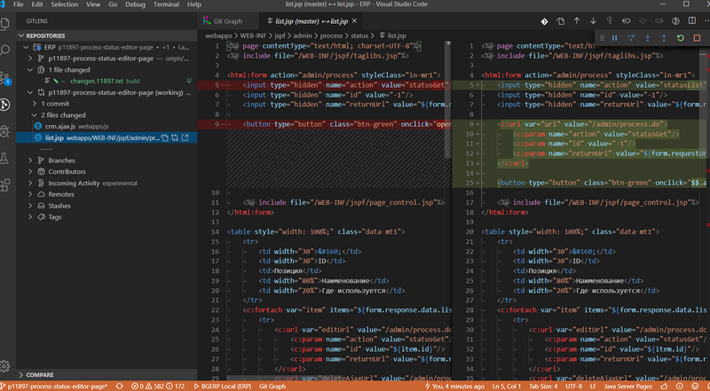
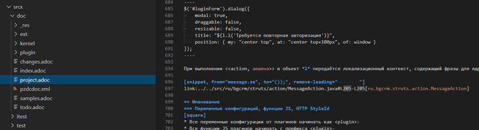
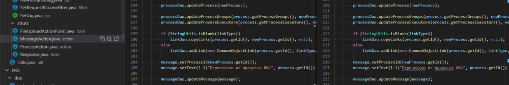

= Development
:toc:
:toclevels: 4

BGERP is quite a large and complex project. It was created by a team consisting of ordinary humans, who may be imperfect and make
mistakes but try to learn continuously. This is a trial and error process, fortunately or not.

This article provides some recommendations collected during the learning process - these are accompanied by a very small amount of <<samples, code>>
for exactly the same reason. Said that, you have to follow those recommendations using *The Boy Scout Rule*.

IMPORTANT: Always leave the campground cleaner than you found it.

While changing a block of code, it is important to try to decrease the usage of outdated approaches, methods and classes.
Write a new code and keep it compliant with the latest recommendations, but at the same time try to get neighboring/adjacent code improved.
During <<workflow, changes>> testing, code improvements will be tested as well.
All in all, gradually, we will improve overall code quality.
We plan to introduce a set of formal code quality metrics: number of compiler warnings, format checks, etc.

[[lang]]
== Languages
The project currently undergoes a migration process from Russian language to an international one (English).
All the software documentation, including this article, and all log messages will be converted to English.
Information shown to the end-user via interface has to be <<l10n, localized>>.

[[project]]
== Project
=== Development environment
The program can be developed on any Java-supported platform:
[square]
* Windows - currently used by the maintainer;
* Linux;
* MacOS.

Minimal required set of software:
[square]
* <<kernel/install.adoc#java, OpenJDK>>;
* <<kernel/install.adoc#mysql, MySQL>>;
* <<eclipse, IDE Eclipse>>.

[[env-console]]
==== Bash for Windows
NOTE: Skip this chapter when using *NIX OS.

Console link:https://git-scm.com/download/win[client] for version control system <<workflow, GIT>>.

System of <<build, build and publish>> is written on Bash scripts and uses GNU utilities, you can use the following when using Windows:
[square]
* link:https://www.windowscentral.com/install-windows-subsystem-linux-windows-10[WSL] - embedded in Windows virtual Linux machine, tested/approved;
* link:https://www.omgubuntu.co.uk/how-to-install-wsl2-on-windows-10[WSL 2] - the new version of it, not tested yet;
* link:https://www.cygwin.com/[Cygwin] - Windows ports of GNU utils, not tested.

The best console emulator on Windows with embedded FAR Manager - link:https://conemu.github.io/[ConEmu].

=== Format
IDE or editor must be configured for displaying whitespace symbols.

image::_res/ide_format.png[width='600px']

The projects mostly follow recommended formatting rules for each of programming languages they use.
Intention:
[square]
* 4 whitespaces - Java;
* 2 whitespaces - SQL <<db, scripts>>;
* tabs - all the rest.

However because of historical reasons many files have been formatted in a wrong way, and have to be carefully fixed.
Screenshot above shows an example of a Java file still using tabs.

When working on fixing a file format, it is important to use the following rules:
[arabic]
. All new files should be formatted correctly.
. Avoid using both indent symbols (tabs and spaces) inside a single file! Such file becomes unreadable in certain editors. If you notice a file/case like this,
make sure to change all indent symbols in the file to the required format.
. Be cautious when combining file formatting with making <<workflow, changes>> - this can significantly complicate analysis down the road.

[[format-java]]
==== Java
Jave code formatting should be *Java Conventions*-compliant, with the following additional changes (Eclipse formatter settings shown below)

Use settings in  *Windows - Preferences - Java - Code style - Formatter*.
Open a standard formatter and save it under a different name after changing the following parameters:
[square]
* *Indentation - Tab policy* - *Spaces only*
* *Indentation* - *Tab size* - *4*
* *Line Wrapping* - *Maximum line width*  - *150*

*Window - Preferences - Java - Code style - Organize Imports* - put 99 and 1 in the respective fields.

Example/resulting Eclipse formatter file: link:../../.vscode/formatter.xml[formatter.xml]

[[eclipse]]
=== Eclipse
Currently one of the most handy platforms.
Download *Eclipse for Java EE Developers*, as this build already includes GIT client as well as JSP and XML editors.
Install the following plugins:
[square]
* *Buildship Gradle* - <<build, Gradle>> support;
* *AsciiDoctor* -  <<documentation, documentation>> editor;
* *MoreUnit* - convenient plugin to work with <<unit-test, unit-tests>>.

Right-click on the project and invoke *Refresh Gradle Project* menu item.
Also use it every time you change any of the project's libraries.

*Window - Preferences - General - Editors - Text Editors* - set a *Show whitespace characters* checkbox

*Window - Preferences - Team - Git - History* remove  *Relative history* checkbox

Import <<format-java, Java formatter>> via *Window - Preferences - Java - Codestyle - Formatter*.

=== VS Code
A bit faster than Eclipse, has better JavaScript and Gradle support.

Drawbacks:
[square]
* JSP support is nearly absent;
* external GIT client is required.

Visit link:../../.vscode/readme.txt[open] and navigate to `.vscode` catalog in project's DB_USER in order to get some configuration examples.
Jave formatter and space symbols indicators have been already enabled there.

[[ide-run]]
=== Running in IDE
Configuration:
[square]
* Main class: ru.bgerp.Server
* Program arguments: start
* VM arguments: -Dbgerp.setup.data=bgerp_test
* Classpath: click on *User entries - Advanced - Add folders* and add project's current folder.

Copy `bgerp.properties` to `bgerp_test.propertes`, replace *GENERATED_PASSWORD* with some random value, possibly using `pwgen` or similar utility.

==== Database
MySQL server may be running on any supported platform, check <<kernel/install.adoc#mysql, configuration>> of it.

For database creation use the following files sequentially:
[square]
* `db_create.sql`, `db_init.sql` from link:https://bgerp.org/download/3.0/bgerp.zip[bgerp.zip] - initial structure;
* `bgerp.sql` from link:https://demo.bgerp.org/bgerp.sql[bgerp.sql] - data after running of <<integration-test, integration test>>.

Replace *GENERATED_PASSWORD* in `db_create.sql` with the value from `bgerp_test.properties` but *surrounded by commas*.

Execute the following mysql commands:
[source, bash]
----
mysql --default-character-set=utf8 -uDB_USER -p < db_create.sql
mysql --default-character-set=utf8 -ubgerp -p < db_init.sql
mysql --default-character-set=utf8 -ubgerp -p bgerp < bgerp.sql
----

For <<db, DB update>> on each start in `.properties` must be set <<kernel/setup.adoc#config-on-start, option>>:
[source]
----
runOnStart+=,ru.bgcrm.util.distr.DevDbUpdater
----

[[log4j]]
==== Logging
By default,  a running in IDE application uses <<kernel/extension.adoc#log4j, logging configuration>> from `src/log4j.properties`.
In order to adjust it, copy the file to the project DB_USER (will not be handled by GIT) and make required changes.

[[structure]]
=== Files
Project's folder listing along with decription.
[square]
* *bin* - IDE-compiled Java classes;
* *build* - files related to <<build, build>>;
* *docpattern* - <<plugin/document/index.adoc#, Document>> plugin templates ;
* *dyn* - <<kernel/extension.adoc#dyn, dynamic code>>, with examples;
* *dyn.ext* - this folder can be used to mount dynamic classes on <<devm, developer's system>>;
* *filestorage* - file storage when launched from IDE;
* *lib* - Java libraries, which are not linked via <<java-lib, Gradle>>;
* *plugin* - <<plugin, plugin>> declarations;
* *src* - Java source code;
* *srcx* - <<documentation, documentation>>, <<unit-test, unit-tests>>, <<integration-test, integration tests>>, build utilities sources;
* *webapps* -  <<js-lib, Web application>> DB_USER;
* *work* - folder created by Tomcat for JSP file compilation.

==== Libraries
[[java-lib]]
===== Java
When link:../../build/bgerp/files/erp.sh[running] a program, a number of JAR files are linked from the following folders:
[square]
* *lib/app* - <<build-erp, application classes>>;
* *lib/ext* - external libraries;
* *lib/custom* - additional libraries required for <<kernel/extension.adoc#dyn, dynamic code>> and JEXL scripts.

External libraries are supplied with a separate <<build-update, build update>>.
Artifacts and versions are indicated in the following file: link:../../build.gradle[build.gradle] (for *bgerp* configuration)

IMPORTANT: This configuration does NOT use transitive dependencies  - all required libraries and versions have to be explicitly defined.
We would suggest to gradually add a small set of libraries until getting a "workable" application - this will allow to decrease build's size and simplify further support and troubleshooting.

In order to speed up project initialization, our default Eclipse IDE configuration does not load source code and documentation.
[snippet, from="ec", to="}"]
link:../../build.gradle#L18-L24[build.gradle]

[[js-lib]]
===== JS
JS libraries are located in the following folders:
[square]
* `webapps/js` - application's JS files: kernel's and <<plugin, plugins'>>;
* `webapps/lib` - external libraries.

Non-minified libraries are used in order to simplify debugging.

Some of the external libraries have been patched and all changes are accompanied by relevant comments, for example:
[snippet, from="con", to=");", remove-leading="		"]
link:../../webapps/lib/jquery-ui-1.12.1/jquery-ui.js#L8923-L8930[webapps/lib/jquery-ui-1.12.1/jquery-ui.js]

[[devm]]
=== Client's development methodology

BGERP launches within IDE, gets connected to the database and, optinally, billing.
At the end of the development/work session remote client database will have all the actual information, so it is only required to update the product itself.

[square]
* Use SSH to connect to the client, utilize port-forwarding in order to connect to the database and, optionally, billing.
Example: *ssh user@X.X.X.X -L3307:127.0.0.1:3306 -L8081:Y.Y.Y.Y:8080*
* Create your own *bgerp_customer.properties* file - you can use it to keep your configuration and access parameters. This file does not get pushed to GIT.
You can also use this file to alter billing connection URL - for example, to a localhost.
* Reconfigure BGERP port so you could save passwords in your browser for specific client(s).
* Create IDE launch configuration using this properties file
* Optionally, alter *.gitignore* in order to save custom client's files in case you are using fork.

[[workflow]]
== GIT Workflow
Table below describes GIT branches - link:https://docs.google.com/document/d/15NptRsx1qrdiWEew23EFz6gbxD6S12VQpnBQ6X9NbiQ/edit?usp=sharing[standard GIT Workflow] is used here.
Same workflow is used, for example, for Linux kernel development.

Main idea is that merging is only happening 'downstream', i.e. from the main branch to secondary branches, in order to get to the actual state.
Main branch has linear structure as all changes are incorporated via 'patches'.
Secondary branches can be then deleted, as all the aggregated information from secondary branches will be present in the main branch.

[cols="a,a,a,a", options="header"]
|===
|Branch
|Based On
|Purpose
|<<gitlab-ci, CI>>

|*master*
|
|Stable release.
|<<test-integration>>, <<publish-source>>

|*p<Process ID>-short-description*
|master
|Release and documentation changes.
|<<test-unit-and-doc>>

|*p11862-documentation*
|master
|Documentation changes. <<longlife-branch, Long-live branch>>, periodically gets incorporated into main.
|<<publish-doc>>

|*documentation-change-request*
|p11862-documentation
|Documentation changes proposals, can be merged back to p11862-documentation.
|<<test-unit-and-doc>>
|===

*master* is a main project branch and is used for <<build, builds>>.
[square]
* Each *change* should be based on the process within BGERP, which is used for all information exchange for a given *change*.
* *Change ID* is a *p<Process ID>* string, for example *p13455*
* For each change create a separate GIT branch (based on master). Branch's name should start from *Change ID*, then use "-" as delimiters.
Example: *p11788-link-filter-title*
* When developing, you can use any commit strategy within a branch: checkpoint commits, reverts/resets, commits to a new branch, etc.
We would recommend to push intermediate commits, using GIT repository as a backup copy.
* Main branch can be periodically merged to this "change" branch in order to synchronize with the actual state. *This HAS to be done before the 'merge --squash' to master*
* All the necessary  <<documentation, documentation>> changes are done simultaneously with the code changes
* Client's test build update and accompanying documentation can be <<build-update, built and published>> from the branch.
* Branch has to add *build/change.<Process ID>.txt* file - if absent, it gets added automatically during <<build-update, update build>>
This file has to describe new functions, fixes or other changes - each item on a separate row.
Format is identical to *changes.txt*, which accumulates all *build/change.<Process ID>.txt* information when <<build-erp, update>> gets published.
* Request branch *merge --squash* to master once client-side development and testing completes for a given change by moving BGERP process into *Acceptance* status.
* Process gets closed after check/acceptance, and change gets merged to master as a single commit with a comment starting with the change ID.
* "Change" branch can be then deleted. Change author can be later identified by the change ID used in the comment.

[IMPORTANT]
====
One cannot test and use in parallel several changes  within a single system.
Each change will overwrite the previous one when update gets installed.
In principle it is allowed to use multiple build branches, which are used as targets for multiple change branches' merges.
====

=== GIT Configuration
`$USER_HOME\.gitconfig` example configuration:
[source]
----
[user]
	email = shamil@company.com
	name = Shamil Vakhitov
[credential]
	helper = store
[core]
	autocrlf = false
	fileMode = false
[pull]
	rebase = true
----

NOTE:

=== GIT Commands
Clean all links to non-existent/deleted branches:
[source]
----
git remote prune origin
----

Fetch master branch and update remote-tracking branch origin/master:
[source]
----
git fetch origin master:master
----

[[accept]]
=== Acceptance and merge --squash
When change is accepted, 'change' branch is compared with the master - so merge master to the 'change' branch before committing a change.

[[change-file]]
It is also important to create and populate a file listing all changes.
You can use the following <<build, command>> for this:

[bash]
----
bash -c "./gradlew touchChanges"
----

GIT commands to be used for merging change from *pXXXXX-short-change-description* branch to master:
[source, bash]
----
git checkout pXXXXX-short-change-description && git pull
git commit --allow-empty -m "MERGED" && git push
git checkout master && git pull
git merge --squash pXXXXX-short-change-description
----

Commit with current GIT user.
[source, bash]
----
git commit -am "pXXXXX Some change description."
----

Or for preserving the author in GitHub. Mapping internal to external mails is available in file `.gitlab-ci-publish-author.sh`
[source, bash]
----
git commit -am "pXXXXX Some change description." --author="Developer Name <internal@gitlab.email>"
----

And finally, push.
[source, bash]
----
git push
----

<<build-erp, Update is published>> periodically from the main branch.

[[longlife-branch]]
=== Long-lived branches
Long-lived branches only get changes which *are not altering product functionality*, for example: localization and documentation fixes, code formatting, tests.
BGERP process for a change does not get closed , and <<accept, merge --squash>> is performed multiple times upon completion of specific change(s)

[[documentation]]
==== Documentation
A particular case of long-lived branch is documentation.
The source AsciiDoctor and resource files are placed in `srcx/doc` directory.
Publication of the product manual <<publish-doc, runs>> automcatically from <<workflow, branch>> *p11862-documentation*.

Documentation might be <<build-doc, built>> also locally from any branch and together with a <<build-update, change update package>>.

Documentation changes are recommended to be done at the end of <<workflow, branch development>>,
using <<change-file, change file>> as an intermediate notes. The samples of documentation's format may be found <<samples.adoc#, here>>.

Due the strict references and snippets checking, it is quite possible to have broken <<test-unit-and-doc, state>> of documentation
even without .adoc files. Something like the following:
[source]
----
2020-05-25 12:17:39,149 INFO DocGenerator [main] Processing: srcx/doc/project.adoc
2020-05-25 12:17:39,844 ERROR Snippet [main] Snippet '../../src/ru/bgcrm/struts/action/MessageAction.java' doesn't start from: 'message.se', line number: 205, content: newProcess.setDescription(message.getSubject());
2020-05-25 12:17:39,855 ERROR Snippet [main] Snippet '../../src/ru/bgcrm/struts/action/MessageAction.java' doesn't end on: ');', line number: 71, content: if (message == null)
2020-05-25 12:17:39,859 ERROR Snippet [main] Snippet '../../src/ru/bgcrm/struts/action/MessageAction.java' doesn't start from: 'pu', line number: 241, content:
2020-05-25 12:17:39,860 ERROR Snippet [main] Snippet '../../src/ru/bgcrm/struts/action/MessageAction.java' doesn't end on: '}', line number: 253, content:
2020-05-25 12:17:39,911 ERROR Snippet [main] Snippet '../../webapps/WEB-INF/jspf/user/search/search.jsp' doesn't start from: '<div', line number: 1, content: <%@ page contentType="text/html; charset=UTF-8"%>
2020-05-25 12:17:39,911 ERROR Snippet [main] Snippet '../../webapps/WEB-INF/jspf/user/search/search.jsp' doesn't end on: '/div>', line number: 134, content: <%@ include file="/WEB-INF/jspf/shell_title.jsp"%>
2
----

For such cases here is the *fixing algorithm*.
First, find the failing line in `.adoc` file:

After that, using branch comparism, find the new rows and change them in the `.adoc`:

== Architecture
BGERP is a standalone Java application with a dynamic Web-interface.
When developing, you can <<ide-run, launch>> BGERP directly from IDE

Figure below illustrates a request processing pipeline:

[ditaa]
----
+----------------+             AJAX
|                |    +----+           +-------------+     +----------+
|      HTML      |    | JS |           |             |     |{s}       |
|                +-=->+    +-----+=+-->+ Java Action +<-=->+ MySQL DB |
|                |    |    |           |             |     |          |
|                |    |    +<----+=+---+             |     +----------+
|                |    |    | CHANGE OK +------+------+
|                |    |    | ANY ERROR        |
|                |    |    |                  :
|       +--------+    |    |                  |
|       |  HTML  |    |    |                  v
|       |        +<-=-+    |           +------+------+
|       |Fragment|    |    +<----+=+---+     JSP     |
|       +--------+    +----+   READ    +-------------+
|                |
+----------------+
----

Request processing stages:
[arabic]
.	JS is used to form a request via HTML form , which is then sent to a Java Action class method.
.	Upon a change request system sends only a confirmation - JSON response with OK status
.	Any exception on Java Action side triggers a JSON with an ERROR status to be sent towards a client side.
.	Any successful data read request returns an HTML Fragment (Table with a list of usernames as an example), which can then be embedded into resulting HTML on the client side.

[[tech-stack]]
Below is a summary of a technology stack used, in descending order of importance:
[arabic]
. Java - all <<action, application logic>> is implemented as Java code, as Java provides best options in terms of easy of development, reliability and performance.
.. MySQL + JDBC - <<db, data>> processing.
. HTML + CSS - browser's markup language and style tables.
. JSP + JSTL - HTML page rendering templates,  <<jsp, presentation layer>>;
. JS + JQuery - client-side scripting language for dynamic content, only used as predefined framework calls.

IMPORTANT: Pay attention to avoid mixing the layers, e.g. creating application logic outside of Java code, defining presentation layer without JSP, performing data manipulation without MySQL.

[[db]]
==== Database
<<kernel/db.adoc#, DB Structure>> is documented in the common <<documentation, process>>, simultaneously with making changes.
Use `build/update/db.sql` script to create and <<kernel/install.adoc#update, update>> DB within application.
When <<ide-run, launching within IDE>>, this script can be executed automatically upon each run.

In addition, plugins can have their own <<plugin-db, scripts>> run at the time of plugin initialization.

[[cache]]
===== Cache
Caching is used within internal Map and List in order to significantly (100s of times) expedite directory data retrieval when <<jsp, building UI>> or when running <<kernel/extension.adoc#jexl-process-context, JEXL scripts>>
Map allows to get specific value based on they kay (from a 'key-value' pair), list - an alphabetically sorted list.
Users, User Groups, Process types, configurations are examples of such cached data.

IMPORTANT: Use caches as much as possible for getting reference values and avoid querying DB extensively.

Directory data is edited directly in DB and cache is cleared after an edit.
[snippet, from="pu", to="}"]
link:../../src/ru/bgcrm/struts/action/admin/UserAction.java#L92-L98[ru.bgcrm.struts.action.admin.UserAction]

[[mvc]]
=== MVC
The project is using Apache Struts framework in a very own and customized way:
[square]
* requests are sent using <<sample-jsp-ui-ajax, AJAX>> and responses update HTML partially
* from Struts's JSP <<jsp-tag, tags>> <<sample-jsp-ui-restore-form, used>> only *<html:form* with *<html:param* inside
* <<action, action>> methods have different signature as standard
* the <<action-form, form>> object has always the same class

[[action]]
==== Java Action
Action classes are defined within `struts-config.xml` files and then are used within request's URL, where *action* HTTP request's parameter is used to indicate method's name.
If this HTTP parameter is not defined, then *unspecified* method gets invoked, however, this workflow is discouraged.

Action with forwarding definition example:
[snippet, from="<ac", to="on>", remove-leading="		"]
link:../../src/ru/bgerp/plugin/blow/struts-config.xml#L4-L8[src/ru/bgerp/plugin/blow/struts-config.xml]

Action has to extend javadoc:ru.bgcrm.struts.action.BaseAction[] class, its methods have to return by invoking *data* or *status*.
First method gets processed by JSP forward page and sends HTML back to the client. Second one is used to perform changes and only returns JSON-based change execution result.

[[action-form]]
====== Form Object
В каждый вызов акшена передаётся *супер объект form* javadoc:ru.bgcrm.struts.form.DynActionForm[], содержащий контекст выполнения:
Each action class method call gets a *form object*  javadoc:ru.bgcrm.struts.form.DynActionForm[] as a parameter. This object contains a context of request's execution;
[square]
* User;
* Request parameters and supplementary methods for parsing those parameters

CAUTION: Do not use a legacy action format with HttpClientRequest and HttpClientResponse parameters (note that they are still present in the form)

Below is a snippet of an ActionForward method:
[snippet, from="pu", to="}", remove-leading="    "]
link:../../src/ru/bgerp/plugin/blow/struts/action/BoardAction.java#L38-L58[ru.bgerp.plugin.blow.struts.action.BoardAction]

Result gets redirected to a JSP page:
link:../../webapps/WEB-INF/jspf/user/plugin/blow/board/show.jsp[webapps/WEB-INF/jspf/user/plugin/blow/board/show.jsp].

Use the same *form* to pass data for JSP rendering, excluding some auxiliary directories.
You can use form's *response* field for this.
When set to *responseType=json*, all data in the response gets serialized into JSON - that's why it is important to put directories into HttpResponse.

[snippet, from="pu", to="}", remove-leading="    "]
link:../../src/ru/bgcrm/plugin/dispatch/struts/action/DispatchAction.java#L46-L52[ru.bgcrm.plugin.dispatch.struts.action.DispatchAction]

[[action-name]]
===== Naming Convention
<<plugin, Plugin's>> action classes have to be placed into `PLUGIN_PACKAGE.action` package, class name should end with *Action*.
Previously Action classes have been located within `struts.action` packages - this approach is considered obsolete.

*User* <<kernel/interface.adoc#, interface>> actions are divided into /user and /admin
This separation will be used in future for distinguishing administrative calls.

*Usermob* и *open* interfaces have their own actions - in this case package names and URL have to contain *usermob* и *open*, respectively.
link:../../src/org/bgerp/action/usermob/ProcessAction.java[org.bgerp.action.usermob.ProcessAction] provides an example of such action.

We recommend to use the following naming convention for methods:
[arabic]
. [optional] Name of the object being handled in case a given class works with several objects.
. Verb which defines method's operation. For example, for CRUD these are: *list*, *get*, *update*, *delete*.

javadoc:ru.bgcrm.struts.action.admin.UserAction[] has some example method names:
[square]
* permsetList;
* permsetGet;
* permsetUpdate.

Another set of examples from javadoc:ru.bgcrm.struts.action.admin.AppAction[]:
[suare]
* status - provides application status;
* update - triggers update installation;
* userLoggedList - provides a list of logged in users.

It is recommended to use identical names for both method and forward:
[snippet, from="<action path=\"/admin", to="</action>", remove-leading="		"]
link:../../webapps/WEB-INF/struts-config.xml#L55-L58[webapps/WEB-INF/struts-config.xml]

[[action-permission]]
===== Permissions check
All action methods have to be defined within link:../../src/ru/bgcrm/model/user/action.xml[ru/bgcrm/model/user/action.xml] for the kernel or for the <<plugin, plugin>>.
The following link provides an example for Blow plugin's actions definition: link:../../src/ru/bgerp/plugin/blow/action.xml[ru/bgerp/plugin/blow/action.xml]
Actions from those files are forming a tree which is used for <<kernel/setup.adoc#user, access control>>.

Each action is identified by a class AND method, separated by semicolon.

Main identifier can be preceded by additional ones, also separated by a semicolon - for example, when renaming classes or methods.
This allows to provide backwards compatibility with permissions already present in the DB. New identifier will be used upon the next save operation of the permission set

[snippet, from="<item ti", to="с\"/>", remove-leading="		"]
link:../../src/ru/bgcrm/model/user/action.xml#L145-L146[ru/bgcrm/model/user/action.xml]

Вспомогательные действия, которые должны быть постоянно разрешены помечаются атрибутом *allowAll="1"*.

[[exception]]
===== Обработка ошибок
Исключение прерывает выполнение акшена, прерывает тразакцию в <<db, БД>>, ответ отправляется всегда в JSON формате.
Обработка исключений производится централизованно в javadoc:ru.bgcrm.struts.action.BaseAction[], методы DAO либо обработчики скриптов должны просто выбрасывать их все наружу.
Соответственно в декларациях методов акшенов и DAO должно значиться *throws java.lang.Exception*.

Класс javadoc:ru.bgcrm.model.BGException[] используется для исключений, генерируемых самой системой, в чистом виде нужен весьма редко.

Его наследник класс javadoc:ru.bgcrm.model.BGMessageException[] используется для отправки <<l10n, локализованного>>
уведомления пользователю, без записи сообщения в лог. Пример:

[snippet, from="for (", to=");", remove-leading="            "]
link:../../src/ru/bgcrm/event/listener/ProcessClosingListener.java#L39-L41[ru.bgcrm.event.listener.ProcessClosingListener]

[[action-db]]
===== Работа с БД
Работа с базой данных выполняется через отдельные Java DAO (Data Access Objects) классы. Непосредственно в акшенах используются уже они.
Обработка запросов <<action, акшенами>> производится транзакционно: транзакция начинается перед вызовом метода, далее подверждается (COMMIT) при возврате
результатов без ошибок либо отменяется (ROLLBACK) при выбросе исключения.

Соединение с базой передаётся в параметрах *con* акшен методов. Также есть варианты методов с параметром *conSet* (javadoc:ru.bgcrm.util.sql.ConnectionSet[]), выдающим соединения по отдельному вызову.
Данный способ подходит для методов не требующих соединения с БД, либо же наоборот, требующих несколько видов соединений: реплики или мусорной для некритичных данных БД (пока не поддержана).

Имена таблиц указываются в константах, для повышения связанности кода, например: javadoc:ru.bgcrm.dao.Tables[]
Если таблица используется только в единственном DAO классе, то константу с её именем делать приватной: javadoc:ru.bgcrm.plugin.fulltext.dao.SearchDAO[]

Для сборки запросов рекомендуется использование класса link:https://docs.oracle.com/en/java/javase/11/docs/api/java.sql/java/sql/PreparedStatement.html[java.sql.PreparedStatement]
либо более удобной его обёрткой ru.bgcrm.util.sql.PreparedDelay[]. Второй класс удобен возможностью склеивать как запросы, так и параметры и не указывать
номер позиции устанавливаемых параметров.

[[jsp]]
==== JSP View
HTML страницы отрисовываются на серверной стороне <<kernel/extension.adoc#jsp, JSP шаблонами>>, получая даннные от Action.
UI реализован из унифицированных компонентов таким образом, что в большинстве случаев что не требуется устанавливать стили,
писать дополнительные JS обработчики. Примеры <<sample-jsp-ui, кода JSP UI>>.

[[jsp-request-params]]
===== SetRequestParamsFilter
The filter is executing after action and sets in request object Java objects, those methods may be called.
The following objects prefixes are available:
[[square]]
* *u.* javadoc:ru.bgcrm.util.Utils[]
* *tu.* javadoc:ru.bgcrm.util.TimeUtils[]
// duplicated in kernel/extension.adoc
* *su* link:https://commons.apache.org/proper/commons-lang/javadocs/api-2.5/org/apache/commons/lang/StringUtils.html[org.apache.commons.lang.StringUtils]
* *сu* link:https://commons.apache.org/proper/commons-collections/javadocs/api-3.2.2/org/apache/commons/collections/CollectionUtils.html[org.apache.commons.collections.CollectionUtils]

As an example see <<sample-date-format, date and time format>>.

Beside of the mentioned static functions, the filter sets also <<cache, caches>>.
All the request parameters are set in class link:../../src/ru/bgcrm/servlet/filter/SetRequestParamsFilter.java[ru.bgcrm.servlet.filter.SetRequestParamsFilter]

[[jsp-function]]
===== Functions
JSP functions are defined in the directory `webapps/WEB-INF/tld`.
Same as for tags IDEs support autocomplition for them.

IMPORTANT: Most of the functions there are deprecated because of possibility to <<jsp-request-params, call>> Java analogs.

Using semicolumn-separated JSP functions makes sence only for JSP specific things, like in the following cases.

[[jsp-function-uiid]]
====== Идентификация элементов
В HTML DOM все идентификаторы элементов глобальные с использованием атрибутов `class` и `id`. Их довольно сложно отслеживать на предмет
используемости и уникальности, а кроме того приложение обязательно должно быть одностраничным, что мешает сохранять состояние на скрытых элементах.
Для обхода этого неудобства в проекте используется привязка JS обработчиков через HTML атрибуты onClick и т.п., с применением конекстной переменной `this`.
Либо генерируется уникальный идентификатор с помощью JSP функции `u:uiid()`, который также подставляется в сгенерированный вызов JS.

[[jsp-tag]]
===== Tags
Компоненты выполнены как JSP теги, объявлены в каталоге `webapps/WEB-INF/tags`.
<<eclipse, IDE Eclipse>> поддерживает автодополнение при их использовании.

image::_res/ide_jsp_tag.png[width='600px']

Обзор использования тегов с элементами управления пользователя вы можете посмотреть в файле link:../../webapps/test.jsp[webapps/test.jsp],
для выполнения шаблона наберите в браузере http://<host>:<port>/test.jsp, для Demo системы: https://demo.bgerp.org/test.jsp

Пункты меню, устанавливающие соответствие между URL оснастки и Java Action определяются для ядра в файле
link:../../webapps/WEB-INF/jspf/user/menu.jsp[webapps/WEB-INF/jspf/user/menu.jsp], для плагинов - через точку <<plugin-xml-ui-menu, расширения>>.

[[jsp-tag-u-sc]]
====== u:sc
JSP страница хранит все переменные глобально. В сочетании с инклудами и большими шаблонами это может создавать неудобства.
Для обхода проблемы используется тег восстановления контекста `<u:sc>`, все переменные созданные внутри него сбрасываются при выходе.

[[jsp-tag-p-check]]
====== p:check
The tag enabling code inside only when mentioned <<action, action>> is <<action-permission, allowed>> for the current user.
[snippet, from="<p:ch", to=">"]
link:../../webapps/WEB-INF/jspf/user/plugin/blow/board/show.jsp#L11-L14[webapps/WEB-INF/jspf/user/plugin/blow/board/show.jsp]

[[jsp-tags-top-line]]
====== shell:title and shell:state
Set the left area and the right areas of <<kernel/interface.adoc#user-top-line, top line>> in user interface.
<<l10n, Localization>> is supported using *ltext* attribute. Tag shell:state may create a documentation help link.
[snippet, from="<shell:t", to=">"]
link:../../webapps/WEB-INF/jspf/admin/config/list.jsp#L34-L35[webapps/WEB-INF/jspf/admin/config/list.jsp]

[[js]]
==== Java Script
JS используется для обеспечения динамического поведения на странице клиента.
Скрипты и библиотеки к ним располагаются по следующим <<js-lib, путям>>, <<plugin, плагины>> могут обладать собственными скриптами.

В некоторых местах код JS генерируется на стороне сервера в JSP шаблонах.
Данный способ не очень предпочтителен, поскольку сложен для отладки в браузере.

Функции системы разбиты по объектам, выстроенных в иерархию от корневого объекта *+++$$+++*.
Например: link:../../webapps/js/kernel.ajax.js[+++$$+++.ajax], link:../../webapps/js/kernel.ui.js[$$.ui]
Обычная схема привязки JS кода к HTML: установка обработчиков событий с вызовом функций, <<sample-jsp-ui, пример AJAX>>.

Устаревшие JS функции помечаются следующим образом:
[snippet, from="fun", to="}"]
link:../../webapps/js/kernel.ajax.js#L352-L357[webapps/js/kernel.ajax.js]

При их вызове в console бразузера выводится сообщение: "Deprecated", при клике по которому можно найти устаревший вызов.
Использование подобных функций не допускается в новом коде и должно уменьшаться в существующем.

[[plugin]]
=== Плагины
Всякая логически обособленная функциональность должна быть вынесена в плагин.
Особенностью плагинов является их изолированность. Каждый плагин работает с ядром,
ядро не знает особенностей конкретного плагина, плагины не знают друг о друге.
Под *знанием* тут подразумевается полагание на конкретное API, вызовы.

[[plugin-class]]
==== Java класс плагина
Плагины находятся программой при старте по обязательному Java классу, расширяющему javadoc:ru.bgcrm.plugin.Plugin[]
Пример класса: link:../../src/ru/bgerp/plugin/blow/Plugin.java[ru.bgerp.plugin.blow.Plugin]

Каждый плагин должен уникальным *Java package*, содержащим данный класс.
Далее пакет плагина будет обозначаться как *PLUGIN_PACKAGE*.

В методе инициализации класса плагина могут определяться слушатели событий:
[snippet, from="Eve", to="ss);", remove-leading="        "]
link:../../src/ru/bgcrm/plugin/slack/Plugin.java#L21-L23[ru.bgcrm.plugin.slack.Plugin]

В данном случае в <<kernel/extension.adoc#jexl, JEXL>> контекст помещается обработчик функций.

Каждый плагин должен обладать уникальным строковым *идентификатором*, удовлетворяющим следующим условиям:
[square]
* одно уникальное для данного плагина английское слово без перемены регистра и спецсимволов;
* <<db, таблицы БД>> плагина, если они есть, должны начинаться с идентификатора;
* <<action, actions>> плагина, если они есть, должны начинаться с /user/plugin/идентификатор.

[[plugin-db]]
Если плагин использует <<db, БД>>, то в его пакете может находиться скрипт, создающий и изменяющий таблицы.
Скрипт с именем `db.sql` вызывается при стандартной процедуре инициализации.

Пример скрипта для плагина FullText.
[snippet]
link:../../src/ru/bgcrm/plugin/fulltext/db.sql[src/ru/bgcrm/plugin/fulltext/db.sql]

[[plugin-xml]]
==== XML декларация
Необязательный файл `plugin.xml`, располагающийся в *PLUGIN_PACKAGE*

В файле определяются точки расширения:
[square]
* JSP шаблоны;
* JS файлы.

[[plugin-xml-ui-menu]]
===== Пункты меню
Объявление точки расширения в XML декларации:
[snippet, from="<en", to=">", remove-leading="	"]
link:../../src/ru/bgerp/plugin/blow/plugin.xml#L4-L4[blow/plugin.xml]

Добавление пункта с помощью тега JSP: link:../../webapps/WEB-INF/jspf/user/plugin/blow/menu_items.jsp[webapps/WEB-INF/jspf/user/plugin/blow/menu_items.jsp]

[[plugin-xml-js]]
===== JavaScript
Объявление точки расширения в XML декларации:
[snippet, from="<en", to=">", remove-leading="	"]
link:../../src/ru/bgerp/plugin/blow/plugin.xml#L5-L5[blow/plugin.xml]

Файл со скриптом: link:../../webapps/js/pl.blow.js[webapps/js/pl.blow.js]

[[plugin-action]]
==== Actions
<<action, Акшены>> плагина, если требуется, должны быть определены в *PLUGIN_PACKAGE.action* каталоге.
Файлы `struts-config.xml` и `action.xml` должны находится в *PLUGIN_PACKAGE*.

JSP шаблоны - `webapps/WEB-INF/jspf/user|open|usermob/plugin/идентификатор`.

[[plugin-l10n]]
==== Локализация
Файл <<l10n, локализации>> плагина `i10n.xml` должен находиться в *PLUGIN_PACKAGE*.
Он используется только для локализаций акшенов и JSP шаблонов в них.

[[custom-level]]
=== Кастомизация
Одним из изначальных приоритетов системы была расширяемость и гибкость.
Поэтому стандартный функционал может быть <<kernel/extension.adoc#tech-choice, расширен>> несколькими способами.

Следует однако понимать, что наиболее эффективный путь разработки и долгосрочной поддержки функциональности
- реализация в виде штатного плагина либо части ядра, с вынесением необходимого минимума параметров в конфигурацию.
JEXL скрипты либо динамический код могут быть использованы для быстрого прототипирования,
либо реализации *исключительно специфичной для данной инсталляции* логики.

Практика показывает, что из всего набора кастомизированных попыток постепенно
выявляются удачные решения, которые подходят значительному числу пользователей.
Такие необходимо переносить в основной код, делая частью системы и совместно развивая её дальше.

Следующая диаграмма визуально отображает данную динамику трансформации совокупной массы программного кода разных типов.
Объём кода учитывается для всех клиентов, бОльший объём из разрозненных *решений* преобразуется в меньший объём более универсального кода единого *продукта*.

[ditaa]
----
+--------------+   +--------------+  +-----------------------+
|              |   |              |  |                       |
|              |   |              |  |                       |
|  Custom JSP  |   |  Dyn Code    |  |      Configuration    |
|              |   |              |  |                       |
|              |   |              |  |         +JEXL         |
|              |   |              |  |                       |
+------+-------+   +-----------+--+  +-+----------+----------+
       |                       |       |          |
       v                       v       v          v
+------+-------+           +---+-------+-+ +------+------+
| Standard JSP |           |  Java Code  | |Configuration|
+--------------+           +-------------+ +-------------+
----

[[l10n]]
=== Localization
Все сообщения в логах не локализуются и выводятся на английском языке.

Локализуется интерфейс и сообщения, адресованные пользователю системы.
Язык системы задаётся глобально в <<kernel/setup.adoc#config, конфигурации>>.

[[l10n-files]]
==== Files
XML localization file `l10n.xml` for the kernel is located in `src/ru/bgerp/l10n`,
for <<plugin-l10n, plugins>> - in their packages.
New localization phrases should be added to the end of the list in the file.

Custom localization may ovewrite all of them and read out `custom/l10n.xml` file in case of existing that.

NOTE: To disable caching of localizations at the time of development, set in the configuration *localization.cache=0*

The key of the localizing phrase is the first entry in any language, for example Russian:
[source, xml]
----

<ru>Требуется повторная авторизация</ru><en>Re-authorization is required</en>

----

It is possible to use short abbreviated keys, representing them as records in a special system language, for example:
[source, xml]
----

<sys>reauth.message</sys><ru>Требуется повторная авторизация</ru><en>Re-authorization is required</en>

----

To change the labels on the buttons in the interface, add a separate localization (you cannot change the Russian localization, since it is used as a key), for example, change the button in the creation wizard, through the my language:
[source, xml]
----

<ru>Завершить</ru><en>Finish</en><my>Создать заявку</my>

----

[[l10n-code]]
==== Code
Localization can be done in JSP templates and Java actions. In JS code, localization is available only if it is generated by JSP.
In the JSP template code, the localization call from the example above looks like this:
[source, jsp]
----
$('#loginForm').dialog({
	modal: true,
	draggable: false,
	resizable: false,
	title: "${l.l('Требуется повторная авторизация')}",
	position: { my: "center top", at: "center top+100px", of: window }
});
----

By doing <<action>> in object *l* the localization context is passed, containing phrases for the core and the plugin being called.

[snippet, from="message.se", to="());", remove-leading="        "]
link:../../src/ru/bgcrm/struts/action/MessageAction.java#L228-L228[ru.bgcrm.struts.action.MessageAction]

Localized key string may contain placeholders for some values, marked as *%s*.
Such case may be seen for <<exception, BGMessageException sample>>.

[[l10n-dev]]
==== Development
All the new code has to be written using localized strings.
For legacy code recommended during other changes replace static strings to localized.

For figuring out missing keys add in <<log4j, logging configuration>>:
[source]
----
log4j.appender.l10n=org.apache.log4j.ConsoleAppender
log4j.appender.l10n.Target=System.out
log4j.appender.l10n.layout=org.apache.log4j.PatternLayout
log4j.appender.l10n.layout.ConversionPattern=%d{MM-dd/HH:mm:ss} %5p [%t] %c{1} - %m%n

log4j.logger.ru.bgerp.l10n.Localizer=DEBUG, l10n
log4j.additivity.ru.bgerp.l10n.Localizer=false
----

== Именование
=== Переменные конфигураций, функции JS, HTTP StyleId
[square]
* Все переменные конфигурации от плагинов начинать как <plugin>:
* Все функции JS плагинов начинать с префикса <plugin>-
В других местах тире запретить в названии функции.
* Все идентификаторы (style id) DOM элементов для плагинов начинать как <plugin>-
В других местах тире запретить в названиях  идентификаторов.

=== База данных
1) Таблицы и поля в них именовать с нижним подчёркиванием.
process_id
param_id

=== Переменные Java, параметры HTTP запросов, переменные в JSP
В camelCase нотации:
processId
paramId

=== Дата - поле сущности
Если в поле только дата, то:
createDate - Java - тип java.util.Date
create_date - БД - тип date

Если в поле дата + время, то:
createTime - Java - тип java.util.Date
create_dt - БД - тип datetime

=== Дата - период сущности
В бинах дату периода хранить с типом java.util.Date с именем:
dateFrom
dateTo

Соответственно методы получения и установки:
setDateFrom
setDateTo
getDateFrom
getDateTo

CAUTION: Не использовать для хранения в бинах Calendar.
Если нужно конверить в календарь или из календаря - использовать TimeUtils.

Если нужно хранить время, то делаем:
timeFrom
timeTo

Также тип java.util.Date.

Calendar использовать во всяких калькуляторах/тарификаторах, когда реально нужно постоянно двигать дату.

В базе использовать поля from_date и to_date, тип date.

from_dt, to_dt - тип datetime.

Неограниченные даты - NULL.

[[samples]]
== Code samples
Так как система очень быстро меняется, то здесь собираются примеры актуального кода, рекомендуемого к использованию.
Сниппеты извлекаются непосредственно из исходных файлов проекта, поэтому всегда достоверны.
При необходимости воспользуйтесь IDE для поиска классов или файлов.

=== Сохранение последних параметров запроса пользователя
Например, фильтров интерфейса. Используется метод *restoreRequestParams* в: javadoc:ru.bgcrm.struts.action.BaseAction[]

Сохранение значения:
[snippet, from="resto", to=");", remove-leading=    "]
link:../../src/ru/bgcrm/struts/action/MessageAction.java#L89-L89[ru.bgcrm.struts.action.MessageAction]

Восстановление:
[snippet, from="pu", to="}", remove-leading="    "]
link:../../src/ru/bgcrm/struts/action/MessageAction.java#L275-L287[ru.bgcrm.struts.action.MessageAction]

Сохранение плюс восстановление сразу:
[snippet, from="//", to=");", remove-leading="    "]
link:../../src/ru/bgcrm/struts/action/ProcessLinkAction.java#L52-L56[ru.bgcrm.struts.action.ProcessLinkAction]

=== Отображение на вкладке количества элементов
Например, количества связанных процессов. Сохраняется при первом вызове.
Используется класс javadoc:ru.bgcrm.model.IfaceState[]

Обновление значения:
[snippet, from="// п", to="}", remove-leading="        "]
link:../../src/ru/bgcrm/struts/action/ProcessLinkAction.java#L220-L227[ru.bgcrm.struts.action.ProcessLinkAction]

Show in JSP:
[snippet, from="<c:if", to="if>", remove-leading="						"]
link:../../webapps/WEB-INF/jspf/user/process/process/process_editor.jsp#L81-L95[webapps/WEB-INF/jspf/user/process/process/process_editor.jsp]

[[sample-date-format]]
=== Date and time format
При форматировании дат и времени в Java либо JSP для независимости от текущей локали и унификации используются форматы вида:
[square]
* *ymd* - год, месяц, день;
* *ymdh* - год, месяц, день, час;
* *ymdhm* - год, месяц, день, час, минута;
* *ymdhms* - год, месяц, день, час, минута, секунда.

В Java коде для форматирования дат используется класс javadoc:ru.bgcrm.util.TimeUtils[],
в нём же есть константы с форматами.

The same functions may be used in <<jsp, JSP>> using `tu` prefix:
[snippet, from="<input type=", to="d}\"/>", remove-leading="				"]
link:../../webapps/WEB-INF/jspf/user/parameter/edit.jsp#L158-L158[webapps/WEB-INF/jspf/user/parameter/edit.jsp]

=== Бины конфигурации
Для ускорения парсинга и валидации используются Java объекты с классом, наследующим javadoc:ru.bgcrm.util.Config[].
Например: link:../../src/ru/bgcrm/model/config/IsolationConfig.java[ru.bgcrm.model.config.IsolationConfig].
Данная конфигурация поддерживает конструктор с флагом валидации, что позволяет проверять синтаксис при сохранении.

Бины конфигурации могут быть получены и в JSP:
[snippet, from="<c:", to="/>"]
link:../../webapps/WEB-INF/jspf/user/plugin/task/task_list.jsp#L4-L4[webapps/WEB-INF/jspf/user/plugin/task/task_list.jsp]

[[sample-logging]]
=== Logging
==== Java
Используется класс логгер javadoc:ru.bgerp.util.Log[], базирующийся на фрейморке <<kernel/extension.adoc#log4j, Log4j>>.
При запуске в IDE конфигурационный файл из дистрибутива link:../../build/bgerp/files/log4j.properties[build/bgerp/files/log4j.properties]
может быть скопирован в корень проекта и изменён требуемым образом.

Для логирования в <<action, actions>> использовать *protected* переменную `log`.

В Java классах создавать *static final* переменную класса:
[snippet, from="pub", to=");"]
link:../../src/ru/bgcrm/worker/MessageExchange.java#L16-L19[ru.bgcrm.worker.MessageExchange]

Вывод сообщения при исключении:
[snippet, from="try", to="}", remove-leading="					"]
link:../../src/ru/bgcrm/worker/MessageExchange.java#L60-L64[ru.bgcrm.worker.MessageExchange]

==== JS
Вывод отладки вместо console.log:
[snippet, from="con", to="}"]
link:../../webapps/js/kernel.shell.js#L5-L12[webapps/js/kernel.shell.js]

Enabling debug:
[snippet, from="$$.", to="0,"]
link:../../webapps/js/kernel.js#L18-L22[webapps/js/kernel.js]

=== Постраничный вывод
Вывод результатов в JSP и отображение формы:
[snippet, from="<c:", to="rm>", remove-leading="		"]
link:../../webapps/WEB-INF/jspf/user/process/process/link_process_list.jsp#L75-L83[webapps/WEB-INF/jspf/user/process/process/link_process_list.jsp]

Java action:
[snippet, from="//", to="open);", remove-leading="        "]
link:../../src/ru/bgcrm/struts/action/ProcessLinkAction.java#L211-L213[ru.bgcrm.struts.action.ProcessLinkAction]

[[sample-jsp-ui]]
=== JSP UI
Простой справочник с промотчиком страниц, вызов редактора AJAX: link:../../webapps/WEB-INF/jspf/admin/process/status/list.jsp[webapps/WEB-INF/jspf/admin/process/status/list.jsp]

[[sample-jsp-ui-ajax]]
Отправка AJAX для сохранения, выхода, либо восстановления данных в <<kernel/process/index.adoc#type, редакторе свойств типа процесса>>:
[snippet, from="<div", to="/div>"]
link:../../webapps/WEB-INF/jspf/admin/process/type/properties.jsp#L191-L196[webapps/WEB-INF/jspf/admin/process/type/properties.jsp]

Рекурсивный инклуд:
[snippet, from="<c:", to="if>", remove-leading="					"]
link:../../webapps/WEB-INF/jspf/admin/user/check_tree_item.jsp#L48-L50[webapps/WEB-INF/jspf/admin/user/check_tree_item.jsp]

Инклуд результата выполнения акшена:
[snippet, from="<c:", to="/>", remove-leading="			"]
link:../../webapps/WEB-INF/jspf/admin/user/user/update.jsp#L161-L166[webapps/WEB-INF/jspf/admin/user/user/update.jsp]

Flex layout, использование констант из Java классов, кнопка вывода рядом с полем:
[snippet, from="<div", to="/div>", remove-leading="				"]
link:../../webapps/WEB-INF/jspf/user/search/search.jsp#L77-L96[webapps/WEB-INF/jspf/user/search/search.jsp]

Обновление оснастки при повторном переходе в неё:
[snippet, from="<script", to="/script>"]
link:../../webapps/WEB-INF/jspf/user/log/log.jsp#L22-L28[webapps/WEB-INF/jspf/user/log/log.jsp]

Отправка AJAX запроса, блокировка кнопки при долгом выполнении действия:
[snippet, from="<bu", to="on>"]
link:../../webapps/WEB-INF/jspf/admin/dynamic/dynamic.jsp#L22-L30[webapps/WEB-INF/jspf/admin/dynamic/dynamic.jsp]

[[sample-jsp-ui-restore-form]]
Restore form parameter values:
[snippet, from="<ht", to="/>"]
link:../../webapps/WEB-INF/jspf/admin/directory/parameter/group/update.jsp#L8-L10[webapps/WEB-INF/jspf/admin/directory/parameter/group/update.jsp]

[[build]]
== Build and publish
Проект сконфигурирован в формате Gradle, конфигурационный файл link:../../build.gradle[build.gradle].
For build and publish except Java is required <<env-console, console enviroment>> with available *ant*, *ssh* and *rsync* packages.

NOTE: Здесь и далее команды приведены в расчёте на WSL окружение, в *NIX системах префикс `bash -c` не требуется.

[[build-doc]]
=== Документация
[source]
----
bash -c "./gradlew clean buildDoc"
----
Собранные HTML файлы доступны в каталоге *target/doc*. Они автоматически проверяются на корректность внутренних ссылок.

[[build-update]]
=== Change update
Build and publish on https://bgerp.org/update update package with a <<workflow, change>>.

[IMPORTANT]
====
Public SSH key or the developer might be added for *bgerp-cdn@pzdc.de*.
Before you publish a change update, make sure that `ssh bgerp-cdn@pzdc.de` sessions work for you.
====

Clean before publish:
[source, bash]
----
bash -c "./gradlew clean buildClean "
----

If there are some <<documentation, documentation>> or <<java-lib, Java libraries>> changes:
[source, bash]
----
bash -c "./gradlew buildUpdateLib buildDoc"
----

Or only application changes:
[source, bash]
----
bash -c "./gradlew buildUpdate"
----

For publish operation make the command:
[source, bash]
----
bash -c "./gradlew publishUpdate"
----

Of course, all the Gradle tasks might be started together, so the typical case is:
[source, bash]
----
bash -c "./gradlew clean buildClean buildUpdate buildDoc publishUpdate"
----

All the updates packages are copies to Web directory: `https://bgerp.org/update/PROCESS_ID`
The <<change-file, change file>> has also copied, and all documentation links there starting from `https://bgerp.org/doc`
are automatically replaced to the `https://bgerp.org/update/PROCESS_ID/doc`.

Пользователи имеют возможность <<kernel/install.adoc#installer, установить>> пакет с помощью команды *install*,
сообщить о выявленных недочётах и откатиться на предыдущую версию командой *update* в случае невозможности работать с ними далее.
Возможна многократная публикация до выявления всех недочётов, после чего именение <<workflow, переносится>>
в основную ветку и <<build-erp, публикуется>> очередное обновление.

[[build-erp]]
=== Release
CAUTION: Check <<unit-test, Unit tests>> running.

[IMPORTANT]
====
Public SSH key or the developer might be added for *bgerp-cdn@pzdc.de* and *www@bgerp.org*.
Before you publish a change update, make sure that `ssh bgerp-cdn@pzdc.de` and `ssh www@bgerp.org` sessions work for you.
====

Сборка производится с *master* ветки и может включать несколько изменений, <<workflow, перенесённых>> на неё.

IMPORTANT: Для каждого переноса делать отдельный GIT push, для корректной <<publish-source, публикации>> в открытом репозитарии.

В зависимости от наличия в обновлении <<java-lib, сторонних библиотек>> выполнить команды:
[source, bash]
----
bash -c "./gradlew buildClean buildUpdate"
----
либо:
[source, bash]
----
bash -c "./gradlew buildClean buildUpdateLib buildUpdate"
----

Далее:
[source, bash]
----
bash -c "./gradlew patchChanges rss publishBuild publishCommit"
----

Check the release commit and make:
[source, bash]
----
git push
----

Merge the latest state of the master on <<documentation, documentation>> branch.

[[build-docker]]
==== Docker Image
[source]
----
docker login --username bgerp
----
Input access token.

Go in directory `build/docker`
[source]
----
bash files.sh &&
docker build . -t bgerp/bgerp &&
docker push bgerp/bgerp
----

[[test]]
== Tests

[[unit-test]]
=== Unit
Используется фреймворк JUnit, каталог `srcx/test`.
Проверка отдельных алгоритмов, тесты не зависят друг от друга, не работают с БД.

Запуск локально командой:
[source, bash]
----
bash -c "./gradlew clean test"
----

[[integration-test]]
=== Integration
Используется фреймворк TestNG, каталог `srcx/itest`.

Интеграционный тест производит сборку, установку и запуск приложения с реальной БД.
Далее в браузере эмулируется различные действия пользователя с проверкой результата.
Тесты образуют граф зависимостей, определяющий порядок и параллельность выполнения.
После успешного прохождения тестов дамп заполненной БД <<test-integration, выгружается>> для https://demo.bgerp.org

WARNING: The tests recreate DB with name *bgerp*

[source, bash]
----
./gradlew integrationTest -Pdb.host=DB_HOST -Pdb.user=DB_USER -Pdb.pswd=DB_PSWD
----

Parameters *DB_HOST*, *DB_USER*, *DB_PSWD* - for accessing the MySQL server, there the test DB will be created.

[[integration-test-opt]]
==== Optimization
Addtionally to the recommended MySQL <<kernel/install.adoc#mysql, configuration>>, check and set in `my.ini`:
[source]
----
innodb_file_per_table=0
----

That will significally increase table creation speed.
After the first successfully run, the structure o DB may be persisted and re-created faster by this way.

Creation of dump for Windows:
[source, bash]
----
echo DROP DATABASE IF EXISTS bgerp; > ./dump.sql &&
echo CREATE DATABASE bgerp DEFAULT CHARACTER SET utf8 COLLATE utf8_general_ci; >> ./dump.sql &&
echo USE bgerp; >> ./dump.sql &&
mysqldump -uDB_USER -pDB_PSWD bgerp --add-drop-database --no-data >> ./dump.sql &&
type build\bgerp\db_init_end.sql >> ./dump.sql
----

For *NIX:
[source, bash]
----
echo "DROP DATABASE IF EXISTS bgerp;" > ./dump.sql &&
echo "CREATE DATABASE bgerp DEFAULT CHARACTER SET utf8 COLLATE utf8_general_ci;" >> ./dump.sql &&
echo "USE bgerp;" >> ./dump.sql &&
mysqldump -uDB_USER -pDB_PSWD bgerp --add-drop-database --no-data >> ./dump.sql &&
cat build/bgerp/db_init_end.sql >> ./dump.sql
----

Running the tests after:
[source, bash]
----
mysql -uDB_USER -pDB_PSWD < ./dump.sql &&
gradlew integrationTest -Pdb.user=DB_USER -Pdb.pswd=DB_PSWD -Pskip.dbReset=true
----

[[gitlab-ci]]
== GitLab CI
В файле link:../../.gitlab-ci.yml[.gitlab-ci.yml] настроен автоматический запуск задач на каждый коммит в GIT.
Различные задачи выполняются в разных ветках <<workflow, Workflow>>.
Ниже описание CI задач.

[[test-unit-and-doc]]
=== test-unit-and-doc
Запускает <<unit-test, Unit тесты>>, <<build-doc, сборку и проверку документации>>.

[[test-integration]]
=== test-integration
Запускает <<integration-test, интеграционный тест>>.

[[publish-doc]]
=== publish-doc
Запускает <<build-doc, сборку и проверку документации>>, при отсутствии ошибок - публикует её на https://bgerp.org/doc/3.0/manual.

[[publish-source]]
=== publish-source
Публикует актуальные исходные коды из `master` в открытый репозитарий https://github.com/pingvin235/bgerp
Данный способ выбран для уменьшения размера открытого репозитария и сокрытия удалённых ранее файлов из истории.
