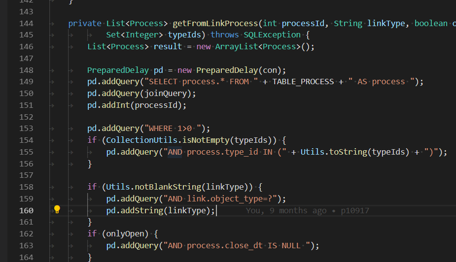

= Development
:toc:
:toclevels: 4

BGERP is quite a large and complex project. It was created by a team consisting of ordinary humans, who may be imperfect and make
mistakes but try to learn continuously. This is a trial and error process, fortunately or not.

This article provides some recommendations collected during the learning process - these are accompanied by a relative small amount of <<examples.adoc#, code>>
for exactly the same reason. Said that, you have to follow those recommendations using *The Boy Scout Rule*.

IMPORTANT: Always leave the campground cleaner than you found it.

While changing a block of code, it is important to try to decrease the usage of outdated approaches, methods and classes.
Write a new code and keep it compliant with the latest recommendations, but at the same time try to get neighboring/adjacent code improved.
During <<workflow.adoc#, changes>> testing, code improvements will be tested as well.
All in all, gradually, we will improve overall code quality.
We plan to introduce a set of formal code quality metrics: number of compiler warnings, format checks, etc.

[[lang]]
== Languages
The project currently undergoes a migration process from Russian language to an international one (English).
All the software documentation, including this article, and all log messages will be converted to English.
Information shown to the end-user via interface has to be <<l10n, localized>>.

[[project]]
== Project
[[env]]
=== Environment
The program can be developed on any Java-supported platform.

[[env-windows]]
==== Windows
Minimal required set of software:
[square]
* link:https://adoptium.net[OpenJDK 17];
* link:https://hub.docker.com/editions/community/docker-ce-desktop-windows[Docker for Windows];
* link:https://git-scm.com/download/win[GIT].

[[env-console]]
===== Shell
System of <<workflow.adoc#build, build and publish>> is written on Bash scripts and uses GNU utilities, you can use the following when using Windows:
[square]
* link:https://www.omgubuntu.co.uk/how-to-install-wsl2-on-windows-10[WSL 2] - embedded in Windows virtual Linux machine;
* link:https://www.cygwin.com/[Cygwin] - Windows ports of GNU utils, not tested.

The best console emulator on Windows with embedded FAR Manager - link:https://conemu.github.io/[ConEmu].

[[env-linux]]
==== Linux
Install using a package manager:
[square]
* <<../kernel/install.adoc#java, OpenJDK 17>>;
* Docker;
* GIT;
* GIT-LFS.

[[checkout]]
=== Checkout
Checkout the project using GIT to an wanted directory, e.g.: `BGERP`.

[[checkout-contrib]]
==== Contributors
For project's contributors, internal repo with <<workflow.adoc#change, branches>>:
[source]
----
git clone https://git.bgerp.org/bgerp/bgerp.git BGERP
----

Configure GIT inside the directory. Use your name and email instead.
[source]
----
git config user.name "Shamil Vakhitov"
git config user.email shamil@bgerp.org
git config pull.rebase true
git config core.fileMode false
git config core.longpaths true
git config core.autocrlf false
----

For Windows and Mac only.
[source]
----
git config core.ignorecase true
----

[[checkout-reader]]
==== Read-only access
For only readers, including <<../kernel/extension.adoc#custom, custom>> developers.

[source]
----
git clone https://github.com/Pingvin235/bgerp BGERP
----

[[run]]
=== Running

[[run-data]]
==== DB container
Use the Docker image for running developer DB instance.
Run the following command inside of the project's directory.

NOTE: We expose non-standard MySQL port *3388* to avoid possible conflicts with a running locally MySQL server.

[source, bash]
----
docker pull bgerp/bgerp && docker run -d --name bgerp-demo --restart unless-stopped -p 3388:3306 bgerp/bgerp
----

Make sure, that the container is running using the command:
[source, bash]
----
docker exec bgerp-demo /opt/bgerp/erp_status.sh
----

[[run-data-logging]]
Get configuration and data files from the container:
[source, bash]
----
docker exec bgerp-demo cat /opt/bgerp/bgerp.properties | bash -c "sed 's#127.0.0.1/#127.0.0.1:3388/#'" > bgerp.properties
docker cp bgerp-demo:/opt/bgerp/log4j.properties log4j.properties
docker cp bgerp-demo:/opt/bgerp/filestorage filestorage
----

NOTE: Use the command for removing the created container:
[source, bash]
----
docker rm -f bgerp-demo
----

NOTE: For accessing the DB instance with console SQL client use the command:
[source, bash]
----
docker exec -it bgerp-demo mysql -ubgerp -p<PASSWORD_FROM_PROPERTIES> bgerp
----

[[run-gradle]]
==== Command line
Execute command:
[source]
----
gradlew startServer
----

CAUTION: The Gradle tasks ends on 75%.

After correct start of the server, Web interface has to be available at URL: http://localhost:9088/user
Use *admin* - *admin* credentials.

[[run-launch]]
==== Inside IDE
Configuration for running inside IDE:
[square]
* Main class: ru.bgerp.Server
* Program arguments: start
* VM arguments: -Dbgerp.setup.data=bgerp
* Classpath: click on *User entries - Advanced - Add folders* and add project's current folder.

[[format]]
=== Code formatting
IDE or editor must be configured for displaying whitespace symbols.

Set trim trailing whitespaces on saving, the option is provided for <<ide-vscode, VS Code Settings Template>>.

The projects mostly follow recommended formatting rules for each of programming languages they use.
Intention:
[square]
* 4 whitespaces - Java, Gradle, Bash, YML;
* tabs - <<plugin-db, SQL>>, XML, HTML, JS, JSP, Dockerfile.

However because of historical reasons many files have been formatted in a wrong way, and have to be carefully fixed.
Screenshot above shows an example of a Java file still using tabs.

When working on fixing a file format, it is important to use the following rules:
[arabic]
. All new files should be formatted correctly.
. Avoid using both indent symbols (tabs and spaces) inside a single file! Such file becomes unreadable in certain editors. If you notice a file/case like this,
make sure to change all indent symbols in the file to the required format.
. Be cautious when combining file formatting with making <<workflow.adoc#change, changes>> - this can significantly complicate analysis down the road.

[[format-java]]
==== Java
Jave code formatting should be *Java Conventions*-compliant, with the following additional changes (Eclipse formatter settings shown below)

Use settings in  *Windows - Preferences - Java - Code style - Formatter*.
Open a standard formatter and save it under a different name after changing the following parameters:
[square]
* *Indentation - Tab policy* - *Spaces only*
* *Indentation* - *Tab size* - *4*
* *Line Wrapping* - *Maximum line width*  - *150*

*Window - Preferences - Java - Code style - Organize Imports* - put 99 and 1 in the respective fields.

Example/resulting Eclipse formatter file: link:../../../.vscode/formatter.xml[formatter.xml]

[[ide]]
=== IDE
[[ide-eclipse]]
==== Eclipse
Currently one of the most handy platforms.
Download *Eclipse for Java EE Developers*, as this build already includes Gradle, JSP and XML editors.
Install the following plugins:
[square]
* *AsciiDoctor* -  <<workflow.adoc#doc, documentation>> editor;
* *MoreUnit* - convenient plugin to work with <<workflow.adoc#unit-test, unit-tests>>.

Import the project directory as a *Gradle Project*.

NOTE: Due to a bug in the Eclipse plugin define exact *6.9.1* version of Gradle before the import.

*Window - Preferences - General - Editors - Text Editors* - set a *Show whitespace characters* checkbox

*Window - Preferences - Team - Git - History* remove  *Relative history* checkbox

Import <<format-java, Java formatter>> via *Window - Preferences - Java - Codestyle - Formatter*.

[[ide-vscode]]
==== VS Code
A much faster than Eclipse, has better JavaScript and Gradle support.

Drawbacks:
[square]
* JSP support is nearly absent;
* external GIT client is required.

Install VS Code itself and the following extensions:
[square]
* *Java Extension Pack*
* *GitLens*
* *Git Graph*
* *Git History*
* *AsciiDoc*
* *Eclipse Keymap* - optionally

Visit link:../../../.vscode/readme.txt[open] and navigate to `.vscode` catalog in project's directory in order to get some configuration examples.
Java formatter and space symbols indicators have been already enabled there.

[[ide-logging]]
==== Logging
A <<run-data-logging, taken>> from DB container `log4j.properties` file doesn't produce output to *STDOUT* IDE console.
In order to change that you have to add *out* appender there.
[source]
----
log4j.logger.ru.bgcrm=ALL, file, session, out
log4j.logger.ru.bgerp=ALL, file, session, out
log4j.logger.org.bgerp=ALL, file, session, out
----

[[structure]]
=== File's structure
Project's folder listing along with description.
[square]
* *bin* - IDE-compiled Java classes;
* *build* - files related to <<workflow.adoc#build, build>>;
* *docpattern* - <<../plugin/document/index.adoc#, Document>> plugin templates;
* *filestorage* - file storage when launched from IDE;
* *lib* - Java libraries, which are not linked via <<java-lib, Gradle>>;
* *plugin* - <<plugin, plugin>> declarations;
* *src* - Java source code;
* *srcx* - <<workflow.adoc#doc, documentation>>, <<workflow.adoc#unit-test, unit-tests>>, <<workflow.adoc#integration-test, integration tests>>, build utilities sources;
* *webapps* -  <<arch, Web application's>> root directory;
* *work* - folder created by Tomcat for JSP file compilation.

=== Libraries
[[java-lib]]
==== Java
When link:../../../build/bgerp/files/erp.sh[running] a program, a number of JAR files are linked from the following folders:
[square]
* *lib/app* - application's and <<../kernel/extension.adoc#custom, Custom>> classes;
* *lib/ext* - external libraries.

External libraries are supplied with a separate <<workflow.adoc#build-release, update package>>.
Artifacts and versions are indicated in the following file: link:../../../build.gradle[build.gradle] (for *bgerp* configuration)

NOTE: This configuration does NOT use transitive dependencies  - all required libraries and versions have to be explicitly defined.
We would suggest to gradually add a small set of libraries until getting a "workable" application - this will allow to decrease build's size and simplify further support and troubleshooting.

In order to speed up project initialization, our default Eclipse IDE configuration does not load source code and documentation.
[snippet, from="ec", to="}"]
link:../../../build.gradle#L27-L33[build.gradle]

After adding new libraries in `build.gradle` create an empty `build/changes.lib.txt` file using `gradlew touchChangesLib` command.
Existence of the file causes build library update package during <<workflow.adoc#build-release, release build>>.

[[js-lib]]
==== JS
JS libraries are located in the following folders:
[square]
* `webapps/js` - application's JS files: kernel's and <<plugin, plugins'>>;
* `webapps/lib` - external libraries.

Non-minified libraries are used in order to simplify debugging.

Some of the external libraries have been patched and all changes are accompanied by relevant comments, for example:
[snippet, from="con", to=");", remove-leading="		"]
link:../../../webapps/lib/jquery-ui-1.12.1/jquery-ui.js#L8923-L8929[webapps/lib/jquery-ui-1.12.1/jquery-ui.js]

[[devm]]
=== Remote development methodology
BGERP launches within IDE, gets connected to the database and, optionally, billing.
At the end of the development/work session remote client database will have all the actual information, so it is only required to update the product itself.

[square]
* Use SSH to connect to the client, utilize port-forwarding in order to connect to the database and, optionally, billing.
Example: *ssh user@X.X.X.X -L3307:127.0.0.1:3306 -L8081:Y.Y.Y.Y:8080*
* Create your own *bgerp_customer.properties* file - you can use it to keep your configuration and access parameters. This file does not get pushed to GIT.
You can also use this file to alter billing connection URL - for example, to a localhost.
* Reconfigure BGERP port so you could save passwords in your browser for specific client(s).
* Create IDE launch configuration using this properties file
* Optionally, alter *.gitignore* in order to save custom client's files in case you are using fork.

[[arch]]
== Architecture
BGERP is a standalone Java application with a dynamic Web-interface.
When developing, you can <<run, launch>> it directly from IDE.

Figure below illustrates a request processing pipeline:

[ditaa]
----
+----------------+             AJAX
|                |    +----+           +-------------+     +----------+
|      HTML      |    | JS |           |             |     |{s}       |
|                +-=->+    +-----+=+-->+ Java Action +<-=->+ MySQL DB |
|                |    |    |           |             |     |          |
|                |    |    +<----+=+---+             |     +----------+
|                |    |    | CHANGE OK +------+------+
|                |    |    | ANY ERROR        |
|                |    |    |                  :
|       +--------+    |    |                  |
|       |  HTML  |    |    |                  v
|       |        +<-=-+    |           +------+------+
|       |Fragment|    |    +<----+=+---+     JSP     |
|       +--------+    +----+   READ    +-------------+
|                |
+----------------+
----

Request processing stages:
[arabic]
.	JS is used to form a request via HTML form , which is then sent to a Java Action class method.
.	Upon a change request system sends only a confirmation - JSON response with OK status
.	Any exception on Java Action side triggers a JSON with an ERROR status to be sent towards a client side.
.	Any successful data read request returns an HTML Fragment (Table with a list of usernames as an example), which can then be embedded into resulting HTML on the client side.

[[tech-stack]]
Below is a summary of a technology stack used, in descending order of importance:
[arabic]
. Java - all <<action, application logic>> is implemented as Java code, as Java provides best options in terms of easy of development, reliability and performance.
.. MySQL + JDBC - <<plugin-db, data>> processing.
. HTML + CSS - browser's markup language and style tables.
. JSP + JSTL - HTML page rendering templates,  <<jsp, presentation layer>>;
. JS + JQuery - client-side scripting language for dynamic content, only used as predefined framework calls.

IMPORTANT: Pay attention to avoid mixing the layers, e.g. creating application logic outside of Java code, defining presentation layer without JSP, performing data manipulation without MySQL.

[[plugin]]
=== Plugin
Any logically detached functionality has to be moved into a plugin.
Isolation is a primary trait of a plugin. Each plugin works with a kernel and kernel has no knowledge of the inner works of a given plugin.
Plugins do not have to 'know' how other plugins work, either.
'Knowing' here means a necessity to rely on certain APIs or specific method calls.

[[plugin-kernel]]
==== Kernel
The special javadoc:org.bgerp.plugin.kernel.Plugin[kernel] <<plugin-class, plugin>> is responsible for keeping the kernel functionality of the system.

This plugin is a specific one, because:
[square]
* always <<../kernel/setup.adoc#config-plugin, enabled>> and required for normal work of the program
* because that do not need <<plugin-endpoint, endpoints>>
* Java classes spread outside a single *PLUGIN_PACKAGE*
* JSP files are also in many directories

Using those assumptions the system may be presented as set of plugins.

[[plugin-class]]
==== Plugin's Java class
Application detects plugin upon start by a mandatory Java class, extended from javadoc:ru.bgcrm.plugin.Plugin[]
Class example; link:../../../src/ru/bgerp/plugin/blow/Plugin.java[ru.bgerp.plugin.blow.Plugin]

Each plugin has a corresponding and unique:
[square]
* *PLUGIN_ID* - a single and unique for a plugin English word, all single case (no upper/lower mix) and without special symbols.
* Java *PLUGIN_PACKAGE* which includes this specific class.

[[plugin-init]]
===== Init
Plugin class *init* method is called for all <<../kernel/setup.adoc#config-plugin, enabled>> plugins during the server start.
[snippet, from="Eve", to="ss);", remove-leading="        "]
link:../../../src/ru/bgcrm/plugin/slack/Plugin.java#L35-L37[ru.bgcrm.plugin.slack.Plugin]

In the particular case shown above, function handler gets included into <<../kernel/extension.adoc#jexl, JEXL>> context.
First init is done for <<plugin-kernel, Kernel Plugin>>.

[[plugin-db]]
==== Database
If plugin uses <<mvc, DB>>, then plugin package can contain a script which creates or modifies tables.
When `db.sql` script presented in *PLUGIN_PACKAGE* it gets invoked during standard <<plugin-init, initialization>> routine.

Below is an example of a script for a FullText plugin
[snippet]
link:../../../src/ru/bgcrm/plugin/fulltext/db.sql[src/ru/bgcrm/plugin/fulltext/db.sql]

Plugin DB table names have to start from <<plugin-class, PLUGIN_ID>>.

<<db.adoc#, DB Structure>> is documented in the common <<workflow.adoc#doc, process>>, simultaneously with making changes.

Use PRIMARY key only for auto incremented INT columns, otherwise prefer named UNIQUE key.
[snippet, from="UNIQUE", to="`),", remove-leading="	"]
link:../../../src/org/bgerp/plugin/kernel/db.sql#L405-L405[src/org/bgerp/plugin/kernel/db.sql]

[[plugin-db-cache]]
===== Database Queries Cache
To speed-up the application startup initialization all the already executed calls are cached in <<db.adoc#_db_update_log, db_update_log>> table.
The cache might be reset using <<../kernel/install.adoc#installer, installer>> console util.

To force re-execution a query, add a whitespace before ending semicolon on the query line.
[snippet, from="CALL drop_key_if_exists", to=") ;"]
link:../../../src/org/bgerp/plugin/kernel/db.sql#L787-L787[src/org/bgerp/plugin/kernel/db.sql]

[[cache]]
===== Cache
Caching is used within internal Map and List in order to significantly (100s of times) expedite directory data retrieval when <<jsp, building UI>> or when running <<../kernel/extension.adoc#jexl-process-context, JEXL scripts>>
Map allows to get specific value based on they kay (from a 'key-value' pair), list - an alphabetically sorted list.
Users, User Groups, Process types, configurations are examples of such cached data.

IMPORTANT: Use caches as much as possible for getting reference values and avoid querying DB extensively.

Directory data is edited directly in DB and cache is cleared after an edit.
[snippet, from="pu", to="}"]
link:../../../src/ru/bgcrm/struts/action/admin/UserAction.java#L89-L95[ru.bgcrm.struts.action.admin.UserAction]

[[plugin-endpoint]]
==== Endpoints
NOTE: Earlier plugin endpoints were described in `plugin.xml` file located within *PLUGIN_PACKAGE*

Endpoints used for connecting non-Java plugin parts:
[square]
* JSP includes;
* JS files.

[[plugin-js]]
===== JavaScript
Extension points definition within Plugin declaration:
[snippet, from="Endpoint.JS", to=",", remove-leading="            "]
link:../../../src/ru/bgerp/plugin/blow/Plugin.java#L21-L21[ru.bgerp.plugin.blow.Plugin]

File containing script: link:../../../webapps/js/pl.blow.js[webapps/js/pl.blow.js]

[[plugin-ui-menu]]
===== Menu items
Menu item in <<../kernel/interface.adoc#user, user>> interface.

Extension points definition within <<plugin-class, Plugin class>>:
[snippet, from="Endpoint.USER_PROCESS_MENU", to=",", remove-leading="            "]
link:../../../src/ru/bgerp/plugin/blow/Plugin.java#L23-L23[ru.bgerp.plugin.blow.Plugin]

Adding a menu item using JSP tag: link:../../../webapps/WEB-INF/jspf/user/plugin/blow/menu_items.jsp[webapps/WEB-INF/jspf/user/plugin/blow/menu_items.jsp]

[[plugin-action]]
==== Action
Plugin <<action, actions>> classes, if used, have to be declared in *PLUGIN_PACKAGE.action* package.

`action.xml` with <<action-permission, permission tree>> for <<../kernel/interface.adoc#user, user>> interface actions has to be located in *PLUGIN_PACKAGE*.

JSP templates:
[square]
* <<../kernel/interface.adoc#user, user>> interface in `webapps/WEB-INF/jspf/user/plugin/<PLUGIN_ID>` or `webapps/WEB-INF/jspf/admin/plugin/<PLUGIN_ID>`
* <<../kernel/interface.adoc#open, open>> interface in `webapps/WEB-INF/jspf/open/plugin/<PLUGIN_ID>`

[[plugin-l10n]]
==== Localization
Plugin's <<l10n, localization>> file (`i10n.xml`) has to be located in *PLUGIN_PACKAGE*.
It is only used for localizing actions and action's JSP templates

[[mvc]]
=== MVC
The project is using Apache Struts framework in a very own and customized way:
[square]
* requests are sent using <<examples.adoc#code-jsp-ui-ajax, AJAX>> and responses update HTML partially
* from Struts JSP <<jsp-tag, tags>> <<examples.adoc#code-jsp-ui-restore-form, used>> only *<html:form* with *<html:param* inside
* <<action, action>> methods have different signature as standard
* the <<action-form, form>> object has always the same class

[[mvc-iface]]
==== Interfaces
There are three user <<../kernel/interface.adoc#, interfaces>> exist in the program.

The following table shows rules for path and packages of <<action, actions>> and <<jsp, JSP>> templates.
Shortcuts there mean:
[square]
* *ppp* - plugin ID;
* *aaa* - action.

NOTE: JSP paths are defined starting from `webapps/WEB-INF` directory.

[cols="10%,20%,35%,35%", options="header"]
|===
| Interface | Action path | Action class | JSP path

.2+|user
|/admin/aaa +
/admin/plugin/ppp/aaa

|...action.admin.AaaAction +
...plugin.ppp.action.admin.AaaAction
|jspf/admin/.../aaa.jsp +
jspf/admin/.../plugin/ppp/.../aaa.jsp

|/user/aaa +
/user/plugin/ppp/aaa
|...action.AaaAction +
...plugin.ppp.action.AaaAction
|jspf/user/../aaa.jsp +
jspf/user/../plugin/ppp/.../aaa.jsp

|usermob
|/usermob/aaa
|...action.usermob.AaaAction
|jspf/usermob/../aaa.jsp

|open
|/open/aaa +
/open/plugin/ppp/aaa
|...action.open.AaaAction +
...plugin.ppp.action.open.AaaAction
|jspf/open/../aaa.jsp +
jspf/open/../plugin/ppp/.../aaa.jsp

|===

[[mvc-iface-test]]
===== Test zones
For testing MVC framework available special hidden zones.

[cols="10%,20%,35%,35%", options="header"]
|===
| Interface | Action path, mapping JSP | Action class | JSP path

|user
|/user/test +
jspf/user/menu.jsp
|org.bgerp.action.TestAction
|jspf/user/test.jsp

|open
|/open/test +
jspf/open/test/url.jsp
|org.bgerp.action.open.TestAction
|jspf/open/test.jsp

|===

[[action]]
==== Java Action
NOTE: Action definition in `struts-confing.xml` files is deprecated.

Action classes have to extend javadoc:ru.bgcrm.struts.action.BaseAction[] class marked by *Action* annotation.
[snippet, from="@", to=";", remove-leading=""]
link:../../../src/org/bgerp/action/admin/RunAction.java#L14-L16[org.bgerp.action.admin.RunAction]

The sample above means that HTTP requests with URL */admin/run.do* mapped to the class.
An *action* HTTP request's parameter is used to indicate method's name.
If this HTTP parameter is not defined, then *unspecified* method gets invoked.

Action methods have to return by invoking *html* or *json*.

First method gets processed by JSP forward page and sends HTML back to the client.
[snippet, from="@O", to="}", remove-leading=""]
link:../../../src/org/bgerp/action/admin/RunAction.java#L18-L23[org.bgerp.action.admin.RunAction]

Second one is used to perform changes and only returns JSON-based change execution result.
[snippet, from="pu", to="}", remove-leading=""]
link:../../../src/org/bgerp/action/admin/RunAction.java#L25-L49[org.bgerp.action.admin.RunAction]

[[action-form]]
===== Form Object
Each action class method call gets a *form object*  javadoc:ru.bgcrm.struts.form.DynActionForm[] as a parameter. This object contains a context of request's execution;
[square]
* User;
* Request parameters and supplementary methods for parsing those parameters

CAUTION: Do not use a legacy action format with HttpClientRequest and HttpClientResponse parameters (note that they are still present in the form)

A snippet of an action method:
[snippet, from="pu", to="}", remove-leading="    "]
link:../../../src/ru/bgerp/plugin/blow/action/BoardAction.java#L40-L60[ru.bgerp.plugin.blow.action.BoardAction]

Result gets redirected to a JSP page:
link:../../../webapps/WEB-INF/jspf/user/plugin/blow/board/show.jsp[webapps/WEB-INF/jspf/user/plugin/blow/board/show.jsp].

Use the same *form* to pass data for JSP rendering, excluding some auxiliary directories.
You can use form's *response* field for this.
When set to *responseType=json*, all data in the response gets serialized into JSON - that's why it is important to put directories into HttpResponse.

[snippet, from="pu", to="}", remove-leading="    "]
link:../../../src/ru/bgcrm/plugin/dispatch/struts/action/DispatchAction.java#L46-L52[ru.bgcrm.plugin.dispatch.struts.action.DispatchAction]

[[action-name]]
===== Naming Convention
<<plugin, Plugin's>> action classes have to be placed into `PLUGIN_PACKAGE.action` package, class name should end with *Action*.
Previously Action classes have been located within `struts.action` packages - this approach is considered obsolete.

*user* <<../kernel/interface.adoc#user, interface>> actions are divided into /user and /admin
This separation will be used in future for distinguishing administrative calls.

*usermob* и *open* interfaces have their own actions - in this case package names and URL have to contain *usermob* и *open*, respectively.
link:../../../src/org/bgerp/action/usermob/ProcessAction.java[org.bgerp.action.usermob.ProcessAction] provides an example of such action.

We recommend to use the following naming convention for methods:
[arabic]
. [optional] Name of the object being handled in case a given class works with several objects.
. Verb which defines method's operation. For example, for CRUD these are: *list*, *get*, *update*, *delete*.

javadoc:ru.bgcrm.struts.action.admin.UserAction[] has some example method names:
[square]
* permsetList;
* permsetGet;
* permsetUpdate.

Another set of examples from javadoc:ru.bgcrm.struts.action.admin.AppAction[]:
[suare]
* status - provides application status;
* update - triggers update installation;
* userLoggedList - provides a list of logged in users.

It is recommended to use identical names for both method and forward JSP files.

[[action-permission]]
===== Permissions check
All action methods for <<../kernel/interface.adoc#user, user>> interface have to be defined within `PLUGIN_PACKAGE/action.xml` files.
Examples:
[square]
* link:../../../src/org/bgerp/plugin/kernel/action.xml[org/bgerp/plugin/kernel/action.xml] - for <<plugin-kernel, Kernel>> plugin
* link:../../../src/ru/bgerp/plugin/blow/action.xml[ru/bgerp/plugin/blow/action.xml] - for Blow plugin

Definitions from those files are forming a tree which is used for <<../kernel/setup.adoc#user, access control>>.

Each action is identified by a class AND method, separated by semicolon.

Main identifier can be preceded by additional ones, separated by a *comma* - for example, when renaming classes or methods.
This allows to provide backwards compatibility with permissions already present in the DB.
The actual main identifier stays always last and will be used upon the next save operation of the permission set.

In the following example an action class was renamed and action method changed to *unspecified*, defined in the configuration by *null*.

[snippet, from="<item ti", to="с\"/>", remove-leading="		"]
link:../../../src/org/bgerp/plugin/kernel/action.xml#L154-L155[org/bgerp/plugin/kernel/action.xml]

The same principe may be used for grouping many methods to a single logical action, for example typical get and update calls.

[snippet, from="<item ac", to="te\"/>", remove-leading="		"]
link:../../../src/org/bgerp/plugin/bil/billing/invoice/action.xml#L6-L6[org/bgerp/plugin/bil/billing/invoice/action.xml]

Actions may be hierarchically organized when some parent action is required for accessing children.
[snippet, from="<item ac", to="em>", remove-leading="	"]
link:../../../src/org/bgerp/plugin/svc/backup/action.xml#L2-L6[org/bgerp/plugin/svc/backup/action.xml]

In the latest example notice also attribute *ltitle*, which means that the title goes through <<l10n, localization system>>.

Auxillary actions, which have to be permanently allowed, have to be marked with *allowAll="1"* attribute.

[[exception]]
===== Exception handling
Exception interrupts actions execution, also rolls back <<plugin-db, DB>> transaction - response will be always sent back as JSON.
All Exception handling is defined centrally in javadoc:ru.bgcrm.struts.action.BaseAction[], DAO methods or script handlers just need to raise a given exception.
Said that, action methods declarations and DAO just need to use *throws java.lang.Exception*.

javadoc:ru.bgcrm.model.BGException[] class is typically used for system-generated exceptions and is rarely used elsewhere.

javadoc:ru.bgcrm.model.BGMessageException[] which inherits from javadoc:ru.bgcrm.model.BGException[],
is used to sent a <<l10n, localized>> message to the user, without writing this message in the log.
For example:
[snippet, from="for (", to=");", remove-leading="            "]
link:../../../src/ru/bgcrm/event/listener/ProcessClosingListener.java#L39-L41[ru.bgcrm.event.listener.ProcessClosingListener]

[[action-db]]
===== DB Operations
DB-related operations are performed via separate Java DAO (Data Access Objects) classes which are then used within actions.
Actions are using transactional request processing: transaction starts before method gets invoked, then a) gets committed (COMMIT) if there are no errors when returning results
or b) gets rolled back (ROLLBACK) if exception is thrown.

DB connection details have to be specified via action methods' *con* parameters. Some methods use *conSet* (javadoc:ru.bgcrm.util.sql.ConnectionSet[]) parameter, which invoke DB connection via a separate call.
The latter is more suitable for methods which do not demand a DB connection, or, on the contrary, for the ones demanding several connection types: to replica or "trash" DB for non-critical data (currently not supported)

Table names have to be specified via constants in order to improve code cohesion (see javadoc:ru.bgcrm.dao.Tables[] as example).
If a given table is only used in a single DAO class, then this constant has to be defined as private (javadoc:ru.bgcrm.plugin.fulltext.dao.SearchDAO[] as example)

Use link:https://docs.oracle.com/en/java/javase/11/docs/api/java.sql/java/sql/PreparedStatement.html[java.sql.PreparedStatement] class for building queries or. alternatively,
use its wrapper - ru.bgcrm.util.sql.PreparedDelay[]. The latter allows to 'glue' both queries and parameters and does not require to specify parameters' positions.

[[jsp]]
==== JSP View
HTML gets rendered on server-side using JSP templates after receiving data from Action.
UI uses a set of unified components - thanks to that in most cases there is no need to install additional styles or create additional JS handlers.
<<examples.adoc#code-jsp-ui, JSP UI code>> examples.

The principal schema of JSP work looks like:
image::_res/project_jsp_schema.png[]

[[jsp-request-params]]
===== SetRequestParamsFilter
The filter is executing after action and sets in request object Java objects, those methods may be called.
The following objects prefixes are available:
[[square]]
* *u.* javadoc:ru.bgcrm.util.Utils[]
* *tu.* javadoc:ru.bgcrm.util.TimeUtils[]
// TODO: duplicated in kernel/extension.adoc, extract to include
* *su* link:https://commons.apache.org/proper/commons-lang/javadocs/api-2.5/org/apache/commons/lang/StringUtils.html[org.apache.commons.lang.StringUtils]
* *сu* link:https://commons.apache.org/proper/commons-collections/javadocs/api-3.2.2/org/apache/commons/collections/CollectionUtils.html[org.apache.commons.collections.CollectionUtils]

As an example see <<examples.adoc#code-date-format, date and time format>>.

Beside of the mentioned static functions, the filter sets also <<cache, caches>>.
All the request parameters are set in class link:../../../src/ru/bgcrm/servlet/filter/SetRequestParamsFilter.java[ru.bgcrm.servlet.filter.SetRequestParamsFilter]

[[jsp-function]]
===== Functions
JSP functions are defined in the directory `webapps/WEB-INF/tld`.
Same as for tags IDEs support autocompletion for them.

IMPORTANT: Most of the functions there are deprecated because of possibility to <<jsp-request-params, call>> Java analogs.

Using semicolon-separated JSP functions makes sense only for JSP specific things, like in the following cases.

[[jsp-function-uiid]]
====== Element IDs
HTML DOM model assumes all element IDs are globally defined using `class` and `id` attributes. Due to that it is quite tricky to track their usage and ensure their uniqueness. Moreover, developer has to create a single-page application, which prevents to keep state for hidden elements.

In order to overcome this limitation, project attaches JS handlers via HTML onClick (and the like) attributes  using context variable 'this'.
Another method used for that is using `u:uiid()` function to generate a unique identifier, which is then used in auto-generated JS call.

In link:../../../webapps/WEB-INF/jspf/user/log/log.jsp[webapps/WEB-INF/jspf/user/log/log.jsp] might be seen how to completely avoid absolute element IDs.

[[jsp-tag]]
===== Tags
Components are defined within JSP tags and are declared in `webapps/WEB-INF/tags`
<<ide-eclipse, IDE Eclipse>> supports autocomplete when using them in the code.

image::_res/ide_jsp_tag.png[width='600px']

<<mvc-iface-test, UI test zones>> provide several examples of using JSP tags with user control elements.

For kernel, link:../../../webapps/WEB-INF/jspf/user/menu.jsp[webapps/WEB-INF/jspf/user/menu.jsp] file defines menu items which are used to match URL and Java Action. For plugins this is done via <<plugin-ui-menu, extension>> points.

[[jsp-tag-u-sc]]
====== u:sc
JSP page stores all variables  ones. Combined with includes and long templates, this can cause certain inconvenience.
`<u:sc>` context recovery tag is used to overcome this problem - all variables defined with this tag are cleared upon exit.

[[jsp-tag-p-check]]
====== p:check
The tag enables code inside it only when mentioned <<action, action>> is <<action-permission, allowed>> for the current user.
[snippet, from="<p:ch", to=">"]
link:../../../webapps/WEB-INF/jspf/user/plugin/blow/board/show.jsp#L11-L14[webapps/WEB-INF/jspf/user/plugin/blow/board/show.jsp]

For combining permission check with other checks use function <<jsp-request-params, ctxUser.checkPerm>>, pointing to javadoc:ru.bgcrm.model.user.User[].
[snippet, from="<c:if", to=">"]
link:../../../webapps/WEB-INF/jspf/user/process/process/link_process_list.jsp#L32-L33[webapps/WEB-INF/jspf/user/process/process/link_process_list.jsp]

[[jsp-tags-top-line]]
====== shell:title and shell:state
Set the left area and the right areas of <<../kernel/interface.adoc#user-top-line, top line>> in user interface.
<<l10n, Localization>> is supported using *ltext* attribute. Tag shell:state may create a documentation help link.
[snippet, from="<shell:t", to=">"]
link:../../../webapps/WEB-INF/jspf/admin/config/list.jsp#L89-L90[webapps/WEB-INF/jspf/admin/config/list.jsp]

[[js]]
==== Java Script
JS is used to enabled dynamic content on the client side.
Scripts and associated libraries are located within <<js-lib, this path>>. <<plugin, plugins>> can have their own scripts.

In certain cases JS gets dynamically generated via JSP templates on a server-side.
This method is generally discouraged as it significantly complicates broweser-side debugging.

System functions are organized as object hierarchy built from the *+++$$+++* root object.
For example: link:../../../webapps/js/kernel.ajax.js[+++$$+++.ajax], link:../../../webapps/js/kernel.ui.js[$$.ui]
A typical scheme for attaching JS code to HTML is to setup event handler with a function call - <<examples.adoc#code-jsp-ui, AJAX example>>

Deprecated JS functions are marked using the following method:
[snippet, from="fun", to="}"]
link:../../../webapps/js/kernel.ajax.js#L455-L459[webapps/js/kernel.ajax.js]

When such a function gets invoked, browser console gets a "clickable" "Deprecated" message which allows to find a this deprecated function call
It is forbidden to use those functions in the new code, usage has to be decreased in the existing code over time.

[[custom-level]]
=== Customization
//TODO: Merge the chapter with extension.adoc#tech-choice
One of the main solution's prioritized features are extensibility and flexibility.
Said that, standard functions can be <<../kernel/extension.adoc#ccc, extended>> by using several methods.

However, it is important to understand that the most effective way to efficiently develop and maintain functionality longer-term is to either use built-in plugin system or include as part of the kernel and at the same time
keep configurable parameters to a minimum.
JEXL scripts or dynamic code can be used for a quick prototyping or in order to implement certain application logic *which is extremely specific to a given installation*.

Our experience shows that all such customizations over time crystallize successful solutions suitable for a much larger group of users.
Such customizations have to be moved into a main code to make them part of the system and to then allow further community development and improvement.

The following diagram illustrates above-mentioned transformation dynamics for a code of different types. Size of a given rectangle correlates with a code size for a specific type.
Code size is a cumulative value for all Customers - larger size from scattered customizations gets translated into a much smaller universal code within a single *product*.

[ditaa]
----
+--------------+   +--------------+  +-----------------------+
|              |   |              |  |                       |
|              |   |              |  |                       |
|  Custom JSP  |   |  Dyn Code    |  |      Configuration    |
|              |   |              |  |                       |
|              |   |              |  |         +JEXL         |
|              |   |              |  |                       |
+------+-------+   +-----------+--+  +-+----------+----------+
       |                       |       |          |
       v                       v       v          v
+------+-------+           +---+-------+-+ +------+------+
| Standard JSP |           |  Java Code  | |Configuration|
+--------------+           +-------------+ +-------------+
----

[[l10n]]
=== Localization
All log messages are produced in English only.

Localization gets applied to a user interface and messages addresses to a system user.
System language is defined globally within <<../kernel/setup.adoc#config, configuration>>.

[[l10n-files]]
==== Files
XML localization file `l10n.xml` are located in <<plugin-l10n, plugin's packages>>.
New localization phrases should be added to the end of the list in the file.

<<../kernel/extension.adoc#custom-l10n, Custom>> localization may overwrite all of them and read out `custom/l10n.xml` file in case of existing that.

The key of the localizing phrase is the first entry in any language, for example Russian:
[source, xml]
----

<ru>Требуется повторная авторизация</ru><en>Re-authorization is required</en>

----

[[l10n-lang-sys]]
==== SYS language
It is possible to use short abbreviated keys, representing them as records in a special system language, for example:
[snippet, from="
", to="
"]
link:../../../src/org/bgerp/plugin/msg/email/l10n.xml#L3-L9[src/org/bgerp/plugin/msg/email/l10n.xml]

In the example also might be seen how to use multiline phrases.

[[l10n-lang-own]]
==== Own language
To change the labels on the buttons in the interface, add a separate localization (you cannot change the Russian localization, since it is used as a key), for example, change the button in the creation wizard, through the my language:
[source, xml]
----

<ru>Завершить</ru><en>Finish</en><my>Создать заявку</my>

----

[[l10n-code]]
==== Code
Localization can be done in JSP templates and Java actions. In JS code, localization is available only if it is generated by JSP.
In the JSP template code, the localization call from the example above looks like this:
[source, jsp]
----
$('#loginForm').dialog({
	modal: true,
	draggable: false,
	resizable: false,
	title: "${l.l('Требуется повторная авторизация')}",
	position: { my: "center top", at: "center top+100px", of: window }
});
----

By doing <<action>> in object *l* the localization context is passed, containing phrases for the core and the plugin being called.

[snippet, from="message.se", to="());", remove-leading="        "]
link:../../../src/ru/bgcrm/struts/action/MessageAction.java#L198-L198[ru.bgcrm.struts.action.MessageAction]

Localized key string may contain placeholders for some values, marked as *{}*.
Such case may be seen for <<exception, BGMessageException sample>>.

[[l10n-dev]]
==== Development
All the new code has to be written using localized strings.
For legacy code recommended during other changes replace static strings to localized.

For missing keys the following messages appear in <<ide-logging, log output>>:
[source]
----
01-02/00:44:01  WARN [http-nio-9088-exec-2] Localizer - Missing translation for pattern: 'Иниациализировать плагины'
----

After adding missing patterns, application server has to be re-started.

[[logging]]
=== Logging
[[logging-java]]
==== Java
javadoc:ru.bgerp.util.Log[] logger class is used, which is based on <<../kernel/extension.adoc#log4j, Log4j>> framework.
When launching from IDE, you can copy link:../../../build/bgerp/files/log4j.properties[build/bgerp/files/log4j.properties] file from distribution kit into project's root folder and adapt, as needed.

Use `log` protected variable when logging within <<action, actions>>

Create *static final* class variable within Java classes:
[snippet, from="pub", to=");"]
link:../../../src/ru/bgcrm/worker/MessageExchange.java#L17-L20[ru.bgcrm.worker.MessageExchange]

Log message with substitutions:
[snippet, from="log.debug(", to=");", remove-leading="            "]
link:../../../src/ru/bgcrm/Server.java#L114-L114[ru.bgcrm.Server]

Exception message output:
[snippet, from="try", to="}", remove-leading="                "]
link:../../../src/ru/bgcrm/worker/MessageExchange.java#L66-L70[ru.bgcrm.worker.MessageExchange]

[[logging-js]]
==== JS
Show debug data instead of console.log:
[snippet, from="con", to="}"]
link:../../../webapps/js/kernel.shell.js#L5-L12[webapps/js/kernel.shell.js]

Enabling debug:
[snippet, from="$$.", to="0,"]
link:../../../webapps/js/kernel.js#L19-L23[webapps/js/kernel.js]

[[naming]]
== Naming conventions
=== Configuration variables, JS functions, HTTP StyleId
[square]
* All plugin configuration variable names have to start with *<plugin>:*
* All plugin's JS function names have to start with *<plugin>-* prefix.
"-" cannot be used within a function name in other places.
* All DOM element identifiers (style id) for a plugin have to start with *<plugin>-*
"-" cannot be used within a DOM element identifier name in other places.

[[naming-db]]
=== Database
* Database table and column names have to be in lower case, underscore separated : *process_id*, *param_id*.

[[naming-camel]]
=== Java variables, HTTP request parameters, JSP variables
Have to use camelCase notation:
processId
paramId

[[naming-date]]
=== Date - field entity
If a field has only date, then:
[square]
* Java: *createdDate* type *java.util.Date*
* DB: *created_date* type *DATE*

If a field has date + time, then:
[square]
* Java: *createdTime* type *java.util.Date*
* DB: *created_dt* type *DATETIME*

[[naming-date-period]]
=== Date - period entity
NOTE: Period entity must have two logically connected date or time fields, defining the same period.
There is might be a `fromDate` field if it is not paired and and `dateFrom` that mandatory has `dateTo` pair.

If saving in bins, period has to use java.util.Date type with the following naming convention:
[square]
* dateFrom
* dateTo

Corresponding set and get methods:
[square]
* setDateFrom
* setDateTo
* getDateFrom
* getDateTo

CAUTION: Do not use Calendar beans!
Use TimeUtils to convert into Calendar or from Calendar.

For storing 'time', use:
[square]
* timeFrom
* timeTo

.. and also java.util.Date type.

Use Calendar for various calculators/billings when you need to constantly adjust dates.

Use *date_from* and *date_to* in the database (*DATE* type)

*dt_from*, *dt_to* - *DATETIME* type.

Infinity time or date - *NULL*.

